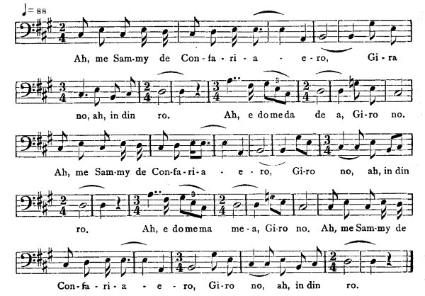

[Intangible Textual Heritage](../../index)  [Africa](../index) 
[Index](index)  [Previous](jas067)  [Next](jas069)   
 [\[Note\]](jas068n)

------------------------------------------------------------------------

### 68. Sammy the Comferee.

Thomas White, Maroon Town.

It was a woman had one son, an' it was a boy dat very unruly by him
mudder an' fader. He had not'ing to do but fire bow an' arrow all day.
An' one day he tek up him bow an' arrow an' fire de arrow an' de arrow
drop in a Massa Jesus yard. An' he went in de yard to go an' pick up de
arrow, an' Massa Jesus wife was in de yard an' Massa Jesus was gone
out--wasn't at home. An' all dem clo'es was out of doors sunning. An' de
wife detain de boy in de yard fo' de whole day until rain come de day
an' wet up all Massa Jesus clo'es a-do'. Dis boy was Sammy de Comferee,
an' jus' t'ru Sammy de Comferee mek de clo'es a wet up a-do'. An' when
Massa Jesus come in, him was wet an' him want some dry clo'es to put on
an' him couldn't get no dry clo'es to put on, An' him tu'n to him wife
an' ask him what him was doin' de whole day at de house an' mek him
clo'es wet up a-do'. Him answer to Massa Jesus dat as he, Sammy de
Comferee, was in de house, das why came de clo'es to wet a-do'. Massa
Jesus say to him as he was along in de house de whole day if is de
reason to mek him clo'es a wet up a-do', an' de woman reply to Massa
Jesus dat if him been pretty as Sammy de Comferee, him would a do more.
An' Massa Jesus answer to him wife dat him know dat is him made Sammy de
Comferee, an' if Sammy de Comferee is prettier den him, him would see
about it.

An' Massa Jesus put up iron rod, an' de iron rod hot as a fire, hot
until it red. An' him sen' for Sammy de Comferee. An' when Sammy de
Comferee come, Massa Jesus says to him what he was doin' in him yard de
whole day. An' he says dat him

{p. 76}

fire him bow an' arrow an' de arrow drop into de yard, an' after, he
went in de yard to pick up de arrow an' de wife detain him in de yard
an' him couldn't get away from de woman until rain tek him in de yard.
And Massa Jesus said dat de wife tell him dat Sammy de Comferee is
prettier 'an him dat made him. An' he order Sammy to climb de iron rod,
An' he commence to melt away an' he sing,

  
Ah, me Sam-my de Con-fa-ri-a-e-ro,  
Gi-ra no, ah, in din ro.  
Ah, e do me da de a, Gi-ro no.  
Ah, me Sam-my de Con-fa-ri-a-e-ro,  
Gi-ro no, ah, in din ro.  
Ah, e do me ma me-a, Gi-ro no.  
Ah, Me Sam-my de  
Con-fa-ri-a-e-ro, Gi-ro no, ah, in din ro.

He melt off to him leg. An' sing again--

"A me Sammy de Con-fa-ri-a!"

He melt off to his middle. He sing again--

"A me Sammy de Con-fa-ri-a!"

an' him melt off one of him hand. He sing again--

"A me Sammy de Con-fa-ri-a!"

an' him melt off to him neck. An' him sing again,

"A me Sammy de Con-fa-ri-a!  
Gi-ra no a in din ro!"

an' him melt off to not'ing. An' when you look at de iron rod, de whole
heap of fat heap up about de iron rod. An' all de pretty men dat come
into de worl' get some of Sammy de Comferee's fat, but all de ugly ones
don't get none of it. Jack man dory, me story done!

{p. 77}

------------------------------------------------------------------------

[Next: 69. Grandy-Do-an'-Do.](jas069)
