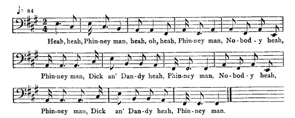

[Intangible Textual Heritage](../../index)  [Africa](../index.md) 
[Index](index)  [Previous](jas071)  [Next](jas073.md)   
 [\[Note\]](jas072n.md)

------------------------------------------------------------------------

### 72. The Barking Puppy.

Alfred Williams, Maroon Town, Cock-pit country.

Deh is old lady live at home wid one little puppy, an' ev'ry night a
gentleman come to pay her a visit, but dis little puppy snap an' bark,
have fo' to tu'n back. An' de ol' lady catch de puppy an' mak up a big
fire an' bu'n de puppy. Nex' night again de gen'leman come back. Ol'
lady sing,

  
Heah, heah, Phin-ney man, heah, ob, heah, Phin-n ey man, No-bod-y
heah,  
Phin-ney man, Dick an' Dan-dy heah, Phin-ney man, No-bod-y heah,  
Phin-ney man, Dick an' Dan-dy heah, Phin-ney man,

De ashes bark as de puppy. De ol' lady get up, tak up de ashes

{p. 83}

dash 'em in de river, say, "Dis gen'leman goin' to pay me visit an'
kyan' because de ashes bark!"

Nex' night, de gen'leman come back again, holla out, "Hulloo!" Ol' lady
sing,

"Heah, heah, Phinney man,  
Nobody heah, Phinney man,  
Dick an' Dandy heah!"

De puppy ashes bark in de river an' de gen'leman wouldn't come. De ol'
lady tak de river water dash in de sea to hinder Dick an' Dandy from
barking. Nex' night de gen'leman come back fo' de las time; counsel a
sing now. Old lady raise up an' sing,

"Heah, heah, Phinney man,  
Nobody heah, Phinney man,  
Dick an' Dandy heah!"

Meanwhile de gentleman dance. He come in now, draw a chair, say, "So
long I couldn't come on account of Dick an' Dandy!" an' say, "I coming
to marry you." Old lady say yes, but don' know but don' shadow come;
sometime shadow come back, Ol' lady sing,

"Heah, heah, Phinney man,  
Nobody heah, Phinney man,  
Dick an' Dandy heah!"

An' de gentleman catch de ol' lady an' tear him up to inch pieces.

------------------------------------------------------------------------

[Next: 73. The Singing Bird.](jas073.md)
