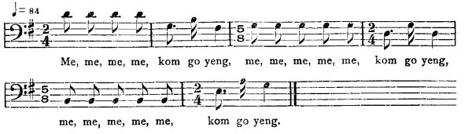

[Intangible Textual Heritage](../../index)  [Africa](../index) 
[Index](index)  [Previous](jas084)  [Next](jas086)   
 [\[Note\]](jas085n)

------------------------------------------------------------------------

### 85. Man-Snake as Bridegroom.

##### a. The Rescue. (1)

Richard Morgan, Santa Cruz Mountains.

Der is a woman to court. Every man come to court her, she said she don'
want him, till one day she saw a coal-black man, pretty man. 'he said,
"O mudder, dis is my courtier!" She tek de man. Breakfas' an' dinner de
man don' eat, only suck couple raw egg. So her got a brudder name of
Collin. She didn't count de brudder. De brudder tell her, said, "Sister,
dat man you gwine to marry to, it is a snake." She said, "Boy, you eber
hear snake kyan tu'n a man?" Collin said, "All right! De day you are
married, me wi' be in de bush shootin' me bird."

So de weddin' day when de marry ober, de man took his wife, all his
weddin' garment, he borrow everyt'ing; so him gwine home, everywhere him
go all doze t'ing him borrow, him shed dem off one by one till de las'
house he tek off de las' piece an',--de Bogie! He walk wid his wife into
de wood an' to a cave. He put down his wife to sit down. He tu'n a
yellow snake an' sit down in his wife lap an' have his head p'int to her
nose to suck her blood to kill her. An de woman sing,

"Collin now, Collin now,  
Fe me li'l brudder callin' come o!"

De Snake said,

"Um hum, hum he,  
A han'some man you want,  
A han'some man wi' kill you."

De woman sing again,

"Collin now, Collin now,  
Fe me li'l brudder callin' come o!"

De Snake say,

"Um hum, hum he,  
Deh han'some man,  
Deh han'some man wi' kill you."

Collin said, "Wonder who singin' me name in dis middle wood?" an' he
walk fas' wid his gun. When he come to de cave, de snake-head jus' gwine
to touch de woman nose. An' Collin shoot him wid de gun an' tek out his
sister. So she never count her brudder till her brudder save her life.

{p. 104}

##### a. The Rescue (2).

Matilda Hall, Harmony Hall, Cock-pit country.

A woman got one daughter that mother and father had, a very loving
daughter to them. So draw up to womanhood, a young man come for her; she
don't like. Another young man come; she don't like. An' a nice young man
come one day to the yard, an' when that one come she was well pleased
with him, say, "That is my beloved! me like him well!" An' that time was
a Yellow Snake jes' come fe her now.

So them well pleased of it, father an' mother, an' them marry, Snake an'
daughter. An' when the wedding-day come, everything was well finish
until getting home now at the husband house in a wil' wood. An' when he
got half way, begun to drop the clo'es now that he wear, drop him
trousers, drop him shirt, an' jacket, an' going into one hole an' long
out his head. An' he lay hol' of the leg of his wife an' he swallow to
the hip an' he couldn't go further.' Yellow Snake begin to sing,

"Worra worra, me wi' swallow yo',  
Worra worra, me wi' swallow yo',  
Swallow yo' till yo' mamma kyan' fin' yo'!"

So the girl sang now,

"I'm calling fe me hunter-man brother,  
Harry, Tom an' John!  
I'm calling fe me hunter-man brother,  
Harry, Tom an' John!  
Yellow Snake a wi' swallow me,  
So me mamma kyan' fin' me!"

The brothers were hunter-men, heard her crying and run to see what is
was. And they killed the Snake and took away the sister and said, 'Well,
you will have it! Pick an' choose isn't good. You wasn't pick an'
choose, you wouldn't marry to Yellow Snake that was going to kill you
now."

##### b. Snake Swallows the Bride.

William Forbes, Dry River, Cock-pit country.

A lady had one daughter. All de young men come co'tin', she didn't like
none. Till Snake tu'n a man, come in wid epaulette, everyt'ing, well
dress up, an' he ax fe de girl fe marry. Say, "You is de man I want!"
An' give up 'hem daughter to dat man de said night. Very well, middle of
de night de girl was singing in de bed,

"Me me me me!"

{p. 105}

Snake go,

"Um um do, kom go yeng!"

  
Me, me, me, me, kom go yeng,  
me, me, me, me, me, kom go yeng,  
me, me, me, me, me, kom go yeng.

Snake go

"Um um do kom go yerry."

Well, him singing de whole night till him swallow her. When de mamma get
tea, papa get up an' drink, say, "Where dese young people? past time!"
Mamma say, "Dem is young people, let 'em lie down!" An' when de fader
shove de door gwine see, de Snake swallowed de daughter.

Jack man dory fe dat!

------------------------------------------------------------------------

[Next: 86. The Girls who married the Devil.](jas086)
