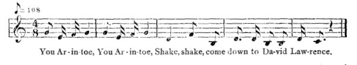

[Intangible Textual Heritage](../../index)  [Africa](../index.md) 
[Index](index)  [Previous](jas089)  [Next](jas091.md)   
 [\[Note\]](jas090n.md)

------------------------------------------------------------------------

### 90. Bird Arinto.

Mrs. Ramtalli, Maggotty.

There was a bird Arinto; it used to feed on human flesh. In the district
there was a little boy by the name of David Lawrence who was lame in
both feet. When the boy heard the bird fly, he asked his sister to take
him; but she refused, saying if she remained Arinto would eat her too.
The boy, having no other resource, dug a hole in the ground where he
lived for some time. When the bird came and perched on the house-top, he
said, "Smell flesh; somebody about here!" Then David Lawrence sang,

  
You Ar-in-toe, You Ar-in-toe,  
Shake, shake, come down to Da-vid Law-rence.

Then the bird pitched off the house to the spot where he heard the
singing. As it was an underground passage, the boy would move along and
the bird would follow him up and down. As he went to the foot (of the
passage), the bird would go there; as he went above, the bird would go
there,--all day like that. At night the bird would go to rest,--couldn't
eat he was so tired. But the boy cooked at night and had his rest.

It went on for some weeks until the bird got tired an' weary and one
night fell off the roost. David Lawrence came out, cut out the tongue,
and took it to the king, who had promised whoever killed Arinto would
get his daughter's hand in marriage. Anansi, passing the nex' day, saw
the dead bird, cut off the head and hurried with it to the king. A
wedding feast was made to have Anansi married to (the king's) daughter.
Just as that was going on, a ragged boy called at the gate, but Anansi
told the king to have nothing to do with him. But he appealed so loudly
that the king after all went out, and the boy said to him, "Anansi

{p. 116}

is a usurper, because, king, have you ever seen a head without a
tongue?" Anansi, on hearing that, ran under the table and from there
into the house-top. David Lawrence was taken in, dressed, married to the
king's daughter, and lived happily.

Jack man dora!

------------------------------------------------------------------------

[Next: 91. Tiger Softens his Voice.](jas091.md)
