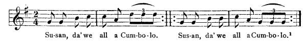

[Intangible Textual Heritage](../../index)  [Africa](../index.md) 
[Index](index)  [Previous](jas145)  [Next](jas147.md)   
 [\[Note\]](jas146n.md)

------------------------------------------------------------------------

### 146. The Cumbolo.

Sarah Findley, Santa Cruz Mountains.

An ol' man an' a wife was travelling going on walk when they hear a nice
music was playing an' the ol' man say to his wife, "O Quasiba,\[2\] hear
dat sweet music singing over yonder. I like

\[2. Two school-mistresses in Bethlehem, Santa Cruz Mountains, gave the
following list of "born-day names" which belong to negro children in
Jamaica according to the day of the week upon which they are born. See
Jekyll, int. x (l. C.).

An old woman who was telling me of some obeah practises assured me that
the obi-man (sorcerer) did not use a man's common name when he wanted to
bewitch him, but his "born-day" name.

|           |        |          |
|-----------|--------|----------|
|           | Boys   | Girls    |
| Sunday    | Quashy | Quashiba |
| Monday    | Quaco  | Juba     |
| Tuesday   | Cubena | Cuba     |
| Wednesday | Cudjo  | Bennie   |
| Thursday  | Quaw   | Abba     |
| Friday    | Cuffy  | Pheba    |
| Saturday  | Quamin | Benneba. |

 

\]

{p. 177}

to know where dat music come from."--"Ol' man, you tak time walk an' we
soon hear where dat music from But Bruddie, dat ol' Cumbolo dat was
singing las' night!"--"Den you mus' come let we dance de Cumbolo, Susan,
we all a Cumbolo!" (sing and dance)--

  
Su-san, da'we all a Cum-bo-lo. Sus-an, da'we all a Cum-bo-lo.\[1\]

\[1. The music was recorded by a colored boy who was organist in the
church at Bethlehem. The dance (also called "calimbe") is performed at
wakes, two men holding a couple of sticks parallel while a third dances
upon them to the strains of the song.\]

------------------------------------------------------------------------

[Next: 147. John-crow and Fowl at Court.](jas147.md)
