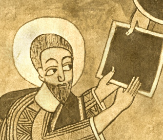

  
[Intangible Textual Heritage](../../index)  [Africa](../index.md) 

------------------------------------------------------------------------

<table width="75%">
<colgroup>
<col style="width: 50%" />
<col style="width: 50%" />
</colgroup>
<tbody>
<tr class="odd">
<td width="50%" data-valign="TOP"></td>
<td width="50%" data-valign="CENTER"><h1 id="the-kebra-nagast" data-align="CENTER">The Kebra Nagast</h1>
<h2 id="by-e.a.w.-budge" data-align="CENTER">by E.A.W. Budge</h2>
<h4 id="section" data-align="CENTER">[1922]</h4></td>
</tr>
</tbody>
</table>

------------------------------------------------------------------------

[Contents](#contents)    [Start Reading](kn000.md)    [Page
Index](pageidx)    [Text \[Zipped\]](kn.txt.gz.md)

------------------------------------------------------------------------

This is a translation of the Kebra Nagast, a tremendous collection of
Ethiopian Biblical folklore. The Kebra Nagast tells the legend of the
Queen of Sheba's son by King Solomon, Menyelek (also known herein as
Bayna-Lehkem and David II). Menyelek engineers a plot to take the
Tabernacle of the Law of God (i.e., the Ark of the Covenant) to
Ethiopia. This is done at the behest of an Angel of God who predicts the
downfall of the kingdom of Solomon.

Comitted to writing in the fourteenth century, the Kebra Nagast was
derived from Ethiopian oral traditions of the Queen of Sheba and her
state marriage with Solomon. The Kebra Nagast has been cited as one of
the sources of the Rastafarian movement because of its support of
Ethiopian theocracy.

------------------------------------------------------------------------

 [Title Page](kn000.md)  
[Preface](kn001.md)  
[Contents](kn002.md)  
[List of Plates](kn003.md)  

### Introduction

[I. The Manuscripts of the Kĕbra Nagast, etc.](kn004.md)  
[II. Translation of the Arabic Version](kn005.md)  
[III. Legends of the Queen of Sheba in the Kur’ân](kn006.md)  
[IV. Modern Legends of Solomon and the Queen of Sheba](kn007.md)  
[V. Summary of the Contents of the Kĕbra Nagast](kn008.md)  

### The Kebra Nagast

[1. Concerning the Glory of Kings](kn009.md)  
[2. Concerning the Greatness of Kings](kn010.md)  
[3. Concerning the Kingdom of Adam](kn011.md)  
[4. Concerning Envy](kn012.md)  
[5. Concerning the Kingdom of Seth](kn013.md)  
[6. Concerning the Sin of Cain](kn014.md)  
[7. Concerning Noah](kn015.md)  
[8. Concerning the Flood](kn016.md)  
[9. Concerning the Covenant of Noah](kn017.md)  
[10. Concerning Zion](kn018.md)  
[11. The Unanimous Declaration of the Three Hundred and Eighteen
Orthodox Fathers](kn019.md)  
[12. Concerning Canaan](kn020.md)  
[13. Concerning Abraham](kn021.md)  
[14. Concerning the Covenant of Abraham](kn022.md)  
[15. Concerning Isaac and Jacob](kn023.md)  
[16. Concerning Rôbêl (Reuben)](kn024.md)  
[17. Concerning the Glory of Zion](kn025.md)  
[18. How The Orthodox Fathers and Bishops Agreed](kn026.md)  
[19. How this Book came to be Found](kn027.md)  
[20. Concerning the Division of the Earth](kn028.md)  
[21. Concerning the Queen of the South](kn029.md)  
[22. Concerning Tâmrîn, the Merchant](kn030.md)  
[23. How the Merchant Returned to Ethiopia](kn031.md)  
[24. How the Queen made ready to set out on her Journey](kn032.md)  
[25. How the Queen came to Solomon the King](kn033.md)  
[26. How the King Held converse with the Queen](kn034.md)  
[27. Concerning the Labourer](kn035.md)  
[28. How Solomon gave Commandments to the Queen](kn036.md)  
[29. Concerning the Three Hundred and Eighteen \[Patriarchs\]](kn037.md)  
[30. Concerning how King Solomon swore to the Queen](kn038.md)  
[31. Concerning the Sign which Solomon gave the Queen](kn039.md)  
[32. How the Queen Brought forth and came to her own Country](kn040.md)  
[33. How the King of Ethiopia travelled](kn041.md)  
[34. How The Young Man Arrived in his Mother's Country](kn042.md)  
[35. How King Solomon sent to his son the Commander of his
Army](kn043.md)  
[36. How King Solomon held Intercourse with his Son](kn044.md)  
[37. How Solomon asked His Son questions](kn045.md)  
[38. How the King planned to send away his son with the children of the
nobles](kn046.md)  
[39. How they made the Son of Solomon King](kn047.md)  
[40. How Zadok the Priest gave Commands to David the King](kn048.md)  
[41. Concerning the Blessing of Kings](kn049.md)  
[42. Concerning the Ten Commandments](kn050.md)  
[43. How the Men of the Army of Israel received \[their\]
orders](kn051.md)  
[44. How it is not a seemly thing to revile the King](kn052.md)  
[45. How those who were sent away wept and made a plan](kn053.md)  
[46. How they made a plan concerning Zion](kn054.md)  
[47. Concerning the offering of Azâryâs (Azariah) and the King](kn055.md)  
[48. How they carried away Zion](kn056.md)  
[49. How his Father blessed his Son](kn057.md)  
[50. How they bade farewell to his Father and how the city
mourned](kn058.md)  
[51. How he said unto Zadok the Priest, ''Go and Bring the Covering (or,
Clothing) which is upon it (i.e. Zion)''](kn059.md)  
[52. How Zadok the Priest Departed](kn060.md)  
[53. How the Wagon was given to Ethiopia](kn061.md)  
[54. How David \[the King of Ethiopia\] Prophesied and Saluted
Zion](kn062.md)  
[55. How the People of Ethiopia Rejoiced](kn063.md)  
[56. Of the Return of Zadok the Priest, and the giving of the
Gift](kn064.md)  
[57. Concerning the Fall of Zadok the Priest](kn065.md)  
[58. How Solomon Rose up to Slay Them](kn066.md)  
[59. How the King Questioned an Egyptian, the Servant of
Pharaoh](kn067.md)  
[60. How Solomon Lamented for Zion](kn068.md)  
[61. How Solomon Returned to Jerusalem](kn069.md)  
[62. Concerning the Answer which Solomon made to them](kn070.md)  
[63. How the Nobles of Israel Agreed \[with the King\]](kn071.md)  
[64. How the Daughter of Pharaoh Seduced Solomon](kn072.md)  
[65. Concerning the Sin of Solomon](kn073.md)  
[66. Concerning the Prophecy of Christ](kn074.md)  
[67. Concerning the Lamentation of Solomon](kn075.md)  
[68. Concerning Mary, Our Lady of Salvation](kn076.md)  
[69. Concerning the Question of Solomon](kn077.md)  
[70. How Rehoboam Reigned](kn078.md)  
[71. Concerning Mary, the Daughter of David](kn079.md)  
[72. Concerning the King of Rome. (Constantinople)](kn080.md)  
[73. Concerning the First Judgment of ’Adrâmî, King of Rômê](kn081.md)  
[74. Concerning the King of Medyâm](kn082.md)  
[75. Concerning the King of Babylon](kn083.md)  
[76. Concerning Lying Witnesses](kn084.md)  
[77. Concerning the King of Persia](kn085.md)  
[78. Concerning the King of Moab](kn086.md)  
[79. Concerning the King of Amalek](kn087.md)  
[80. Concerning the King of the Philistines](kn088.md)  
[81. How the son of Samson slew the son of the King of the
Philistines](kn089.md)  
[82. Concerning the going down of Abraham into Egypt](kn090.md)  
[83. Concerning the King of the Ishmaelites](kn091.md)  
[84. Concerning the King of Ethiopia and how he returned to his
country](kn092.md)  
[85. Concerning the Rejoicing of Queen Mâkĕdâ](kn093.md)  
[86. How Queen Mâkĕdâ made her son King](kn094.md)  
[87. How the nobles (or governors) of Ethiopia took the oath](kn095.md)  
[88. How he himself related to his mother how they made him
King](kn096.md)  
[89. How the Queen talked to the Children of Israel](kn097.md)  
[90. How Azariah praised the Queen and her city](kn098.md)  
[91. This is what ye shall eat: the clean and the unclean](kn099.md)  
[92. How they renewed the kingdom of David](kn100.md)  
[93. How the men of Rômê destroyed the Faith](kn101.md)  
[94. The first war of the King of Ethiopia](kn102.md)  
[95. How the honourable estate of the King of Ethiopia was universally
accepted](kn103.md)  
[96. Concerning the Prophecy about Christ](kn104.md)  
[97. Concerning the Murmuring of Israel](kn105.md)  
[98. Concerning the Rod of Moses and the Rod of Aaron](kn106.md)  
[99. Concerning the Two Servants](kn107.md)  
[100. Concerning the Angels who rebelled](kn108.md)  
[101. Concerning Him that existeth in Everything and
Everywhere](kn109.md)  
[102. Concerning the Beginning](kn110.md)  
[103. Concerning the Horns of the Altar](kn111.md)  
[104. More concerning the Ark and the Talk of the Wicked](kn112.md)  
[105. Concerning the Belief of Abraham](kn113.md)  
[106. A Prophecy concerning the Coming of Christ](kn114.md)  
[107. Concerning His entrance into Jerusalem in Glory](kn115.md)  
[108. Concerning the Wickedness of the Iniquitous Jews](kn116.md)  
[109. Concerning His Crucifixion](kn117.md)  
[110. Concerning His Resurrection](kn118.md)  
[111. Concerning His Ascension And His Second Coming](kn119.md)  
[112. How the Prophets foreshadowed Him in their Persons](kn120.md)  
[113. Concerning the Chariot and the Vanquisher of the Enemy](kn121.md)  
[114. Concerning the Return of Zion](kn122.md)  
[115. Concerning the Judgement of Israel](kn123.md)  
[116. Concerning the Chariot of Ethiopia](kn124.md)  
[117. Concerning the King of Rômê and the King of Ethiopia](kn125.md)  
[Colophon](kn126.md)  
[Index](kn127.md)  
[A List of the Passages from the Old and New Testaments, Quoted or
Referred to in the Kebra Nagast](kn128.md)  
