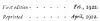

  
[Intangible Textual Heritage](../../index)  [Africa](../index.md) 
[Index](index)  [Next](kn001.md) 

------------------------------------------------------------------------

  
*The Kebra Nagast*, by E.A.W. Budge, \[1922\], at Intangible Textual
Heritage

------------------------------------------------------------------------

|                  |
|------------------|
|  |

p. i

# THE QUEEN of SHEBA & her only SON MENYELEK

## BEING THE HISTORY *of the* DEPARTURE OF GOD & HIS ARK *of* THE COVENANT FROM JERUSALEM TO ETHIOPIA, AND THE ESTABLISHMENT *of* THE RELIGION OF THE HEBREWS & THE SOLOMONIC LINE OF KINGS IN THAT COUNTRY. A COMPLETE TRANSLATION *of the KEBRA NAGAST* WITH INTRODUCTION BY *SIR E. A. WALLIS BUDGE*, M.A., LITT.D., D.LITT., LIT.D., F.S.A., SOMETIME SCHOLAR OF CHRIST'S COLLEGE, CAMBRIDGE, AND TYRWHITT HEBREW SCHOLAR. KEEPER OF THE DEPARTMENT OF EGYPTIAN AND ASSYRIAN ANTIQUITIES IN THE BRITISH MUSEUM.

### NOW FIRST PUBLISHED WITH 31 ILLUSTRATIONS FROM ETHIOPIC MSS. IN THE BRITISH MUSEUM BY THE MEDICI SOCIETY, LIMITED, LONDON, LIVERPOOL, AND BOSTON, MASS., MCMXXII.

#### \[1922\]

Scanned, proofed and formatted at Intangible Textual Heritage, April
2010, by John Bruno Hare. This text is in the public domain in the US
because it was published prior to 1923.

  [  
Click to enlarge](img/title.jpg.md)  
Title Page  

 
[  
Click to enlarge](img/verso.jpg.md)  
Verso  

 
[  
Click to enlarge](img/front.jpg.md)  
Frontispiece  

p. ii p. iii p. iv p. v p. vi

------------------------------------------------------------------------

[Next: Preface](kn001.md)

