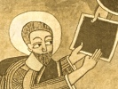

  
[Intangible Textual Heritage](../../index)  [Africa](../index.md) 
[Index](index)  [Previous](kn008)  [Next](kn010.md) 

------------------------------------------------------------------------

  
*The Kebra Nagast*, by E.A.W. Budge, \[1922\], at Intangible Textual
Heritage

------------------------------------------------------------------------

p. 1

  [  
Click to enlarge](img/pl02.jpg.md)  
Plate II. Two columns of the Ethiopic Text of the Book of the Glory of
Kings of Ethiopia. From a British Museum Codex of the Kebra Nagast  

# THE GLORY OF KINGS

##### IN PRAISING GOD THE FATHER, THE SUSTAINER OF THE UNIVERSE, AND HIS SON JESUS CHRIST, THROUGH WHOM EVERYTHING CAME INTO BEING, AND WITHOUT WHOM NOTHING CAME INTO BEING, AND THE HOLY TRIUNE SPIRIT, THE PARACLETE, WHO GOETH FORTH FROM THE FATHER, AND DERIVETH FROM THE SON, WE BELIEVE IN AND ADORE THE TRINITY, ONE GOD, THE FATHER, AND THE SON, AND THE HOLY SPIRIT.

### 1. CONCERNING THE GLORY OF KINGS

THE interpretation and explanation of the Three Hundred and Eighteen
Orthodox \[Fathers\] concerning splendour, and greatness, and dignity,
and how God gave them to the children of Adam, and especially concerning
the greatness and splendour of Zion, the Tabernacle (*tâbôt*) of the Law
of God, of which He Himself is the Maker and Fashioner, in the fortress
of His holiness before all created things, \[both\] angels and men. For
the Father, and the Son, and the Holy Spirit with good fellowship and
right good will and cordial agreement together made the Heavenly Zion to
be the place of habitation of their Glory. And then the Father, and the
Son, and the Holy Spirit said, "Let Us make man in Our similitude and
likeness," [1](#fn_29.md) and with ready agreement
and good will They were all of this opinion. And the Son said, "I will
put on the body of Adam," and the Holy Spirit said, "I will dwell in the
heart\[s\] of the Prophets and the Righteous"; and this common agreement
and covenant was \[fulfilled\] in Zion, the City of their Glory.

p. 2

\[paragraph continues\] And David said,
"Remember Thine agreement which Thou didst make of old for salvation,
the rod of Thine inheritance, in Mount Zion wherein Thou dost
dwell." [1](#fn_30.md)

And He made Adam in His own image and likeness, so that He might remove
Satan because of his pride, together with his host, and might establish
Adam—His own plant—together with the righteous, His children, for His
praises. For the plan of God was decided upon and decreed in that He
said, "I will become man, and I will be in everything which I have
created, I will abide in flesh." And in the days that came after, by His
good pleasure there was born in the flesh of the Second Zion the second
Adam, Who was our Saviour Christ. This is our glory and our faith, our
hope and our life, the Second Zion. [2](#fn_31.md)

------------------------------------------------------------------------

### Footnotes

[1:1](kn009.htm#fr_29.md) Genesis i, 26.

[2:1](kn009.htm#fr_30.md) Psalm lxxiv, 2.

[2:2](kn009.htm#fr_31.md) *I.e.*, the Virgin Mary,
who is identified in Chapter 11 with the "Tabernacle of the Law of God,
the heavenly and spiritual Zion."

------------------------------------------------------------------------

[Next: 2. Concerning the Greatness of Kings](kn010.md)

