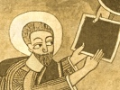

  
[Intangible Textual Heritage](../../index)  [Africa](../index.md) 
[Index](index)  [Previous](kn117)  [Next](kn119.md) 

------------------------------------------------------------------------

  
*The Kebra Nagast*, by E.A.W. Budge, \[1922\], at Intangible Textual
Heritage

------------------------------------------------------------------------

### 110. CONCERNING HIS RESURRECTION

And the prophet David also prophesied concerning His Resurrection and
said, "I will arise, saith the Lord,

p. 216

and I will make salvation and manifest it openly." [1](#fn_284.md) And again he saith, "Rise up, O Lord,
and judge the earth, for Thou shalt inherit among the nations." [2](#fn_285.md) And he also prophesied and said, "Rise
up, O Lord, help us, and deliver us for Thy Name's sake." [3](#fn_286.md) And again he said, "Let God arise and
let His enemies be scattered, and let His enemies flee from before His
face." [4](#fn_287.md) And he also prophesied and
said, "God hath risen up like one who hath woke up from sleep, and like
a mighty man who hath left \[his\] wine." [5](#fn_288.md)

Thus Isaiah the prophet prophesied and said, "He will remove sickness
from his soul, for he hath not committed sin, and falsehood hath not
been found in his mouth. And to him that hath served righteousness and
good will he show light and he will justify him; and he shall do away
the sins of many, for he hath not committed sin, and falsehood is not
found in his mouth." [6](#fn_289.md)

Thus prophesied David the Prophet and said, "For My soul shall not be
left in hell." [7](#fn_290.md)

Thus Solomon his son prophesied and said, "The Sun of righteousness
shall arise, and shall travel towards the right, and shall return into
His place." [8](#fn_291.md)

------------------------------------------------------------------------

### Footnotes

[215:1](kn117.htm#fr_278.md) Isaiah liii, 4 ff.

[215:2](kn117.htm#fr_279.md) Zechariah xi, 13.

[215:3](kn117.htm#fr_280.md) Isaiah liii, 12.

[215:4](kn117.htm#fr_281.md) Psalm xxxv, 12.

[215:5](kn117.htm#fr_282.md) Zechariah xii, 10.

[215:6](kn117.htm#fr_283.md) Acts iii, 20 ff.

[216:1](kn118.htm#fr_284.md) Psalm xii, 5.

[216:2](kn118.htm#fr_285.md) Psalm lxxxii, 8.

[216:3](kn118.htm#fr_286.md) Psalm xliv, 26.

[216:4](kn118.htm#fr_287.md) Psalm lxviii, 1.

[216:5](kn118.htm#fr_288.md) Psalm lxxviii, 65.

[216:6](kn118.htm#fr_289.md) Compare Isaiah liii,
4 ff.

[216:7](kn118.htm#fr_290.md) Psalm xvi, 10.

[216:8](kn118.htm#fr_291.md) Compare Malachi iv,
2.

------------------------------------------------------------------------

[Next: 111. Concerning His Ascension And His Second Coming](kn119.md)

