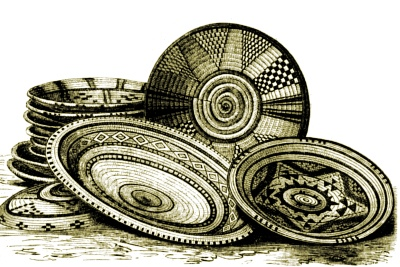

  
[Intangible Textual Heritage](../../index)  [Africa](../index) 

------------------------------------------------------------------------

<table width="75%">
<colgroup>
<col style="width: 50%" />
<col style="width: 50%" />
</colgroup>
<tbody>
<tr class="odd">
<td width="50%" data-valign="TOP"></td>
<td width="50%" data-valign="CENTER"><h1 id="at-the-back-of-the-black-mans-mind" data-align="CENTER">At the Back of the Black Man's Mind</h1>
<h2 id="by-r.-e.-dennett" data-align="CENTER">by R. E. Dennett</h2>
<h3 id="section" data-align="CENTER">[1906]</h3></td>
</tr>
</tbody>
</table>

------------------------------------------------------------------------

[Contents](#contents)    [Start Reading](mind00)    [Text
\[Zipped\]](mind.txt.gz)

------------------------------------------------------------------------

This book is by turns detailed, incoherent, and frustratingly
colonialist. Nevertheless, it is written by an intelligent and
sympathetic European observer who spent many years studying West African
folklore, culture, and religion at the turn of the 19th century. It is
useful because it goes into much greater detail than any other book from
this period about Bantu and [Yoruba](mind24) spiritual practices and
philosophy. The problem is that it presents some very half-baked
theories as to the significance of this data, which should be treated
with great caution.

By reading this book critically we can glimpse a system of nature
worship, sacred kingship, and shamanism from before the colonial era,
and get a hint of a very complex philosophy of esoteric corespondences
which rival the better documented systems (e.g. the Upanishads, the I
Ching and the Qabalah). - *JBH*.

------------------------------------------------------------------------

 [Preface](mind00)  
[Chapter 1. Luango and the Bavili](mind01)  
[Chapter 2. Election of a King in the Kongo](mind02)  
[Chapter 3. Coronation of a King in the Kongo](mind03)  
[Chapter 4. Courts of Maluango and Mamboma](mind04)  
[Chapter 5. Law](mind05)  
[Chapter 6. Measures, Signs, and Symbols](mind06)  
[Chapter 7. Bavili Psychology](mind07)  
[Chapter 8. Ndongoism](mind08)  
[Chapter 9. Nkici-ism](mind09)  
[Chapter 10. Bavili Philosophy](mind10)  
[Chapter 11. Bibila, the Philosophy of the Groves](mind11)  
[Chapter 12. Sacred Lands and Rivers](mind12)  
[Chapter 13. Sacred Trees](mind13)  
[Chapter 14. The Omens](mind14)  
[Chapter 15. Sacred Animals](mind15)  
[Chapter 16. Nzambi (God), the Word Nkici, and the Bakici
Baci](mind16)  
[Chapter 17. The Bini](mind17)  
[Chapter 18. Benin Districts](mind18)  
[Chapter 19. Bini Customs](mind19)  
[Chapter 20. More Customs](mind20)  
[Chapter 21. Traces of Nkici-ism Among the Bini](mind21)  
[Chapter 22. The Philosophy at the Back of the Black Man's Mind in Table
Form](mind22)  
[Chapter 23. Conclusion](mind23)  
[Appendix](mind24)  
