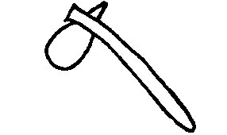
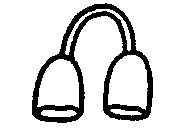
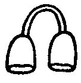

  
[Intangible Textual Heritage](../../index)  [Africa](../index) 
[Index](index)  [Previous](mind05)  [Next](mind07) 

------------------------------------------------------------------------

  
*At the Back of the Black Man's Mind*, by Richard Edward Dennett,
\[1906\], at Intangible Textual Heritage

------------------------------------------------------------------------

# CHAPTER VI

# MEASURES, SIGNS, AND SYMBOLS

Palavers. -Counting on the Hands.-The Fingers.-Lineal Measures.-The
Shroud. -Duodecimal System. -Time. -Days and Months.-Sexual Matters.
-The Seasons. -Praying for Rain. -Symbols. -Drum Language.

## PROCEDURE OF PALAVERS, COUNTING.

IF I had not read Mr. R. A. Stewart Macalister's *Studies in Irish
Epigrapy* and had been asked to decipher an Ogham inscription, I should
have had no hesitation in saying that it was a record of some ancient
African palaver. When the Bavili hold their palavers, after having met
and settled down as described by me in *Notes on the Folklore of the
Fjort*,\[1\] the party on either side smooth the earth just in front of
them. Upon this smoothed ground they keep count of all the points in the
arguments in the palaver for and against.

No. 1 begins by stating the case; and as he opens the palaver he makes a
point with the tip of his index-finger upon the ground. He then states
that so-and-so has robbed him, and this statement he marks by a stroke
which he places just after the dot, thus:-

 

Then No. 2 defends himself, and as he does so No. 1 marks the points in
his defence by strokes below a line he draws to divide his side of the
question from that of the accused. The palaver then might stand thus:-

 

\[1. And in *Laws of the Bavili*.\]

No. 1 then answers these denials or justifications of the robbery, and
as he does so makes his strokes above the line:-

 

Then No. 1 gives his proofs, but first makes a dot to show that another
phase of the palaver has been entered upon, and another oration
commenced:-

 

No. 2 answers him, restating his case:-

 

No. I then sums up, and as it is getting late, cuts the palaver for the
day; so that, if this " tally" had been kept on stone or wood, the
palaver, as far as it had gone, would appear as under:-

 

The cutting of the line, or closing of the palaver, is done by drawing a
double line with the index and next finger across the dividing line.

Now, in counting, the Bavili mark the ground also, and all this they
call "Bisona bintawto," writing on the ground. In counting they make
four strokes on the ground, and the fifth they make by crossing the four
upright strokes, thus:

No. 1 he marks with his index-finger; No. 2 with his second, covering
the first mark with the index-finger. No. He marks with his
index-finger; No. 4 sometimes with his index-finger and sometimes with
his second finger, running over No. 3 with his index-finger; No. 5, as
stated, by crossing the four strokes.

Sometimes he will count by tens. Then he marks two strokes with his
index and second fingers, and so on five times, and then he makes a
stroke apart to show that he has counted ten. Each ten are marked in
this way, until the whole number of things are counted. Then he will
count the number of strokes and declare the number counted. But when he
counts on his fingers he begins by placing the index-finger of his right
hand upon the little finger of his left hand.

I found that both the Bavili (of Luango) and the BAKOTCHI of Kakongo had
their variants of the old nursery rime for fingers or toes. I will give
them both, as they differ.

BAVILI.

1\. *Second Finger* (no name)  
    Minu i kula i kula e fuana i munto Ko  
2. *Index-Finger* (Luzala xiso anzo)  
    Minu xilandi Xiaku  
3. *Third Finger* (no name)  
    Oho nu kulila ngolo ximbixi mibakaci?  
4. *Little Finger* (Luzala lu sa)  
    Bene boso nu kulila minu unkuluntu inu?  
5. *Thumb* (Luzala mbo mbo)  
    Buãu i mangina lu nãungu lu inu lu keli inu buãu i botokula mundonga
inu.

TRANSLATION.

1\. There is no man so tall or equal to me.  
2. Index-finger:  
    I am the one that follows.  
3. 3rd Finger:  
    How much do you gain by being taller and stronger?  
4. Little Finger: a very old man, they say, the primeval  
    What do you all gain by being tall? I am thy chief  
5. The Thumb:  
    For this reason I who am not your equal am by myself, for this I
left you (on account of constant strife).

THE KAKONGO VERSION.

The first two lines are the same.  
3. Ayi nguli, ayi muna, tate, ximbixi nubakac?  
4. Nsambixi nkotala ku nkwandi tata i nguli?  
5. Lu naungu. lu inu i yaka na mundonga, inu.

TRANSLATION:

1\. There is no man equal or as tall as I am.  
2. I come after thee.  
3. And what do you gain by it, Mother and Father?  
4. Why does he raise the question (of?) his Father and Mother?  
5. Your one apart is your slave.

The Kabinda woman who gave me the Kakongo version explained that the
little finger claimed to be the chief (or the first?) because the little
finger and the "tragus" of the ear were the first parts of a child in
conception to be formed.

The Bavili use beads also to count with (BILABU or the blue glass
beads); LABU as père Visseg tells us is the most subtle part of fire.

Thus (to-day rarely but) twenty years ago generally if you watched the
Bavili counting you would notice that when he counted one he would put
two beads on the ground, two, two more, and so on until he had counted
four, when he would place two apart. These he would amass, and then
place two beads on one side, so that when he had counted eight he would
have two heaps of ten each plus four beads or 24 in all. These he would
amass again and place one on one side (25 or one generation) so that
when he had counted forty he really had 80 + 16 + 4 = 100.

Now the word for ten is Kumi (from KUMA to cause, to reason) and ten is
the square root of KAMA, a word meaning (the royal wife and) 100.

The smallest measure that I know of is what the natives call XITINI,
that is from the tip of the middle finger to the bottom of its joint or
its root in the palm of the hand. It measures two nails or 41/2 inches,
and is used in measuring tobacco, long strings of which are cut up into
these BITINI. The value of the XITINI of tobacco was 36 BILABU or beads,
two Bitini make one MBOKANA (palm) and two MBOKANA make one LUBONGO
ZIFULA (or a piece or native grass cloth measuring 18 inches or a
cubit). Its value being 144 beads.

2 ZIMBONGO= I MAKABA or yard.  
2 MAKABA = I NTAMA or fathom, and this may be said to be their standard
measure.

Three NTAMA (or 12 mats in one bundle)=one MBONDO, while four MBONDO=One
NLELE BIFUNZI (or 48 mats) or the bundle that a man is expected to
contribute towards any of his wife's near relations' funeral expenses.
These mats are sewn together also for the purpose of shrouds, thus six
mats make a SAMBANO, complete cloth, four of which are sewn together to
look as if there were only three to make a shroud, That is to say, two
are first sewn together, then two more, and one of the latter is allowed
to fall on one of the former just to cover it and then sewn that way, so
that one complete shroud is composed Of 24 pieces or ZIMBONGO ZIFULA.  
The King is first wrapped in one shroud (24 cubits). After an interval
when his body has been dried, he is wrapped in three shrouds (72
cubits), and finally, just before burial in six shrouds, or 144 cubits.
The NLELE BIFUNZI is valued at 7,200 beads.

      120 Beads= 1 LOMBi or string.  
    1,400 " or 12 MILOMBI = 1 XIKO or a bunch (50).  
   14,400 " or 10 BIKO = 1 NSUKU or KAMA 400.  
  144,000 " or 10 MISUKU = 1 XIVIEVE (1000).

In the olden days cottons were sent out in accordance with the demand of
the natives in pieces 24 yards long doubled in 24 laps or 12 folds. In
1880 the length was 20 yards, in 1883 it went down to 18 yards, and
latterly, when the trader was obliged to pay import dues and taxes to
the different Governments, the length quickly fell to eight yards.

In the same way the Germans sent out strings of only 100 beads
(believing in the superiority of the decimal system) until at last the
natives refused to receive them in exchange for ivory.  
The sun and moon are the great time markers of the Bavili, the heavens
their mighty clock.  
They divide the night and day into 12 periods of two hours each. They
call this period LO or rather XELO a cutting (plural BILO).

From 6 p.m. to 8 p.m. they call XELO XITOMBE XITOMBE or the little
darkness.  
   "   8 p.m. to 10 p.m. they call XELO XITOMBE darkness.  
   "   10 p.m. to 12 p.m. XELO KATA XIBWICI.  
   "   12 a.m. to 2 a. m. MIXELO-XELO the little cuttings.  
   "   2 a.m. to 4 a.m. MWECI XELO the smoke cutting.  
   "   4 a.m. to 6 a.m. MWECI smoke or the revealer.  
   "   6 a.m. to 8 a.m. MBOTA MAULA the star MAULA.  
   "   8 a.m. to 10 a.m. LUBACI LUASEKA of the custom of the people of
corruption.  
   "   10 a.m. to 12 a.m. MENE NGWALI (early partridge) morning.  
   "   12 p.m. to 2 p.m. TANGA MBATA to count the stroke, to throb.  
   "   2 p.m. to 4 p.m. MBUKU LUBWICI the birth of the falling.  
   "   4 P.m. to 6 p.m. TANGA MACIKA to count the sinking.

The night they call the deep of the heavens, BUILU; the day, LUMBU, of
the custom of the deep.

There are four days in the week.

\(1\) NDUKA, the day when palavers are finished.  
(2) NTONA. The day when women do not plant, and burials take place,
followed by the dance MASUKU.  
(3) CILO. The day when the family fetishes MPUMBU, NGOFO and XIMPUKA are
consulted about death palavers, and Manioc is taken out of the water.  
(4) SONA. Perhaps short for SUNGA virtue. The day when no one is allowed
to pass the NKUMBI tree save women going for water. Man's day of rest,
the women's market day. Only women sell in the market.

Thus there are seven weeks in the Bavili month. His year is composed of
thirteen months, which he divides into three great divisions, one of one
month, one of four months, and one of eight. MAWALALA, XICIFU, and NVULA
is the beginning and end of the year, the dry season and the rainy
season. And there are three great Zinganga presiding over these three
divisions of the year. NGANGA NVUMBA the King, NGANGA BUNCI, who doctors
sterility in men, and NGANGA FUNZA, who doctors barren women so that
they may become fruitful. MAWALALA is also a season.

The other twelve months are then arranged into six seasons as under:-

The season MWICI (smoke) produces as food the pea, NKASA and the names
of the two months in this time are BULU MACI MAVOLA (the deep of rain
water), and BULU MACI MBU (the deep of the sea waters).

The next season is BUNJI (literal meaning mist) producing the new green
grass called MBUNDUBUNDU.

The two months in this season are called BIKA LI MUANDA XICIVU (to leave
the valley of mist) and MUANDA XICIVU (the valley of mist).

During the season Mwici the men hunt and fish while the women gather
FUBU leaves for their mat and basket work. The season BUNJI is devoted
by the men to the burning of the grass, hunting, and cutting down of the
forests to form new plantations, while the women busy themselves in the
making of mats and baskets.

The season of drizzling rains is called MVUMVUvu, and it produces BUKU
or mushrooms. The names of the months are KUFULu NKACI and KUFULU NUNI
(negative and positive burning or desire).

This season is occupied by the men putting new roofs on their houses and
repairing them generally, while the women sow their seed and prepare to
plant manioc and sweet potatoes. It is now that the BAVILI'S thoughts
turn lightly to love and marriage, and as a great deal of false modesty
is to be noticed in the writings of some authors of books about the
Kongo, and as it leads to a good deal of misunderstanding,\[1\] it may
be well to state clearly what the ideas of the Bavili are on this
subject.

The great power BUNZI objects strongly to unmarried women; increase and
multiply are his standing orders. Virginity therefore after one has come
to the age of puberty

\[1. I mention this because in one translation of the Gospels the Virgin
Mary is called NDUMBA.\]

is almost unknown, and is not a state which a woman can be proud of When
speaking of the virgin earth the Bavili say ANCI I BUNA I BUTICI XIMAKA,
"the earth as yet has not brought forth anything," but speaking of a
maiden they say XINKUMBI I BUNA KU NETA XIVUMU KO, "the maiden's stomach
has not yet carried anything." A child before it arrives at the age of
puberty is called XINKUMBA, but when she has arrived at that age and is
still a virgin she is called XIKUMBI XIMBUILA. A woman who has lost her
virtue is called NDUMBA. The name for an ordinary wife is NKACI, a royal
wife NKAMA.

The next season is that of the WAW WAW WAW rains, and it produces the
KUSAFU or NSAFU, a small green fruit something like a date in shape.
KACI MBANGALA and NUNI MBANGALA, *i.e.*, the negative and positive
witness, are the names of the months. The name of these rains is also an
exclamation used to express "listen! look! as it was, so it is again,
the thief!"

MBANGALA carries with it the idea of exposure and the fear that causes
one to run away (WANGALA). KUSAFU means the exhibiting or the sprouting
of the tree.

The next season is that of the female rains NVULA NXENTU, and this
brings forth fruit MAKUNDI. The months are BIKA LI MUANDA SUNJI and
MUANDA SUNJI.

During the month of BIKA LI MUANDA SUNJI the female rains hurry on all
fruit to a state of ripeness, so that when they cease in the next month
(the little dry season) the people can gather in their harvest. It is
said to leave sufficient moisture in the ground to last over the month
of MUANDA SUNJI.

Just before the new moon that heralds in this last month (the seventh
month of the Hebrews) the Bavili gather the large leaves of the herb
LEMBELEMBE, and with them cover up their fetishes; this they call KUBATA
BAKICI. These then remain covered until the next new moon appears, when,
after having chewed the pepper NXEFU ZIMPUMBU and the leaves of the
LUSAKU-SAKU, the Bavili splutter the contents of their mouths upon them
to wake them up; this they call KUSAKA MUNA BAKICL

MAKUNDI =fruits. KUNDA is to do homage by throwing oneself on the ground
and rubbing the earth with the sides of the palms of one's hands and
then touching the sides of one's face with them. MUANDA SUNJI=the deep,
valley, or soul of the cycle. SUNJI NDUNGO is the skin that is stretched
over the hollow of the drum. SUNJIKA is to clear up and straighten (a
complicated palaver).

NSUNJI YADUKA means the cycle is ended, referring to the end of a season
or a year. Such is the picture of fruitfulness, as the result of
pregnancy caused by the life-saving rains.

The last season is that of the male rains, NVULA MBAKALA, producing the
palm kernel MBA, and comprising the months NDOLO NKAU and NDOLO NUNI.

And this is the end of the cycle of seasons.

## PRAYING FOR RAIN IN FJORTLAND (KONGO).

The rainy season should commence in the Kongo about the middle of the
month of September, that is, in the month called Kufulu Nkaci (negative
desire), but in 1898 the rains came a little before their time, and the
old men looked sadly on and prophesied a drought. Month followed month
and scarce a shower fell, and the people began to cry out against their
rulers for having neglected their duty to their Bakici Baci, or primeval
powers on earth, of which Nzambi or God is the personal essence or
spirit. In 1896 the same thing occurred and a famine scoured the land;
the people blamed Nganga Vumba, or their king elect, who had not yet
been crowned Maluango, and that poor old man left his Xibila (sacred
ground) in the province of Buali and sought refuge in his natal village.
This year, Maluango existing but in name, the slave Mamboma is acting in
his place. Thus in answer to the cry of the people the sacred groves of
Nyambi (vis vitæ) the nephew of Bunzi in Kakongo, the south wind and the
giver of rain, and that of Senza, the west wind, were cleaned up and
once more put in order; and the goods necessary were collected by him
(Mamboma) and sent in the name of Maluango to Bunzi to pray him to send
the rain to the now parched country of the Bavili (people of Luango).
Bunzi received their gifts, but Nzambi heard not their prayer, and the
rain came not.

After an eloquent sermon at the mission a priest informed the
congregation that special prayers would be offered to Almighty God that
He might be pleased to forgive the sins of the people and send them
rain, but the good priest reminded them that their sins might be such
that God could not overlook, and so He might, in spite of the prayers of
the faithful, refuse to grant their petition. And God did not hear their
prayers, and no rain came.

And the Zi Nganga, or priests of the groves of Nyambi and Senza, sought
hard for the cause of God's wrath, and they divined that it was on
account of the immorality of certain persons unknown, who were ignoring
the traditions and laws of their God and country. Then Mamboma sent word
to his Kongo Zovo, or chiefs, that there were people in their towns who
were the cause of God's wrath. And the Kongo Zovo each in his district
called his people together and bid them make the necessary inquiries.
And it was discovered that three girls were pregnant, who had ignored
the customs of their country and had been defiled by men before having
passed through the "paint-house."

As there is much misconception abroad about this custom of putting
maidens into the paint house, originating no doubt in the first
impressions of people who without a proper study of the subject have
concluded that it must be bad because it is a custom of a people living
in a different stage of civilisation from their own, let us digress for
a moment to describe it. We in England know what it is to suffer from
the vicious fables of ignorant scribes bent on informing the Continental
public of all the evil that exists amongst us. We cannot blame the
public in question for the opinions they have formed of us, we can only
pity them, and curse the idiots who have only studied one side of our
character, or who have come to us so prejudiced that even our virtues
are distorted by them into some cute scheme of the devil to put them off
what to them may seem a true appreciation of our character. So it is
with the European and the African generally; the European is white and
therefore pure, the African black and therefore impure. And all the good
we find in him, we proudly put down, not to the influence of God who has
been with him from the beginning, but to our own good influence. And so,
when we drop from our atmosphere of twentieth century refinement and
find ourselves after a few days' sea voyage in the middle of twelfth and
thirteenth century frankness, we are apt to see sin and immodesty where
really neither exists.

At the first signs of puberty the maiden's (xikumbi) family rejoice, and
the men fire off their guns. Then a small hut or shed is built outside
the town for the girl. The hair of her head is shaved off and her whole
body is covered with takula, or the powdered red wood mixed with water.
Thus painted the maiden retires with friends of hers who have already
gone through the ceremony to the little hut. Here she is presented with
a fowl, or if the family cannot afford this, an egg. The maiden rests
here for six days while her companions watch and amuse and feed her
during the day, serving her as if she were a princess, and at night
singing and dancing to the music of the misunga (the great dried pod of
the Baobab tree).

In the meantime a nice shimbec or hut is built for her in town, wherein
two beds are placed. Upon one of these, accompanied by two of her older
friends, the maiden sleeps, while the other is placed at the disposal of
her other and younger friends. Each day she twice submits to the
painting process, and for four or five months is not permitted to work
in any way.

When the time comes for her to be handed over to her husband, one of his
relations proceeds to this shimbec at the break of day, and pulls her
bed out of the hut by one of its legs. If she is not yet engaged to be
married, then it is her father who pulls the bed out into the open. Then
all the women of the maiden's family, carrying umbrellas and clean
clothes and ornaments for her, take her down to the salt water, and beat
the paint off her with pliant twigs; then they proceed to the nearest
fresh water stream and wash and dress. The maiden's legs are loaded with
great brass rings, her arms with smaller ones, while her neck and waist
are hung with all the family's coral, across her breast a coloured
handkerchief is hung, and the general colour of the cloth or skirts
hanging to her waist is red; an umbrella completes her outfit. Then a
procession is formed, and all her friends, twirling their umbrellas,
sing and march through the town or towns on their way home again. All
along the route the young men in the towns come out and dance before
her, presenting her with some small offering. Then she is taken to her
husband, and dancing is kept up during the night.

And now to return to the search for the evil doers. When it became known
that the Kongo Zovo were in earnest, and meant to punish the three girls
and their defilers, their families hid them away, so that the people,
who were now thoroughly aroused, became very angry. The month of
Mbangala Nuni (December) had nearly passed, and the sun-scorched stocks
of the fruitless Indian corn shook their rustling leaves in mockery
around the native huts, and the shrivelled leaves of the native bean lay
black and crisp upon the ruddy soil, while the sweet potato shoots
planted beneath the mandioca had flowered and withered long ago. Their
mandioca and their half sulky palm trees alone remained, and granted
that it rained shortly, might still be saved to them. The mango trees,
that during the last drought had born them two great crops of their
luscious fruit, this year had scarcely deigned to bear at all.

On New Year's Day, as I was on my way home, I noticed a crowd of women
hooting and beating a girl, who was running away from them. That girl
was one of the three. She got away to her village, and prematurely gave
birth to a child. Time was given to her to recover, and January 23rd was
the day marked for the great dance in Maluango's capital, when the girl
and her defiler should pay the penalty due to their God, King, and
country for their crime. The custom is that the crime committed shall be
proved against the culprit before the King and the people assembled, and
the penalty is that the culprits shall be shamed by dancing naked before
all the people, who heated gravel and bits of glass and threw them at
the man and girl as they ran the gauntlet. The culprits were then
obliged to buy some very expensive medicine by way of a fine to appease
the Bakici Baci. I do not say that death may not in some cases be the
penalty, but Maluango alone has the power of life and death over free
men, and the people themselves would have to answer to him if they took
the law into their own.hands, and killed a sinner of this kind before a
proper trial had taken place. But before the 23rd the man and the girl
in question had run away.  
In the meantime, the people in the villages around the mission had
discovered the second girl who had broken the laws of her country. So
they went to her town to arrest her. But she had run away, so they tore
up the plantations round about, and eased their wrath in that way.

Then the head of the mission, understanding that the. people wished to
kill the girl, very properly wrote to the administrator to ask him to
interfere in the matter. The administrator then arrested one of the
Kongo Zovo, and kept him prisoner until the culprits should be delivered
up to him. And on January 27th the culprits were brought before him,
*and on that morning it rained*.

## SOME SYMBOLS.

Questions of this sort are settled by the people; but in some cases the
palaver is considered too important for human interference; then the man
wears a badge (Pl. II, b) with various symbols upon it.

The great symbols which the Fjort describe upon their carved sticks, or
on their cloths, are as follows:-

 

"Ntangu Ntangu, The Sun."

Vana vamonikana ntangu mbata. ina.

This sign signifies: " Even if I keep putting off talking the palaver
with you, we will talk it out when the sun at midday is unclouded."

 

Ngonde Ngonde, The Moon.

Vana vantentimina ngonde katekuici.

The same meaning, but at midnight when the moon shines brightly.

 

Axe.

Xitali kukuanga nunkuanga kwinu.

When a man is about to die he says: "You may be killing me, but there is
one who will avenge me."

 

Hoe.

Nkuku sengo kufua nkuku li ambu (kufua) mpe. " The hoe may rust and
vanish, but the word lasts for ever." This refers of course to their
everlasting palavers, but it has the higher sense also.

 Ngonje.

Beno nuzabici minu i li fumu'nci Budu lu ncikila ngonje. " Let all know
that only on the death of a Prince, and by a Prince, can the ngonje be
struck."

 

Bikula.

The four royal drums, representing the four fingers on the hand.

Bikula õuaci ku muntu ku fua bikula ku cikila mpe una ba cikila fumu ci.

"The drums that are heard by man only on the death of a great prince,
and not at other times."

 

Ma Ku Ku.

The three lumps of ant-hill-earth, which women place under their pots to
support them while their food is being cooked.

Ma Ku Ku ba tatu nzunga ku duku ka mpe.

"A pot on three stones does not upset."

When a woman comes with a matet \[1\] upon her head in which bottles of
water are carried, she places them at her husband's feet, and if well
educated, salutes him by clapping her hands three times, and says
"makuku batu nzunga kuduku ka mpe."

One day an old lady visited me. She had taken nkasa, the poisonous bark,
to prove to the world that it was not she who had caused death. She was
wearing the red collar to show the people that she had taken nkasa and
that successfully.

On one side of this red neck-scarf or collar, which is bound with white
tape, were represented the moon, a native axe and a native hoe, and at
the bottom the sun. This picture gives us the idea of the moon's place
in creation, as the woman working with hoe and axe to supply man with
food. On the other side were roughly represented the death-drum
"Bikula," and a woman carrying a load upon her head, above the three
makuku (or tops of small ant-hill) upon which the woman's cooking pot is
placed. And where the two ends of the collar are joined together, a
negro bell is attached.

Now when the BAVILI make a solemn oath (KU LEVA MPECI) they wet their
finger and make the sign of the Cross upon the earth and then touch
their earth-covered finger with their tongue.  
General as this custom is even far inland, I have always

\[1. Long native basket made of palm leaves.\]

looked upon it as one possibly introduced into the country by the early
Portuguese.

Mr. Bentley translates the word cross EKULUZU, while Père Derouet gives
the word KRUSSU, these are of course derived from the Portuguese word
"Cruz."

Now in the capitals of all Kongo's once great provinces (now Kingdoms)
four roads called NZILA NZAMBI or God's roads meet, and where they cross
or rather separate they are called MAVAMBA, and these roads come from
the East and West and North and South and represent the four great
winds, MABILI the East from whence their religious ideas come, SENZA the
strong West wind representing morality, XIKAMACI the North wind
representing matter, reason and evil, and BUNZI the South wind
representing the deep of the nervous system, the rain giver.

The signs by which the natives represent the Cross they call ZILA (or
way), and it is of the TAU form 
with the additions at the lower extremity of the
inverted horns of the Antelope 
called MBAMBISA. It is used on the collar of red saved
list, worn by those who have taken the powdered bark "NKASA," the ordeal
to prove that they are not witches. It says "We were of one . . . .
stock and travelled by one way until this palaver parted us."

On Friday, January 5, 1900, Matueka came to see me, he informed me he
had taken "casca." He was wearing the usual red collar round his neck
and I asked him to explain the symbols worked in patchwork on it.

The sign near the top of the right shoulder, he said, we call nzila
mavamba,  , and it means
that we were born of one mother, and were one until strife divided us.
The next sign, xala mioko, 
is a seed that opens and separates easily, and shows
that I was open handed and generous. Then the bellows, nsakaso,  points to the fact that it was
my relations that caused me to treat them as I have done. The nozzle to
the bellows,  , called
nxelo, explains that we were sons of one father, and that I, the son of
one wife, had to contend against my three half brothers, sons of another
wife, The three ant-hills, makuku matatu, 
, tell you that I called witnesses, saluted them three
times, and told them all about the palaver. The mat, mbonda fulla  , says that I put my accusers
on one side just as they have placed me on one side.;  , ntanji or chair, points out
that I was given a nice place in the town where I took casca, and was
well treated. Then Mbambisa, 
the horns of an antelope, explains that I asked the
question, "What did I do to cause this dividing of the ways of the
children of one father." And the smaller drums "bikula,  , say, " Why was I forced to
beat the Bikula and so let all the world know that I was an outcast from
my family?" Then when I had taken the bark and proved my  
innocence, I beat the drum ndungu ilo, as the sign  big drum, shows, to let the
world know that I was innocent. And I sent the ngonje,  , or bell to my people to
announce the day of my return to town. And the Ximpaba,  or knife of office was sent to
my accusers to demand damages.\[1\]

## THE TRIBAL MARKS OF THE PEOPLE BETWEEN LUANGO AND BRAZZAVILLE.

The Batexi, or Bateki, who say they are from the same Mother as the
Bavili, file their front teeth to two points, and mark each side of
their face with three marks 
.

The Bakuni file their front teeth to six points, and mark their face
with six strokes .

The Bavili file their front teeth to four points, and mark their
stomachs thus:-

 

The Bakamba file their front teeth to six points, and have from one to
three crocodiles tattooed on their stomachs.

The Bayaka and Basanji file their front teeth to two points, and have
six keloids, in the form of lizards, on their stomachs.

## DRUM LANGUAGE.

In 1881, we in Landana heard of the wreck of the mail steamer Ethiopia
off Luango, sixty or seventy miles away, one or two hours after its
actual occurrence, in Luango, by drum message.

\[1.These rough diagrams represent as nearly as possible the very rough
patchwork figures on the red collar.\]

This wonderful drum is called NKONKO, and is formed of a log of wood
some six feet long. This log is then rounded; pieces at each end of what
is destined to be the top side of the drum are left in the rough, to be
carved and ornamented. From these pieces (nearly from end to end that
is) a long thin slit or cut is made. This incision is about two inches
deep and three finger-widths broad in the middle, narrowing at each end
to two finger-widths. The rounding is then continued to the depth of the
incision, then the drum is hollowed out by means of long chisels or
gouges.

The drum being made, a good operator with his drumsticks can say
anything he likes upon it in his dialect. The drum-language (so-called)
is not limited to a few sentences but, given a good operator and a good
listener, comprehends all a man can say.

I. The sound I (ee) is formed by operator striking the side of the drum
nearest to him, just in the centre of the drum, on the line of the
incision.  
U is formed by hitting the belly of the drum on both sides at the same
time, when they say the sound comes out at either end of the incision.  
A is sounded by beating the line of incision to your left, near to that
end of the drum.  
O, by beating the line of incision to the right of the I.  
E, by striking the line of incision on both sides of the drum between
the letters A and I.  
The other letters are formed in combination with these vowel sounds by
striking the line with a second drum stick with more or less of emphasis
or precision.

The call to arms:-In yako-in yako-i zi fula i me yela.

Here (we are ready)-(get ready) there both powder and ball.

To call the men who are in the bush to town:-Beno boso nu duka.

You all (gather) together (in town) caution.

And when the native hears that an enemy is approaching, he advises him
to come well prepared, or he will suffer:-Nu ba intu for bantu.\[1\]

You men.

In the early part of 1895 I sent the schooner *Olhanensa* from Luango to
a place some sixty miles north, called Konkwatti, for the purpose of
picking up some cargo there. One morning about ten o'clock my head man
came to me, and after some hesitation told me that he had heard that the
schooner was ashore. I could get nothing more definite out of him except
that he had heard the "news." I knew enough about the rapidity with
which bad news travels to believe that this misfortune must have
occurred, and set about making the necessary preparations for
despatching boats and implements to her rescue, so that the next day,
when the messenger confirming the news arrived, all was ready and
immediately forwarded. It appeared that the schooner had come ashore
during the night previous to the arrival of the unofficial news, which
probably had not been communicated to me until some time after it was
the common property of the natives; that is to say, the news had
travelled the sixty miles or so in three or four hours.

\[1. This is particularly interesting, as giving the key to a perennial
puzzle, revived during the Boer war, viz: How does news travel among the
natives in the speedy way it does?\]

------------------------------------------------------------------------

[Next: Chapter 7. Bavili Psychology](mind07)

