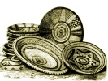

  
[Intangible Textual Heritage](../../index)  [Africa](../index.md) 
[Index](index)  [Previous](mind11)  [Next](mind13.md) 

------------------------------------------------------------------------

  
*At the Back of the Black Man's Mind*, by Richard Edward Dennett,
\[1906\], at Intangible Textual Heritage

------------------------------------------------------------------------

# CHAPTER XII

# SACRED LANDS AND RIVERS

Sonio.-Killing the King.-The Provinces.-The Formula.-Maluango's Lesson.

I COULD not, if I would, give you an exact account of the meanings of
the names of all the rivers and places in Luango, so that I will
restrict my study to the river Kuilu and its tributaries, and the names
of the provinces into which the composite kingdom of Luango, is divided.

Starting south of the Kongo we find the name Solo, or SONIO, as that of
a province in Kongo's composite kingdom. When the natives talk of the
banks of a river they stand with their backs to the sea, and call the
right bank the man side and the left bank the woman side (the word Solo
might be translated as the power of life in fatherhood).

Now just opposite to the province of Sonio on the woman side of the
great river Kongo, we have the province of NGOIO (the power of life in
motherhood).

NEAMLAU told me that he had the right to take the cap of NGANGA NGOIO,
but that as this chief was always killed on the night after his
coronation he did not care to do so. It is said that when Kongo sent his
sons to govern his provinces, he sent NGOIO with them as a kind of high
priest, and undoubtedly the NKICICI BUNzi has its home at MBAMBA in this
province or district, and its NGANGA also.

But both Sonio and Ngoio are names used at times for the whole kingdoms
of Kongo and Kakongo, which makes me think that these names are really
their sacred names. Certain it is, that just as MAKONGO had to marry a
princess Of SONIO, so MALUANGO had to marry a princess of NGOIO.

And just as Sonio and Ngoio for the natives represented Fatherhood and
Motherhood, so BUKOIO, the sacred name for Luango, represents, as an
effect, offspring (or as a cause, birth-giving power).

There is a legend which throws some light on the thoughts of the BAVILI
regarding their origin. It runs thus

BUKOIO BUNTANGUA!  
The birth-giving power of the sun (Luango).  
LUKATU BAKA 'NGILA MADONGA  
UNA 'N NUKA 'NCIA CIALI,

translated to me " though the fish-basket be empty there still remains
the smell of the fish," which I think means to say that although Luango,
may not be the really great kingdom, yet, as the descendant of Kongo, it
at least has some of the renown attached to that great father kingdom.
In other words, if Maluango (great MFUMU in his own kingdom) is not
*the* MFUMU, Still, in relation to Kongo, he is MANIFUMU.

This connecting of the seed of the great Kongo with the sun,\[1\] taken
in connection with the name NGOIO (NGO NDE the moon) is very suggestive,
for it leaves us to suppose that the Father Kongo must be on a line with
some higher power, the moon being an intermediate effect, while the sun
(the offspring and the propagator) becomes the intermediate cause, just
as the offspring Luango is-that is, the father, through the mother, has
a son who in his turn shall propagate his image. I know of no NGANGA
BUKOIO in Luango and very few people seem to know that BUKOIO BU NTANGUA
is the sacred name of the country. But MAMBUKU is the very powerful
chief of the province of BUKU.

The people are now seldom, if ever, called to meet the king in his
XIBILA and so valuable traditions are being lost, and it has become very
difficult to piece together even the headings of these lessons, and of
course, quite impossible to give them in his words.

I will now give you the names of the provinces and rivers.

\[1. See p. 104.\]

And here let me clearly state that the order in the following formula of
twenty-four Bakici baci was obtained by the help of two or three
intelligent non-Christian natives in an attempt to complete the
philosophy of the Bavili. I therefore, first give a list of the titles
and lands, and secondly in table form the order as established by myself
and the natives. The contents of the sacred groves are the same as those
given in chapter IX. In discussions it always appeared to me that these
natives instinctively connected the animals, trees, and omens with the
foregoing groves discussed in the last chapter, but they could give me
no intelligent reason for so doing, save that they were all BAKICI BACI.

SAMANU is the most southerly province of Luango on the sea coast, just
on the northern bank of the LUANGO LUICI or CHI LUANGO river which
divides it from the mother province KAKONGO. The natives say that SAMANU
means the waters of purity.

XIBANGA is the most northerly province divided into two parts by the
waters of the KWILU river-the part to the north being the home Of
XIKAMACI, where they say a pretender to the throne of Maluango is never
wanting.

The meaning of XIBANGA is of the quality of seed.

LUANJILI is the province joining the two above provinces together with
the exception of the sea frontage of BUALI, a strip of land containing
the road from Buali to the beach. It is in this province that the kings
of Luango are buried. LUANJILI means of fused rocks.

XIKAMBA is the centre inland province facing the Mayombe on the east,
and its meaning is of the quality of informing or calling. It joins
NKONDI to MBUKU.

NKONDI is the province on the South-east of BUALI where the sisters of
Maluango reside and have children from among whom the king's successor
is chosen. The word means a hunter and this connects the province with
fruitfulness (see P. 103).

MBUKU is the province to the East of BUALI and northeast of XIKAMBA,
where MAMBUKU resides and guards the Eastern gate of the kingdom-the
province where the sun rises. MBUKU means explosion.

These six provinces surround BUALI, the centre province in the middle of
which MALUANGO has his XIBILA or sacred grove. The meaning of BUALI is
the deep of breathing life.

The sea is called MBU, the deep, an enclosed space. It is at the mouth
of the river, where whirlpools are created by the meeting of the fresh
and the sea waters that the deeps of maternity exist, which they call
MBUNGU NTWALI.

The KUILU, is the principal river of the kingdom of Luango, the word
means to and from the sky. Into this river the tributaries LUICI,
LUKULU, and the LUALI run.

NYANGA is the name of the lake and means the repetition of the four, and
it is here that the NYARI, the name by which the KUILU is known in its
upper reaches, has its source.\[1\]

The Sacred Rivers and Provinces and Contents of Sacred Grove.

<table data-border="0" width="943">
<colgroup>
<col style="width: 33%" />
<col style="width: 33%" />
<col style="width: 33%" />
</colgroup>
<tbody>
<tr class="odd">
<td data-valign="TOP" width="27%">
 
</td>
<td data-valign="TOP" width="51%">
BUKOIO
</td>
<td data-valign="TOP" width="22%">
 
</td>
</tr>
<tr class="even">
<td data-valign="TOP" width="27%">
 
</td>
<td data-valign="TOP" width="51%">
(Contents of the grove.)
</td>
<td data-valign="TOP" width="22%">
 
</td>
</tr>
<tr class="odd">
<td data-valign="TOP" width="27%">
Rivers.
</td>
<td data-valign="TOP" width="51%">
 
</td>
<td data-valign="TOP" width="22%">
Lands.
</td>
</tr>
<tr class="even">
<td data-valign="TOP" width="27%">
1. KUILU.
</td>
<td data-valign="TOP" width="51%">
MACI (rain water). 
MBU (salt water).
</td>
<td data-valign="TOP" width="22%">
SAMANU.
</td>
</tr>
<tr class="odd">
<td data-valign="TOP" width="27%">
2. LUICI.
</td>
<td data-valign="TOP" width="51%">
XIVUNGA (seed). 
MTI (tree).
</td>
<td data-valign="TOP" width="22%">
XIBANGA.
</td>
</tr>
<tr class="even">
<td data-valign="TOP" width="27%">
3. LUKULU.
</td>
<td data-valign="TOP" width="51%">
NZO (house). 
XINKONKOLO (oyster shell).
</td>
<td data-valign="TOP" width="22%">
LUANJILI.
</td>
</tr>
<tr class="odd">
<td data-valign="TOP" width="27%">
4. LUALI.
</td>
<td data-valign="TOP" width="51%">
XINIOKA (snake). 
XAMA (snake).
</td>
<td data-valign="TOP" width="22%">
XIKAMBA.
</td>
</tr>
<tr class="even">
<td data-valign="TOP" width="27%">
5. NYANGA.
</td>
<td data-valign="TOP" width="51%">
MBIZI or NFU (fish). 
SUSU (fowl).
</td>
<td data-valign="TOP" width="22%">
NKONDI.
</td>
</tr>
<tr class="odd">
<td data-valign="TOP" width="27%">
6. NYARI.
</td>
<td data-valign="TOP" width="51%">
VUMUNA (animal). 
XIBULU (beast).
</td>
<td data-valign="TOP" width="22%">
MBUKU.
</td>
</tr>
<tr class="even">
<td data-valign="TOP" width="27%">
 
</td>
<td data-valign="TOP" width="51%">
BUALI.
</td>
<td data-valign="TOP" width="22%">
 
</td>
</tr>
</tbody>
</table>

 

In the above order it will be seen by the meaning of the words that the
order of the six categories is maintained.

\[1. The meanings of these words are: Kuilu, to or from heaven; Luici,
primeval essence; Lukulu, of the spirit, of the departed, or of the ray
of light; Luali, of the breathing life, Nyanga, continuance of being;
Nyari, of the road of being.\]

The following lesson, if not exactly what Maluango used to say to his
people, at any rate is a close reproduction of it. I have talked over
these questions with him many times, although I never heard him address
his people in a sacred grove. In the reading of these symbols it will be
noted that my friends have as it were doubled the formula in the middle
and taken the first and sixth families together, and worked down and up
towards the line dividing the third and fourth.

Maluango is supposed to be speaking.

<table data-border="0" width="621">
<colgroup>
<col style="width: 50%" />
<col style="width: 50%" />
</colgroup>
<tbody>
<tr class="odd">
<td data-valign="TOP" width="17%"></td>
<td data-valign="TOP" width="83%">
Nyari-Kuilu. 
The way of Being, to and from sky. 
The Source and the mouth of the river must not 
be separated in your minds. 
God is the Source of all things the
</td>
</tr>
<tr class="even">
<td data-valign="TOP" width="17%">
Nyari.
</td>
<td data-valign="TOP" width="83%">
Great ruler (Nyari) in heaven as I am the ruler on earth-
</td>
</tr>
<tr class="odd">
<td data-valign="TOP" width="17%">
Kuilu.
</td>
<td data-valign="TOP" width="83%">
From heaven to heaven do we come and go-
</td>
</tr>
<tr class="even">
<td data-valign="TOP" width="17%">
Vumuna.
</td>
<td data-valign="TOP" width="83%">
We suckle our young like cattle
</td>
</tr>
<tr class="odd">
<td data-valign="TOP" width="17%">
Xibulu.
</td>
<td data-valign="TOP" width="83%">
And know our wives like the beasts of the field.
</td>
</tr>
<tr class="even">
<td data-valign="TOP" width="17%">
Xibila.
</td>
<td data-valign="TOP" width="83%">
But as we come together let us remember that we
</td>
</tr>
<tr class="odd">
<td data-valign="TOP" width="17%">
Xibila.
</td>
<td data-valign="TOP" width="83%">
Are also one with God so that our
</td>
</tr>
<tr class="even">
<td data-valign="TOP" width="17%">
Mbuku.
</td>
<td data-valign="TOP" width="83%">
living offspring born through the birth-producing powers given to us by the Sun may also inherit and absorb the bright and
</td>
</tr>
<tr class="odd">
<td data-valign="TOP" width="17%">
Samanu.
</td>
<td data-valign="TOP" width="83%">
pure waters of morality.
</td>
</tr>
<tr class="even">
<td data-valign="TOP" width="17%">
 
</td>
<td data-valign="TOP" width="83%">
Nyanga-Luici-Life
</td>
</tr>
<tr class="odd">
<td data-valign="TOP" width="17%">
Nyanga.
</td>
<td data-valign="TOP" width="83%">
The waters of life that have risen from their source are accumulated in the lake and as they flow onward
</td>
</tr>
<tr class="even">
<td data-valign="TOP" width="17%">
Luici.
</td>
<td data-valign="TOP" width="83%">
are mingled with those of the river of primeval matter.
</td>
</tr>
<tr class="odd">
<td data-valign="TOP" width="17%">
Mfu.
</td>
<td data-valign="TOP" width="83%">
It is true that in our lower nature we are as the fish of the sea and the
</td>
</tr>
<tr class="even">
<td data-valign="TOP" width="17%">
Susu.
</td>
<td data-valign="TOP" width="83%">
birds in the air who bring forth abundantly,
</td>
</tr>
<tr class="odd">
<td data-valign="TOP" width="17%">
Kondi.
</td>
<td data-valign="TOP" width="83%">
but let us remember our higher nature and seek to live.
</td>
</tr>
<tr class="even">
<td data-valign="TOP" width="17%">
Xivunga Mti.
</td>
<td data-valign="TOP" width="83%">
rather as the tree and herbs that have seed in themselves and also bear fruit
</td>
</tr>
<tr class="odd">
<td data-valign="TOP" width="17%">
Xi Banga.
</td>
<td data-valign="TOP" width="83%">
and seed. For on the wrong side of the river Kuilu lives the usurper who would lead us to wrong thoughts and actions and the consequent punishment.
</td>
</tr>
<tr class="even">
<td data-valign="TOP" width="17%">
 
</td>
<td data-valign="TOP" width="83%">
Lukulu and Luali.
</td>
</tr>
<tr class="odd">
<td data-valign="TOP" width="17%">
Lukulu.
</td>
<td data-valign="TOP" width="83%">
Two other great rivers flow into our river of Being, that of spirit and nature. And thus by spiritual law through the spirit of our ancestors we are connected with and of God, by natural
</td>
</tr>
<tr class="even">
<td data-valign="TOP" width="17%">
Luali.
</td>
<td data-valign="TOP" width="83%">
law we are connected with and of the Sun. In us are two great lights, the light uncreated and the created light.
</td>
</tr>
<tr class="odd">
<td data-valign="TOP" width="17%">
Nioka.
</td>
<td data-valign="TOP" width="83%">
In our lower nature the snakes that crawl
</td>
</tr>
<tr class="even">
<td data-valign="TOP" width="17%">
Xama.
</td>
<td data-valign="TOP" width="83%">
and feel and give birth to
</td>
</tr>
<tr class="odd">
<td data-valign="TOP" width="17%">
Xikamba.
</td>
<td data-valign="TOP" width="83%">
offspring are at one with us, but rather should we be called to look to what
</td>
</tr>
<tr class="even">
<td data-valign="TOP" width="17%">
Nkongolo.
</td>
<td data-valign="TOP" width="83%">
the colours of the rainbows symbolise to us than to their snake-like nature, and to,
</td>
</tr>
<tr class="odd">
<td data-valign="TOP" width="17%">
Nzo.
</td>
<td data-valign="TOP" width="83%">
the house of love that contains all the mysteries of generation, so that our offspring may be in death in
</td>
</tr>
<tr class="even">
<td data-valign="TOP" width="17%">
Luanjili.
</td>
<td data-valign="TOP" width="83%">
union with Nzambi even as parts of rocks are fused in one by heat.
</td>
</tr>
</tbody>
</table>

 

Such are the lessons I would have you learn from my title Fumu, under
which I am the way or will and power that has been sent by my father to
rule all living things in the sea and rivers and on the land in this
kingdom of Luango; Lamba Dende (to cook kernels) walk cautiously if you
wish to attain the great end in life, and do no wrong so that your
conscience will not force you to come to me crying Dianu (kill me, put
me out of the country).

------------------------------------------------------------------------

[Next: Chapter 13. Sacred Trees](mind13.md)

