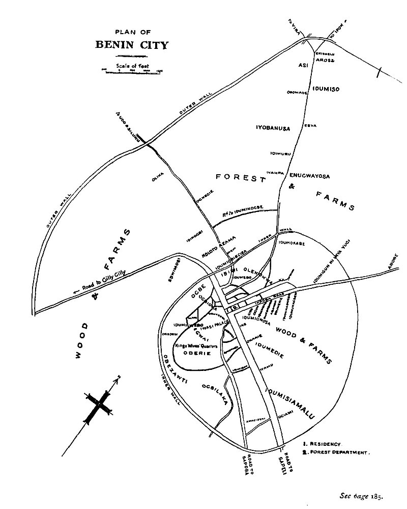
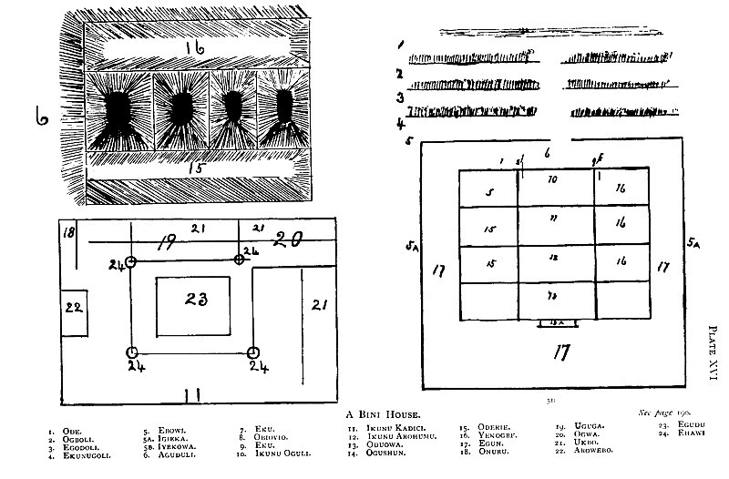

  
[Intangible Textual Heritage](../../index)  [Africa](../index.md) 
[Index](index)  [Previous](mind17)  [Next](mind19.md) 

------------------------------------------------------------------------

  
*At the Back of the Black Man's Mind*, by Richard Edward Dennett,
\[1906\], at Intangible Textual Heritage

------------------------------------------------------------------------

# CHAPTER XVIII

# BENIN DISTRICTS

## QUARTERS.

The Provinces. -Benin City.-The King's Compound. -Bronzes. -A Bini
House.

### DISTRICTS.

THE OBA'S central province was bound by the rivers

OYISA, OKWO, OVIA, OLUKUN, AWREHOMO, and IKPOBA. From the city through
this province to six outlying districts or provinces, six great roads
led, and these roads and districts were under the following chiefs:-

Gilly-Gilly under Ezomo.

Udo under OLIHA.

Shelu under ERO.

Geduma under OGIFA.

Sapoba under CIGIAML

Sapelli under ELEMA.

The neutral (or ambassador's province) under ELAUWEY was bounded by the
rivers OFUSU, OHA, and upper OVIA or OSSE, with its capital at OKENUE or
OKELUSE. When they reached this place ELAUWEY told Bini to go on to
OGIFA'S place and that he would follow in five days (but he stayed there
and formed the province as a kind of buffer province between the Yoruba
and Bini Kingdoms).

In each of these districts there are a certain number of OGIE (OGICI).
In ELAUWEY, OGOTE, the two Bale, UHEIN and IKOHA, under OJIMA Of OKENUE.

ODCLOBO Sapelli road under ELEMA seems to have extended to UMUGUMO and
the country between the rivers EKHIMI, IGBAGON, and OLUKUN. The ogies
are:-

OGYUMUGUMU IZAWGBO.  
OGYUMUGUMU NUGU.  
OGIEBAZOGBI.  
OGIOGEGE.  
OGIEWISI.  
OGIEABABO.

ODIYOKOREOMO (sapoba. under Ogiami) is the district between the rivers
EKHIMI and AUREHOMO, and here we find the following OGIES:-

OGYUGU.  
OGIEWEHIGAL  
OGIEWEHIA.  
OGYOGAN.  
OGYOGBA.  
OGYOHEZI.  
OGYOMEDI.  
OGULEGUN.  
OGUKHIRI.

ODIYEKPOBA and ODUHUMODE (Geduma under Ogifa) the country bound by the
Ifon road, the Awrehomo and the IKPOBA rivers with the OGIES:-

OGIEGMA.  
OGIEHOBI.  
OGIEKO.  
OGIEBWI.  
OGYUGO NEYEKPOBA.  
OGYUBE.  
OGIWAN.  
OGIEBONWAN.  
IH0LO NISI.  
ODUHUMODE.  
OGIEYNIE.  
OGIEWOMUDU.  
OHENUKUDI (Juju).  
OGYUGA.  
IHOLO NU GEDUMA.  
OGIHAW.  
OGIERWA.  
OGIEUHL  
OGIRHUE.  
IEKUSHELU under ERO with the OGIES:-  
OWAZA. Cap from AWYAW.  
OGYUNWAN.  
OGIOWA.  
OGINWHAN.

ODUDO or ODIDUMIHOGBI (Udo road under OLIHA) within the centre province.
OGIES:-

OGIEGANW.  
OGUSE.  
OGIOMI.  
OGIOGEGE.  
OGIOKELE.  
OGIEGBAN.  
OGIEBOLEKPE.  
OGYUTOKA.  
OGYUIE.  
OGYULOMO.  
OGYIGWOGI.  
OGYIHOGWA.  
OGIEKEZI.  
OGIDA.  
On the far side of the Ovia (river Osse):  
OGETETI.  
OGYUGOLO.  
OGIESI.  
OGYUTESI.  
OGYEGBATA.  
OGYUDO having died intestate IYASE NUDO governs in his place, in UDO.  
ODUGWATON or ODUZABU (Gilly Gilly road under Ezomo).  
No OGIE.

 

Plan of Benin City (Pl. XIV)

Under these OGIES are many villages ruled over by headmen equivalent to
the KONGOZOVO in the Kongo. These. headmen have a number of families
under them, each of which have land given to them for planting. There
may be waste land in a province or a kingdom, but that is not to, say
that it is no man's land for it belongs either to the OGIE, or the OBA.

There were three other roads (Pl. XIV) leading from the OBA'S Compound
to places within the outer wall, ODUHUMIDUMU to the east, where the OBA
"played," and ODOKORAW to the residence of the OBA's eldest son, and
ODIEKOGBA to the country at the back of the palace.

The OBA'S Compound became the centre of a very large city surrounded by
two great ditches and the thrown-up earth forming walls on either side
of them.

It takes one more than half an hour's hard walking to march from the
inner wall or ditch on one side of the city to the same on the other
side. And from the inner to the outer wall the distance varies from
1,000 to 3,600 paces.

The main roads are those leading from the Oba's Compound to Siluka, Yira
and Ifon, Geduma, Sapoba, Sapeli, and Gilly Gilly.

In the olden days when the Sapoba and Gilly Gilly roads were unbroken
approaches to and only bordered on one side by the palace wall and on
the other by IMARAN'S house they must have had a very grand and
beautiful appearance. A hundred paces broad, these green glades were
lined by trees, growing on the raised sweeping of years on either side.'

It was the duty of certain towns to come in to Benin City yearly and
clean and sweep these glorious entrances to the palace.

1\. The OBA'S Compound was roughly divided into three quarters. The
OBA's quarter EGWAI. The wives' quarter ODERIE, and the Eunuchs' quarter
called after the first great Eunuch URUKPOTA.2

\[1. The poorer people who could not afford to bury their dead in houses
threw their bodies on to this road, so that with-these and the bodies of
people sacrificed it really had an awful appearance.

2 They say that OVERAMI did not castrate people to act as Eunuchs, but
that any child who had the misfortune to be born without, or by an
accident to lose these parts, was brought by his parents to the king. It
is possible that this is in part the truth, but what about those holes
in the wall of a town not far from Benin City, through which they say
the victim's head was thrust while this operation was carried out.\]

Then there were eleven other divisions into which the City was divided
and the names of these parts are those of the great chiefs who first
founded them.

2\. The beadmen's quarter (OBADAGBONYI) known as IDUMI WEBO. These
people under NWAGWE appear to have partly lived close to the King in his
Compound and partly to the N.W. of it.

3\. Then to the South, behind the wall of the ODERIE was the quarter
called OGBEZAWTI.

4\. From here to where OBASEKI has his house was called OGBE.

5\. Round about where ARASI has his house was called OGBIOKA (OBA'S
son's quarter).

6\. And where OBAYAGBON has his house was named the IDUMU IBIWI.

7\. And where IHALIKA lives was called IDUM'EBO.

8\. Then from the UDO or SILUKU road to the IKPOBA or GEDUMA road is
named after OLENOKWA.

9\. And from the IKPOBA road to the SAPOBA road the name is IDUMGWOSA as
far as the house of PUSH PUSH.

10\. From the latter's house along the Sapoba road is still called
IDUMEDIE.

11\. From there to the ditch, near the Sapeli road is called
IDUMSIAMALU.

12\. From the Sapeli road to OGBEZAWTI is called OGBILAKA.

In the OBA'S Compound there was also a quarter called IDUMWUKI, where
certain people observed the changes of the moon.

Each of these twelve quarters contained "Houses" or small quarters
belonging to certain chiefs.

EBWIMOSI, a spot close to the second wall on the Gilly Gilly road, was
where Ezomo (or OJUMO) used to sacrifice people.

On the IKPOBA road, about fifteen hundred yards from the Residency at
IDUMIGUN NI INYA YUGI the blacksmiths had their shops, and some 150
yards from the river IKPOBA is the grove AWORE.

On the UDO or SILUKU road, a hundred yards on the other side of the
first wall, is IDUMIOBIECISA, a place where the test for witchcraft used
to be administered, and some 260 yards further on near HOLOTO is AZAMA,
where the OBA-elect went previous to being crowned.

On the SHELU road, 700 yards or so from the first ditch is IYAKPA or the
gate dividing the Queen Mother from her people, and 500 yards further on
is EEYA; where the Queen Mother has erected her new quarters. About 3000
yards from the Residency on this road is God's Grove called A RO'SA, and
it was here that the OBA sent his son with a goat to sacrifice
immediately after he had been crowned.

The late OBA'S palace was nearly in the Centre of what is known as the
OBA'S Compound, his predecessors' palaces and their ruins being to the
north-west of it. Near to each of these palaces, and I think there were
thirty-one of them, was a deep well (OVVIO, being the name of the late
OBA'S well), where they threw the bodies of the human beings sacrificed.
Round about the palace were the headquarters of the IWASI, IWEBO, IBIWI,
and IWEGWE, while to the South and East the houses of the OBA'S many
wives were scattered. The wall running round the ODERIE or wives'
quarter, or the back semicircular wall of the Compound, was considered
sacred and no outsider was allowed even to touch it under the penalty of
death.

The front wall ran in a straight line along the Sapoba to Gilli Gilli
road, almost North-west and South-east for about 500 yards, and it was
called OBOLOBA. The quarter behind it was called IDUMIWEBO, part of
which is situated near to the OBA. The second wall was called OZAMOKO,
while the quarter behind it was that of the Eunuchs, called URUKPOTA.
The third wall was called UGOHE and the quarter behind it UGWOZOLA. Here
the late OBA had a tin house built upon iron pillars, and it was in this
quarter where people wishing to see him had to wait. There is a deep pit
here and another just behind the present cemetery these pits are called
IRIDIAWÃ1.

I never saw the palace, and cannot therefore describe it, but while
wandering about its ruins I have come across holes in the ground some 15
feet deep, which were in some of the divisions of the palace, and were
used by the late OBA as the burial place of those visitors whom he did
not wish to see again.

The people still dig amongst the ruins of the palace for the bronzes the
OBA and his followers valued so much. Mr. Erdmann, a well known German
trader, on his last visit to Benin City informed me that he had seen the
palace just after its roof had been burnt off and had taken many
photographs of it. He said that the bronzes were ranged along the walls
and served as historical symbols, reminding the historian of the chief
events of the past history of the BINI people. Unfortunately this
much-respected trader died on his way home in the year, 1904.

Inside the first or second wall was the tree under which people were
sacrificed to the Rain power, this ceremony was called AIYAWOMANAMI.

People were sacrificed to the Sun\[1\] power under the UBOGWE tree which
once stood just in front of the first wall outside the Compound. Where
murderers are now hung under the OKHA and ULOHE trees near to IMARAN's
quarter the ceremonies connected with the new Yam Juju were commenced.

And in the ODERIE where there is now a fowl house, and under the IKHIMI
tree cows were sacrificed.

What we know now as the Sapeli Road was called UBOKA, while just outside
the Residency on the Sapoba Road there was a place and a tree to which
people used to be tied called the OGYUWO. Along one side of the IKPOBA
road there are the ruins of a line of blacksmiths' shops, and
blacksmiths are still found in different parts of the city working in
iron and brass. The present productions in brass are rough and crude,
but there are some artists who sculpture very well in clay, and so
ornament the pillars in some of the houses of the Benin

\[1. This was called AIYAWOMANUKBO.\]

City Chiefs. Carvers in wood also exist, but the ivory carvers cannot be
compared to those of Luango south of the Equator.

Upon showing the photos of bronzes and ivory in the "Antiquities of
Benin" to certain chiefs, their surprise and satisfaction was very
great, and they were glad to think that most of their ancient works of
art still exist. It is to be hoped that private collectors of these
bronzes may some day bequeath their collections to the British Museum,
and that photographs at any rate of those collections in the Hamburg and
Berlin Museums may be obtained and made accessible to the public. The
future educated BINI as a British subject has a right to expect to find
as full a collection as possible of these bronzes, etc., in this
Imperial Museum.

By a house, I mean the abode of a family \[1\] living under its head,
and not merely the dwelling place of an individual.

This house (Pl. XVI) is built on the same lines, though on a smaller
scale than a chief's palace.

Passing along a road (ODÉ) one comes to a fence on one side of it, and
this outer fence they call OGBOLI. Passing through an entrance there is,
at a given distance, a second fence called EGODOLI, and then a third
called EKUNUGOLI before coming to the house. The front wall of this
house is called EBOWI, the side walls IGIEKA, and the back wall IYEKOWA.

The space between the enclosing wall and the house in front is called
AGUDULI, while those on the sides and back are made into a garden called
EGUN.

The house is divided into three sections, the centre part being the
husband's quarters, looking towards the road to the left the wives'
quarters ODERIE (Pl. XV*b*), and to the right the young men's quarters
YEKOGBE. The doorway is called EKU, while the passages are called
OBIOVIO.

The rooms are ranged in both these latter quarters on the inner sides of
the outer walls of the house and the outer sides of the walls of the
husband's quarter, and are mere lean-to sheds.

\[1. The family is called EGRE, and is composed of ERA, father, OMIWU,
the sons of the father, EYE, INYHEYHI, SAPAMAREGUDI, EGABIONA and the
next our generations, none of whom may intermarry.\]

The centre part or husbands' quarters of an ideal Bini house is divided
into four rooms.

1\. IKUNU OGULI or ALERA, father's room, where there is an altar to the
memory of the occupant's father.

2\. IKUNU KADICI or ALWIYE, mother's room.

3\. IKUNU AROHUMU, the reigning son's room, or the head's grove or
temple.

The entrance passage to this room is called ONURU, and facing you as you
enter is the side of the altar AROWEBO (bead grove or altar).\[1\] There
is an entrance to the wives' quarter from this. The roofs of these rooms
incline towards the centre, which is an open square, and is upheld by a
pillar (EHAWI) in each corner of the square. The floor of this square is
about twelve inches or more below the level of the floor running round
it, and this basin is called EGUDU. On the side opposite the altar is a
raised platform of mud serving as a sofa or bed which is called UKBO. On
the left hand side, just after entering the third room, are two
closed-in rooms which you enter through small openings in the wall, one
being the wife's room UGUGA, and the other the husband's room, OGWA.

The fourth room is a spare quarter called ODUOWA, and in a garden on the
outside of the back wall of the ODUOWA is a general or medicine altar
called OGUSHUN.

They call the roof EROHUMOWA, and it is made of the leaves (EBE) of a
reed-like plant with a large leaf called EMWAME.

The ridge pole goes by the name OKPO, the rafter EREDOMI, while the
opening or funnel down which the rain flows into the EGUDU is called the
OBOTO.

\[1 . For contents of this altar see under OLUKUN.\]

 

A BINI HOUSE (Pl. XVI)

------------------------------------------------------------------------

[Next: Chapter 19. Bini Customs](mind19.md)

