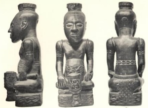

  
[Intangible Textual Heritage](../../index)  [Africa](../index.md) 

------------------------------------------------------------------------

[Buy this Book at
Amazon.com](https://www.amazon.com/exec/obidos/ASIN/0837115507/internetsacredte.md)

------------------------------------------------------------------------

<table width="75%">
<colgroup>
<col style="width: 50%" />
<col style="width: 50%" />
</colgroup>
<tbody>
<tr class="odd">
<td width="50%" data-valign="TOP"></td>
<td width="50%" data-valign="CENTER"><h1 id="religion-and-myth" data-align="CENTER">Religion and Myth</h1>
<h2 id="by-james-macdonald" data-align="CENTER">by James Macdonald</h2>
<h4 id="section" data-align="CENTER">[1883]</h4></td>
</tr>
</tbody>
</table>

------------------------------------------------------------------------

[Contents](#contents)    [Start Reading](ram00.md)    [Page
Index](pageidx)    [Text \[Zipped\]](ramtxt.zip.md)

------------------------------------------------------------------------

|                                                                                                                           |
|---------------------------------------------------------------------------------------------------------------------------|
|  |

This pioneering Victorian study of comparative African religious
beliefs, draws on ethnographies, folklore studies, historical and
traveler's accounts. Macdonald examines in detail taboos, magic,
divination, prophecy, sacrifice, sorcery, sexual practices, and the
status of women. He also ties in data from Celtic, Ancient Near East,
Pacific and other cultures. Particularly, he includes comparative points
from *his* native land, Scotland. Macdonald demonstrates that there are
broad similarities between African belief systems and those of other
pre-industrial peoples.

In his final chapter he critiques European attempts to 'civilize'
Africans, by selling them useless or harmful trade goods, converting
them to Christianity, or by forcing them to wear European clothes (!).
He observes that Africans have just as much cultural potential as any
other people, if allowed to develop on their own terms. This was a very
progressive view for his time. This book will enhance any study of
African spirituality.

------------------------------------------------------------------------

 [Title Page](ram00.md)  
[Preface](ram01.md)  
[Contents](ram02.md)  
[Chapter I. Primitive Man and the Supernatural](ram03.md)  
[Chapter II. Guarding Divinity](ram04.md)  
[Chapter III. Evolution of Deity](ram05.md)  
[Chapter IV. Sacrifice](ram06.md)  
[Chapter V. Taboos](ram07.md)  
[Chapter VI. Expulsion of Demons](ram08.md)  
[Chapter VII. Witchcraft](ram09.md)  
[Chapter VIII. Harvest Festivals](ram10.md)  
[Chapter IX. Prophecy](ram11.md)  
[Chapter X. Social Usages](ram12.md)  
[Chapter XI. Acts of Devotion—Myths](ram13.md)  
[Chapter XII. Woman](ram14.md)  
[Chapter XIII. Courtesies of Life—Dress](ram15.md)  
[Chapter XIV. Reforms](ram16.md)  
[Index](ram17.md)  
