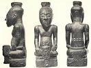

  
[Intangible Textual Heritage](../../index)  [Africa](../index) 
[Index](index)  [Previous](ram02)  [Next](ram04) 

------------------------------------------------------------------------

[Buy this Book at
Amazon.com](https://www.amazon.com/exec/obidos/ASIN/0837115507/internetsacredte)

------------------------------------------------------------------------

  
*Religion and Myth*, by James Macdonald, \[1883\], at Intangible Textual
Heritage

------------------------------------------------------------------------

p. 1

# RELIGION AND MYTH

### CHAPTER I

##### PRIMITIVE MAN AND THE SUPERNATURAL

Religion in the widest sense may be
defined as man's attitude towards the unseen, and the earliest forms of
human thought furnish the clue from which must be traced the development
of those great systems of religion that have at different periods been
professed by the majority of men. Under the term religion we must
include, not only beliefs in unseen spiritual agencies, but numerous
customs, superstitions, and myths which have usually been regarded, by
both travellers and students, as worthless and degrading, till within a
comparatively recent period. Only by taking account of such, and
comparing usages common among tribes far removed from the influence of
civilisation with survivals in other parts of the world, can we arrive
at any definite knowledge regarding the world's earliest systems of
thought.

In both ancient Greece and Italy the union of

p. 2

royal title with priestly functions was common. At Rome the tradition
was, that the sacrificial king had been appointed to perform sacred
functions formerly belonging to the ruling monarch, after the overthrow
of the ancient dynasty and the expulsion of the kings. [\*](#fn_0) In republican Athens the second magistrate
of the city was called King, and his wife Queen. The functions of both
were religious. [†](#fn_1) Other examples will
occur to readers familiar with the classics. Such traditions and usages
leave no doubt but in very early times kings were not only civil rulers,
but also the priests who offered the sacrifices and stood between the
worshippers and the unseen world.

The king would thus be revered as the ruler and father of his people who
protected and cared for them. He would be also alternately feared and
loved as the ghostly intercessor of men, and regarded as himself
partaking of the ghostly nature, for the divinity which hedged a king in
those days was no empty title, but a sober fact. He was regarded as able
to bestow or withhold blessings; to bring blight and curse, and remove
them; and so, being above and beyond the control of his subjects,
reverence and fear would easily pass into adoration and worship. To us
this may appear strange, but it is quite consistent with savage thought.
To the savage African or South Sea Islander the world is largely, if not
exclusively, worked by supernatural agents, and these act on impulses
similar to those which move and influence men, and with which he

p. 3

is familiar in himself and others. Where the forces of nature are under
the control of the king-priest, the worshipper sees no limit to his
power and the influence he can exert on the course of nature, or even
upon the material universe itself, as when a man's father's spirit
shakes the earth because the king hurt his toe. He holds converse with
the gods. From them come abundant crops, fecundity, success in war, and
kindred blessings, and the king who bestows these is regarded as having
the god residing in his own person; to the savage man he is himself
divine.

There is another way by which the idea of a man-god may be reached. In
all countries we find traces of a system of thought which attributed to
sympathetic magic events which can only happen in the ordinary course of
nature, but which are supposed to be produced by will-power through some
object. One of the leading principles of this sympathetic magic is, that
any effect may be produced by the imitation of it. [\*](#fn_2) Perhaps the most familiar illustration of
this is the Highland "Corp Creadh." This consisted, or consists—for it
is said the practice is not extinct—of a clay image of the person to be
bewitched being made and placed on a door, taken off the hinges, before
a large and constantly replenished fire. Sharp thorns, pins and needles,
were pushed into it; oaths and imprecations were uttered over it, the
victim writhing in agony the while; elf arrows were darted against it,
and the fire stirred to a blaze as the image was turned and toasted to
make the sufferer feel all the torments of the damned.

p. 4

\[paragraph continues\] Finally, the "Corp
Creadh" was broken to pieces, when the patient died a horrible death,
blue flames issuing from his mouth. In Africa a small bundle, with a
charm, tied to a pigeon's leg, keeps the person bewitched nervous and
restless as the bird flits from twig to twig. If no accident happens to
the charm or the bird that carries it, there is no hope for the
patient's recovery; he will simply be worried to death.

This magic sympathy goes farther. It is supposed to exist between a man
and any portion of his person that may be severed from the body, as cut
nails, hair, saliva, or even the impression left when he sits down on
the grass. The same sympathy exists between persons hunting, fishing, on
a journey, or at war, and those left behind. If those who remain at home
break any of the prescribed rules, disaster or failure overtakes those
of their friends who are absent. According to the same superstition,
animals, fowls, and crops may be influenced through tufts of hair,
feathers, or green leaves of corn as the case may be, and among savages
elaborate precautions are taken for their protection and preservation.
"Medicine" poured out on the path by which a man usually approaches his
dwelling affects him,. should he return by that path, as if he had
swallowed it. A hair from a cow's tail steeped in the virus of any
disease prevalent among cattle will affect the animal from which it was
taken, and through it the herd. A green leaf of corn scorched against a
fire, or placed where it will mildew, will produce drought or blight in
the field or district

p. 5

from which it was taken. These are illustrations of the evils that may
be produced by sympathetic magic, but it is capable of being applied to
good purposes also.

A South African, in calling a village to a hunt, goes from hut to hut
imitating the movements of some well-known animal of the chase. The
villagers pelt him with cow-dung, which he does his best to avoid.
Should he be well bespattered when he has finished his rounds, the hunt
will be successful; if not, it will be entered upon in a heartless
manner, as all will expect failure. In Niass when a wild pig falls into
a snare it is taken out and rubbed with nine fallen leaves, the belief
being that this will cause nine other pigs to fall into the pit. [\*](#fn_3) A South Sea Islander when unsuccessful with
his nets walks about as if ignorant of their existence, till caught
himself, after which he goes home assured of success on the morrow. As a
boy, when fishing about Loch Aline, we often, when luck went against us,
used to make pretence of throwing one of the fellows overboard and
hauling him out of the water. After that trout or sillock began to
nibble, according as we were on fresh water or salt. These superstitions
are world-wide. Actions are performed or avoided by all peoples because
they entail results similar to, or in some way connected with, the
action. So it is that a fashionable lady will throw a pinch of salt over
her shoulder when any has been spilled.

Another form of this superstition is securing certain desirable
qualities of animals or objects

p. 6

for oneself. A Kaffir warrior twines tufts of rat hair with his own, as
this will give him a rat's chances of escape from the enemy's spears.
Bechuanas use ferret-skins for a similar purpose, or it may be hair from
a hornless ox, as being hard to catch and harder to hold. Thieves in
South Africa affect the skin of the common wild cat, which is hardly
ever caught when making descents on hen-roosts. There is not a savage
who does not believe that he can influence nature in some direction, or
secure qualities by means of sympathetic magic, and when any one obtains
more than a village reputation for his gifts and powers, his deification
is merely a question of time or of local accident. He by degrees ceases
to be the receiver of divine communications, or the medium through which
divine power is exercised, for divinity dwells within him; he is himself
divine, and can by a touch or look, or even a wish, produce effects
which result from divine power only, and which in their results go
vibrating to the farthest confines of the universe.

The savage ruler who has attained to the honour of divinity is expected
to give such evidence of his power as his people need for material
prosperity and comfort, but not more than that. Of these, health and
strength, victory in war, fecundity and abundant crops, may be regarded
as the chief necessities of primitive man. A shrewd ruler might keep his
reputation unimpaired for a lifetime, as regards both health and success
in battle among a hardy race of people, nor would he be very much
troubled by those desirous of issue in a land the

p. 7

inhabitants of which are notoriously prolific. But the question of crops
in seasons of drought, or when there is too great a rainfall,
complicates the situation considerably. And when to these are added
hailstorms, tornadoes, insect plagues, and the occasional frosts of
tropical lands, it becomes manifest that the divine king sits on an
uncertain throne, for all these phenomena he must direct and control for
the benefit of himself and his people.

When the sky, for example, indicates the approach of a tornado
accompanied by hail, the magician repairs to an eminence, where he
collects as many people as can be hastily summoned to his assistance.
These, under his direction and guidance, shout and bellow in imitation
of the wind, when with hurricane force it swirls and eddies round the
houses and among the forest trees. Then at a signal they imitate the
crash of the thunder, after which there is a dead silence for a few
seconds; then another screech, more piercing and long-continued than any
that preceded, dying away in a tremulous wail. The priest fills his
mouth with his own urine, which he squirts in defiant jets against the
approaching storm, as a kind of menace or challenge to the wind spirit,
the shouting and wailing being intended to frighten the storm spirit
from approaching those who resist it. This is continued till the tornado
bursts or passes away in another direction. In the former case more
powerful magic sent it on the course it took; nothing more could have
been done to avert it. This belongs to a more developed system of
thought after the offices of

p. 8

ruler and priest have been separated. I have scores of times watched
South African magicians fighting the storm, and when successful the tone
of proud arrogance assumed by the priest was most amusing, especially to
those who did not believe in his power, and who at times included his
own patron and chief.

This same belief in regard to the power of man to influence the wind by
means of magic is found in all parts of the world. The Yakut takes a
stone, found inside an animal or fish, and ties it to a stick with a
horsehair. This he waves again and again round his head, and a cool
breeze springs up. [\*](#fn_4) The New Briton
throws burned lime into the air when he wishes to make wind. Highland
witches sold wind to credulous skippers in knots: one knot opened and a
gentle wind blew; a second brought a snoring breeze; the third a full
gale. A simple method of raising wind to retard the progress of a vessel
was to draw the cat through the fire. [†](#fn_5)
How it came to be supposed that the suffering of poor pussy had an
effect on the wind the author quoted failed to ascertain. It is well
known that a cat scratching table or chair legs is raising wind, and I
once heard a Scotch matron order her daughter to "drive out that beast:
do ye no see she’s making wind, and we’ll no get a wisp o’ hay hame the
day gin she goes on." Our Highland friends, too, could sink a ship at
sea by placing an egg-shell in a tub of water and raising tiny wavelets
to sink it. By sympathy the doomed ship sank.

p. 9

Mariners the world over whistle for wind—by courtesy to Neptune in
modern tines; formerly, as an act or exercise of power. I tried it once
but that was long ago—I am wiser now—and did raise wind; a hurricane of
it, but it was from the skipper, who cursed me by all the gods he knew,
and a good many he did not know, for "interfering with what ye know
nothing about." The fear of that man has haunted me ever since.
Hottentots cause the wind to drop by hanging a fat skin on a pole. The
Kaffir raises it by exposing his posterior to the clouds. An Austrian
during a storm will open his window and throw out a handful of meal,
saying: "There, that's for you: stop." [\*](#fn_6) Wind-bound fishermen in the Western Isles
of Scotland believe that walking sunwise round the Chapel of Fladda, and
pouring water on a particular stone, will bring a favourable breeze. If
a mariner in the same region ties knots on a cow-hair tether, he may
venture to sea, even during a violent gale, as he can, by means of his
tether and knots, control the wind at will. Bedouins of East Africa go
out to make war on the desert whirlwind, and drive their weapons into
the dusty column to drive away the evil spirit that is believed to be
riding on the storm. The Australians kill their storm-demons with
boomerangs; while the Breton peasant, when a wisp of hay is lifted by
the wind, throws a knife or fork at the wizard that is supposed to be
disporting himself there.

Other powers of nature are similarly treated by the savage, and the
custom is continued by his

p. 10

civilised brother without any clear conception of the significance of
his own actions. It is unnecessary to discuss the details of locust
cursing and the banning of frosts, but the methods of making and
preventing rain occupy such a large place in savage life that a detailed
account is necessary if we are to understand man's early habits of
thought, and how primitive usages developed into elaborate systems of
ritual and religion.

The approved methods of rain-making vary considerably according to the
fancies of the professors of the art. In Russia, men used to climb lofty
trees with a vessel full of water. While seated on their airy perch, two
firebrands were struck together to imitate lightning, and a drum beat as
a substitute for thunder, during which the rain-maker sprinkled water
from his vessel on all sides to produce a miniature shower in sympathy
with which rain fell copiously. [\*](#fn_7) This
system of producing rain by imitation and sympathy is common in parts of
South and South-east Africa, as among Hlubies and Swazies. The
rain-doctor goes to a river, from which, with much mystic ceremony, he
draws water, which he carries to a cultivated field. He then throws jets
from his vessel high into the air, and the falling spray draws down the
clouds and causes rain to fall in sympathy. In time of severe drought
the Zulus look out for a "heaven bird," which is ordinarily sacred, kill
it, and throw it into a pool of water.. Then the skies melt in pity for
the bird and rain down tears of sorrow upon the earth. [†](#fn_8) The

p. 11

\[paragraph continues\] Lubare of the
Wagogo is lord of heaven and of earth, and gives or withholds rain
according as men conduct themselves towards it. New Caledonians dig up a
body recently buried, and after they have removed and cleaned the bones
they rejoint them and place the skeleton over taro leaves; water is then
poured over it, which the spirit of the man who owned the skeleton takes
up and showers down in plenteous rain. [\*](#fn_9) The same motive comes out clearly in the
mode of making rain common among peoples of South-eastern Europe. "In
times of drought, the Servians strip a girl, clothe her in grass, herbs,
and flowers, even her face being hidden with them. Thus disguised, she
is called the Dodola, and goes through the village with a troop of
girls. They stop before every house; the Dodola dances, while the other
girls form a ring round her singing one of the Dodola songs, and the
housewife pours a pail of water over her." [†](#fn_10) Similar customs are observed by Greeks,
Bulgarians and others.

These illustrations, which might be multiplied to any extent, show us
clearly that the savage does not place any limitations to his own power
over nature, and that early customs, once firmly rooted in the tribal or
national mind, are observed by civilised men long after the faith that
gave them birth has been forgotten and replaced by systems which, in the
interval, may have been changed or modified many times—customs which one
moment's reflection shows to be as absurd as they are childish. But
absurd as such actions may appear to us, there is

p. 12

behind their a philosophy, and from them we learn the processes of the
human mind, as, groping after knowledge, it proceeded on the road to the
discovery of all the facts which make up the sum of the world's
acquirements. Though at first sight the action of the savage seems as if
based on the assumption that nature is a series of caprices, a closer
study convinces us that his reasoning is based on the constancy of
nature, or, as we would say, the persistency of natural laws. The savage
expects the same causes to produce the same results at all times,
however inadequate the cause may actually be, and the universality of
this belief proves that it is Rio mere local philosophy, which is false
root and branch, but a universal craving after knowledge on the basis of
a philosophy where the premisses are false, but where, this defect
apart, the conclusion is based on sound reasoning. What we call natural
law the savage ascribes to his own power over the forces of the physical
world.

The reason of this boundless confidence in himself on the part of
primitive man is, that at first supernatural agents are not regarded as
greatly superior to himself, and that at any time he may become one.
These supernatural agents dwell in man, and their presence make him
divine. To him acts of homage are paid. As the system develops,
sacrifices are offered to him, and he is worshipped as a god. The office
he holds is, or tends to become, hereditary; in any case, it is
elective, and persons holding it are always sacred, frequently divine.
Thus, the nominal King of the Monbutto is divine, a veritable man-god.

p. 13

He may not be seen to eat by any one. What he leaves is thrown into a
pit set apart for the purpose. Whatever he handles is sacred and may not
again be used for any purpose. A guest of even the highest rank and
honour may not light his pipe with an ember from the fire that burns
before him. To do so would be punished by instant death. [\*](#fn_11) What the results of shaking hands with
his majesty would be it is hard to conjecture; probably a tremor
reaching to the outermost circle of the universe.

When the Purra, or high priest of the Bulloms, West Africa, goes to a
place, all women must, on pain of instant death, keep indoors or hide in
the depth of the jungle; [†](#fn_12) they must
keep up a continual clapping of hands while he is pleased to remain, and
should any of them be known to have a peep at the Purra, even through a
chink, she would be executed instanter for her presumption in gazing on
divinity. Jaggas, like many other East African peoples, regard their
king as divine, [‡](#fn_13) and all his people
do him reverence. Before a visitor can be admitted to his presence, he
must be sprinkled with medicine by the magician. On all occasions his
person is guarded with the most jealous care, and whatever touches him
or comes from his person is sacred and must be treated with the utmost
reverence; [§](#fn_14) as something differing
from what was the king's simply, rather as having in itself the elements
of divinity from its having belonged to one who is himself a man-god.

Engai—that is, the rain-cloud—placed the father of

p. 14

the Wakuafi on the snow mountain, Killimanjaro. This first ancestor was
an incarnation of Engai himself, and was exalted above all men. His
children were demi-gods and the ancestors of the present ruling
chiefs. [\*](#fn_15) From him, or his
incarnations, radiates everything, even the bodies of his subjects, for
he is their god. This same form of king adoration and homage exists in
Shoa, Abyssinia. The Wadoe address their king as "Lion of Heaven." [†](#fn_16) When his majesty coughs or sneezes, all
within hearing say "Muisa," which means, Lion or Lord of Heaven. The
Gingane, or high priest of certain Congo tribes, is divine. [‡](#fn_17) His person is sacred, and .he is always
accompanied by a novice who, in the event of his death, will receive or
catch the divine element or soul which belongs to him in virtue of his
office, and which, but for the novice's presence, might be lost or
stolen.

Among the Baralongs all property belongs to the chief, as do also the
bodies of his subjects. He acts as his own chief priest; is invariably
called father, often lord. Zulus and Galekas acknowledge the chief as
universal owner, and regard themselves as his, body and soul. The Kings
of Dahomey and Ashantee are veritable gods, without any gilding to
conceal their glory; as is also the Grand Lama of Thibet. Men pronounce
the King of Dahomey's name with bated breath, fearing the very walls may
whisper of the great name being used profanely. [§](#fn_18) Among South African tribes there is a
marked aversion to pronouncing the chiefs name, and it is never

p. 15

done when it can by any possibility be avoided by them.

Makusa, the spirit *par excellence* of the Wagogo and Waganda, leaves
his quarters in Lake Nyanza at intervals, and takes up his abode in a
man or woman, who becomes Lubare, [\*](#fn_19)
or, in other words, a god. The Lubare is supreme, not only in matters of
faith and sacrifice, but in questions of war and state policy. When
councillors were questioned by Mackay regarding the nature of the
Lubare, or Makusa who dwelt in the Lubare, they replied that the Lubare
is a bull—this because the Lubare represents the principle of universal
life. Again, the Lubare was described as a wandering spirit, and
finally, as a man who becomes a Lubare. The first is probably the more
general belief regarding the Lubare as possessed by Makusa.

When Makusa enters a man he becomes a Lubare, and is removed, by Makusa
presumably, about a mile and a half from the margin of the lake, and
there waits the advent of the new moon before beginning operations. When
the first faint crescent is discerned the king and all his subjects are
from that hour under the orders of the Lubare. The king orders a
flotilla of canoes to start on a trading expedition; the Lubare hears of
it; countermands the king's instructions, and is obeyed. Whatever the
divine man orders must be done. If he takes a fancy for a trifle of five
hundred heads as a sacrifice, the king's executioners must post
themselves on the highways to catch wayfarers till the

p. 16

requisite number is made up. Or should his fancy suggest the
extermination of a weak neighbouring tribe, the warriors must be called
by beat of drum, and he on the war-path before the dawn of day. The
king, absolute, despotic, tyrannical as he is, becomes for the time
being the agent through whom the executive is carried on by the Lubare.

The chief Lakonga, at the south end of the lake, calls himself a god,
and is treated as such by his people [\*](#fn_20) who prostrate themselves before hint as
they approach, anal perform such acts of worship as are rendered to true
divinity. At times, however, there are rival claimants as being
descended from the same god ancestor long before, which is a little
confusing, and has tended to bring the office into disrepute. Still, the
fact remains that the present ruler claims divinity, and his claim is
acknowledged, though odd sceptics may exist, especially among those who
supported the claims of rivals.

In Laongo the king is worshipped as a god, and is called Sambee and
Pango, words which mean god. [†](#fn_21) When
rain falls and crops are plentiful they load him with gifts and honours.
If the seasons are bad, so that crops fail and fish cannot be caught, Le
is accused of having a bad heart and is deposed; but this belongs rather
to the practice of killing the god, which falls to be discussed in
another connection. Traces of the same kingly divinity can still be
found lingering among the Celtic races of Europe. The extraordinary
sanctity of the chief's person among Scottish Highlanders of a past
generation seems to

p. 17

have been nothing else than a lingering survival of divinity in the head
of the clan.

From this rapid and fragmentary survey of the position occupied in the
world's earliest religious ordinances by the king or ruler, we may
safely infer that the claims put forward to divine and supernatural
powers by great monarchs like those of ancient Egypt, Mexico, Peru,
Japan, and Chaldea, as in the time of Daniel, was not so much the pride
of power and the vanity of men accustomed to fulsome flattery and
adulation, as a survival of a belief once universal among men. The union
of sacred functions and claims to divinity with civil and political
power meets us at every turn. It goes to confirm the traditional account
given of the sacrificial king at Rome and the origin of the priestly
kings in republican Greece, nor does the multiplicity of gods in
classical times present the same difficulties which might at first sight
be supposed, for among primitive men we find kings who are regarded as
divine presiding over particular departments of nature; departmental
kings, as Mr. Frazer calls them. [\*](#fn_22) At
the mouth of the Congo resides Namvula Ruma as "king of the rain and
storm." His functions do not extend beyond his own department, but there
he reigns supreme, and is regarded as divine by mariners and
agriculturists. In Abyssinia an office exists known as "the priesthood
of the Alfai," which is hereditary and kingly. He, too, is a king of
rain, and is supposed to avert drought and produce necessary showers.
Should he in this

p. 18

disappoint the people's expectations, he is stoned to death, and a
successor chosen; no easy task when the heavens are as brass and the
ground as iron. The offices performed by the mysterious kings of fire
and water in the backwoods of Cambodia, seem to have a close resemblance
to those of the king of rain and storm at the Congo and the priest of
the Alfai in Abyssinia. Of the mysterious Cambodian monarchs not much is
known, and their existence might have passed as a myth, but for the real
king exchanging presents with them annually. No one travelled to their
domains, and the gifts were passed on from tribe to tribe till they
reached their destination, after which the return present of a wax
candle and two calabashes began an erratic pilgrimage to the king who
had despatched the gifts to his mysterious subjects and equals, or more
than equals. The functions of the kings of fire and water were purely
spiritual. They claimed no civil power or political authority, and lived
simply as peasants. They lived apart, and gifts were brought furtively
and left where they could find them. Their offices are hereditary and
last seven years, but owing to the hard and solitary life many are said
to die during their term of office. Naturally the dignity is not
coveted, and like the Alfai priesthood there is difficulty in finding
suitable candidates from among those who are eligible for office.

Did the scope of our inquiry permit, a king of the wood and of the sea
could be found among primitive men, but enough has been said to show the
general relations subsisting between man, as he

p. 19

first began to look out on the world and wander hither and thither over
the face of the globe, and the supernatural, which to him was an utterly
unknown world. We shall now turn to the consideration of the care man
bestowed on those who, according to his conception of the constitution
of the universe, were its supernatural agents or divinities.

------------------------------------------------------------------------

### Footnotes

[2:\*](ram03.htm#fr_0) Livy.

[2:†](ram03.htm#fr_1) J. G. Frazer, *Golden
Bough*.

[3:\*](ram03.htm#fr_2) J. G. Frazer, *Golden
Bough*.

[5:\*](ram03.htm#fr_3) J. G. Frazer, *Golden
Bough*.

[8:\*](ram03.htm#fr_4) sc J. G. Frazer, *Golden
Bough*.

[8:†](ram03.htm#fr_5) A. Polson, *Gaelic Society
Memoirs*.

[9:\*](ram03.htm#fr_6) J. G. Frazer, *Golden
Bough*.

[10:\*](ram03.htm#fr_7) W. Mannhardt.

[10:†](ram03.htm#fr_8) Bishop Callaway.

[11:\*](ram03.htm#fr_9) Turner, *Samoa*.

[11:†](ram03.htm#fr_10) J. G. Frazer.

[13:\*](ram03.htm#fr_11) Schweinfurth.

[13:†](ram03.htm#fr_12) Winterbotham.

[13:‡](ram03.htm#fr_13) Krapf.

[13:§](ram03.htm#fr_14) *Ibid*.

[14:\*](ram03.htm#fr_15) Krapf.

[14:†](ram03.htm#fr_16) *Ibid*.

[14:‡](ram03.htm#fr_17) Tucker.

[14:§](ram03.htm#fr_18) Rowley.

[15:\*](ram03.htm#fr_19) Mackay of Uganda.

[16:\*](ram03.htm#fr_20) Mackay of Uganda.

[16:†](ram03.htm#fr_21) J. G. Frazer.

[17:\*](ram03.htm#fr_22) J. G. Frazer, *Golden
Bough*.

------------------------------------------------------------------------

[Next: Chapter II. Guarding Divinity](ram04)
