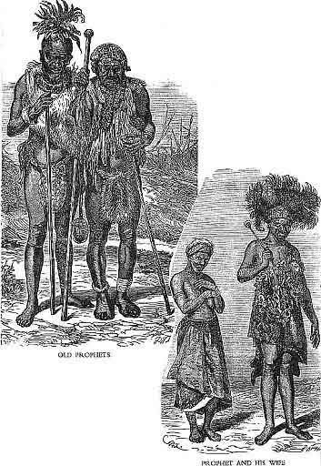

[Sacred-Texts](../../index) [African](../index) [Index](index) [Previous](rsa08) [Next](rsa10)

------------------------------------------------------------------------

p. 259

## IZINYANGA ZOKUBULA; OR, DIVINERS.

------------------------------------------------------------------------

> *The Initiation of a Diviner.*
>
> THE condition of a man who is about to be
> an inyanga[1](#page_259_note_1) is
> this: At first he is apparently robust; but in process of time he
> begins to be delicate, not having any real disease, but being very
> delicate. He begins to be particular about food, and abstains from
> some kinds, and requests his friends not to give him that food,
> because it makes him ill. He habitually avoids certain kinds of food,
> choosing what he likes, and he does not eat much of that; and he is
> continually complaining of pains in different parts of his body. And
> he tells them that he has dreamt that he was being carried away by a
> river. He dreams of many things, and his body is muddled id="page_259_fr_2">[2](#page_259_note_2) p.
> 260 and he becomes a house of dreams. id="page_260_fr_3">[3](#page_260_note_3) And he dreams
> constantly of many things, and on awaking says to his friends, "My
> body is muddled to-day; I dreamt many men were killing me; I escaped I
> know not how. And on waking one part of my body felt different from
> other parts; it was no longer alike all over." At last the man is very
> ill, and they go to the diviners to enquire.
>
>  The diviners do not at once see that he is about to have a soft
> head.[4](#page_260_note_4) It is
> difficult for them to see the truth; they continually talk nonsense,
> and make false statements, until all the man's cattle are devoured at
> their command, they saying that the spirit of his people demands
> cattle, that it may eat food.
>
>  So the people readily assent to the diviners' word, thinking that
> they know. At length all the man's property is expended, he being
> still ill; and they no longer p. 261 know
> what to do, for he has no more cattle, and his friends help him in
> such things as he needs.
>
>  At length an inyanga comes and says that all the others are wrong. He
> says, "I know that you come here to me because you have been unable to
> do any thing for the man, and have no longer the heart to believe that
> any inyanga can help you. But, my friends, I see that my friends, the
> other izinyanga, have gone astray. They have not eaten impepo. id="page_261_fr_5">[5](#page_261_note_5) They were not
> initiated in a proper way. Why have they been mistaken, when the
> disease is evident? For my part, I tell you the izinyanga have
> troubled you. The disease does not require to be treated with
> blood.[6](#page_261_note_6) As for the
> man, I see nothing else but that he is possessed by the Itongo. id="page_261_fr_7">[7](#page_261_note_7) There is nothing else.
> He is possessed by an Itongo. Your people id="page_261_fr_8">[8](#page_261_note_8) move in him. They are
> divided into two p. 262 parties; some say,
> 'No, we do not wish that our child should be injured. We do not wish
> it.' It is for that reason and no other that he does not get well. If
> you bar the way against the Itongo, you will be killing him. For he
> will not be an inyanga; neither will he ever be a man again; he will
> be what he is now. If he is not ill, he will be delicate, and become a
> fool, and be unable to understand any thing. I tell you you will kill
> him by using medicines. Just leave him alone, and look to the end to
> which the disease points. Do you not see that on the day he has not
> taken medicine, he just takes a mouthful of food? id="page_262_fr_9">[9](#page_262_note_9) Do not give him any
> more medicines. He will not die of the sickness, for he will have what
> is good[10](#page_262_note_10) given
> to him."
>
>  So the man may be ill two years without getting better; perhaps even
> longer than that. He may leave the house for a few days, and the
> people begin to think he will get well. But no, he is confined to the
> house again. This continues until his hair falls off. And his body is
> dry and scurfy; and he does not like to anoint himself. People wonder
> at the progress of the disease. p. 263 But
> his head begins to give signs of what is about to happen. He shows
> that he is about to be a diviner by yawning id="page_263_fr_11">[11](#page_263_note_11) again and again,
> and by sneezing again and again. And men say, "No! Truly it seems as
> though this man was about to be possessed by a spirit." This is also
> apparent from his being very fond of snuff; not allowing any long time
> to pass without taking some. And people begin to see that he has had
> what is good given to him.
>
>  After that he is ill; he has slight convulsions, and has water poured
> on him, and they cease for a time. He habitually sheds tears, at first
> slight, and at last he weeps aloud, and in the middle of the night,
> when the people are asleep, he is heard making a noise, and wakes the
> people by singing; he has composed a song, and men and women awake and
> go to sing in concert with him.
>
>  In this state of things they daily expect his death; id="page_263_fr_12">[12](#page_263_note_12) he is now  id="page_264">p. 264 but skin and bones, and they think that
> to-morrow's sun will not leave him alive. The people wonder when they
> hear him singing, and they strike their hands in concert. They then
> begin to take courage, saying, "Yes; now we see that it is the
> head."[13](#page_264_note_13)
>
>  Therefore whilst he is undergoing this initiation the people of the
> village are troubled by want of sleep; for a man who is beginning to
> be an inyanga causes great trouble, for he does not sleep, but works
> constantly with his brain; his sleep is merely by snatches, and he
> wakes up singing many songs; and people who are near quit their
> villages by night when they hear him singing aloud, and go to sing in
> concert. Perhaps he sings till the morning, no one having slept. The
> people of the village smite their hands in concert till they are sore.
> And then he leaps about the house like a frog; and the house becomes
> too small for him, and he goes out, leaping and singing, and shaking
> like a reed in the water, and dripping with perspiration.
>
>  At that time many cattle are eaten. The people encourage his becoming
> an inyanga; they employ means for making the Itongo white, that it may
> make his divination very clear. At length p.
> 265 another ancient inyanga of celebrity is pointed out to
> him.[14](#page_265_note_14) At night
> whilst asleep he is commanded by the Itongo, who says to him, "Go to
> So-and-so; go to him, and he will churn for you emetic-ubulawo, id="page_265_fr_15">[15](#page_265_note_15) that you may be an
> inyanga altogether." Then he is quiet for a few days, having gone to
> the inyanga to have ubulawo churned for him; and he comes back quite
> another man, being now cleansed and an inyanga indeed.
>
>  And if he is to have familiar spirits, there is continually a voice
> saying to him, "You will not speak with the people; they will be told
> by us every thing they come to enquire about." And he continually
> tells the people his dreams, saying, "There are people id="page_265_fr_16">[16](#page_265_note_16) who tell me at
> night that they will speak for themselves to those who come to
> enquire." At last all this turns out to be true; when he has begun to
> divine, at length his power entirely ceases, and he hears the spirits
> who speak by whistlings id="page_265_fr_17">[17](#page_265_note_17) speaking to him,
> and he answers them as he would answer a man; and he causes them to
> speak by asking them questions; if he does not understand  id="page_266">p. 266 what they say, they make him understand
> every thing they see. The familiar spirits do not begin by explaining
> omens which occur among the people; they begin by speaking with him
> whose familiars they are, and making him acquainted with what is about
> to happen, and then he divines for the people.
>
>  This then is what I know of familiar spirits and diviners.
>
>  If the relatives of the man who has been made ill by the Itongo do
> not wish him to become a diviner, they call a great doctor to treat
> him, to lay the spirit, that he may not divine. But although the man
> no longer divines, he is not well; he continues to be always out of
> health. This is what I know. But although he no longer divines, as
> regards wisdom he is like a diviner. For instance, there was Undayeni.
> His friends did not wish him to become a diviner; they said, "No; we
> do not wish so fine and powerful a man to become a mere thing which
> stays at home, and does no work, but only divines." So they laid the
> spirit. But there still remained in him signs which caused the people
> to say, "If that man had been a diviner, he would have been a very
> great man, a first-class diviner."
>
> p. 267
>
>  As to the familiar spirits, it is not one only that speaks; they are
> very many; and their voices are not alike; one has his voice, and
> another his; and the voice of the man into whom they enter is
> different from theirs. He too enquires of them as other people do; and
> he too seeks divination of them. If they do not speak, he does not
> know what they will say; he cannot tell those who come for divination
> what they will be told. No. It is his place to take what those who
> come to enquire bring, and nothing more. And the man and the familiar
> spirits ask questions of each other and converse.
>
>  When those who come to seek divination salute him, he replies, "O,
> you have come when I am, alone. The spirits departed yesterday. I do
> not know where they are gone." So the people wait. When they come they
> are heard saluting them, saying, "Good day." They reply, "Good day to
> you, masters." And the man who lives with them also asks them saying,
> "Are you coming?" They say, they are. It is therefore difficult to
> understand that it is a deception, when we hear many voices speaking
> with the man who has familiar spirits, and him too speaking with them.
>
> p. 268
>
> ------------------------------------------------------------------------
>
> *The way in which a person begins to be a Diviner.*
>
> UTHLABO id="page_268_fr_18">[18](#page_268_note_18) is known by causing
> a sensation of perforation id="page_268_fr_19">[19](#page_268_note_19) of the side; and
> the man says, "I have pain under the armpit, beneath the
> shoulder-blade, in my side, in the flesh. It causes the feeling as if
> there was a hole there; the pain passes through my body to each side."
>
>  The men ask, "What is this disease? for it resembles nothing but
> uthlabo."
>
>  He replies, "Yes, yes; I too say it is uthlabo; it is that which
> comes out[20](#page_268_note_20) from
> the side of my body and will not let me breathe, neither will it let
> me lie down."
>
>  At length the doctor who knows the medicines for uthlabo cures it.
> But black people call it also ukxulo, id="page_268_fr_21">[21](#page_268_note_21) and say it is
> caused by the Itongo. id="page_268_fr_22">[22](#page_268_note_22) And when a  id="page_269">p. 269 man is constantly affected id="page_269_fr_23">[23](#page_269_note_23) by uthlabo, black
> men say the Itongo is walking in him; Amatongo are walking in his
> body. If the disease lasts a long time, they at length go to enquire
> of diviners. They come and say, "He is affected by the Itongo. He is
> affected by his people who are dead. id="page_269_fr_24">[24](#page_269_note_24) There was one of
> them who was an inyanga; and this man has the Itongo in his body; his
> people p. 270 wish him to have a soft
> head,[25](#page_270_note_25) and
> become a diviner, when he has been initiated."
>
>  The diviners say, "Do not give him any more medicines. Do you not see
> when you get uthlabo-medicines for him, the disease does not cease?
> When you give him medicine, do you not thereby increase the disease?
> Leave him alone. His people are in him. They wish him to dream."
>
>  And if one of his people who is dead was an inyanga, the diviners who
> come to divine call him by name, and say, "So-and-so is in him; it is
> he who says he is to be an inyanga. It is a great inyanga that
> possesses him." That is what the diviners say. They say, "The man who
> was an inyanga, who is walking in his body, was also an inyanga who
> could dig up poisons. id="page_270_fr_26">[26](#page_270_note_26) He used to dig them
> up. And since he who used to p. 271 dig up
> the poison of the sorcerers by which they destroyed others has taken
> possession of this man, he too as soon as be has been initiated will
> have a white Itongo, id="page_271_fr_27">[27](#page_271_note_27) and will dig up
> poisons as So-and-so, one of his people, used to do. Leave him alone
> as regards medicines. Throw away medicines, and give him no more; you
> will kill him if you do. You think they will cure him. They will not
> cure him. He is purposely thus affected. The Amatongo wish  id="page_272">p. 272 him to become a white id="page_272_fr_28">[28](#page_272_note_28) inyanga. Be quiet,
> and see if the Amatongo do not give him commands at night in his
> sleep. You will see him come home in the morning, not having seen him
> go out, having had medicines revealed to him which he will go to the
> mountains to dig up; you will see he has dug up cleansing-ubulawo, and
> he will churn it and make it froth and drink it, and cleanse himself
> by it, and so begin to be an inyanga. And at other times he will be
> commanded to fetch impepo, which he will go to the marsh to pluck."
>
>  The Amatongo tell him to kill cattle, for the dead are very fond of
> demanding flesh of one whom they wish to make an inyanga. He
> slaughters them for his people who are dead. And others enter his
> kraal.[29](#page_272_note_29) He
> slaughters constantly, and others again come in in their place, the
> cattle being derived from his treatment of disease, and from divining,
> and digging up poisons. When men are perishing, being destroyed by
> sorcerers, he goes and digs up the poisons, and purifies those whom
> the sorcerers are poisoning.
>
> p. 273
>
>  When the Amatongo make a man ill, he cries "Hai, hai, hai." id="page_273_fr_30">[30](#page_273_note_30) They cause him to
> compose songs, and the people of his home assemble and beat time to
> the song the Amatongo have caused him to compose,—the song of
> initiation,—a song of professional skill.
>
>  Some dispute and say, "No. The fellow is merely mad. There is no
> Itongo in him." Others say, "O, there is an Itongo in him; he is
> already an inyanga."
>
>  The others say, "No; he is mad. Have you ever hidden things for him
> to discover by his inner sight, since you say he is an inyanga?"
>
>  They say, "No; we have not done that."
>
>  They ask, "How then do you know he is an inyanga?"
>
>  They say, "We know it because he is told about medicines, which he
> goes to dig up."
>
>  They reply, "O! he is a mere madman. We might allow that he is an
> inyanga if you had concealed things for him to find, and he had
> discovered what you had concealed. But you tell us what is of no
> import, as you have not done this."
>
>  As they are talking thus and disputing about concealing things  id="page_274">p. 274 for him to find, at night when he is
> asleep he dreams that the man of his people who is dead, and who is
> causing him to begin to be an inyanga, tells him saying, "They were
> disputing with each other, saying you are not an inyanga."
>
>  He who is beginning to be an inyanga asks, "Why do they say I am not
> an inyanga?"
>
>  He replies, "They say you are not an inyanga, but a mere mad man; and
> ask if they have hidden things for you to discover, since the others
> say you are an inyanga."
>
>  He says, "Tell me who they are who say so."
>
>  He replies, "So-and-so and So-and-so were disputing."
>
>  The man asks, "Do you say they lie when they say so?"
>
>  He replies, "Be quiet. Because they say so, I say you shall be a
> greater inyanga than all others, and all men in the world shall be
> satisfied that you are a great inyanga, and they shall know you."
>
>  The man who is beginning to be be an inyanga says, "For my part I say
> they speak the truth when they say I am mad. Truly they have never
> hidden anything for me to find."
>
>  Then the man who was an inyanga, p. 275 he
> who is initiating him, says, "Just be quiet. I will take you to them
> in the morning. And you appear on a hill; do not come upon them
> suddenly; but appear on a hill which is concealed, and cry 'Hai, hai,
> hai;' cry thus on the hill which is concealed, that they may hear.
> When you cry 'Hai, hai, hai,' if they do not hear, then go on to a
> hill which is open; do not expose yourself much; as soon as you expose
> yourself, cry 'Hai, hai, hai,' so that they may just hear. When they
> hear that it is you, go down again from the hill, and return to the
> one which is concealed. So I say they will see and understand that
> they have spoken of a man who is beginning to be a doctor; they shall
> know by that, that when they said you were a mad man and not an
> inyanga they were mistaken."
>
>  So he does so. He cries "Hai, hai, hai," on a hill which is hidden;
> they do not hear him distinctly; they hear only a continual sound of
> Nkene, nkene, nkene, nkene. id="page_275_fr_31">[31](#page_275_note_31) One of them says,
> "It sounds as though there was some one singing." Others say, "We do
> not hear. We hear only an echo."
>
>  The Itongo comes to him and tells him that they cannot hear,  id="page_276">p. 276 and bids him go out a little on the open
> hill, and then return again to the hill which is hidden.
>
>  So he departs at the word of the Itongo, and goes out to the open
> hill, and cries "Hai, hai, hai;" and they all hear that it is he. They
> are again disputing about him, and as soon as they hear that it is he,
> they say, "Can it be, sirs, that he comes about the matter we were
> disputing about, saying, he is mad?"
>
>  Others[32](#page_276_note_32) say,
> "O, why do you ask? He comes on that account, if indeed you said he
> was not an inyanga, but a madman."
>
>  The great man of the village to which the inyanga is approaching,
> says, "I too say he is mad. Just take things and go and hide them,
> that we may see if he can find them."
>
>  They take things; one takes beads, and goes and hides them; others
> take picks, and go and hide them; others hide assagais; others
> bracelets; others hide their sticks, others their kilts, others their
> ornaments, others their pots; others hide baskets, and say, "Just let
> us see if he will find all these p. 277
> things or not." Others hide cobs of maize; others the ears of amabele,
> or sweet cane, or of ujiba, or the heads of upoko.
>
>  Some say, "O, if he find all these things, will he not be tired? Why
> have you hidden so many?"
>
>  They say, "We hide so many that we may see that he is really an
> inyanga."
>
>  They reply, "Stop now; you have hidden very many things."
>
>  They return home, and wait. Then the Itongo tells him on the
> concealed hill; for it had already said to him, "Keep quiet; they are
> now hiding things; do not begin to appear. They wish to say when you
> find the things that you saw when they hid them. Be quiet, that they
> may hide all the things; then they will be satisfied that you are an
> inyanga." Now the Itongo tells him, "They have now hidden the things,
> and gone home. It is proper for you now to go to the home of the
> people who say you are mad and not an inyanga."
>
>  So he comes out on the open mountain, and runs towards their home,
> being pursued by his own people who are seeking him, for he went out
> during the night, and p. 278 they did not
> hear when he went out very early in the morning, when it was still
> dark, when the horns of the cattle were beginning to be just
> visible.[34](#page_278_note_34) He
> reaches their home, and his own people who were looking for him, and
> have now found him, come with him. On his arrival he dances; and as he
> dances they strike hands in unison; and the people of the place who
> have hidden things for him to find, also start up and strike hands; he
> dances, and they smite their hands earnestly.
>
>  He says to them, "Have you then hid things for me to find?"
>
>  They deny, saying, "No; we have not hidden things for you to find."
>
>  He says, "You have."
>
>  They deny, saying, "It is not true; we have not."
>
>  He says, "Am I not able to find id="page_278_fr_35">[35](#page_278_note_35) them?"
>
>  They say, "No; you cannot. Have we hidden then things for you to
> find?"
>
>  He says, "You have."
>
>  They deny, declaring that they have not done so. But he asserts that
> they have.
>
>  When they persist in their denial, p. 279
> he starts up, shaking his head. He goes and finds the beads; he finds
> the picks, and the kilts, and the bracelets; he finds the cobs of
> maize, and the ears of the amabele and ujiba and of upoko; he finds
> all the things they have hidden. They see he is a great inyanga when
> he has found all the things they have concealed.
>
>  He goes home again as soon as he has found all the things, and not
> one thing remains outside where they had hidden it. On his return to
> their home from the river whither he had gone to find what was hidden,
> he is tired, and the Amatongo say to him, "Although you are tired, you
> will not sleep here; we will go home with you." This is what the
> Amatongo say to the inyanga when he is tired with finding the things.
>
>  The inyanga's people who accompany him say, "Just tell us if he is
> not an inyanga?"
>
>  And he says, "I have found all the things whieh you hid; there is
> nothing left outside; all things are here in the house. I was
> commanded to come to you, for you said I was not an inyanga, but a
> madman, and asked if my people had hidden things for me to find.  id="page_280">p. 280 Just say who told me the things about
> which you were speaking. You said I was mad. You thought you were just
> speaking. Do you think the Amatongo id="page_280_fr_36">[36](#page_280_note_36) do not hear? As you
> were speaking, they were listening. And when I was asleep they told me
> that I was a worthless inyanga, a mere thing."
>
>  Then the people make him presents. One comes with beads and gives
> him; another brings a goat; another an assagai; another a bracelet;
> another brings an ornament made of beads, and gives him. The chief of
> the village gives him a bullock; and all the chief men give him goats,
> because he had come to their village at the bidding of the Amatongo.
>
> UGUAISE.
>
> ------------------------------------------------------------------------
>
> *The Doctor of Divination, the Isanusi, Ibuda, or Umungoma.*
>
> THE doctor is called Isanusi, id="page_280_fr_37">[37](#page_280_note_37) or Ibuda, id="page_280_fr_38">[38](#page_280_note_38) or Inyanga of  id="page_281">p. 281 divination, id="page_281_fr_39">[39](#page_281_note_39) or Umungoma; id="page_281_fr_40">[40](#page_281_note_40) for when people are
> enquiring of a diviner, they say, "True, Umungoma." Doctors who treat
> disease are different p. 282 from those who
> divine; for a man is a doctor of disease if he is able to treat
> disease; and diviners point out the doctor of medicine who is
> successful. They tell those who enquire of them to go to a certain
> doctor whom they know to have successfully treated the disease from
> which their friend is suffering. And so they go to the doctor of
> medicine that has been pointed out by the diviners. And if he has the
> disease which the diviners say he has, he will be cured by the
> medicines of the doctor that they point out.
>
>  But if the doctor of medicine treats the sick man and he does not get
> well, he says, "This disease masters me. Since the diviners did
> nothing more than send you to me, just go and hear what other diviners
> say; then perhaps some diviner will tell you the medicine with which I
> can cure this man."
>
>  So they assent, saying, "O, you say truly. It is proper for us to go
> to hear what other diviners may say; perhaps we shall find one who
> will tell us the medicine with which you can cure him." So they go to
> other diviners to hear whether they will all give the same advice.
>
>  When they come to the diviner, they do not say to him, "We are  id="page_283">p. 283 come to enquire." They merely go and
> salute him, saying, "Yes, yes, dear sir! Good news!" id="page_283_fr_41">[41](#page_283_note_41) Thus the diviner
> understands that they have come to enquire. So they sit still, and the
> diviner sits, and salutes them, saying, "Good day." They reply, "Yes,
> yes, dear sir."
>
>  He says, "O, let be! These people have come in a time of dearth; we
> have no food ready; we are hungry; and the beer which we had, we
> finished yesterday. We cannot tell where you can get any food."
>
>  They reply, "O, sir, we cannot get much food; we are very hungry:
> food cannot be obtained. For our parts, if we get boiled maize, we
> shall say we have got food. We were not wishing for that food you are
> calling for, sir; we for our parts are wishing for nothing but boiled
> maize; we understand that you are calling for beer."
>
>  He says, "O, get them some food; cook them some porridge; cook for
> them very thick porridge." So his wives cook for them.
>
>  When their food has been cooked, he pours some snuff into his hand,
> and takes it there in the p. 284 house; he
> shudders and yawns, and then goes out of doors to a clump of trees and
> sends a man to call them. The man calls them, and they go to the clump
> of trees to the diviner.
>
>  He tells them to pluck rods for beating the ground. They go and pluck
> the rods, and return and sit down. He takes out his snuffbox, pours
> snuff into his hand and takes it; and they do the same.
>
>  When they have taken snuff, he tells them to smite the ground. Some
> say, "Hear!" Others say, "True!"
>
>  "You are come to enquire about sickness."
>
>  They smite the ground for him.
>
>  He says, "It is a human being that is ill."
>
>  They smite the ground. He says, "It is a great man. You have already
> been to another friend of mine."
>
>  They smite the ground vehemently.
>
>  He says, "Smite the ground, that I may understand what that friend of
> mine to whom you went seeking divination said to you."
>
>  They smite the ground. He says, "There is my friend id="page_284_fr_42">[42](#page_284_note_42) who told the
> disease by which he is affected."
>
> p. 285
>
>  They smite the ground vehemently, and say, "Right."
>
>  He says, "There is someone to whom that friend of mine sent you; he
> is a doctor, not a divining doctor; he is a doctor of medicine."
>
>  Upon that they smite the ground vehemently.
>
>  He says, "Do you question me. Do not leave me."
>
>  They say, "We cannot question you. For you speak the very facts
> themselves. We put to the question a man that talks at random, and
> does not mention the very nature of the disease."
>
>  Then he says, "Smite the ground again, that I may understand what
> medicine my friend told him to give to cure him."
>
>  They smite the ground, and say to him, "Diviner, tell us at once the
> medicine that will cure him; for since you have seen the man to whom
> your friend directed us, we shall hear from you the medicine too that
> will cure him."
>
>  He says, "I am about to tell you. Our people id="page_285_fr_43">[43](#page_285_note_43) say, they will tell
> you."
>
>  They say, "We are glad, diviner, that your people are white, id="page_285_fr_44">[44](#page_285_note_44) and unite with our
> people, p. 286 that the case may turn out
> well. For we have no more hope that he will recover. For as regards
> the doctor whom your friend pointed out, we trusted in our hearts,
> saying, 'Since the diviner has told us the doctor that can cure him,
> he will now be cured, and get well.' We went to the doctor whom your
> friend mentioned; but lo, we saw the disease passing onward, tending
> to get worse and worse, and began to wonder, saying, 'Let be!' For we
> were trustful and of good courage, saying, 'Perhaps he will get well,
> for the diviner says so.'" They go on, "We have just said these words,
> because you said them first; you saw that we had already been to
> another diviner. If you had not said we had already gone to another
> diviner, we should not have said them; we say them because you already
> said them."
>
>  He says, "Smite the ground, that I may tell you the medicine that
> will cure him."
>
>  They then smite the ground vehemently.
>
>  He says, "For my part I tell you that the medicine that will cure him
> is inyamazane.[45](#page_286_note_45)
> p. 287 The man has umsizi." id="page_287_fr_46">[46](#page_287_note_46)
>
> p. 288
>
>  They then smite the ground, and say, "We will hear from you, diviner.
> For our parts we know nothing; now we can do nothing; now we are
> fools; there is no longer any wisdom in us. And as for the words you
> say, promising to tell us the medicine which will cure him, in our
> hearts we no longer say that even the medicine you mention will cure
> him. We now say that death will carry him away captive. We have no
> more courage, for the disease is there; we do not understand, for he
> is now affected with hiccup."
>
>  He says, "Smite the ground then; smite the ground then at that point
> of hiccup, that I may tell you."
>
>  They smite.
>
>  He says, "The hiccup is nothing. I will give him medicine for hiccup,
> and it will cease."
>
>  They say, "We are glad, diviner, for what you say. But we do not
> know. It is customary for all doctors to say so; and yet the man gets
> worse, and dies. You doctors no longer inspire us with courage. It is
> customary for them all to speak thus. And we now rejoice when we see a
> man already p. 289 in health; and then we
> say, 'He is a diviner,' when we see the man getting well. If the
> disease increases, we do not say the inyanga has divined. We say, 'He
> has wandered. He is lost.' If a man has got well, we say, 'The diviner
> has divined;' and we praise him much, saying, 'He is one who divines.'
> Forsooth we say so because the man has got well."
>
>  He says, "Smite the ground, that I may tell you."
>
>  They smite the ground.
>
>  He says, "The hiccup is nothing. Our people say it is not dangerous;
> they say, the hiccup is nothing. They say they will tell you a
> medicine that will cure him. They find fault with my friend to whom
> you went seeking divination; they say, he did not see what medicine
> would cure him; he merely pointed out a doctor to treat him, and did
> not mention the medicine which would cure him."
>
>  Then they smite the ground. He says, "Smite the ground vehemently."
>
>  They do so. He says, "He never named the medicine which would cure
> him. So I am going to tell you the medicine which will restore him to
> health; and you leave off the p. 290 tears
> you have been shedding, id="page_290_fr_47">[47](#page_290_note_47) thinking he was
> already dead."
>
>  They reply, "Diviner, we will hear what you say; we merely beat the
> ground;[48](#page_290_note_48) we
> weep; tears are our portion; id="page_290_fr_49">[49](#page_290_note_49) whilst we are here,
> we do not know what will happen—whether during this day's sun we shall
> find him still living."
>
>  He says, "Smite the ground. You will find him still alive. Smite the
> ground, that I may tell you of a man who treats disease, who will do
> him good, who will come to him, and cure him on the very day he
> comes."
>
>  They smite the ground.
>
>  He says, "I say, go to such and such a doctor, of such and such a
> place. He will give you umsizi-medicine. And he will himself come and
> give him an expressed juice id="page_290_fr_50">[50](#page_290_note_50) to drink, and he
> will drink it. After that he will scarify him, id="page_290_fr_51">[51](#page_290_note_51) and give him
> medicine.[52](#page_290_note_52)
> p. 291 He will get well on the day the
> doctor comes with the expressed juice. I will give you
> hiccup-medicine; and do you give it him; it will keep him alive id="page_291_fr_53">[53](#page_291_note_53) until the doctor
> whom I have mentioned to you comes. He will cure him."
>
>  So he gives them hiccup-medicine to keep him alive.
>
>  Then they go back to the diviner's house to eat the food which has
> been cooked for them. They enter the house, and the people give them
> food; they eat and are satisfied, and their hunger ceases. They
> enquire if it is dark. Some say that it is now dark. The diviner who
> has just divined for them says, "O, sleep here, and go in the
> morning."
>
>  They refuse, saying, "O, on no account, diviner; we must go; for,
> see, you have given us medicine; we wish that the man should drink
> this medicine whether we reach home in the night, or whether we reach
> home in the morning; it will not matter; we wish him to take this
> medicine."
>
>  So the diviner agrees, saying, "Surely, you are right. But if you
> reach him with this medicine of mine, and the doctor is ever so far
> away, until he comes it will keep him alive. Further, as to  id="page_292">p. 292 this medicine, even if I come to a man so
> ill as to be raised by others, he being unable to raise himself, and
> make him drink this medicine, he will raise himself, even though
> before he could not do so."
>
>  They set out at once by night, and reach their home in the morning.
> They find the people assembled in the sick man's hut. They squeeze out
> for him the hiccup-medicine, they have brought, into a cup, he being
> still affected with hiccup. They make him drink it. When he has drunk
> it, he is seized with hiccup again, and he becomes sensible. id="page_292_fr_54">[54](#page_292_note_54) The people in the
> hut are alarmed, and say, "Truly, is he not now just about to
> die?"[55](#page_292_note_55)
>
>  Those in the house look at each other, and enquire of those who have
> brought the medicine, saying, "O, how the man has lighted up! What
> kind of medicine is that of the doctor's?"
>
>  They say, "O, as to the doctor, we merely bring the medicine; the
> diviner gave it to us, and said it would keep him alive till the
> doctor came to treat the disease. He said he would not die if we
> reached home with this medicine, until the doctor came whom he named."
>
> p. 293
>
>  But he lights up only, and does not die. They take courage from what
> the diviner said. They stay one night, and on the following morning
> say, "O, yes, the diviner pointed out a doctor of such a place to come
> and treat him. He said he has umsizi, and that the doctor will bring
> medicine for him to drink; then he will give another medicine, and
> scarify him. So now we will go to that doctor."
>
>  They rejoice and say, "We are glad; it is well for you to go. Truly,
> since you gave him the hiccup-medicine he has not had the hiccup all
> night. We now see that you went to a diviner who speaks id="page_293_fr_56">[56](#page_293_note_56) truth, and knows
> the disease; you have brought the right medicine. We now have
> confidence. We now see that his eyes are bright."
>
>  So they go to the doctor which the diviner has pointed out. They do
> not go any more to the first doctor, for he told them he could not do
> any thing for the sick man, and asked why the diviner had not
> mentioned the medicine with which he might cure the patient.
>
>  They reach the doctor's. When they reach him, they make obeisance,
> saying, "Eh, dear sir." They go into the house; they salute them,
> saying, "Good day," p. 294 and they return
> the salutation, saying, "Yes, sirs." They say, "Whence do you come?"
>
>  They say, "From our home."
>
>  "Where are you going?"
>
>  "We have come to this place." id="page_294_fr_57">[57](#page_294_note_57)
>
>  "What business have you here?"
>
>  They say, "O, sirs, we are come to the doctor. One of our people is
> ill."
>
>  They say, "Is there then any doctor here?"
>
>  They reply, "O, sirs, you can tell us where the doctor is; we have
> come to him."
>
>  Those in the house laugh.
>
>  The others say, "O, sirs, do not laugh at us. We are in trouble."
>
>  They say, "What troubles you?"
>
>  They say, "O, we are troubled by disease. One of our people is ill."
>
>  They ask, "As you have come here, have you heard that there is a
> doctor here?"
>
>  They say, "Yes; we have heard that there is one here."
>
>  They say, "Who told you?"
>
>  They reply, "O, sirs, we cannot make a great secret of it. For we
> have come here because we went to a diviner, and he showed us the
> path, and told us there was a doctor here. We did not know it; for we
> had gone to another diviner, and p. 295 he
> pointed out another doctor, who, he said, would cure the sick man; we
> went to that doctor, and he treated him, but could do nothing. At
> length he told us he could do nothing, and that the diviner of whom we
> had enquired erred, because he did not name the medicine with which he
> could cure the patient. So we agreed with that doctor, and went to
> another diviner. On our arrival, he told us that there was a doctor
> here who could cure the sick man. And now you see us, sirs; we have
> come."
>
>  They say, "O, yes, yes; there is a man here who treats disease."
>
>  They say, "Tell us where he is."
>
>  They say, "There he is."
>
>  And he says, "Yes, yes, it is I. Tell me why you have come here to
> me."
>
>  They say, "We come, sir, on account of sickness. For the diviner sent
> us here to you."
>
>  The doctor says, "Did the diviner, when you asked him, tell you with
> what medicine I could cure him?"
>
>  They say, "We asked him, and he told us the medicine with which you
> could cure him. He said he had umsizi, and that you could cure him
> with umsizi-medicine."
>
>  He says, "What have you brought for me?" id="page_295_fr_58">[58](#page_295_note_58)
>
> p. 296
>
>  They say, "Sir, we have not brought any thing. When you have cured
> him, you shall pick out for yourself the cattle you like at our home."
>
>  He says, "What will you give me to cause me to quit my hut?"
>
>  They say, "Sir, we will give you something to cause you to quit the
> hut; it is at home—a goat."
>
>  He says, "Is it possible that you come to take me away with a goat,
> to go to a man whom I am going to cure?"
>
>  They say, "O, dear sir, do not trouble yourself with talking; there
> is also a bullock at home to take you away. We say that as we have
> only the diviner's word, you will never cure him; for he is very ill."
>
>  He says, "I shall cure him, because the diviner told you to come to
> me." And asks, "What medicine did the diviner say I could cure him
> with?"
>
>  They reply, "O, dear sir, he said you would cure him by giving him an
> expressed juice; and then you would give him another medicine, and
> scarify him. And that p. 297 he would get
> well on the very day you go to him. That is what the diviner said."
>
>  He says, "Go home then, and I will come the day after tomorrow."
>
>  They object, saying, "O, dear sir, go with us; do not stay behind."
>
>  And at length he assents, saying, "Well, then, I will go with you."
>
>  So he goes with them, taking with him plants to express their juice
> for him, and other medicines, and medicines to rub into the
> scarifications. At length they reach their home with the doctor. On
> his arrival he makes the man drink the expressed juice, and then gives
> him other medicine and scarifies him. He asks for a goat, and kills
> it, and makes medicine with it, and gives it to him. He asks also for
> a bullock, and makes medicine with it, and gives him.
>
>  The people see that he will cure him. id="page_297_fr_59">[59](#page_297_note_59) He becomes strong,
> and eats the flesh of the goat and the bullock. They ask, "How is the
> pain now?"
>
>  He replies, "O, be silent, sirs; I am still earnestly looking out for
> it. I shall feel whether it is still p. 298
> there to-morrow, and then tell you. I have indeed had some sleep. I
> will tell you to-morrow, sirs, whether that man is a doctor or not."
>
>  Indeed, night comes, and there is no return of the pain. He sleeps.
> In the morning they ask him how he is.
>
>  He says, "O, sirs, I shall now get well."
>
>  The doctor then says, "I have now cured him. Show me my cattle, I am
> going in the morning; I wish to see them, and in the morning drive
> them home. I say, let me see them before I lie down."
>
>  They say, "O, yes, dear sir; you are right. We now see that your
> patient is nearly well,"
>
>  So they shew him his cattle; they point out a young cow with a heifer
> by her side, and a calf of a year old—three altogether,
>
>  They say, "Say what you think, doctor; we say, there are your
> cattle."
>
>  He says, "I thank you for the cattle. But give me something to wipe
> my eyes with."[60](#page_298_note_60)
>
> p. 299
>
>  So they give him a goat. He kills the goat, and places the
> gall-bladder in his hair. He says, "I shall leave medicines with you,
> that you may wash him with them. I have now entirely finished for my
> part."
>
> ------------------------------------------------------------------------
>
> *The Diviner mistaken.*
>
> IT is said a man begins to be a diviner by
> being ill; it is said he is made ill by the Amatongo; and he has many
> goats killed for him; and when they have been killed he carries the
> gall-bladders in his hair. It is a sign that a man is becoming a
> diviner if he wears many gall-bladders. After that he begins to be a
> diviner.
>
>  On his initiation, he goes like one mad to a pool, and dives into it,
> seeking for snakes; having found them, he seizes them and comes out of
> the water with them, and entwines them still living about his body,
> that the people may see that he is indeed a diviner. id="page_299_fr_61">[61](#page_299_note_61) After that they
> begin to try him in many ways, to see whether he will become a
> trustworthy diviner. They then go to him, and the diviner hears them
> say they have come to divine; and he tells them to smite the ground,
> that he may understand why p. 300 they have
> come. And they smite the ground and cry, "Hear."—And he then says,
> "You have come for such and such a matter."—And then they smite the
> ground.—He then says, "You have come for so and so;" and he proceeds
> to tell them what has taken place as regards that about which they
> have come; and he tells them what the man about whom they have come
> has done. They then reward him if they see that he has divined about
> matters which they understand; and depart; and when they reach home
> they do as the diviner tells them. Perhaps it turns out in accordance
> with what the diviner has said; perhaps it does not so turn out; when
> they see that it has not turned out in accordance with his word, they
> go to another diviner; and perhaps what he says comes to pass. That is
> what I have heard.
>
>  Once at Pietermaritzburg a heifer belonging to Mr. G., my white
> master, was lost. We looked for it, but could not find it. We then
> asked Mr. G. to give us a shilling, that we might enquire of a
> diviner, for we were now troubled with looking for it, and did not
> know where to look for it any further. He gave us a shilling, and we
> went to a diviner who lives near the Zwartkop. On our arrival we found
> him sitting in the p. 301 cattle-pen; and
> we saluted, saying, "Eh, dear sir," and sat down.
>
>  They saluted us, and we replied.
>
>  The diviner's people asked us whence we came.
>
>  We told them we came from Pietermaritzburg, and had come to enquire
> of the diviner.
>
>  They said, "Why have you come here?"
>
>  We told them we had come on our own account, some cattle id="page_301_fr_62">[62](#page_301_note_62) having been lost.
> We then asked for snuff, and they gave us some and we took it; and
> after that the diviner said, "Let us go yonder outside the village."
>
>  He went out, and we followed him. He said to us, "Strike the ground,
> that I may understand, my friends, what is the reason that you have
> come to me."
>
>  We smote our hands together, and said, "Hear."
>
>  He said, "You are in trouble."
>
>  We said, "Hear."
>
>  He said, "Let me just understand what kind of a bullock it is?"
>
>  We smote our hands together.
>
>  He said, "It is a cow."
>
>  We smote our hands.
>
>  He said, "No; it is an ox."
>
>  We smote our hands.
>
> p. 302
>
>  He said, "No; it is not an ox."
>
>  We smote our hands.
>
>  He said, "You are in trouble, lads."
>
>  We smote our hands.
>
>  He said, "But the cow was lost a long time ago."
>
>  And there he spoke truly.
>
>  We smote our hands.
>
>  He said, "Just let me understand if it was stolen by any one."
>
>  We smote our hands.
>
>  He said, "No, it was not stolen by men; but it is still living."
>
>  We smote our hands.
>
>  He said, "It is one that is lost."
>
>  And there too he spoke the truth.
>
>  We smote with our hands.
>
>  He said, "Let me just understand of what colour it is."
>
>  We smote with our hands.
>
>  He said, "It is a red and white cow."
>
>  But there he made a guess, and did not speak truly.
>
>  We smote our hands.
>
>  He said, "No; it is a heifer; it is not yet in calf."
>
>  We smote our hands.
>
>  And there too he spoke truly.
>
>  He said, "Let me understand if the heifer is still living or not."
>
>  We smote our hands.
>
>  He said, "No, the heifer is dead."
>
> p. 303
>
>  We smote our hands.
>
>  He said, "No, it is still living."
>
>  He said, "Let me just understand where it is."
>
>  We smote our hands.
>
>  He said, "It is in the mimosa thorn-country."
>
>  We smote our hands.
>
>  He said, "Just let me understand in what part of the thorn-country it
> is."
>
>  We smote our hands.
>
>  He said, "It has gone down the Umsunduze."
>
>  We smote our hands.
>
>  He said, "Just let me understand if it is still living."
>
>  We smote our hands.
>
>  He said, "It is still living, and eating umtolo and umunga. id="page_303_fr_63">[63](#page_303_note_63) Go and look for it
> there, and you will find it."
>
>  We thought we understood that he had now told us the place, for for
> some time we had not known where to go to look for it.
>
>  Then we gave him the shilling, and returned to Pietermaritzburg. When
> we came to Mr. G. we told him that the diviner said it was in the
> thorn-country, and that we were to go and look for it down the
> Umsunduze.
>
>  He told us to go and look for it in the place mentioned by the
> diviner. We went to look for it, going down the Umsunduze. As  id="page_304">p. 304 we went along we looked for it, going
> towards the thorn-country which he had pointed out. At length we got
> as far as T.'s, and sought for it in that neighbourhood; we could not
> find it, for the thorns were very thick. As we went we enquired at all
> the native villages in the thorn-country. The people said they knew
> nothing about it; and others told us to go to T., the white man who
> ate up the cattle of the people that were lost. id="page_304_fr_64">[64](#page_304_note_64) But we were afraid
> to go to him, for he is a passionate white man who beats any coloured
> men whom he does not know if he see them passing through his land. So
> we went back to Pietermaritzburg without going to T.; and told Mr. G.
> that we had not found the heifer at the place pointed out by the
> diviner. So he told us to give up the search. We did so, and that was
> the end of it.
>
> USETEMBA D class="small">HLADHLA. 
>
> p. 305
>
> ------------------------------------------------------------------------
>
> *The Account of Ukanzi.*

THE following narrative gives an interesting
and striking instance of the power a bold man may possess even over
venomous snakes. The snakes caught by the diviners and hung in festoons
about their bodies, are probably charmed in some such manner as here
related of Ukanzi. It is quite possible that both possessed medicines
which are either offensive or pleasing to snakes, by which they caused
them to be afraid or gentle. But it is not necessary to suppose that
Ukanzi used any such medicines; the mere daring and yet cautious
coolness with which he approached the snake is quite sufficient to
explain why it became so cowed before him. But how are we to explain his
insusceptibility to the snake poison? Why did the poisoned fangs broken
off and remaining in his lips produce no symptoms? It is likely that he
was naturally insusceptible to the influence of such animal poisons,
just as others possess a natural intense susceptibility to it, so that
the sting of a bee has in them been followed by fatal consequences. This
is much more likely, than that he possessed any powerful remedies by the
use of which he rendered the snake poison innocuous. The son inherited
the same insusceptibility. Of course all statements as to the invariable
efficacy of some particular remedy possessed by savages, must be
received with great caution; and if subjected to rigid enquiry would
probably prove not to be founded in well-observed facts.

> THE account of Ukanzi, the son of Unjoko,
> and of his knowledge of snake-poison.
>
>  He is a man who causes us to wonder much at his knowledge. There is
> no one in our country like him who can render inert the poison of
> snakes; he is a man trusted to the uttermost in cases of snake-bites.
>
>  If any one is bitten by any kind of snake, he does not say he  id="page_306">p. 306 does not possess the remedy id="page_306_fr_65">[65](#page_306_note_65) for that kind of
> snake-poison. No; for his part he is only gladdened by all kinds of
> snakes; nothing prevents his curing the bite of any of them. If a man
> is said to have been bitten by some deadly snake, he at once selects
> the proper remedy.
>
>  And he continually separates the remedy for the poison which is in
> the body, and that which is in the viscera, and keeps them distinct.
>
>  A proof that he is a doctor is that the snakes which he catches are
> to him no more than mice. I once saw this with my own eyes, and did
> not merely hear it by report. He caught a great snake called
> Umdhlambila, the rock imamba, when we were hunting. When we, the
> hunting party, came under a precipice, there was a snake in a tree
> basking in the sun. We saw it occupying the whole tree; it was of a
> grey colour; its eyes were piercing; it was fearful when it looked at
> any one.
>
>  We called him, saying, "Here is your game!" He came running and
> asking where it was. We pointed it out, and he saw it. He laid his
> weapons on the ground, and climbed the tree and went to it. I said in
> my heart, "I shall now see. p. 307 For
> since he has not taken a stick, what will he do to this snake which is
> as large as a post? id="page_307_fr_66">[66](#page_307_note_66) Will it not devour
> him?"[67](#page_307_note_67) He  id="page_308">p. 308 put his hand in his mouth and gently bit
> it all over; he took it p. 309 out and
> extended it towards the snake; it started and raised its head, and
> turned in every direction, wishing to escape. But his hand followed it
> constantly wherever it went on the tree. When I thought it would
> strike him on his head, he withdrew himself and it did nothing; and
> then raised his hand again; at length it became gentle, and laid its
> head in his hand, not placing it there in a hostile manner, but laying
> its head with all gentleness in his hand, and letting him do what he
> liked with it. He seized its head, and put it in his mouth, and chewed
> it; the snake's teeth broke in his mouth; he picked out the teeth when
> he had killed the snake, and nothing happened; it was as if he picked
> out thorns merely; he took no medicine to counteract the poison; he
> merely picked out the teeth.
>
>  We who were standing on the ground wondered, and said Ukanzi was a
> sorcerer. He drew the snake towards himself, and twisted it round his
> body, and came down with it. He got some grass and tied the snake up
> in it, and went home with it, saying, "For my part I have now killed
> my game; I shall prepare it at home." So he carried it away.
>
>  And his son Ugidinga resembles p. 310 his
> father in his power of catching snakes, he having learnt of his
> father.
>
>  When he reached home with the snake, he skinned it, and separated the
> skin and the flesh, and selected different portions of the body; he
> roasted it that it might not decay, but dry; he boiled it with other
> snake-poison remedies. The heart was set aside by itself; and the body
> by itself; and he had thus two remedies—that obtained from the heart,
> and that from the body.
>
>  If a man walking with Ukanzi were bitten by a snake, he would give
> him a little powder to lick with his tongue, and say, "That is all. I
> have now cured you." The man would go on in fear, not believing that
> he was cured, for he had not seen much medicine, or much treatment.
> But at length he saw when they had gone a great distance and nothing
> happened, and there was no swelling, and it was as if his being bitten
> at all was a mistake. Such, then, was how he acted.
>
>  But as to his knowledge, no one knew by what means he cured all kinds
> of snake-bites in this manner. But it was said he first treated
> himself with powerful medicines; for even if a snake ran into a hole
> he would catch it by p. 311 the tail, and
> it would turn round and bite him; it was no matter to him, but he
> would catch it by the head and kill it by placing it in his mouth, and
> adopted no treatment whatever for the bite any more than if he had
> been bitten by a mouse.
>
> ------------------------------------------------------------------------
>
> *Consulting the Diviner.*
>
> IF a man is ill, the people go to a
> diviner, to enquire of him. He says the man is suffering from disease.
> Or perhaps he says, he is injured by some one who is a sorcerer. They
> go home, now knowing the man who practises sorcery.
>
>  But others dispute, saying, "No! The diviner lies; that man is not a
> sorcerer." Others say, he speaks the truth. At length the man hears
> that the diviner has pointed him out as a sorcerer. He is angry, and
> leaves the place, and goes to be a dependent among other people. But
> the people believe in what the diviner says. But others do not
> believe.
>
>  If a man is ill, they go to enquire of the diviner. He says, "The man
> is made ill by the Idhlozi. Let them eat an ox; the man will get well
> if they eat an ox." They eat an ox. They worship the Amatongo, and
> kill it.
>
>  When they have eaten all the p. 312 flesh
> and the man does not get well, but is constantly ill until he dies,
> some say, "The diviner lies." Others say, "He was called by the
> Amatongo; a diviner cannot conquer the Amatongo."
>
>  When he is dead, they go to enquire of the diviner. He says, "He has
> been called by the Amatango; they wish him to die, and go and live
> with them." And yet people do not cease to enquire of the diviner.
> Sometimes they say, the diviner is true; sometimes they say, he is
> false. For when a man is ill they will enquire of a diviner; and the
> diviner says, if they kill an ox the man will get well. They kill an
> ox, and the man gets well; and then they believe in the diviner's
> word; and yet forsooth the man would have got well after a time. But
> the people believe he has been saved by the Amatango.
>
>  When a man is ill, they call doctors to see him; they treat him, and
> when he gets well they demand cattle, telling him he must pay because
> they have cured him; he pays; and after he has paid, he is ill again,
> and goes to the same doctor whom he has paid; he treats him, but does
> not remove the disease; and tells him, it masters him. And the sick
> man asks his ox to be sent back, that he may go to other doctors. They
> p. 313 go to others; they treat him;
> perhaps they cure the disease; then the first doctor feels hurt, and
> says that the sick man was cured by him, but they have paid the man
> that gave him physic last.
>
>  When a doctor treats a sick person, he kills an ox, and cuts away the
> tendons of the legs, and mixes them with medicines, and chars them,
> till they are dry. When they are dry they are powdered, and the sick
> man is scarified, and the medicines are rubbed into the
> scarifications; and the gall is poured on him, that the Amatongo may
> come and see him and lick him, that he may get well.
>
>  Men go to the diviner that he may tell them what they wish to know.
> They merely go to him, and on their arrival do not tell him for what
> purpose they have come. They are silent. But he tells them they have
> come on some matter of importance. They assent by striking the ground.
> If they strike vehemently, they do so because they hear the diviner
> mention things which they know and about which they have come to him.
> If he mentions things unknown to them, they strike the ground
> slightly. If he mentions the very things they know, they strike
> vehemently.
>
> p. 314
>
>  If any thing is lost, an ox for instance, they go to a diviner, and
> he tells them that if they look for it in a certain place they will
> find it. They go to the place he mentions, and find it. But if they do
> not find it where he says, they say, the diviner is false; he does not
> know how to divine. They then go to another, who is known to divine
> truly; he tells them, and they go and seek there. If they find it,
> they believe in that diviner, and say, he is a true diviner.
>
> ------------------------------------------------------------------------
>
> *To bar the way against the Amatongo and against disease supposed to
> be occasioned by them.*
>
> WHEN a doctor bars the way id="page_314_fr_68">[68](#page_314_note_68) for  id="page_315">p. 315 man who has isidhlaho, id="page_315_fr_69">[69](#page_315_note_69) he takes certain
> known medicines with him to the sick man, and takes some of his blood
> and goes to a hard ant-hill which the ants will repair again if broken
> down; he makes a hole in it, and places in it the medicine with the
> blood of the sick man, and closes up the hole with a stone, and leaves
> the place without looking back id="page_315_fr_70">[70](#page_315_note_70) till he gets home.
> So it is said the disease is barred out, and will never return again.
>
>  When we bar the way with a frog of the river, we catch a frog, and
> take it home; when the patient has been scarified over the  id="page_316">p. 316 most painful spot, the blood is taken from
> that place, and is placed in the frog's mouth, and it is carried back
> to its place; it is handled gently, lest it should die. So the disease
> is barred out from the man.
>
>  Again, if a woman has lost her husband, and she is troubled
> excessively by a dream, and when she is asleep her husband comes home
> again, and she sees him. daily just as if he was alive, and so she at
> last wastes away, and says, "I am troubled by the father of
> So-and-so;[71](#page_316_note_71) he
> does not leave me; it is as though he was not dead; at night I am
> always with him, and he vanishes when I awake. At length my bodily
> health is deranged; he speaks about his children, and his property,
> and about many little matters." Therefore at last they find a man who
> knows how to bar out that dream for her. He gives her medicine, and
> says, "There is medicine. When you dream of him and awake, chew it; do
> not waste the spittle which collects in your mouth whilst dreaming; do
> not spit it on the ground, but on this medicine, that we may be able
> to bar out the dream."
>
> p. 317
>
>  Then the doctor comes and asks if she has dreamt of her husband; she
> says she has. He asks if she has done what he told her; the woman says
> she has. He asks whether she has spit on the medicine he gave her to
> chew, the spittle which collected in her mouth whilst dreaming; she
> says she has. He says, "Bring it to me then; and let us go together to
> the place where I will shut him in."
>
>  The doctor treats the dream with medicines which cause darkness; he
> does not treat it with white medicines; for among us black men we say
> there are black and white ubulawo; therefore the doctor churns for the
> woman black ubulawo, because the dream troubles her.
>
>  So he goes with her to a certain place, to lay the Itongo; perhaps he
> shuts it up in a bulb of inkomfe. id="page_317_fr_72">[72](#page_317_note_72) The bulb has a
> little hole made in its side, and the medicine mixed with the
> dream-spittle is placed in the hole, and it is closed with a stopper;
> the bulb is dug up, and placed in another hole, and the earth rammed
> down around it, that it may grow.
>
>  He then leaves the place with the woman, saying to her, "Take care
> that on no account you look back; but look before you constantly,
> p. 318 till you get home. I say the dream
> will never return to you, that you may be satisfied that I am a
> doctor. You will be satisfied of that this day. If it returns, you may
> tell me at once."
>
>  And truly the dream, if treated by a doctor who knows how to bar the
> way against dreams, ceases. And even if the woman dreams of her
> husband, the dream does not come with daily importunity; she may dream
> of him occasionally only, but not constantly as at first. The people
> ask her for a few days after how she is. She replies, "No. I have seen
> nothing since. Perhaps it will come again." They say, "Formerly was
> there ever a time when he did not come?" The woman says, "There was
> not. There used not to be even one day when he did not come. I am
> still waiting to know whether he is really barred from returning."
>
>  The doctor prevails over the dead man as regards that dream; at
> length the woman says, "O! So-and-so is a doctor. See, now I no longer
> know any thing of So-and-so's father. He has departed from me for
> ever."
>
>  Such then is the mode in which dreams are stopped. id="page_318_fr_73">[73](#page_318_note_73)
>
> p. 319
>
> ------------------------------------------------------------------------
>
> *Umwahleni, the Diviner.*
>
> THERE was a great inyanga among our people,
> whose name was Umwathleni. If a sorcerer came by night, he would awake
> in the middle of the night and drive the man away; perhaps he would
> scold him hefore quitting the hut, saying, "So-and-so, go back to your
> own village. I see what you are doing." And he would drive him away in
> the middle of the night. He was a very celebrated inyanga of our
> people.
>
>  Sometimes he would go out when it was about to dawn, and proceed to
> the river, and go into a pool, and would come out having his face
> smeared with white earth, and go home having his neck entirely circled
> with a living imamba. He would catch it and twist it round his neck,
> or wear it as a fillet; when he reached home he was fearful to look
> at; and he would call the people of the village to come and sing the
> songs he had composed.
>
>  He was a very active doctor; he hopped about the whole house like a
> bird, starting from one place and pitching in another. And the songs
> were said to be songs which the Amatongo gave him; his songs were
> different from ours; he composed a first part for the  id="page_320">p. 320 women; and then a second part; the women
> smote their hands and sang the first part for him, and he sang the
> response alone indoors, playing many pranks.
>
>  But the izinyanga of the present time are said no longer to resemble
> those of former times; for this Umwathleni, in order that men might
> see that he was an inyanga, had many things concealed for him to find
> on the day he was formally declared to be an inyanga. All the things
> which are hidden, whether great or small, become the property of the
> inyanga. The people then acted thus with Umwathleni, and tested his
> skill as an inyanga, that it might be known that he was an inyanga
> indeed. When he came to find the things which were concealed, he had
> his body ornamented and daubed with white clay. When he reached his
> home, the people had already hidden all kinds of things in very
> obscure places, both out of doors and in the houses, for him to find.
> O, he resembled a mad man entering the house. Already many crowds of
> people were assembled, who had come to see the wonder. He went rapidly
> and took out of the place of concealment whatever was hidden, and
> placed it before the people. He entered the house, and took out
> whatever was hidden there. He went down to the p.
> 321 river, and took out whatever was hidden there. All these
> things became his, that he might be celebrated, and people say,
> "Umwathleni is a diviner." For it is the custom among black men to
> conceal things for a diviner to find, that he may be seen to be a
> diviner. So this was done for Umwathleni. But among diviners of the
> present time there is no longer any clear evidence that they are
> diviners; and we now say, they have not eaten impepo, and we call them
> amabuda, that is, things which do not speak the truth.
>
>  When we say, "A diviner has not eaten impepo," we speak of reality;
> impepo means true knowledge. If any one has eaten the impepo which is
> eaten by real diviners, or if he says he has really eaten it, we say,
> "No, it is not the impepo which diviners eat; he ate another kind."
> But when it is said he has not eaten impepo, we mean that his
> divination does not resemble the divination of real diviners. Impepo
> means especially that clearness of perception id="page_321_fr_74">[74](#page_321_note_74) which a diviner
> possesses; nothing is too hard for him; but he sees a difficult thing
> at once. So we say of such a diviner, "He has eaten impepo."  id="page_322">p. 322 It is this which the diviner's people say.
>
>  This is the impepo which we see; but as regards the impepo of which
> we are speaking, we do not say that a man may eat it because it is
> said to impart to diviners clear inner sight, and so become a diviner
> himself. No; it cannot make him a diviner by itself, if there is
> nothing within him which can unite with the impepo and make him
> clearsighted.
>
>  There are two kinds of impepo. White impepo has its own
> peculiarities; we believe especially in white impepo; but we do not
> believe at all in the black impepo; id="page_322_fr_75">[75](#page_322_note_75) that which arises
> after eating it is dark. For example, if a man dreams continually of a
> man he does not wish to see, he eats the black impepo, and drives him
> away by it, that should he come again he may not see him distinctly,
> nor understand who it is. Or when we sacrifice we do not take the
> black impepo, but always the white. And one always finds the white
> impepo in the folds of the sleeping mats of old and young, that they
> may have distinct dreams.
>
> p. 323
>
> ------------------------------------------------------------------------
>
> *Divining with Sticks and Bones.*
>
> THE account of diviners when they begin to
> enter on divination. No one knows that a man will be a diviner. He
> begins by being affected with sickness; it appears about to cease, but
> it does not. It is in this respect at the commencement that diviners,
> and those that have familiar spirits, are alike; they differ in their
> mode of divination, for the diviner with familiar spirits does not
> resemble another diviner.
>
>  When a diviner divines for people, even he tells back to the people
> the truth which he first took from them. If as regards that which is
> done by the diviner we put all together, we shall say, it is the
> people who divine; for the diviner does not begin with any thing that
> he has not heard from the people who come to divine.
>
>  There appears to be great cunning in the diviner, for when he divines
> he says, "Smite the ground, that I may understand why you have come."
> The people strike the ground.
>
>  He says, "There is one thing only about which you have come." They
> strike gently. He tries to establish that which he says, and tells
> them to strike the ground. But they again strike gently as at  id="page_324">p. 324 first. And he leaves that which he was
> saying, and perceives that they do not assent, and that he is going
> astray. Then he goes on nibbling till he hits upon something they
> know.
>
>  When he says, "As you came on such an account and nothing else, why
> do you not strike the ground?" then they smite and freely use the
> divining sticks, saying thus to him, "You hit the mark there." Now
> then he will proceed carefully, following that footprint of truth, and
> trying to make it into a continuous track. id="page_324_fr_76">[76](#page_324_note_76) They assent to some
> things; to others they object by striking gently; they continually
> turn him back from his wandering by striking gently; at last he
> perceives that the real importance of the disease starts from that
> point which he just touched on at first; and he continually starts
> from the first words to which they gave their assent, and continually
> goes near them, till he finds out the truth by asking and nibbling
> until he is on the right track.
>
>  Having succeeded thus far, he now begins to speak also about things
> with which they are not acquainted, knowing that they will now believe
> in the things he p. 325 says, though they
> are not acquainted with them; but because he has satisfied them by the
> truths he spoke at first, they will not despise any of his words; but
> every thing he says will be true in their eyes. Such is the method of
> diviners.
>
>  We say he is told, because he too asks of himself in the hearing of
> the people, denying the correctness of what he himself has said; and
> says, "Just let me see what the disease is," turning about continually
> and looking hither and thither. It is evident that he is seeking, and
> that the thing is lost to him; and as to his finding it, if those who
> come to enquire do not know, it is not found at all. Therefore we say
> the diviners too are told. For there are those who do not know how
> divination is managed; and when disease occurs one is sent who
> forsooth never went to enquire of a diviner before; and does not know
> how it is managed; and even if he does know he murmurs in his heart,
> saying, "O, when I go to a diviner who knows, I find him just like
> myself; and he too wants me to tell him the truth; there is no such
> thing as a diviner. A diviner, forsooth, ought to tell me things which
> I know and which I do not know; and not nibble at the affair like a
> man who knows nothing."
>
> p. 326
>
>  The wise man then says in his heart, "No, I see that these diviners
> are told. By themselves they know nothing. Why do they nibble at the
> affair instead of telling the truth at once?"
>
>  So then such a man when he goes to enquire says, "For my part I shall
> be a man who knows nothing. And you too, So-and-so, it is well when
> the diviner tells us to smite, for us to smite vehemently at every
> thing, even when he does not speak truly. We will be set right by him;
> we will say that every thing is true that the diviner says. For we do
> not know any thing; we are going to enquire of one who knows."
>
>  And so they dispute nothing the diviner says. They smite in assent to
> every thing, till the diviner is confused, and at length asks them,
> saying, "O, my friends, did you ever smite in this manner when
> enquiring of a diviner before?"
>
>  They say, "O, sir, again and again. We are they who enquire."
>
>  He asks, "Have you acted thus with all diviners?"
>
>  They say, "Yes, for as to us truly we neither know what is false nor
> what is true. The diviner will distinguish in all such matters."
>
> p. 327
>
>  He remains silent, takes snuff, and shakes his head, and says, "No,
> my friends; you do not smite properly. The diviner is the thumb. id="page_327_fr_77">[77](#page_327_note_77) Why do you smite
> the ground vehemently whatever I say, there being nothing which you
> dispute?"
>
>  They reply, "O, truly, sir; we should not have come to you if we had
> known any one thing. Have we not come to you to hear from you what is
> the very truth?"
>
>  He says, "No. You do not understand. We diviners are told. If people
> smite as you smite, we know nothing."
>
> p. 328
>
>  Such is the position of diviners. We may entertain doubts about them;
> they are not like those who have familiar spirits; they are told, for
> they take the words from the people who come to enquire.
>
>  John, for example, went to enquire of a diviner when his sister was
> ill, wishing to know what was the cause of her illness. But when he
> smote the ground he smote mechanically, assenting to every thing the
> diviner said; for he said to himself, "For my part I know nothing. It
> is the diviner that shall point out to me the real facts of the case."
>
>  The diviner reproved him, saying, "Surely, my friend, did you ever
> enquire of a diviner in this way before?"
>
>  John replied in the affirmative, saying, "O, it is I indeed who
> enquire,[78](#page_328_note_78) for I
> am now the responsible head of our village; there is no other man in
> it; there is no one but me."
>
>  The diviner said, "I see. You do not know how to enquire of a
> diviner." At length he devised a plan with one of his own people,
> saying, "This man has not the least notion of divination. Just go and
> ask him, that he may tell p. 329 you why he
> has come, that you may smite the ground for me in a proper manner."
>
>  So indeed the man said to John, "The diviner says you do not know how
> to divine. Tell me the cause of your coming. You will see that we
> smite the ground for him vehemently when he speaks to the point; and
> if he does not speak to the point, we do not smite much."
>
>  John said in answer, "For my part I do not understand what you say. I
> have merely come to the diviner for no other purpose than to hear of
> him the nature of a disease. I did not come to talk with you about it.
> For my part I shall hear from the diviner what the disease is."
>
>  So he refused to tell him; and the man went back to the diviner; he
> said, "Let him come to me again, that we may hear."
>
>  So John again smote the ground vehemently, and thus expressed his
> assent to every thing the diviner said. Until he became quite foolish,
> and said, "O, my friend, I see indeed that you do not know how to
> enquire of a diviner."
>
>  He said this because there was no point where John assented very
> much, nor where he assented slightly, that he might see by his  id="page_330">p. 330 assenting slightly that he had not hit the
> mark. He expected if he hit the mark John would smite the ground
> vehemently; but if he missed it he would strike gently. So he left off
> divining, and said, "No, my friend, I never met with a man who
> enquired like you." He could do nothing.
>
>  John said, "O then, my friend, as you do not see the nature of the
> disease, Dow give me back my shilling, that I may betake myself to
> another diviner."
>
>  So the diviner gave him back the shilling. His name was
> Umngom’-u-ng’-umuntu. id="page_330_fr_79">[79](#page_330_note_79)
>
>  John then went to Unomantshintshi, one who divined by means of pieces
> of stick. The name of these pieces of stick is Umabukula. The mode of
> divining by them is remarkable.
>
>  So John came to the sticks. Their owner took them and laid them on
> the ground; he chewed some medicine, and puffed it over them, that
> they might tell him truly the very facts of the case. Divination by
> these sticks does not resemble that by a diviner. For the owner of
> them enquires of them. Unomantshintshi asked them, saying, "Tell me,
> how old p. 331 is the person who is ill?"
> And they said. But as they have no mouth they speak thus:—If they say
> no, they fall suddenly; if they say yes, they arise and jump about
> very much, and leap on the person who has come to enquire. In this way
> they told John the character of his sister's illness, and traced out
> every little ramification of it which was known to John. so John
> assented, and left his shilling with the sticks, and said, "This is
> what I want, that the diviner should tell me things which I know
> without having asked me any question. I shall know that he has divined
> by his telling me the symptoms of the disease which are known to me."
>
>  Their mode of speaking is this:—If it is asked where the disease has
> seized the patient, the sticks jump up at once and fix themselves on
> the place where the sick man is affected. If it has affected the
> abdomen, they fix themselves on the abdomen of the man who has come to
> enquire. If the head, they leap upon his head. They go over every
> joint of the body that is affected by the disease. Or if they are
> asked where the doctor is who can cure the sick man, they leap up and
> lie down in the direction of the place where the doctor lives. If the
> owner of them knows for certain the name of a p.
> 332 doctor who lives among the tribe to which the sticks point,
> he mentions the name to them; if it is he they mean, they jump up and
> down and fix themselves on their owner; and he knows thereby that they
> assent.
>
>  Many believe in the Umabukula more than in the diviner. But there are
> not many who have the Umabukula. Those whom I know who have them are
> that same Unomantshintshi and Ukaukau. These I know. There is a third,
> Undangezi, a red man of the house of Undhlovu, of whom my uncle used
> to enquire when I was a lad, and came back with many things which the
> Umabukula had said. The Umabukula of which John enquired gave him an
> exact account of his sister's illness, saying truly where the disease
> began, and where they had gone to enquire as to its nature. He
> believed fully, and went home satisfied.
>
>  This, then, is the account of the Umabukula and of the diviner. They
> differ from each other; they are not the same.
>
>  As regards divination by bones, the bones of all kinds of wild beasts
> are used; there is that of the elephant, and that of the lion, and the
> bones of all great and well known wild beasts.
>
> p. 333
>
>  The diviner by bones, when any one comes to him to enquire, unfastens
> the bag in which the bones are kept, chews some little medicine, and
> puffs on them; he then pours them out, and picks out the bones of
> certain animals with which he is about to divine; they fill both his
> hands; he brings them all together and throws them on the ground; all
> the bones fall. But what the bones say is not clear to the man who
> comes to enquire; if he is not accustomed to them he sees nothing, and
> does not know what it means.
>
>  The owner of the bones manages them all properly. When one in falling
> rests on another—if for instance it is the bone of an elephant and of
> the hyena—he says, "What does the elephant and hyena say?" And
> afterwards by his management of the bones, he tells the enquirer that
> the bones say so and so; that he sees that the bones say this and
> that.
>
>  And the man replies, "Yes; the bones mention that for which I came
> here."
>
>  Then the owner of the bones says to the man, "Just take them
> yourself, and ask them why it is so."
>
>  He throws them down, and the owner then manages them properly,  id="page_334">p. 334 and tells him what the bones say; he says,
> "You see this bone standing in this manner; it speaks of a certain
> matter in your village. This says you must do so-and-so." They say
> every thing the man knows.
>
>  And a person by accustoming himself to divine with bones, himself
> manages them properly; from that proper management the matter is made
> evident, and he sees for himself. The diviner just points it out to
> him, and then follows him, when he has already seen by himself what
> the bones say. Such then is the mode of divining by bones.
>
>  I myself once went to enquire of the bones. There was a goat of
> Umjijane, one of my brothers, which had been yeaning for some days,
> and we wondered why it did not give birth to its young. We went to a
> diviner, the brother of Umatula, who divined with bones. On coming to
> him we made obeisance, saying, "Eh, friend, your affairs!" id="page_334_fr_80">[80](#page_334_note_80) We went home with
> him to his village. He took a little medicine and chewed it, and
> puffed on his bag in which the bones were kept; he rubbed them,  id="page_335">p. 335 and poured them out on the ground; he
> managed them, and said, "O, what does the goat mean? There are two
> kids—one white, and the other, there it is, it is grey. What do they
> mean?"
>
>  We replied, "We do not know, friend. We will be told by the bones."
>
>  He said, "This goat, which is a female black goat, is yeaning. But it
> is as though she had not yet yeaned. But what do you say? You say, the
> goat is in trouble. O, I say for my part when I see the bones speaking
> thus, I see that the young ones are now born. The bones say, 'The
> Itongo of your house, Umjijane, says, you never worship it. There is
> nothing the matter. It says it has helped you very much. The disease
> which sorcerers have poured upon your village is great. It would have
> taken effect, but the Amatongo of your house would not allow it. The
> goat has been, made ill wilfully by sorcerers.' The bones say, 'When
> you reach home the goat will have given birth to two kids. When you
> reach home, return thanks to the Amatongo.' This is what the bones
> say."
>
>  We gave him money and went home, I not believing that there was any
> truth in it, for the bones did not speak. But I had heard  id="page_336">p. 336 a man speaking for them. When we reached
> home we found the goat now standing at the doorway with two kids—one
> white and the other grey. I was at once satisfied. We sacrificed and
> returned thanks to the Amatongo.
>
> ------------------------------------------------------------------------
>
> *Magical Practices.* id="page_336_fr_81">[81](#page_336_note_81)
>
> IT is said that doctors are the authors of
> magical practices. As when a doctor takes a pot and pours water into
> it; and then begins to medicate it. But I do not understand the
> medication, how it is done. He then kindles a fire under the pot, but
> it does not boil. id="page_336_fr_82">[82](#page_336_note_82) He kindles a very
> great fire.
>
>  Or he may take an assagai or a p. 337
> needle, and place even a large pot on it, and it does not fall. That
> is called an umlingo, or magical practice.
>
>  I myself once saw this. A doctor had a lot of bones hung on a string.
> They are called Umabukula. I saw the doctor act thus with the bones:
> he had hung them on a string, and came to our village to divine for my
> father. He first swept the ground, and prepared a broad space; he then
> took the bones in his hands, shook them violently, and praised them by
> name, saying, "I come that I may hear, Buthluza-bonunga!
> Mabala-maji!"[83](#page_337_note_83)
> He then scattered them on the ground; they formed a line, standing up
> on the ground, and pointing to his bladder. He then interpreted for
> them, saying, "The bones say the disease is in the bladder." They knew
> by that that the disease was umsizi, a disease which is seated in the
> bladder.
>
>  It is called also an umlingo if, when a chief is about to fight  id="page_338">p. 338 with another chief, his doctors cause a
> darkness to spread among his enemies, so that they are unable to see
> clearly.[84](#page_338_note_84)
>
> ------------------------------------------------------------------------
>
> *Other modes of divining.*
>
> THERE is among black men a something which
> is divination within them. When any thing valuable is lost, they look
> for it at once; when they cannot find it, each one begins to practise
> this inner divination, trying to feel where the thing is; for not
> being able to see it, he feels internally a pointing, which tells him
> if he will go down to such a place, it is there, and he will find it;
> at length it says he will find it; at length he sees it, and himself
> approaching it; before he begins to move from where he he sees it very
> clearly indeed, and there is an end of doubt. That sight is so clear
> that it is as though it was not an inner sight, but as if he saw the
> very thing itself and the place where it is; so he quickly arises and
> goes to the place; if it is a hidden place, he throws himself into it,
> as though there was something that impelled him to go as swiftly as
> the wind. And in fact he finds the thing, if he has not acted by mere
> headguessing. If it has been done by p. 339
> real inner divination, he really sees it. But if it is done by mere
> head-guessing, and knowledge that he has not gone to such a place and
> such a place, and that therefore it must be in such another place, he
> generally misses the mark.
>
> ------------------------------------------------------------------------
>
> WHEN cattle are lost, and it is not known
> where they are, a little animal whose name is Isipungumangati id="page_339_fr_85">[85](#page_339_note_85) is found, and we
> ask it, saying, "Mantis, where are the cattle?" We hold it in our
> hand, and place it with its pointed head looking upwards; if it points
> in another direction with its head, and it is clear in what direction
> it points, we shall pay no attention to the various directions in
> which it points, but look earnestly to the place where it points its
> head steadily; and perhaps we find them there; and perhaps we do not.
>
> p. 340
>
> ------------------------------------------------------------------------
>
> *Chiefs divine.*
>
> AS to the custom of a chief of a primitive
> stock of kings among black men, he calls to him celebrated diviners to
> place him in the chieftainship, that he may be really a chief; and not
> be one by descent merely, but by adding a chieftainly character by
> calling doctors who possess medicines and charms; and these doctors
> place him in the chieftainship. id="page_340_fr_86">[86](#page_340_note_86)
>
>  One comes and performs many ceremonies, telling the chief the power
> of his medicines. Another does the same; he performs ceremonies, and
> says, "For my part, in order that you may know that I am a doctor, it
> would be well for you to levy an army to attack another chief, whilst
> I am treating you with my medicines, that you may understand me. There
> is ubulawo. If you churn it in your vessel, id="page_340_fr_87">[87](#page_340_note_87) and call So-and-so,
> you p. 341 may see whether you will not cut
> him off in a very little time. It is well for you to begin this very
> day, whilst I am here."
>
>  Truly then the vessel of the chief is first used by the doctors. When
> he churns[88](#page_341_note_88) it,
> he calls the chief who is the enemy of his chief; and lauds ancient
> chiefs who are now dead. If the ubulawo froths up, the doctor shouts
> his name aloud, and says to his chief, "Behold, thou son of So-and-so,
> hereafter thou mayst take me to task. I say, on the very day when you
> go out against him you will destroy him. If there were any danger I
> would tell you." And the doctor tells the chief how to use the vessel,
> and to consider thoroughly the action of the ubulawo which is churned,
> that he may see what will happen by looking into the vessel. id="page_341_fr_89">[89](#page_341_note_89)
>
>  When he has finished his instruction the doctor says, "You can take
> me to task. If it does not turn out in accordance with what I say, I
> will cast away my medicines, and be no longer a doctor."
>
>  So the doctor leads out an army that he may go with it; he goes round
> about it and burns his p. 342 medicines,
> and says, "Even their assagais shall constantly miss you." He goes a
> little way with it, and returns from the top of the hill, and then
> returns to the chief.
>
>  And if they already have any thing belonging to the chief that is
> attacked, when the army is led forth, the chief sits without moving on
> a circlet made of medicines within which that which belongs to the
> other is placed. Whilst he does this he says, "I am overcoming him; I
> am now treading him down; he is now under me. I do not know by what
> way he will escape." id="page_342_fr_90">[90](#page_342_note_90)
>
>  Such then is the vessel of the chief; his vessel is a diviner to him.
> For if there is any place about which the chief is angry, he goes to
> his vessel, and churns it continually; and spits in the direction of
> the person he hates; he spits before sunrise at the time of churning
> his vessel; and subdues the man he hates.
>
>  A chief does thus with his vessel; and he generally mentions what he
> is about to do before it is done, saying, "Such and such will happen;
> and you will do so and so." And so it is when an army is led out, the
> men look for a word to come from the chief to give them courage, that
> they may know what kind of people it is to whom p.
> 343 they are going. And it is as though they knew this
> beforehand.
>
>  But it is so, because again and again the chief is accustomed to say,
> "You will not see any army. I say, I have already killed So-and-so. I
> have seen him here again and again. You will only take the cattle.
> There are no men, but mere women."
>
>  The word of the chief gives confidence to his troops; they say, "We
> are going only; the chief has already seen all that will happen, in
> his vessel." Such then are chiefs; they use a vessel for divination.
>
>  In like manner also a young man that has powerful ubulawo, when he
> churns it, calls on the name of the daughter of such an one, churning
> it at the same time; if the ubulawo froths up, he knows that he has
> prevailed over her. He takes some things belonging to her and places
> them in a pot, and thus churns her, that her heart may regard him. It
> is the same as the churning of a man who is churned by a chief.
>
>  It is the same as regards petty chiefs; if one has gone away from his
> chief, the chief says, "Although So-and-so has departed, he will come
> back again. I am now sitting upon him. I do not know by what way he
> will go away from p. 344 me." Such then is
> the conduct of a chief with a vessel.
>
>  A chief is troubled, and is afraid, and gets thin, if, when he churns
> his vessel, it no longer gives propitious indications. He is greatly
> troubled; it is as though he was about to die, or about to be killed
> by another chief; he has no strength if his vessel does not give him
> confidence. Such then is the confidence of a chief with which he
> trusts in his vessel.
>
>  Various kinds of ubulawo having been bruised, they are placed in the
> vessel, and water is poured on them, and the chief churns them
> continually. And this is what we mean by a chief's vessel. It is not a
> divining vessel if nothing is placed in it. If such a vessel is lost,
> it is a great matter with the chief. There will be much trouble, and
> many men die after the loss of the vessel; if it is not found, the
> diviners point out many men, and many are killed. The doctors crowd
> together to produce courage in the chief by their medicines and by
> words of encouragement, until his fear ceases when he sees that he
> continues to live.
>
> p. 345
>
> ------------------------------------------------------------------------
>
> *The Chief's Vessel.*
>
> A CHIEF among the Amazulu practises
> magic[91](#page_345_note_91) on
> another chief before fighting with him. Something belonging to that
> chief is taken, and the other washes himself with intelezi, id="page_345_fr_92">[92](#page_345_note_92) in order that he
> may overcome the other when they begin to fight. And forsooth the one
> was conquered long ago by having his things taken and practised upon
> by magic.
>
>  And if the cattle fly from an enemy, their dung, and the earth which
> retains the marks of their footprints, are taken to the chief that he
> may churn them and sit upon them. And the men say, "The chief is now
> sitting upon them; he has already eaten them up; we shall find them."
> And when they have found them they say, "The doctor of the chief is a
> doctor indeed."
>
>  The dung and earth which retains the mark of the footprints are
> placed in the chief's vessel; a circlet is made with medicines, id="page_345_fr_93">[93](#page_345_note_93)  id="page_346">p. 346 in which portions of them are wrapped up;
> the chief's vessel is placed on the circlet, and they then wait. When
> he has done this, the chief says, "I have now conquered them. Those
> cattle are now here; I am now sitting upon them. I do not know in what
> way they will escape."
>
>  The isitundu is a vessel which is well sewn with palmetto fibres; it
> is large, but its mouth is small. It is said to be an isitundu because
> its mouth is just large enough to admit the hand. All the knowledge of
> the chief is in this vessel. id="page_346_fr_94">[94](#page_346_note_94) If he wishes to
> kill another chief, he takes something belonging to that chief, and
> puts it in the vessel, and practises magic on it, that he may kill him
> when he has no power left.
>
>  When a chief has taken another chief, id="page_346_fr_95">[95](#page_346_note_95) he churns him in
> his vessel; and at once calls him; when he calls him he inspects
> carefully the mode in which the ubulawo acts, and says, "But I say
> that although I am cutting off the head of So-and-so; yet I say you
> will meet with an army. I see that he stands firm by his manliness.
> p. 347 I see this in my vessel when I am
> churning him; I see that the ubulawo is hard id="page_347_fr_96">[96](#page_347_note_96) when I call him.
> But I say I shall cut off his head. But do you fight with
> determination; they burn; they are a fire." id="page_347_fr_97">[97](#page_347_note_97)
>
>  He also tells them if they will eat the cattle without any loss to
> themselves, saying, "I say, you will eat up the cattle when the sun
> rises; whilst it is still rising you will already have overcome him. I
> have already overcome him. I see it in my vessel. I say the cattle
> will come here tomorrow morning, to report that you have conquered."
>
>  Therefore the army goes out courageously, saying, "There is no enemy
> with which we shall have to fight. Our chief has already bound
> So-and-so. We shall stab mere water-melons, id="page_347_fr_98">[98](#page_347_note_98) which are unable to
> resist."
>
> p. 348
>
> ------------------------------------------------------------------------
>
> *Divining by Familiar Spirits.*
>
> WHEN my aunt was ill, the wife of my father
> by adoption,[99](#page_348_note_99)
> my father went to the forest-country to find a doctor to dig up the
> poison which was killing her. The people directed him to a doctor with
> familiar spirits,[1](#page_348_note_1)
> saying, "Go to Umancele; it is he who will help you." When he came to
> him he said, "My friend, you see I come to you, for I have got no good
> from all the other doctors; I think that perhaps you can help me more
> than they. I wish you to go with me in the morning." Umancele
> assented.
>
>  In the morning there was a p. 349 change
> of weather, and he staid at Umancele's house many days; there was very
> heavy rain, so that they could not set out. On the first fine day,
> they set out. We saw them on their arrival, not knowing the day on
> which they would come.
>
>  When they came, all the people that lived with us were told that the
> familiar spirits had come. All the people collected in the house of
> Umantshayo, the sick person. Her sickness was not that she was in
> suffering; she was sick because all her children died. We who went in
> to salute the doctor did not know for certain that he had familiar
> spirits, but we heard it said by other people that he had; we had seen
> nothing with our own eyes.
>
>  When we had gone in to salute, some saluted the familiar spirits; but
> others before they saluted heard the spirits saluting them, saying,
> "Good day, So-and-so," calling the person by his name. He started, and
> exclaimed, "O! whence does the voice come? I was saluting Umancele
> yonder."
>
>  In the morning they all went out to the gateway of the village to
> enquire of the diviner. But Umancele said, "O, Unkomidhlilale, id="page_349_fr_2">[2](#page_349_note_2) (my father's name
> which was p. 350 given him by the spirits,)
> for my part I cannot give you a single word, one way or the
> other.[3](#page_350_note_3) There are
> masters[4](#page_350_note_4) who will
> answer you."
>
>  And they did answer, saying, "Unkomidhlilale, we cannot divine unless
> you pay us. Do you not see that we have come to help you? Give us a
> bullock, that we may show you the things which are killing you."
>
>  We did not see any one speaking with Unkomidhlilale; we merely heard
> a word telling him to get a bullock. We looked round, saying, "O,
> Umancele's mouth is quite still. Whence does the voice come?" We all
> stared one at the other.
>
>  Unkomidhlilale went into the cattle-pen to look for a bullock, and,
> selecting one, said, "Here is your bullock, my masters. Truly if you
> are come to give me life again, I cannot refuse a bullock, even though
> there are none left; they have all gone to the doctors; I give one
> which was left." The spirits returned thanks, and said, It is well. We
> thank you for the bullock." My father sat down.
>
>  The spirits spoke, saying, "Unkomidhlilale, it is your wife who is
> sick. She is still young. You p. 351 are
> astonished and say, 'What is this? For I took this wife from her
> father when she was still a little girl; she came here to me, and gave
> birth to a female child; after that she could not have children; she
> gave birth for the ground. id="page_351_fr_5">[5](#page_351_note_5) How has this
> happened?' But we are about to tell how this happens to your wife. You
> ask where your wife walked over poison. id="page_351_fr_6">[6](#page_351_note_6) But she has no where
> walked over poison; the disease came to your house when you were
> drinking beer. It is a man who injured her. Your wife died id="page_351_fr_7">[7](#page_351_note_7) for her beauty. She
> went out to make water, but the man was watching her; and when she
> went back, he took the earth which was saturated with her urine, and
> wrapped it up, and said in his heart, 'How now then does the matter
> stand? Since she refused me and would not be my wife, I will bereave
> her, that is, I will kill her children, that she too may be troubled
> as well as me.'"
>
>  The spirits said he did thus:—He took poisonous plants id="page_351_fr_8">[8](#page_351_note_8) and  id="page_352">p. 352 bound them up with the earth impregnated
> with her urine, and made little bags of skin, in which he placed the
> mixture, and buried them under the fireplace of his own hut, that when
> the woman had a call of nature and went to make water, she might have
> a burning in her bladder. He injured her by these means. After that
> indeed she became pregnant, but miscarried. id="page_352_fr_9">[9](#page_352_note_9) The spirits continued,
> "But we spirits can go and dig up the mixture. We can go and take it
> and bring it here, and show it to you. We cannot advise you to go to a
> doctor for the sake of obtaining his advice, that he may cause that
> which is injuring you to rot. The doctors can do nothing. We spirits
> will go. We will go to-morrow. To-day we are tired. We are now going
> to rest."
>
>  Others came forward who had been injured at the same time with her,
> and said, "You know, masters, that we lived together, and were hated
> by that man."
>
> p. 353
>
>  The spirits said to Undayeni, "We know that you are Unkomidhlilale's
> son. You too are injured on account of your wife's beauty; it was not
> liked that she should marry one so ugly as you are; but you took her
> to wife because you were powerful—because you had so many beautiful
> cattle, which were an object of admiration to the maiden's father, and
> so he gave her to you; and that excited hatred in the other's heart,
> and he said, 'How is it that Ujadu has given so beautiful a damsel to
> so ugly a beggar as that? I will kill him, and force him to leave her;
> and when he is dead we shall see whether I shall marry her or not.'
> You were made ill on that account. But the spirits id="page_353_fr_10">[10](#page_353_note_10) of your people
> would not allow you to be killed, but said, 'It cannot be permitted
> that our child should be killed on account of the beauty of his wife.
> We gave him cattle that he might marry, and we be honoured for
> treating him well.' But notwithstanding that, Undayeni, although you
> are living now, you are being killed, and the ancestral spirits give
> you no help, for that sorcerer is constantly longing to bring home
> your corpse.[11](#page_353_note_11)
> We are going to dig up that by which you are injured,  id="page_354">p. 354 and you shall see it with your own eyes."
>
>  On the following morning the spirits said, "Give us some food, that
> we may eat and set out." The people fetched food, and beer in a pot,
> and placed it before Umancele; he and his people ate and drank it all.
> The spirits returned thanks and said, "We thank you; we are now going;
> we are going with the spirits of your people—with Ukcuba and
> Ubutongwane and all the people of your house. id="page_354_fr_12">[12](#page_354_note_12) We do not say that
> we shall take that which is killing you without difficulty; we shall
> fight with the spirits of that place; but we shall conquer them; and
> bring back what we are going for. So good bye." id="page_354_fr_13">[13](#page_354_note_13) They went.
>
>  We, Umancele and his people remained, we wondering and asking, "How
> will this matter turn out?" The spirits went away for three days.
> Umancele remained with us. We asked him when the spirits would come
> back again. He replied, "They may come perhaps to-morrow if they do
> not find it a difficult work where they are gone, and they conquer
> them. But I do not myself know the day of their return, for they did
> not tell me, for they go to an enemy. p.
> 355 We shall know only by their arrival."
>
>  When we asked how we should know when they arrived, Umancele said,
> "You will hear them speak; and if you are making a great noise and
> talking aloud, they will say, 'Be quiet; we are come.' And if you do
> not hear, they will call him by name who is making the noise, and say,
> 'Be quiet, you So-and-so. Do you not hear?' Thus it will be when they
> come."
>
>  Umancele was amongst us like a stranger, not like a doctor; he and
> his peoople ate and drank.
>
>  On the fourth day in the afternoon one spirit came, and we heard it
> saying, "I have come." Umancele asked, "Who are you?" It replied, "I
> am So-and-so," giving the name of the spirit. Umancele again enquired,
> saying, "O, So-and-so, where are all the rest?" It replied, "O, we are
> troubled. They remain behind; the people are dying; id="page_355_fr_14">[14](#page_355_note_14) the enemy is
> stabbing us; they will not let us dig up the poison; but we too have
> our men, and they are fighting with them. I have come to ask for food.
> We are hungry. I am going back. I shall not sleep here."
>
> p. 356
>
>  The people fetched food and placed it before Umancele, both solid
> food and beer. He ate it all. The spirit returned thanks, and said,
> "Good bye." Umancele asked when they would come back. It said, "I do
> not know, for the people are tired; from the time we got there, all
> three days, we have been constantly fighting till to-day. Perhaps we
> may come to-morrow. I cannot say; we shall see by and bye." It
> departed.
>
>  We retired to rest on the fifth day. On the morrow at noon, as we
> were sitting unconscious of any thing, we heard the spirits speaking
> at the upper part of the house, saying, "Cease your noise; we are
> come; but we are not all here; some have been carried away by the
> river."
>
>  Umancele asked who they were.
>
>  They replied, "Ubutongwane. He would not cross; he was afraid of the
> water. But all the things which we went to fetch, are not here; they
> too were carried away by the water; the little bag of So-and-so, the
> one with such and such things in it, has been carried away; and that
> of So-and-so; but other things are here; the bag of So-and-so, and of
> So-and-so, and of all the others who are poisoned, we bring with us."
>
> p. 357
>
>  We heard our mothers whispering that the spirits had come. We asked
> when they came. They said, "Just now, at noon. But they say, your
> father has been carried away by the river, and some of the things
> also." We went out, saying, "Just let us go and hear too." We went
> into the house and sat down; and truly we heard it was so; the spirits
> were speaking. We tried to discover where the voice came from. We
> looked earnestly at Umancele's mouth; we did not see him speaking. We
> could not understand where the voice was.
>
>  The spirits said, "We have all come." They related all the acts of
> the army. They said, "We conquered them. In order that we might
> conquer them, we made an attack with fire; and so conquered them. We
> remained watching the fire, that when it had gone out we might dig up
> the things which we have brought; so we dug them up, and have brought
> them all. You will see them in the morning, every one of them."
>
>  On the following day at noon, every thing was taken out of the house,
> and the floor was smeared with cowdung, that all dust might be taken
> away; the floor dried; and all the people of our villages id="page_357_fr_15">[15](#page_357_note_15)  id="page_358">p. 358 collected to see the things which had
> come. The old people, men and women, were chosen to go into the house.
> The young people, female and male, were separated; they did not go in,
> but remained outside. They said young people could not go in; it was
> not proper for them to see the things of wicked sorcery.
>
>  As they were still speaking, the spirits said, "Arrange yourselves
> properly, and be quite quiet." And truly they were absolutely silent.
> The spirits said, "Look about you for that which falls." They waited
> and watched. They heard something fall from above, like a thing thrown
> by some one; it fell with a sound. Many things fell in this way, until
> all had fallen. When all had fallen, the spirits said, "Collect them;
> all are now here." They collected them. When there was any thing they
> did not see, they heard a spirit saying, "See, there is something
> else; there it is near such a wattle; and there is another by such a
> wattle."[16](#page_358_note_16) They
> collected every thing.
>
>  The spirits said, "You now have every thing. Go to the rocks in the
> river, and spread them abroad there; you will there see  id="page_359">p. 359 the things which you have been looking
> for; So-and-so's little bag, and such and such a thing you will see;
> and that thing of So-and-so." They distinguished all the little bags
> according to the persons to whom they belonged.
>
>  They said, "Go then, and cast them into the water when you have seen
> them, that they may be carried away by it. You will get well; and she
> whose children died will get well; and he who is sick will rejoice,
> that you may know that we are indeed diviners."
>
>  So they went and spread them out by the water; some found their
> beads; some found earth bound up; others found pieces of their old
> tattered garments; others their rags; all found something belonging to
> them; they threw them into the water, and they were carried away. They
> washed their hands and bodies, saying, "We cannot go home with the
> stench of this filth upon us."
>
>  When they came home we asked our mothers in whispers if they had
> found all our things. They replied, "Yes, surely. We believe that they
> are diviners. We have seen the things; there was that of So-and-so
> which we used to see before it was lost; we saw every thing which we
> knew. We now believe that we shall get well."
>
> p. 360
>
>  On the morrow Umancele was given his bullock. He took his leave and
> went home. We gave thanks, saying, "Go in prosperity, our masters. We
> have seen your skill. But we are now looking out for our recovery."
> They departed.
>
>  We remained in expectation. Umantshayo became pregnant; her months
> were ended; she gave birth to a child; after five days it was attacked
> with violent sickness and diarrhœa; it died. We lost heart again, and
> said, "O! since it was said the poison which was killing us has been
> dug up, whence comes this? O! we shall look back again; when we see
> that it is thus, we shall be satisfied, and say that even digging up
> the poison is of no use. We are in trouble."
>
>  She remained a long time; she became pregnant; her months were ended;
> she gave birth to a child; it lived a few days; again it was seized
> with the same disease, and died.
>
>  We said, "O! what is the real truth in this matter? For we see that
> we are still weeping. Why did we give our bullock? Where is the truth
> of the matter, since even now we see no child born to live? O, the
> spirits are deceiving us. They did not take away the poison which was
> killing us. They p. 361 sewed up to deceive
> us their own things in the bags, that they might come and take our
> bullock. We do not see that they dug up the poison for us; we are
> dying notwithstanding. And to this day the children of Umantshayo
> die."
>
>  And Undayeni did not get the least rest; he was always ill, and at
> last died; not a single doctor helped him; all were unsuccessful. And
> he trifled with my father's wife, who had no doctor who could cure
> her; all failed. And the people of Undayeni had the same cause of
> complaint that we had.
>
> UMPENGULA M class="small">BANDA. 
>
> ------------------------------------------------------------------------
>
> *Another account.*
>
> I ONCE went to a person with a familiar
> spirit to enquire respecting a boy of ours who had convulsions. My
> father and brother and mothers and I wondered what was the nature of
> the disease, since it was a new thing. We saw at first sight that it
> was something about which we must enquire of the diviner. We set out
> and went to the person with a familiar spirit. We made obeisance,
> saying, "Eh, friend; we come to you for good news." We waited. The
> doctor said, "Good day." We replied, saying, "Yes." She poured out
> some snuff, and took it; she then yawned and stretched, and also  id="page_362">p. 362 shuddered, and said, "They who divine are
> not yet here."
>
>  We remained a long time, and at length we too took some snuff; when
> we were no longer thinking of the reason of our coming, we heard that
> the spirits were come; they saluted us, saying, "Good day." We looked
> about the house to see where the voice came from.
>
>  The spirits said, "Why are you looking about, for we merely salute
> you?"
>
>  We said, "We look about because we cannot see where you are."
>
>  They said, "Here we are. You cannot see us. You will be helped by
> what we say only."
>
>  The voice was like that of a very little child; it cannot speak
> aloud, for it speaks above, among the wattles of the hut.
>
>  We replied to the salutation.
>
>  The spirits said, "You have come to enquire about something."
>
>  The person whose familiars they were said, "Strike the ground for
> them; see, they say you came to enquire about something."
>
>  So we struck the ground.
>
>  They said, "That about which you have come is a great matter; the
> omen has appeared in a man."
>
>  We struck the ground, and asked, saying, "How big is the  id="page_363">p. 363 man in whom the omen has appeared?"
>
>  They replied, "It is a young person."
>
>  We struck the ground vehemently there, when we perceived that
> she[17](#page_363_note_17) had hit
> the mark.
>
>  They said, "I say the omen is a disease."
>
>  We smote the ground vehemently.
>
>  They said, "It is disease in the body of that young person." They
> said, "Let me see what that person is? It is a boy."
>
>  We assented strongly.
>
>  They said, "He does not yet herd. He is still small."
>
>  We smote violently on the ground.
>
>  They said, "But you wonder at what has occurred to him." They said,
> "Strike the ground, that I may see what that is which has occurred to
> the body of the little boy."
>
>  We struck the ground vehemently, and said, "We will hear from you,
> for you have seen that it is a little boy."
>
>  They said, "There he is; I see him; it is as though he had
> convulsions."
>
>  Upon that we smote the ground vehemently.
>
> p. 364
>
>  They said, "What kind of convulsions are they? Enquire of me."
>
>  We said, "We have nothing to ask about. For behold you know; you have
> already first told us. For it is proper that you should tell us to
> ask, if you were not going the right way; but as we perceive that you
> are going the right way, what have we to ask of you?"
>
>  They replied, "I tell you to ask, for perhaps I am going wrong."
>
>  We said, "No; you are not going wrong; you are going by the way which
> we ourselves see."
>
>  They said, "The disease began in the child when he began to walk.
> When he was very young, you did not see the disease—when was a little
> infant; at length when he began to laugh, the disease had not yet
> appeared; at length he began to sit up, it not having yet appeared; at
> length he began to go on all fours, it not having yet appeared; at
> length he began to stand before he was affected by it; when he began
> to lift his foot from the ground to toddle, the disease came upon him.
> When you saw the disease, you saw it without expecting anything of the
> kind; he died in his mother's arms; his mother poured water on him
> when he was turning up his eyes; she uttered a great  id="page_365">p. 365 cry, you started, and ran into the house;
> when you entered he had again come to life. The mother said, 'You
> heard me cry; my child was dead. Do you not see he is wet? I poured
> water over him for some time, and therefore he has come to life
> again.'" The spirits continued, "I have now told you this; deny if
> what I say is not true."
>
>  We replied, "We can in no way dispute what you say; we have told you
> already that you were going by the right path."
>
>  The spirits said, "This disease resembles convulsions. You have come
> to me to know what is this disease which is like convulsions."
>
>  We said, "Just so, you say truly; we wish to hear from you, spirit;
> you will tell us the disease and its nature, that we may at length
> understand of what nature it is; for you have already told us the name
> of the disease; tell us also the medicines with which we shall treat
> it."
>
>  They replied, "I will tell you the disease. You are greatly alarmed
> because you say the child has convulsious; and a child with
> convulsions is not safe; he burns himself in the fire. I shall tell
> you what caused this disease. Just smite on the ground, boys, that I
> p. 366 may understand if the child is the
> only son of his father."
>
>  We said, "Yes; he is his only son."
>
>  They said, "Smite the ground, that I may understand what relation you
> are to the child, since you come here to enquire."
>
>  We smote vehemently on the ground.
>
>  They said, "The boy is your brother. Smite the ground, that I may see
> if he is really your brother born of your own father, or not. Not so.
> He is not really the son of your father. Your fathers are brothers. He
> is your brother, because your fathers were brothers."
>
>  We smote the ground violently.
>
>  They said, "Smite, that I may understand which is the older of the
> two fathers. I say, boys, your own father is dead. Smite, that I may
> understand where he died. There he is; I see him; he died, boys, in
> the open country. He was stabbed with an assagai. By what tribe was he
> stabbed?"
>
>  We smote the ground vehemently.
>
>  They said, "He was stabbed by the Amazulu on this side the Utukela;
> that is where your father died, boys. The father of that child is your
> uncle, because he was your father's brother; he was the elder of the
> two."
>
> p. 367
>
>  They said, "Let me now tell you the disease which has attacked the
> boy. His disease is like convulsions; but it is not convulsions. And
> you are greatly alarmed because you think it is convulsions. But I
> shall tell you, for you will not again see him have a fit. I shall
> tell you what to do when you get home. Did you ever sacrifice for him?
> You have never sacrificed for him."
>
>  They said, "Let me just see where you live. You live among the
> Amathlongwa; that is the tribe where you live. Let me just see where
> you were born. You belong to the Amadunga. Just let me see, since you
> are here among the Amathlongwa, why you were separated from the
> Amadunga to come here. You quarrelled with your own people, and so
> came here to the Amathlongwa. Smite the ground, that I may see if you
> have built your own village."
>
>  We smote the ground.
>
>  They said, "You have not yet built it. You live in the village of
> another; you have not yet built your own village on the hill. As for
> the boy, the disease attacked him in the village where you now are.
> Smite the ground, that I may see what relation the man with whom you
> live is to you."
>
>  We smote the ground.
>
> p. 368
>
>  They said, "He is your cousin on the mother's side. I see nothing
> wrong in the village of your cousin; he is good; I see no practising
> of sorcery there; I see that the village is clear; you eat with your
> eyes shut, for you have nothing to complain of. What I shall tell you
> is this, it is the ancestral spirits that are doing this. It is not
> convulsions the child has. For my part I say he is affected by the
> ancestral spirits."
>
>  We wondered that we should continually hear the spirits which we
> could not see, speaking in the wattles, and telling us many things
> without our seeing them.
>
>  The spirits said, "I point out your ancestral spirits. When you reach
> home you shall take a goat. There it is, a he goat; I see it.
>
>  We said, "How do you see it?"
>
>  They said, "Be silent, I will tell you, and satisfy you as to its
> colour. It is white. That is it which has just come from the other
> side of the Ilovo from the Amanzimtoti. It is now a large he goat. You
> shall sacrifice it, and pour its gall on the boy. You will go and
> pluck for him Itongo-medicine. I see that Itongo; it says that your
> village is to be removed from its present place, and built on the
> hill. Does not the Itongo ask, 'Why has the village staid so long in
> the midst of another?' p. 369 It injures
> the lad, saying, 'Let the village remove from this place.' The he goat
> you will sacrifice to your grandrnother; it is she who refuses to
> allow the child to die, for your grandfather had been earnest to kill
> him, that he might die and be buried in accordance with his wish. I
> tell you this to satisfy you. I tell you that if the disease returns,
> you may come back to me and take your money. I tell you that this
> disease is caused by the ancestral spirit, because it wishes that your
> village should remove."
>
>  The spirits said, "Now I have divined for you; so give me my money."
>
>  We took out the money.
>
>  Then they said to her whose familiars they were, "Take it; there is
> the money."
>
>  They added, "I just take this money of yours. You will come and take
> it again if the disease returns. I say, it will never return again."
>
>  The woman with the familiar spirits sat in the midst of the house, at
> the time of full daylight, when we enquired of her; for the spirits
> cannot go alone when they are going to divine; their possessor goes
> with them. For if they wish to go they tell their possessor, saying to
> her, "Let us go to such a p. 370 place,"
> wherever they wish to go. The possessor of them cannot speak; id="page_370_fr_18">[18](#page_370_note_18) she usually says
> little, for she too enquires of the spirits, and says, "So-and-so,
> when you say so, do you tell the people who come to enquire of you,
> the truth?" In reply they say, they do tell the truth, and those who
> come to enquire will see it. She says, "Tell them the truth. They will
> come to me here if they come to take back their money; and if you tell
> them falsehoods, I shall give them back their money again. If you do
> not tell them the truth, I shall give it back to them." The spirits
> assent, saying, "You may give it back. For our parts we speak truly;
> we tell no lies."
>
>  So the possessor of the spirits took the money.
>
>  The spirits said to us, "Go in peace." We wondered "When they bid us
> go in peace, without our seeing them. They told us to give their
> services to all our people at home. We said we would.
>
>  They said, "When you get home, do exactly what I have told you."
>
>  We replied, "Yes; we will do all you have told us to do."
>
> p. 371
>
>  So we went home. On our arrival we found the child better. As we were
> speaking with him, our father came into the house, and we said, "O
> father, we never had such confidence in a doctor. When we heard we
> said, 'The spirit has divined.' The spirits divined; they told us all
> things—our birth, and the order of our birth, and that he with whom we
> live is our cousin; they told us every thing. They said the boy has
> nothing the matter with him that will kill him. They said we are
> alarmed, thinking he has convulsions; and we assented, saying, 'Yes,
> yes; we think he has convulsions.' The diviner denied, saying, 'No; he
> has not convulsions; he is possessed by a spirit. The spirit says that
> your village must be moved.' The spirits pointed out a white goat, and
> directed that it should be sacrificed for the child, and the village
> be moved; and they ordered us to pluck for him Itongo-medicine, and
> sacrifice the goat. They said, if the disease returned, we were to go
> and take back our money."
>
>  Our father said, "O, they have divined, both as regards the disease
> and our relations with our cousin. We see they have divined. Why did
> not our ancestral spirits tell me in a dream that there  id="page_372">p. 372 was something which they wanted, instead
> of revealing themselves by coming to kill the child in this way? What
> prevented them from telling me in a dream what they complained about,
> instead of revealing themselves by coming to kill the child in this
> way, without saying any thing to me first? These dead men are fools!
> Why have they revealed themselves by killing the child in this way,
> without telling me? Go and fetch the goat, boys."
>
>  We went to fetch the goat from the house. We killed it, and poured
> the gall over the boy. Our cousin went to pluck the Itongo-medicine;
> he squeezed the juice into a cup, and gave it to the boy to drink, and
> left the cup outside the kraal. id="page_372_fr_19">[19](#page_372_note_19) The goat was eaten.
>
>  We worshipped the ancestral spirits, saying, "We shall see that the
> child is possessed by a spirit by his getting well, and not getting
> ill again; we shall say the spirit has lied if he is still ill. We
> shall see by his recovery; and shall then say, the spirits have told
> the truth. We do not understand why you have killed such a child as
> this. What prevents you from making old people ill? That is a good
> spirit which appears in dreams, and tells what it wants."  id="page_373">p. 373 Such were the words with which we
> addressed the spirits.
>
>  Our father said, "I shall now quit this place with my village in the
> morning, and put it in a place by itself. Why, when I thought I was
> living in peace, am I still obliged to be a wanderer? There is a site
> of an old village; I will examine it well. I shall now remove the
> village; may the new place be healthy and good, and this boy of mine
> be no longer ill. If he is still ill, I shall say he is not possessed
> with a spirit; and I will quarrel with the spirits, and say they have
> not divined properly." Our father said thus. He said, "I will look at
> the new site in the morning; let us go together, my cousin, and look
> at the new site, and inspect it well, for I say I am still a wanderer;
> for the ancestral spirits have killed me for staying here."
>
>  So he and his cousin went in the morning to inspect the site. They
> went to a place on the river Umathlongwa, and thoroughly inspected it
> and thought it good, and that it was a proper place for us to build
> on, for there was water near. They returned home.
>
>  In the morning we took our axes, and went to cut wattles and poles
> for the village. When we had finished cutting, the people of our
> village left that of our cousin p. 374 and
> went to it, and then we completed it. The boy was not ill any more. It
> turned out in accordance with the word of the spirit; he was not ill
> again. At length he took out the calves at milking time, and herded
> the calves; at length he not only herded the calves and goats, but all
> the cattle—calves, goats, sheep, and cows. And at length he grew to be
> a man. His name is Umpini. He is now a diligent man. Next year he will
> milk the cows.
>
>  The name of the woman with the familiar spirits is Umkaukazi. It was
> not a man, but a woman. She saw us for the first time when we saluted
> her on our arrival; for we too had been told by others that she was a
> great diviner. She lived on the Umtwalume by the sea, at a distance
> from us. It is a day and a half's journey from this. id="page_374_fr_20">[20](#page_374_note_20)
>
> UGUAISE. 

------------------------------------------------------------------------

[Next](rsa10)

------------------------------------------------------------------------

### Footnotes

p. 259

 [1](#page_259_fr_1) See [note 6, p.
131](rsa06.htm#page_131_note_6).

 [2](#page_259_fr_2)
*Dungeka.—Ukudunga* is to stir up mud in water, so as to make the water
turbid, or muddy; and is hence applied by metaphor to p. 260 confusion or muddling of mind by
trouble,—disturbance of a family or a village by contention and
quarrelling, and, as above, to general derangement of the body from
disease. (Compare MUDDLE, *Wedgwood's
Dictionary of English Etymology*.) From this word we have the compounds
*Idungamuzi*, A stirrer up of strife in a village, or Village-muddler;
and *Idungandhlu*, A stirrer up of strife in a house, or House-muddler.

 [3](#page_260_fr_3) *A house of
dreams*, meaning that he dreams constantly; that dreams take up their
abode with him. Many dreams are supposed to be caused or sent by the
Amatongo, but not all.

 [4](#page_260_fr_4) *A soft head*,
that is, impressible. Diviners are said to have *soft* heads.

p. 261

 [5](#page_261_fr_5) *Impepo* is of
two kinds—white and black.

 The *black* is first used as an emetic to remove all badness and causes
of dimness from the system.

 The *white* is burnt as incense when sacrificing to the Amatongo;
izinyanga use it as an emetic to prevent the return of dimness of the
inner sight after the use of the black impepo; they also eat it; and
place it under their heads at night, that they may have clear, truthful
dreams. They believe that by the use of this medicine they are enabled
to divine with accuracy. Hence to have "eaten impepo" means to be a
trustworthy diviner.

 [6](#page_261_fr_6) *Treated with
blood*, that is, of sacrifices.

 [7](#page_261_fr_7) *Umhlaba*, i. e.,
the Itongo. [See p. 147, note 14](rsa06.htm#page_147_note_14).

 [8](#page_261_fr_8) *Your people move
in him*, that is, the Amatongo. See [p. 226](rsa06.htm#page_226). Or, he
is possessed by your people.

p. 262

 [9](#page_262_fr_9) When he takes
medicines, he eats nothing, and is worse than usual. When he leaves off
medicines he is better, and takes a little food.

 [10](#page_262_fr_10) *What is
good*, viz., the power to divine.

p. 263

 [11](#page_263_fr_11) Yawning is
considered a sign of approaching inspiration by the Itongo.—In the
Icelandic Legends we find a remarkable power ascribed to yawning. The
female troll who had assumed the likeness of a beautiful queen betrays
her sccret by saying, "When I yawn a little yawn, I am a neat and tiny
maiden; when I yawn a half-yawn, then I am as a half-troll; when I yawn
a whole yawn, then am I as a whole troll." (*Legends of Iceland. Powell
and Magnusson.* 2*nd Series, p.* 448.)

 [12](#page_263_fr_12) Lit., It is
now seen by the morning, viz, that he is still alive. They retire to
rest doubtful whether they shall find him still living at daybreak.

p. 264

 [13](#page_264_fr_13) Lit., We see
the head, viz., that it is affected in that way which is followed by the
power to divine.

p. 265

 [14](#page_265_fr_14) That is, by
the Itongo in a dream.

 [15](#page_265_fr_15) *Ubulawo*.—See
[p. 142, note 10](rsa06.htm#page_142_note_10).

 [16](#page_265_fr_16) *People*,
viz., the dead, the Amatongo.

 [17](#page_265_fr_17) The supposed
voice of the familiar spirits is always in a shrill, whistling tone;
hence they are called *imilozi*.

p. 268

 [18](#page_268_fr_18) *Uhlabo*, the
name of a disease, from *ukuhlaba*, to stab, because it is attended with
a stabbing pain or stitch in the side. It is applied either to
pleurodynia or pleurisy.

 [19](#page_268_fr_19) *Isibobo*, A
hole,—that is, the patient feels as though a hole had been made in his
side with a sharp instrument. The same sensation that we call a "stitch
in the side."

 [20](#page_268_fr_20) He speaks of
the disease as though it was a knife, or something of that kind; he
personifies it.

 [21](#page_268_fr_21) *Ukxulo*.—The
same as *uhlabo*, from *ukukxula*, to stab.

 [22](#page_268_fr_22) We may compare
the following faith in evil Nats, which seem to hold very much the same
position in the East as the Amatongo among the Amazulu:—

 "The Nats or Dewatas play a conspicuous part in the affairs of this
world. Their seats are in the six lower heavens, forming, with the abode
of man and the four states of punishment, the eleven seats of passions.
But they often quit their respective places, and interfere p. 269 with the chief events that take
place among men. Hence we see them ever attentive in ministering to all
the wants of the future Budha. Besides, they are made to watch over
trees, forests, villages, towns, cities, fountains, rivers, &c. These
are the good and benevolent Nats. This world is also supposed to be
peopled with wicked Nats, whose nature is ever prone to the evil. A good
deal of the worship of Budhists consists in superstitious ceremonies and
offerings made for propitiating the wicked Nats, and obtaining favours
and temporal advantages from the good ones. Such a worship is universal,
and fully countenanced by the Talapoins, though in opposition with the
real doctrines of genuine Budhism. All kinds of misfortunes are
attributed to the malignant interference of the evil Nats. In case of
severe illness that has resisted the skill of native medical art, the
physician gravely tells the patient and his relatives that it is useless
to have recourse any longer to medicines, but a conjuror must be sent
for, to drive out the malignant spirit who is the author of the
complaint. Meanwhile directions are given for the erection of a shed,
where offerings intended for the inimical Nat are deposited. A female
relative of the patient begins dancing to the sound of musical
instruments. The dance goes on at first in rather a quiet manner, but it
gradually grows more animated, until it reaches the acme of animal
phrenzy. At that moment the bodily strength of the dancing lady becomes
exhausted; she drops on the ground in a state of apparent faintness. She
is then approached by the conjuror, who asks her if the invisible foe
has relinquished his hold over the diseased. Having been answered in the
affirmative, he bids the physician to give medicines to the patient,
assuring him that his remedies will now act beneficially for restoring
the health of the sick, since their action will meet no further
opposition from the wicked Nat." (*The Life or Legend of Gaudama, the
Budha of the Burmese. P. Bigandet, p.* 71. Comp. also p. 537.)

 [23](#page_269_fr_23) *Tandwa*,
lit., loved.

 [24](#page_269_fr_24) That is, the
Amatongo.

p. 270

 [25](#page_270_fr_25) To have a soft
or impressible head, that is, to be an inyanga.

 [26](#page_270_fr_26)
*Ukumbulula*.—Sorcerers are supposed to destroy their victims by taking
some portion of their bodies, as hair or nails; or something that has
been worn next their person, as a piece of an old garment, and adding to
it certain medicines, which is then buried in some secret place. They
are at once the subjects of disease, and suffer and die. The power
alluded to above is that of discovering and digging up this poison. Very
similar to the practice of sorcerers amongst ourselves, who used to make
an image of wax or clay of the person they wished to kill, and treat it
with poisons, &c:, and every thing done to the image was felt by their
victim.

 The following account is given among Danish Traditions:—

 "In a certain house everything went perversely; for which reason the
inhabitants sent to a well-known wise woman. She came and went about the
house both within and without. At last she stood p. 271 still before a large stone, which
lay just without the dwelling. 'This,' said she, 'should be rolled
away.' But all that they could do with levers and other means was to no
purpose: the stone would not move. At length the wise woman herself
hobbled up to the stone, and scarcely had she touched it before it moved
from its old station. Beneath was found a silken purse filled with the
claws of cocks and eagles, human hair and nails. 'Put it into the fire
together with a good bundle of pea-straw, that it may catch quickly,'
said the old woman; and no sooner was this said than done. But the
moment the fire began to take effect it began to howl and hiss as if the
very house were ready to fall, and people who stood out in the fields
hard by plainly saw a witch sally forth on her broomstick from the mouth
of the oven. At the same moment the old woman died, who, it was
supposed, had bewitched the house, and all the sorcery was at an end."
(*Northern Mythology. Benjamin Thorpe. Vol. II., p.* 189.)

 [27](#page_271_fr_27) That is, an
Itongo who shall influence for good, and enable him to see *clearly* and
help others. They also speak of an Itongo elimnyama, a dark or black
Itongo, that is, one that is jealous, and when he visits any one causes
disease and suffering without giving any reason for his doing so. It is
said, "Li lwe li tulile," that is, It fights in silence,—contends with
people without telling them what to do to pacify it. They suppose that
sorcerers are aided by the Amatongo of their house to practise sorcery
with skill and effect; but such Amatongo are not said to be black or
dark, but white, because they reveal with clearness their will to their
devotee.

p. 272

 [28](#page_272_fr_28) As we speak of
"white witches;" an inyanga who shall see clearly, and use his power for
good purposes.

 [29](#page_272_fr_29) By sacrificing
to the Amatongo he obtains their blessing; they enable him to treat
disease and to divine successfully; and thus he obtains many cattle,
which enter his kraal instead of those he has sacrificed.

p. 273

 [30](#page_273_fr_30) *Haiya*, To
cry as the diviner; a continual repetition of Hai, hai, hai.

p. 275

 [31](#page_275_fr_31) *Nkene*, from
*ukunkeneza*, to echo.

p. 276

 [32](#page_276_fr_32) That is, who
were not present at the former discussion.

p. 278

 [34](#page_278_fr_34) *Ku ’mpondo
zankomo*, It is the horns of a bullock; a saying to express the earliest
dawn, when the horns of the cattle are just becoming visible.

 [35](#page_278_fr_35) Lit., Take
out, viz., from the place of concealment.

p. 280

 [36](#page_280_fr_36) *Abapansi*,
Subterraneans, that is, the Amatongo.

 [37](#page_280_fr_37) *Isanusi*, a
diviner; etymology of the word unknown.

 [38](#page_280_fr_38) *Ibuda*, a
diviner; but for the most part an epithet of contempt, and used pretty
much in the same way and spirit as Ahab's servant applied the term "mad
fellow" to the young prophet that anointed Jehu. ([2 Kings ix.
11](../../bib/kjv/kg2.htm#9:11).) It is derived from *ukubuda*, to talk
recklessly, or not to the point; also to dream falsely.

 It is interesting to note that in Abyssinia we meet with the word
*Bouda*, applied to a character more resembling the Abatakati or Wizards
of these parts. To the *Bouda* is attributed remarkable power of doing
evil; he invariably selects for his victims "those possessed of youth
and talent, beauty and wit, on whom to work his evil p. 281 deeds." His powers are varied. "At
one time he will enslave the objects of his malice; at another, he will
subject them to nameless torments; and not unfrequently his vengeance
will even compass their death." The *Bouda*, or an evil spirit called by
the same name, and acting with him, takes possession of others, giving
rise to an attack known under the name of "Bouda symptoms," which
present the characteristics of intense hysteria, bordering on insanity.
Together with the *Bouda* there is, of course, the exorcist, who has
unusual powers, and, like the *inyanga yokubula* or diviner among the
Amazulu, points out those who are *Boudas*, that is, Abatakati. An
exorcist will suddenly make his appearance "amongst a convivial party of
friends, and pronounce the mystical word *Bouda*. The uncouth appearance
and sepulchral voice of the exorcist everywhere produce the deepest
sensation, and young and old, men and women, gladly part with some
article to get rid of his hated and feared presence. If, as sometimes
happens, one or two less superstitious individuals object to these
wicked exactions, the exorcist has a right to compel every one present
to smell an abominable concoction of foul herbs and decayed bones, which
he carries in his pouch; those who unflinchingly inhale the offensive
scent are declared innocent, and those who have no such strong olfactory
nerves are declared *Boudas*, and shunned as allies of the Evil One." It
was the custom formerly to execute hundreds of suspected *Boudas*.
(*Wanderings among the Falashas in Abyssinia. By Rev. Henry A. Stern,
p.* 152-161.)

 [39](#page_281_fr_39) *Inyanga
yokubula*.—*Inyanga* is one possessed of some particular skill or
knowledge, as that of a smith, or carpenter; or of medicine:—*inyanga
yemiti*, one skilled in medicine, a doctor of medicine; it is applied to
especial departments—*inyanga yezilonda*, a sore-doctor; *inyanga
yonzimba-mubi*, an abscess-doctor, &c. *Inyanga yokubula* is a person
skilled in divination. He is so called from the custom of using branches
of trees to *smite* the ground with during the consultation. These rods
are called *izibulo*, because they are used to smite (*bula*) the ground
with; hence *ukubula* comes to mean to *consult* a diviner by means of
*rods*, that is, by smiting the ground; and to divine or reveal what is
asked. This beating of the ground appears to have two objects: first, to
be a means of expressing assent or otherwise on the part of those who
are enquiring; second, to excite them and throw them off their guard. By
these means the diviner knows when he is following a right clue; and is
able to keep their attention from himself. It is also quite possible
that it may also produce an exalted or mesmeric condition of mind in the
diviner.

 [40](#page_281_fr_40) *Umungoma*, a
diviner, but an epithet of respect. Etymology unknown.

p. 283

 [41](#page_283_fr_41) That is, we
ask you to tell us good news, with which we may return home with
gladdened hearts.

p. 284

 [42](#page_284_fr_42) That is, he
gazes into space with a kind of ecstatic stare, as though he really saw
or had a vision of the other diviner.

p. 285

 [43](#page_285_fr_43) *Our people*,
that is, the Amatongo or ancestral spirits belonging to our house or
tribe. As below, the enquirers speak of their people, that is, the
ancestral spirits belonging to their house or tribe.

 [44](#page_285_fr_44)
*White*,—clearly seen by you, and so giving a clear revelation.

p. 286

 [45](#page_286_fr_45) *Inyamazane*,
Large animals, which are supposed to have been used by some one to
produce the disease from which he is suffering. These are the
*Inhluzele*, the Harte-beest. That this has been used with other
medicines as a poison is known by bloody micturition and p. 287 other symptoms. The *Indhlovu*,
Elephant, which is known to have been used by excessive borborygmus. The
*Isambane*, or Ant-bear, by pain in the hip-joint, as though the femur
were dislocated; possibly, sciatica. When a man is suffering from such
symptoms it is said, *U nenyamazane*, He has a disease occasioned by a
wild animal; or the disease may be distinguished,—*U nenhluzele, U
nendlhlovu, U nesambane*, He has harte-beest, that is, the disease
occasioned by it; He has elephant; He has ant-bear,—that is, the
diseases occasioned by them. To cure these diseases the natives act on
the homœopathic principle, and administer the wild beast that is
supposed to have occasioned the disease, with other medicines.

 [46](#page_287_fr_46) *He has
Umsizi.—Umsizi* is a disease occurring among the Amalala, and said not
to be known to the Amazulu or Amakxosa. It is supposed to arise from the
administration of medicine, in this way. A man is suspicious of his
wife's fidelity. He goes to a doctor of celebrity,—an umsizi-doctor,—and
obtains of him medicine, which he takes himself without his wife's
knowledge, and by cohabiting with her once conveys to her the seed of
disease. And if any one is guilty of illicit intercourse with her after
this, he will have umsizi; the wife all the time remaining quite free
from disease. The symptoms of umsizi are intense darkening of the skin,
and contraction of the tendons with excessive pain; severe pain in a
finger or a toe, from which it shifts to different parts of the body,
especially the joints.

 *Umsizi* is also the medicine used for treating the disease. It
consists of various substances,—plants, their roots, bark, and seeds;
animals, their flesh, skin, tendons, entrails, bones, and excrements;
and stones.

 These substances are partially charred, not reduced to ashes, so as to
destroy their virtue, but sufficiently to admit of their being powdered.

 The medicine is used for the most part endermically by rubbing it into
scarifications, It is also mixed with other medicines to make an
*izembe*.

 *Umsizi ozwakalayo*, Umsizi which is felt.—This term is applied to the
medicine used to make a man sensitive to the existence of that state in
the woman which can produce the disease called umsizi. It is also
applied to that condition of body which renders him thus sensitive.
*Umsizi ozwakalayo* is a kind of umsizi, which the doctor supplies to a
person to be used as a trial medicine. It is rubbed into scarifications
made on the back of the left hand. If his wife or another woman whom he
approaches is in that state which is capable of conveying to him the
disease called umsizi, when he places his hand on her thigh, the hand is
at once affected by spasmodic contraction of the fingers. And he
abstains from her until she has undergone a course of treatment.

 Or it is rubbed in on either side of the Tendo Achillis; and the p. 288 man touches her with his foot or
toe. If she can affect him with umsizi, the leg at once is affected with
spasm.

 It is from the dread of this disease that a man will not marry a widow
until she has been subjected to medical treatment to remove all
possibility of her communicating it.

p. 290

 [47](#page_290_fr_47) Lit., Come
back from the tears you have been shedding.

 [48](#page_290_fr_48) That is, We
are enquirers only. We know nothing.

 [49](#page_290_fr_49) Lit., We have
tears; tears are with us.

 [50](#page_290_fr_50) *Ikambi* is
the name given to a large class of medicines, the expressed juices of
which are used. The green plant is bruised, and a little water added,
and then squeezed. The juice may be squeezed into the mouth, or eyes,
ears, &c.

 [51](#page_290_fr_51) Medicines are
rubbed into the scarifications.

 [52](#page_290_fr_52) *Ukuncindisa*
is a peculiar way of administering a medicine. The medicine is powdered,
and placed in a pot or sherd over the fire; when it is hot the dregs of
beer are squeezed into it, or the contents of a stomach of a goat or
bullock, or whey is sprinkled on it. It froths up on the addition of the
fluid, and the patient dips his fingers into the hot mixture, and
conveys it to his mouth rapidly and eats it; and at the same time
applies it to those parts of the body which are in pain. Medicine thus
prepared is called *izembe*.

p. 291

 [53](#page_291_fr_53) *Ukubambezela*
means to bring the disease to a stand (*ukumisa*), that it may not
increase till the doctor can come with powerful remedies. Medicines
given with this object are called *izibambezelo*.

p. 292

 [54](#page_292_fr_54) *Wa
hlakanipa*, He becomes sensible, sharp. Applied to what is sometimes
called by us "lighting up before death."

 [55](#page_292_fr_55) *Ukuyalela* is
to manifest the signs which precede immediate dissolution. The man is
sometimes conscious of his approaching end, and calls his wives and
children around him, and says farewell.

p. 293

 [56](#page_293_fr_56) Lit., A
diviner who speaks, that is, does not rave and talk nonsense.

p. 294

 [57](#page_294_fr_57) Viz., We are
going no further.

p. 295

 [58](#page_295_fr_58) The doctor
demands first *ugxha*, that is, the stick which he p. 296 uses to dig up medicines. This he
does by asking, "Ni zoku ngi kipa ngani ekaya lapa na?" With what are
you going to take me out of my house? viz., that I may go and dig up
medicine. The *ugxha* is generally a goat, or perhaps a calf. He then
demands an *umkonto* or assagai, saying, "Imiti i za ’kutukululwa
ngani?" With what can the medicines be undone? They give him an assagai,
which remains his property. If the man gets well, he is given one or
more cattle. If he is paid liberally, the *ugxha* and *umkonto* are
given to the boy that carries his medicines, or helps him to dig them
up.

p. 297

 [59](#page_297_fr_59) Lit., Overcome
him, that is, the disease from which he is suffering,—overcome the sick
man by getting rid of his sickness.

p. 298

 [60](#page_298_fr_60) "Give me
something to wipe my eyes with." Lit., Wipe my eyes for me. A proverbial
saying, meaning that he is not wholly satisfied; that his eyes are not
yet quite free from dust, so that he is unable to see clearly the cattle
they have given him. The natives have another saying when purchasing
cattle. When they have agreed about the price, the purchaser says, "Veza
ni amasondo," Bring out the hoofs. Very much like, "Give me a
luck-penny." The person who has sold will then give a small basket of
corn.

p. 299

 [61](#page_299_fr_61) See [the
account of Ukanzi](#page_305) at the end of this article.

p. 301

 [62](#page_301_fr_62) They say "some
cattle," although it was but one that was missing, that they may not
give the diviner too much knowledge. They leave him to discover the
deception; and if he does not, but proceeds to speak as though many
cattle were lost, they know he does not understand divination.

p. 303

 [63](#page_303_fr_63) Umtolo and
umunga, mimosa trees.

p. 304

 [64](#page_304_fr_64) That is, if
any cattle strayed into his land he took possession of them.

p. 306

 [65](#page_306_fr_65) Note that
*isihlungu* is used both for the snake-poison and its remedy.

p. 307

 [66](#page_307_fr_66) Lit., To so
great a post, or trunk, as this.

 [67](#page_307_fr_67) The following
account is taken from the *St. James's Magazine*:

 "In the course of a country ramble, some Europeans fell in with a
company of Eisowys bound for Tangier. A halt was called under a
spreading fig-tree at the foot of which ran a delightful little stream.
The snake-basket was emptied out on the ground, and the performance was
carried on much in the way just described. While the operator was
washing his wounds, and spitting out blood enough to discolour the
stream, some one suggested that it was all a sham, and that the snakes
had not poison enough among them to kill a sparrow. On this being
interpreted to the proprietor, who was by this time up to his knees in
the water, trying to wash away the traces of his last experiment, he
very considerately offered to place his basket at the disposal of any
one who might be inclined to take his first lesson in snake-charming.
There was a pause; for it was suddenly remembered that a luckless
Portuguese had once tried the experiment, and had to suffer the loss of
one of his arms by amputation, as a memorial of his temerity. Meanwhile
the snakes were indulging themselves in a merry wriggle on the grass,
and nobody was sufficiently devoted to the interests of science to
disturb their sports. There the matter would have ended, but for a happy
thought. 'Fetch a fowl,' cried one of the Europeans, and away scampered
a native servant to buy one. By way of improving the time a lean-flanked
Eisowy, who had hitherto contemplated what was going on with a sulky
air, roused himself up and declared his readiness to eat a snake for a
suitable consideration. The offer was sensational, and the required
amount was subscribed, on condition that he should eat a snake to be
chosen by the Europeans. Bang went the tambourine louder than ever, and
up jumped the Eisowy, incumbered with nothing heavier than his skin and
drawers, and looking hungry enough to eat the snakes, basket and all.
Long and anxious was the consultation of the Europeans, as to which was
the nastiest and most venomous of the snakes. The Leffa, which had
bitten the man so badly, was to be reserved for an experiment on the
fowl; so the choice fell on a speckly monster of most alarming vitality.
No sooner was the selection proclaimed, than the operatar seized him by
the tail, which he instantly thrust into his mouth with the manifest
intention of making a hearty meal. Before it was possible to rush
forward and stop the disgusting exhibition, the Eisowy had shown himself
so much in earnest about his work, that he had drawn in several inches
of the reptile, chewing away violently at the unsavoury morsel. There
was no standing such a loathsome sight, so one of his companions was
hastily bribed to snatch the writhing serpent from his hands. It was
impossible to make him comprehend that the exhibition p. 308 was not agreeable. He evidently
thought that there was some mistake about the snake, and to show that he
was equal to the emergency, he most obligingly proposed that another
selection should be made, and, on this being declined, he undertook, for
a further consideration, to find a wild one, and eat him on the spot.
Somewhat chagrined at the signs of disapprobation with which his
suggestion was received, and thinking that he was in duty bound to do
something for his money, he produced an iron skewer, and thrust it
through his cheek, making it appear on the other side of his face. This
was an evident relief to his feelings, for he drew out the skewer, wiped
it on the grass, and squatted on his haunches with the air of a public
benefactor. The truth is, that the habits of these men are so temperate,
and they have so little spare flesh on their bones, that there is
nothing for inflammation to fasten on. It is likely enough that if the
spectators had not had enough of this sensational kind of exlubition,
another famished-looking Eisowy would have made good his promise to eat
a handful of nails or broken glass, at the option of the company. The
capacity of these men for eating seems to be limited by none of the laws
which regulate the appetites of ordinary mortals."

 The same power is also found among the Chinese:—

 "Behind a counter is seen an itinerant doctor, dilating on the virtues
of an antidote against the bite of serpents; one of his coadjutors is
actually putting the head of the *cobra capella*, or hooded snake, into
his mouth, while a less intrepid, but equally useful assistant, is
exchanging the miraculous drug for *cash*, or *tseen*. The great
impostor himself, mounted on a stool, his head protected by a conical
hat of split bamboo, a vestment of thick, coarse, compact cloth
enclosing his arms, and a similar covering being secured around his
waist by a silken girdle, holds a serpent in one hand, and the antidote
to its venomous bite in the other;

<table data-align="center">
<colgroup>
<col style="width: 100%" />
</colgroup>
<tbody>
<tr class="odd">
<td>'Thus is he doubly arm'd with death and life: 
The bane and antidote are both before him.'</td>
</tr>
</tbody>
</table>

So perfect is the education of this mischievous reptile, that it essays
to bite its owner, and submits to disappointment with the appearance of
reluctance. Having proved that this particular enemy of mankind still
retains its propensity to injury in the most entire manner, and requires
to be guarded against with caution, the doctor takes a medicated ball
from one of the packets with which the counter is strewn, and, when the
snake renews its attempts, presents the ball to it, upon which it
instantly recoils, and endeavours to escape from his grasp. Should this
demonstration be insufficient, the efficacy of the charm is still more
convincingly established by merely rubbing the forehead, cheek, hand, or
any other unprotected part with the antidote, and presenting it to the
reptile, which appears to retreat with the same dislike and
precipitation as when the entire ball was shown to it." (*China, in a
Series of Views, &c. By Thomas Allom, Esq., and the Rev. G. N. Wright,
M.A. Vol. II., p.* 14.)

p. 314

 [68](#page_314_fr_68) *Ukuvimba* is
to stop, to put a stopper in a bottle. The natives say, *Uku m vimba
umuntu*, To stop a man, as though there was some opening by which the
Itongo had access. Or *Ukuvimbu itongo*, or *Uku m vimba itongo*, or
*Ukuvimbela umuntu*,—all of which various modes of expressing the same
thing may be translated by our phrase, "to lay a ghost or spirit."

 In Jón Arnason's *Icelandic Legends*, translated by Powell and
Magnússon, we find numerous allusions to ghosts and methods of laying
them. One Ketill, having found the corpse of an old woman lying in the
road, passed by without paying the least attention to it. The next night
and every night after, the old woman visited him in his dreams, assuming
a horrible and threatening aspect, and hounding him on to an untimely
grave. (*P*. 159.) A man lays the ghost of his deceased friend by
pouring a keg of brandy on his grave to moisten his "dry old bones," of
which the ghost complained. (*P*. 160.) "The boy who did not know what
fear was" has a stand-up fight with a giant-goblin, whom he manages to
detain till "the first ray of dawn," which striking the goblin's eyes,
he sinks into the ground in two pieces, and is for ever prevented from
rising again by two crosses driven into the places where the two parts
disappeared. (*P*. 165.) Some are laid by extorting a promise from them
not to appear again. "The deacon of Myrká" haunts his betrothed, as the
ghosts of the Amazulu do their wives, and all means for laying the
spirit having failed, even the reading of psalms by the priest, they
send for a man p. 315 skilled in
witcheraft, who seizes the deacon's ghost, uttering potent spells, and
forces him beneath a stone, and there he lies to this day. (*P*. 177.)
Grímur lays the very substantial ghost of Skeljúngur by fastening him to
a rock; and when the ghost went away with it, cut off his head and burnt
him, and cast the ashes into a well. (*P*. 199.)

 Another plan of getting rid of goblins is to outwit them by setting
them about some task which is impossible to be fulfilled, as spinning
ropes of sand.—Hothershall Hall, near Ribchester, is said to have been
troubled by the nightly visits of a goblin; but the goblin "is
understood to have been 'laid' under the roots of a large laurel tree at
the end of the house, and will not be able to molest the family so long
as the tree exists. It is a common opinion in that part of the country
that the roots have to be moistened with milk on certain occasions, in
order to prolong its existence, and also to preserve the power of the
spell under which the goblin is laid. None but the Roman Catholic
priesthood are supposed to have the power of 'laying an evil spirit,'
and hence they have always the honour to be cited in our local legends."
(*Lancashire Folk-lore. John Harland, F.S.A., and T. T. Wilkinson,
F.R.A.S., p.* 57.)

 [69](#page_315_fr_69) *Isidhlalo*, a
disease supposed to be caused by the Itongo.

 [70](#page_315_fr_70) Here again we
have a superstition analagous with what we find in our own country. To
charm warts away, a piece of flesh is stolen and rubbed on the warts,
and then buried; or a number of pebbles, corresponding with the number
of warts, is placed in a bag, which is thrown over the back. But in
neither case will the charm work if the person "looks back till he gets
home."

p. 316

 [71](#page_316_fr_71) The woman must
respect (*hlonipa*) her husband's name; she does not call him by name,
but as here, when addressing him or speaking of him, says, "Father of
So-and-so," mentioning one of his children by name.

p. 317

 [72](#page_317_fr_72) *Inkomfe*, a
bulbous plant, the leaves of which contain a strong fibre, and are used
for weaving ropes.

p. 318

 [73](#page_318_fr_73) See [p.
142](rsa06.htm#page_142), where it is stated that means are employed to
cause dreams of the departed. This is called *ukubanga ipupo*, to cause
a dream by medicines or medical charms. This system has many
ramifications, and will be again alluded to at the end of the volume.

p. 321

 [74](#page_321_fr_74) *Kcakcambisa*,
to make white; applied metaphorically, to whiten or make clear the
perceptions. See [note 5, p. 261](#page_261_note_5).

p. 322

 [75](#page_322_fr_75) That is, in
its power to produce distinct or clear vision.

p. 324

 [76](#page_324_fr_76) Like a man who
has lost his cattle, having found a footprint he will return again and
again to it, till he succeeds in connecting it with others, and thus
form a continuous track, which leads him to the lost property.

p. 327

 [77](#page_327_fr_77) *A doctor of
the thumb*, or *thumb-doctor*,—so called because he cannot proceed
without the assistance of those who enquire, which they give either by
silence or striking the ground gently with the *izibulo* or
divining-rods, when he is not correct; or by assenting by saying "Hear"
or "True," and by striking the ground violently, and by *pointing to the
diviner in a peculiar way with the thumb*, when he is correct.

 The diviners are separated into four classes:—

 1.—*Thumb-doctors*, in whom no great confidence is placed.

 2.—Diviners who have eaten *impepo*, that is, who possess a real gift
of divination, and who are able to divine without any help from the
enquirers.

 3.—Those who use *bones* or *sticks* in divination. The bones are
called simply *amatambo*, and are obtained from various wild animals.
The doctors who employ them are called *bone-diviners*. The sticks used
are about a foot long, and are called *omabukula-izinti*, or in the
singular, *umabukula-izinti*, which is a compound word: *ukuti bukula*
is to lie down gently and comfortably,—*uma*, when; "When the sticks lie
down gently," that is, the diviner receives intimation by the mode in
which the sticks act. Such a diviner is called a *stick-diviner*. The
natives place much confidence in these doctors.

 4.—Those who have *familiar spirits*. The people have much confidence
also in these, especially because they are not able to comprehend the
source of the voices which appear to come from invisible beings. It is
supposed that this mode of divination is of modern origin.

p. 328

 [78](#page_328_fr_78) The head of
the village alone enquires of the diviner, either in person or by his
representatives. Great men send messengers to the diviner, and do not go
in person.

p. 330

 [79](#page_330_fr_79)
*Umngom’-u-ng’-umuntu*, a name apparently given because whilst
professing to divine he manifested no skill in divination. It means,
"The diviner who is a man," that is, a common man, without any special
endowments.

p. 334

 [80](#page_334_fr_80) A mode of
informing the diviner that they come to divine; and expressing a wish
that he will divine for them favourably. Chiefs are sometimes addressed
in this way when a man is about to ask a favour.

p. 336

 [81](#page_336_fr_81) Some of the
following examples appear to be instances of legerdemain,—mere tricks.

 [82](#page_336_fr_82) "The heroes of
the Finne," in one of their wanderings, fell in with "a great wild
savage of a giant," who, after enquiring the news, arose, and "put a
cauldron on the fire, and a stag of a deer in it.

 "'Sit,' said he, 'and burn (fuel) beneath that cauldron, but unless the
deer be cooked when I awake, you shall have but what you can take off
his head, and by all you have ever seen do not take out the head.'

 "They were tormented by hunger, and they did not know what they should
do. They saw a little shaggy man coming down from the mountain. 'Ye are
in extremity,' said he, himself; 'why are ye not tasting what is in the
cauldron?'

 "'We are not,' said they; 'fear will not let us.'

 "They took the lid out of the end of the cauldron, when they thought it
was boiled, and so it was that there was frozen ice came upon it."
(*Popular Tales of the West Highlands. J. F. Campbell. Vol. III., p.*
299.)—See also below the charge brought against Udumisa for preventing
the pot boiling.

p. 337

 [83](#page_337_fr_83)
*Buhluza-bonungu! mabala-maji!*—These words are *izibongo* or
praise-giving names, by which the doctor addresses the bone which is
taken from the porcupine. Each bone has its *isibongo*, one or more.
*Ukubuhluza*, to stab into the abdomen. *Bonungu* is from *Inungu*, a
porcupine, and is equivalent to Porcupine-men. These bones are derived
from the Abasutu. *Maji* is a Sutu word, meaning apparently many.
*Mabala-maji*, many colours, referring to the various colours of the
quills.

p. 339

 [84](#page_338_fr_84) Compare [2
Kings vi. 17](../../bib/kjv/kg2.htm#6:17)-20.

p. 339

 [85](#page_339_fr_85) The Mantis, or
Hottentot God. There is also a bird called Isipungumangati, which boys
use for the same purpose. If the cattle are lost, and they see this bird
sitting on a tree, they ask it where the cattle are; and go in the
direction in which it points with its head. It is about the size of a
crow, and has a crest.

p. 340

 [86](#page_340_fr_86) Here the
*izinyanga* stand out very clearly as a priesthood, whose duty it was to
"consecrate" the chiefs. They, however, did it with charms and sorcery.
When a chief has obtained from the diviners all their medicines and
information as to the mode of using the *isitundu*, it is said that he
often orders them to be killed, lest they should use their sorcery
against himself.

 [87](#page_340_fr_87) The *isitundu*
is a narrow-mouthed vessel, made of a grass called *umsingizane* or of
*izingqondo-zelala*, the fibres of the vegetable ivory; the grass or
fibres are twisted into a small cord, which is sewn together into the
proper form by the fibres of the *ilala*. It is sufficiently compact to
hold water.

p. 341

 [88](#page_341_fr_88) Churns it,
that is, twists round and round by means of a stick the contents of the
vessel, consisting of sundry plants steeped in water.

 [89](#page_341_fr_89) This appears
to be similar to the divination by looking into a cup or vessel or
crystal, still practised in North Africa and other places. Compare what
is said of Joseph's cup, [Gen. xliv. 5](../../bib/kjv/gen.htm#44:5).

p. 342

 [90](#page_342_fr_90) Lit., I shall
just hear by what kind of a way he will escape.

p. 345

 [91](#page_345_fr_91) *Ukulumba* and
*ukuhlunga* are to practise a peculiar kind of sorcery by means of
medicines. See below, at the end of the volume.

 [92](#page_345_fr_92) *Intelezi*,
various kinds of plants, &c., used as charms, and believed to possess
magical powers.

 [93](#page_345_fr_93) The plants
used to make a circlet of this kind are *umabope*, *usangume*,
*umatshwilitshwili*, *omfingo*, &c.; they are supposed to have some
especial power—to restrain a man from running away, to force him to come
back, to take away his courage or his strength, his judgment, &c.

p. 346

 [94](#page_346_fr_94) This is a
free, but really literal rendering, as in the following sentence:—*Ilau
lomfundisi li hlala izincwadi zake zonke*, The private room of the
missionary contains all his books; or, All the missionary's books are in
his private room.

 [95](#page_346_fr_95) That is,
something belonging to the chief; by taking and churning that, he says
he takes and churns the chief.

p. 347

 [96](#page_347_fr_96) The *ubulawo*
is hard, that is, does not give out readily the signs which indicate a
favourable issue.

 [97](#page_347_fr_97) That is, when
you fight with them, it will be like handing fire, and unless you light
well you will get burnt by the enemy.

 [98](#page_347_fr_98) They are soft,
and easily overcome,—mere women.

p. 348

 [99](#page_348_fr_99) Not the man's
own father, but his uncle, his father's brother, who on the death of the
real father took possession of the wife and family of the deceased,
becoming the husband of the wife and father of the children, and is
therefore called father simply, in accordance with native custom.

 [1](#page_348_fr_1) This, perhaps, is
the best rendering we can give to the words, *Inyanga yemilozi*. The
*imilozi* are supposed to be *amatongo* or spirits of the dead, who wait
on a particular diviner, and speak in a low whistling tone, so as to be
heard by those who come to enquire. They are called *imilozi* from this
mode of speaking; *umlozi* is the whistling sound made by the mouth,
short of a full whistle. The natives do not call them by any term
equivalent to "familiar," but they say they are "*Amatongo a hamba
nomuntu*,"—Spirits who live with a man. The wild cat and baboon are said
to be *amanxusa*—attendants, i. e. familiars—of the *abatakati* or
wizards; and as we shall see below, they are supposed to have power to
bewitch various animals, as dogs, cattle, or snakes, and to send them on
a message of malice to injure those they hate. These are of the same
character as "the Sending" which we read of in Icelandic legends. They
also use the *imikovu*, that is, little people whom they have raised
from the dead by incantations and magic; and who may also be called
*familiars*.

p. 349

 [2](#page_349_fr_2)
*U-nkom’-i-dhl’-i-lale*, The-bullock-which-eats-and-lies-down. Implying
that he lives in the midst of abundance.

p. 350

 [3](#page_350_fr_3) Almost precisely
the words with which Balaam answered Balak, [Numb. xxii.
38](../../bib/kjv/num.htm#22:38).

 [4](#page_350_fr_4) Masters,—the
*imilozi*.

p. 351

 [5](#page_351_fr_5) That is, for
burial. None lived.

 [6](#page_351_fr_6) The natives
believe that the wizard has power to place poisons in the path of a
person he wishes to injure, and that by merely passing over it the
victim will be affected with whatever disease the wizard desires; and
further, no one besides the devoted victim will suffer by passing over
it. This is called *ukubeka ubuti*, to lay poison; and the person
affected is said *ukwekqa ubuti*, to leap over or pass over poison.

 [7](#page_351_fr_7) *Died*; her
disease is called death.

 [8](#page_351_fr_8) *Imbozisa*, a
general term applied to certain medicines capable p. 352 of causing a
slough—escharotics—from *ukubozisa*, to cause to rot. But here they are
not supposed to be applied to the body, or to produce any escharotic
effect, but to be mixed with the urine of the victim, and to be thus
capable of causing her offspring to perish. Two medicines are here
mentioned—*umdhlebe* and *imbuya*; not the common *imbuya*, generally
called wild spinach, but a larger plant possessed of poisonous
qualities.

 [9](#page_352_fr_9) *Sa dhlula*, i.
e. *isisu*, the word *isisu* being applied to the abdomen, to the womb,
and to that which is conceived. "The offspring passed away." The natives
use the same form of a man dying,—"*U se dhlulile*," He has now passed
away—he is dead.

p. 353

 [10](#page_353_fr_10) Amadhlozi or
Amatongo.

 [11](#page_353_fr_11) That is, to
kill you; and like a warrior return with the spoil—the dead body of the
conquered.

p. 354

 [12](#page_354_fr_12) Viz., the
dead,—the Amatongo.

 [13](#page_354_fr_13) Compare this
contest between the contending factions of the Amatongo with the battle
of the good people, given in "The Confessions of Tom Bourke," *Croker's
Fairy Legends*.

p. 355

 [14](#page_355_fr_14) It is supposed
that the Amatongo, or the dead, can die again. Here we have allusions to
their being killed in battle, and of their being carried away by the
river. See above, [p. 225, note 76](rsa06.htm#page_225_note_76).

p. 357

 [15](#page_357_fr_15) There were
three villages situated near each other, and the inhabitants of all of
them came together.

p. 359

 [16](#page_358_fr_16) The English
reader may require to be reminded that the native hut is made of
wattles, covered with grass.

p. 263

 [17](#page_363_fr_17) The woman with
the familiar spirits. The divination of the spirits is spoken of as
something done by the woman, without whom they do not divine.

p. 370

 [18](#page_370_fr_18) That is,
divine. Those diviners who divine by means of the *imilozi* generally
speak in a low muttering tone; and they sometimes have peculiar closed
eyes. They "peep and mutter," reminding us of [Isaiah viii.
19](../../bib/kjv/isa.htm#8:19).

p. 372

 [19](#page_372_fr_19) It is a very
common practice with native doctors to destroy the vessel which has been
used to administer medicines.

p. 374

 [20](#page_374_fr_20) The Hebrew
Ovoth, according to Gesenius, was "a soothsayer who evoked the manes of
the dead by incantations and magical songs in order to give answers as
to future and doubtful things." The demon or familiar spirit spoke in a
half-whisper, half-whistling voice; and the Septuagint render the word
by "ventriloquist," just as those who have witnessed divination by the
*inilozi* have been disposed to attribute the phenomenon to
ventriloquism.

 Among the Polynesians the ancestral spirits are believed to speak to
those who enquire of them with a similar mysterious voice, which there
too is ascribed to ventriloquism. (See *Westminster Review, No. XLII.,
April* 1862, *p*. 313.)

 

 

 

 

 

 

 

 

 

 

 

 

 

 

 
