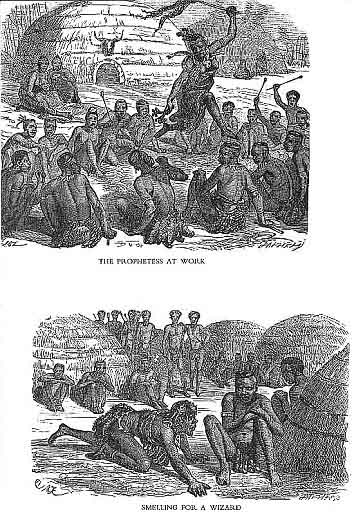

[Sacred-Texts](../../index) [African](../index) [Index](index) [Previous](rsa10.md)

------------------------------------------------------------------------

p. 417

## ABATAKATI; OR MEDICAL MAGIC, AND WITCHCRAFT.

> ------------------------------------------------------------------------
>
> *The Strength of Medicines.*
>
> THERE are medicines which give chiefs
> strength and presence; id="page_417_fr_80">[80](#page_417_note_80.md) a common man, who
> is neither a chief nor a doctor, cannot touch this kind of medicine;
> if any one among the chief's men were seen with it, he used to be
> killed; it was said, "What are you intending to do with that?" For a
> chief feels with his body a man who has great medicines; and when such
> a man stands in his presence he is oppressive; it is as though the
> chief was bearing him, and he feels a perspiration breaking out; and
> he starts up and goes away to strengthen himself with his medicines.
> If that man does not leave p. 418 these
> medicines, he will die. The chief will say to him, "Son of So-and-so,
> if you do not leave off this conduct of yours, you are already dead.
> Give me all your medicines, that I may see those which you have about
> you." And indeed the man does not conceal them, because he has been
> discovered by being felt by the chief's body. And if the chief finds a
> great medicine on him, he asks what he does with it, and from whom he
> got it. He says he purchased it from So-and-so. The chief asks what he
> was about to do with it. And he explains what he wished to do when he
> bought it; perhaps he says to make damsels love him. The chief takes
> the medicine, and places it among his own.
>
>  As to the possibility of a man who carries powerful medicines being
> felt, this is what I know.
>
>  It happened one day the people assembled at a dance; and the men were
> sitting in the cattle-pen looking at the damsel dancing; and then, as
> the men were sitting and looking on without there being anything the
> matter, they saw one among them who appeared to be cold, and saw him
> fall down—a young man of the people of Unomsimekwane, the chief of the
> nation of Umkcoseli. id="page_418_fr_81">[81](#page_418_note_81.md) And  id="page_419">p. 419 the people asked, "What is the matter with
> the man?" And they looked at each other, and asked, "What is the
> matter with you?"
>
>  He replied, "No. I feel different sensations in different parts of my
> body; I am weak; I do not know what is the matter with me. I felt
> myself become suddenly hot, and then fell."
>
>  He was unable to see. My brother went and took his medicines, and
> choosing from among them told him to bite off a portion, and he
> himself, having chewed some, puffed into his ears and nostrils; and in
> a little while the man rose up again and was strong. This is what I
> saw.
>
>  I heard the people talking much, saying, "O, So-and-so did a
> wonderful thing; as we were arriving at the wedding, before we had sat
> down any time, we saw a man fall without apparent reason; and
> So-and-so at last restored him." There was much talk of that kind.
>
>  If common men are unable to restore such a person, it at length
> becomes known to the great men; and people suffering in this way are
> helped by the chief; he will cure him. id="page_419_fr_82">[82](#page_419_note_82.md)
>
> p. 420
>
>  But we do not say amongst ourselves that nothing has been done to the
> man that falls, he falls from mere disease. No, we distinguish
> diseases which cause a man to fall. For amongst us if a man has an old
> injury of the head id="page_420_fr_83">[83](#page_420_note_83.md) it may cause him to
> fall, and be affected with blindness, especially when the sun is
> intensely bright. And he stretches himself and falls; we say, that is
> occasioned by the old accident.
>
>  Further, we do not say of a man that falls, "He merely falls; he has
> done nothing wrong;" we know at once by his conduct that he has
> medicines about him; for as he is not one who is thoroughly acquainted
> with medicines, therefore his medicines are overcome by others which
> are stronger than they, and the owner of the medicines falls. id="page_420_fr_84">[84](#page_420_note_84.md)
>
> p. 421
>
>  Just as in the thorn-couutry where our tribe lived, at Table
> Mountain, there are two doctors who disputed with each other about
> their skill. One said to the other, "So-and-so, you are utterly unable
> to pluck umdhlebe, id="page_421_fr_85">[85](#page_421_note_85.md) though you are a
> doctor." The other said, "I can pluck it at once, as soon as I reach
> it." I know both these men; one is called Usopetu, and the other
> Upeteni. Usopetu said to Upeteni, "Upeteni, let us go together to the
> Umlazi near the sea; the tree you mention I know, that our contentions
> may cease; as for you I know you are a doctor; and you will know me
> when we reach the tree."
>
>  And truly they went till they came to the tree. When they came to it
> Usopetu said, "Upeteni, there it is. Let us sit down."
>
>  But men contend with this tree; it is a powerful opponent; a man
> cannot pluck it before he has fought with it. It is also said that
> beneath it there are many bones of animals which die there; and birds
> if they pitch on it, die. It p. 422 is also
> said that the tree cries like a sheep. There are several kinds of
> umdhlebe, not one kind only; some are small; the largest of all is
> that which grows among the Amanthlwenga.
>
>  Usopetu said, "Upeteni, begin." But although the heaven is still, and
> there is no wind, the tree moves, and makes a noise by moving; its
> leaves move. Usopetu said, "Upeteni, do you begin, since you say you
> are a doctor. Pluck for me, and give me." At once Upeteni untied his
> medicines, and selected what was proper; he chewed them and puffed on
> his body. He arose, thinking to go and pluck from the tree. And as he
> carried his assagais that he might stab it, he stabbed it; id="page_422_fr_86">[86](#page_422_note_86.md) it moved violently;
> and would not allow him to approach it. He went back to other
> medicines, and chewed them and puffed upon his body; and again went to
> the tree, and stabbed it; it made a great noise; again and again he
> tried to approach it, but he was unable; he went back again, and his
> face began to be suffused with perspiration.
>
>  Usopetu said, "Pluck from the tree, and let us go home."
>
> p. 423
>
>  He applied to other medicines; but he was still unable to pluck from
> the tree. And he was no longer able to quit the place; cold entered
> into him; although there was a cloudless, bright sun, he was cold, and
> began to say to Usopetu, "O, I am conquered. Help me; I am now ill."
>
>  Usopetu replied, "Yes! yes! You are about to be satisfied today that
> I am a doctor; you are my boy." id="page_423_fr_87">[87](#page_423_note_87.md) Usopetu untied his
> medicines, and chewed some and puffed on Upeteni, and cured him. He
> took his medicines, and went with them to the tree; he stabbed and it
> made a great noise; he went back from it, and took other medicines and
> went to it again; he stabbed it; it was silent; he went down to it,
> and plucked its branches.
>
>  And Upeteni said, "Pluck for me also." He gave him some of the
> branches of the tree. He took up the assagais and came back with them.
>
>  Upeteni said, "Usopetu, you are a doctor. You have conquered me this
> day."
>
>  This, then, is the tree which kills people, which if cast into the
> midst of a village, that village perishes; a great fever arises; and a
> man dies with all his bones p. 424 racked
> with pain; there is no place where he can rest, but he moves up and
> down continually. At length a doctor comes, and sees that the man has
> been made ill by umbulelo, id="page_424_fr_88">[88](#page_424_note_88.md) that is, umdhlebe;
> he cures him, His treatment consists in ordering him to abstain from
> drinking water, and not to eat amasi.
>
>  Just as I saw with my own eyes those men who were killed by umdhlebe
> among the Amanthlwenga, they having gone to hunt elephants. One of
> them was my brother. He once came here driving the waggon for one
> month; a tall man, with very black skin, and tall, and a long beard.
> They went with a Dutchman; the name of the Dutchman was Umkosi.
>
>  They set out and went to the Amanthlwenga; they met with elephants
> and killed many; at length they reached a place where umdhlebe grows;
> where the people cannot keep cattle, but only goats. And one
> afternoon, feeling hungry, they killed a buffalo; when it was dead,
> they skinned it and roasted it. They used umdhlebe to roast it with,
> not being acquainted with the tree. But they did not eat all the meat,
> Umdava first began to complain, saying, "O, my bones are racked with
> pain." Then Unofithlela complained, saying, p.
> 425 "And I too am suffering in the same way." So they did not
> eat all that meat, but were seized with pain also in their heads; and
> the disease continually attacked others.
>
>  But the Amanthlwenga know how to treat this disease. Unofithlela
> began to swell, and his abdomen continued tumid; he was as if he was
> constantly full. And Umndava was the same; and at length they had
> diarrhœa.
>
>  When the white man saw how it was, and that the people would die; for
> they were many, and all were attacked except himself; (but he too was
> formerly ill when he went there the first time, and was cured; but he
> went again notwithstanding;) he called the doctors of the place, and
> they treated the people. But when they reached the Amanthlwenga some
> had already died. And those who treated them told them not to drink
> water nor to eat amasi; and that if they ate amasi they would die in
> the way and not reach home.
>
>  And indeed whilst under treatment, the Dutchman wished to return
> home, and put them in his waggons. O, as they journeyed they passed
> through the villages of the Amazulu, and saw amasi and ate. Many of
> those who ate amasi died there in the way; and at last the others
> reached our village. p. 426 When they came
> they had tumid abdomens, their bodies were wasted to nothing, and
> their abdomens were a burden to them. O, we did not know how to treat
> these people. We offered them amasi; they refused, saying, "The doctor
> told us not to eat amasi till we are well; then we may eat it."
>
>  There was a great doctor among our people, whose daughter had married
> among us; his name was Umjiya. My uncle at once called him; he treated
> them; he did not go home to his own village, but slept there
> continually. And indeed after a very few days we saw that their eyes
> again were like the eyes of men; for we thought they would really die;
> and the tumid abdomens were reduced, and they got well. And they are
> living to this day.
>
>  That disease of the Amanthlwenga we are thoroughly acquainted with,
> and know that it is a deadly disease. Its name is imbo. id="page_426_fr_89">[89](#page_426_note_89.md) We abstain from
> calling[90](#page_426_note_90.md) the
> tree umdhlebe; for we do not take its name in vain, for it is an awful
> tree; just as the term ibubesi was not used, but we used to say
> ingonyama.[91](#page_426_note_91.md)
>
> p. 427
>
> ------------------------------------------------------------------------
>
> *It is difficult to drink out of the Cup of a Chief.*
>
> IT is said it is difficult even for men who
> consider themselves knowing ones id="page_427_fr_92">[92](#page_427_note_92.md) to drink out of the
> cup of a chief; for if one thinks that he too is taking the cup, yet
> forsooth there is not among his medicines one which he can trust; and
> when he thinks he is about to drink, it is as if he had a stick
> obstructing his swallow; the beer will not go down; the first mouthful
> cannot be swallowed; and at last he spits it out upon the ground.
>
>  The men in the house look at each other, and do not know what to say.
> And the beer is handed back to the chief; and if he give it to a man
> who is faultless, id="page_427_fr_93">[93](#page_427_note_93.md) he just drinks it,
> and it goes down. And they say to the first, "O! Your conduct is evil.
> Why could you not eat the food id="page_427_fr_94">[94](#page_427_note_94.md) of the chief?"
>
>  As it happened also when it was said an army was about to go to  id="page_428">p. 428 fight against the Amahhahhaba. id="page_428_fr_95">[95](#page_428_note_95.md) Usomseu id="page_428_fr_96">[96](#page_428_note_96.md) sent men to
> Udumisa, for the army was mustered out of all the tribes on this side
> the Umkomanzi; and on this side the Umgeni Umkqundane was chief
> officer; and on the other side the Umgeni, Ungoza. And the men who
> were sent by Usomseu—and one of the men I knew was Umanyosi, for he
> was one of our tribe—arrived at Udumisa's. According to the custom of
> black men, when one comes who is sent by the chief, it is proper to
> honour him by killing a bullock for him. Udumisa did so; he killed for
> the messengers a young ox. And they set about boiling it, and kindled
> a great fire, that it might be thoroughly dressed. They collected a
> second time a great deal of firewood, saying, perhaps there is not
> enough fire. No, there was enough. At length they saw that more time
> had passed than was required to cook the meat; they began to remember,
> and say one to another, "Oh, can it be that Udumisa is doing that
> which we have heard mentioned, viz., that if a chief has practised
> p. 429 magic on a bullock, id="page_429_fr_97">[97](#page_429_note_97.md) it does not get
> cooked, until heaps of firewood are burnt? This is what it is, for all
> the firewood is burnt; we pour water into the pot, and it boils away,
> and we add continually more water. When we wish to see, we see that
> the meat is just as it was at first." At length they took the meat out
> of the pot, and slept without eating.
>
> p. 430
>
>  But that was a trouble to them, and they said, "Why has Udumisa done
> this? for he is not our enemy. For we know that this is done by one
> chief to another, that he may see and say, 'If I fight with So-and-so
> he will not be conquered, id="page_430_fr_98">[98](#page_430_note_98.md) but it is I myself
> that shall be conquered.'"
>
>  So they returned, and went at once to the chief. id="page_430_fr_99">[99](#page_430_note_99.md) And when the chief
> heard that Udumisa had done this, he summoned him to appear before
> him. When he came, it was said to him, "Udumisa, we have summoned you
> on account of this report, to know whether it is true that you gave
> the men a bullock, and that they boiled it, but it could not be
> thoroughly cooked?"
>
>  But Udumisa said in reply, "O, chiefs, id="page_430_fr_1">[1](#page_430_note_1.md) I do not know what to
> say, for I gave them a bullock. But if they did not kindle a fire to
> cook it, do you say that it is I who ought to have gone out and
> fetched firewood for them?"
>
>  And the chiefs agreed with Udumisa, and said, "The meat was not
> cooked because the men were idle."
>
>  But in their opinion, although Udumisa spoke cunningly, and  id="page_431">p. 431 the chiefs agreed with him, it was not so;
> for they said, "Eh! what does Udumisa mean by saying that we did not
> kindle sufficient fire for the bullock? What does he understand by
> kindling fire enough, when both the firewood and the water were
> consumed, and we could do nothing more? Is there any bullock which one
> begins to boil on one day, and it is cooked on the morrow? We ask him
> this, when he says we did not kindle fire enough for it."
>
>  The matter ended; the chiefs agreed with Udumisa; but the others have
> in no way altered their opinion, though they lost the case.
>
> ------------------------------------------------------------------------
>
> *The Magic of Ufaku.*
>
> THE account of the magic of Ufaku, id="page_431_fr_2">[2](#page_431_note_2.md) the son of
> Ungqungqushe, which he practised on Uncapayi, id="page_431_fr_3">[3](#page_431_note_3.md) the son of Umadikane.
>
>  Uncapayi married a daughter of Ufaku, the sister of Undamase. One day
> Ufaku sent one of his men to go to Uncapayi by night whilst he was
> asleep. He took a brass ornament which was on his arm, without his
> hearing; neither p. 432 did his wife hear.
> He left their hut, and brought the ornament to Ufaku.
>
>  Ufaku worked on the ornament with his magical knowledge. And one
> night he called Uncapayi, having practised magic on him; he called him
> by name,[4](#page_432_note_4.md) not
> shouting aloud, but calling him, and using the medicines with which he
> was acquainted.
>
>  Uncapayi awoke in the night, and clothed himself. His wife said to
> him, "Where are you going, O chief?"
>
>  He replied, "I am going to the chief, to Ufaku."
>
>  The woman said, "When it is still night?"
>
>  He said, "Yes."
>
>  The woman asked, "Will it never be daylight, that you may go then?"
>
>  He replied, "No, I am going now."
>
>  And indeed he quitted the p. 433 house,
> and went on his way speedily. His wife remained behind. She roused the
> people and said to them, "Your chief has departed. Follow him." And
> the people left their home at once during the night, and followed him
> till the morning. Uncapayi reached the village of Ufaku during the
> night. Ufaku was told that Uncapayi had arrived.
>
>  Ufaku asked, "Where is he going?"
>
>  Uncapayi replied, "I have come to this place."
>
>  Ufaku said, "What has he come to fetch?"
>
>  He replied, "I thought I was called by the chief."
>
>  The chief said, "No. But take him to such and such a house. We will
> talk in the morning." So they went to sleep.
>
>  In the morning Ufaku assembled his troops that they might go out to
> battle.[5](#page_433_note_5.md) But the
> soldiers of Uncapayi which followed him were very few in number. Ufaku
> said, "I cannot kill my child's husband. Let him go home."
>
>  But at that time Uncapayi had not a large army; but he was  id="page_434">p. 434 mighty in battle with the enemy; but he
> was subject to Ufaku, but he did not readily submit to be governed,
> but disputed Ufaku's word, and appeared as though he would fight with
> him. And sometimes when Ufaku wished to kill him, he escaped because
> he was his daughter's husband. But notwithstanding at last Uncapayi
> was hurled by the army of Ufuku over a precipice together with his
> soldiers with which he had come to fight with Ufaku.
>
> ------------------------------------------------------------------------
>
> *Intelezi.*
>
> THERE are mally kinds of plants which are
> called intelezi. Intelezi is a thing of this kind: id="page_434_fr_6">[6](#page_434_note_6.md) when a man goes to
> wash he docs not wash with water only, like women; it is women only
> who wash with water only; when a man goes to wash he picks several
> kinds of intelezi; and when he has come to the river he looks for a
> pebble, and sits down and bruises the intelezi; id="page_434_fr_7">[7](#page_434_note_7.md) when he has bruised
> them he pours a little water on them, and squeezes them in both his
> hands; he raises his hands over his head; and as the water  id="page_435">p. 435 which runs out of the bruised leaves and
> stalks[8](#page_435_note_8.md) of the
> intelezi descends by both his arms, it escapes at his feet; and he
> pours some into his mouth, that he may squirt it in the direction of
> where he has received an injury; id="page_435_fr_9">[9](#page_435_note_9.md) if he has no enemy he
> does not squirt in this manner; he then rubs his whole body, and
> throws the remains on the grass. He then washes the pebble with which
> he bruised the intelezi, and the rock on which he bruised it, and
> hides the pebble, because tomorrow also he may want it; he then washes
> himself with water.
>
>  As to the mode in which a man washes himself among black men, he does
> not begin to wash every part of the body indifferently; he begins with
> his arms, after that he pours water over his body with both his hands;
> then throws it over each shoulder, until he has washed the whole body,
> when he dresses and goes out of the water. id="page_435_fr_10">[10](#page_435_note_10.md)
>
>  He washes himself therefore with intelezi, that though he should meet
> with danger whilst travelling, p. 436 he
> may not be quickly injured, but escape constantly from danger which
> may arise either from falling or from fighting; and that he might not
> suddenly fall into danger.
>
>  Black men trust very much to intelezi; for at all times when a man is
> about to wash he takes intelezi. But when he has gone to the ford id="page_436_fr_11">[11](#page_436_note_11.md) he does not take
> intelezi, but washes with water only; for he quits his hut when it is
> still dark, and he cannot see intelezi; id="page_436_fr_12">[12](#page_436_note_12.md) further, he does
> not wash with intelezi under such circumstances, because the ford is
> said to be a bad thing; id="page_436_fr_13">[13](#page_436_note_13.md) and although a man
> has medicines to which he trusts, he cannot go to them to touch them;
> and if he has great need to touch his medicines, he searches for
> izilumulo[14](#page_436_note_14.md)
> among them, and uses them, and then he will untie his medicines,
> having put them in safety, and then his medicines come to no harm.
>
>  Such then is intelezi. There are some who are acquainted with
> powerful intelezi with which doctors wash themselves. If a man  id="page_437">p. 437 plays with another who has washed with
> intelezi, and meets with some severe injury from merely playing with
> the man, the man is dreaded, and it is said, "O, the intelezi of that
> man is powerful. Why, when he is merely playing with another and not
> fighting, has he met with so severe an injury as this? No; the
> intelezi of that man is powerful."
>
> ------------------------------------------------------------------------
>
> *Intelezi for Soldiers.*
>
> WHEN a chief is about to fight with
> another, he calls his army-doctor. He brings intelezi, which he
> bruises, places in a pot, pours water on it, and then squeezes it with
> his hands, and mixes it with the water. And he has the tail of a large
> animal, which is well known, called the gnu; its tail is long; it is
> placed in the vessel of intelezi, and the doctor takes the vessel. The
> army forms a semi-circle; no man speaks; there is perfect silence; for
> indeed when an army is being led out to war no one speaks even a
> little; it is an evil day, for men are going to die; and they eat
> nothing. The doctor sprinkles the whole army, going round it, until he
> has gone round the whole circle. And when an anny has had this done to
> it, no one among them is able p. 438 to
> associate with his wife; they abstain excessively; for if a man, when
> the army is going out, and the men have been treated with intelezi,
> associate with his wife, he kills himself, making his own eyes
> dark.[15](#page_438_note_15.md) No man
> sins against the law of intelezi; if he does, he kills himself. For on
> the day the army is summoned and assembles at the chief's, the chief
> slaughters cattle, and they are then skinned; the first meat they eat
> is black, being always smeared with umsizi." id="page_438_fr_16">[16](#page_438_note_16.md) All eat the meat,
> each a slice, that they may be brave, and not fearful. When the doctor
> has finished sprinkling the army, the chief id="page_438_fr_17">[17](#page_438_note_17.md) comes into the
> midst of it and talks with it, lauding the Amatongo of their people.
> In conclusion the chief says, "Troops of our people, who did such and
> such great actions, id="page_438_fr_18">[18](#page_438_note_18.md) I shall hear of
> your doings. There is the sun in the sky; I have this day given the
> enemy into the hands of such and such a regiment; and I direct such
> and p. 439 such a regiment to follow it. I
> do not know for my part what more I could do. If you do not conquer,
> you will disgrace yourselves. id="page_439_fr_19">[19](#page_439_note_19.md) My father was a
> brave; there was never known to be a coward amongst us. Let the
> assagais wound you in front; let there be no wound in the back. If I
> see you coming back conquered I will kill you; you will find no place
> for you here at home; I too am an enemy if you are cowards."
>
>  Then there is no end of leaping and brandishing of weapons. Some
> devote[20](#page_439_note_20.md) the
> villages of their fathers, saying, "For my part, if I do not stab the
> enemy, I give you the whole village of my family." But if it is a
> chief who does not wish a boy to devote his fathers village whilst his
> father is living, he says, "No. Do not devote the villages of other
> men." Another says, "You speak the truth, leopard. id="page_439_fr_21">[21](#page_439_note_21.md) For my part I
> devote my own head, that if I do nothing, you may kill me; that is
> all. That is what I devote." All say the same. Some do not know what
> to say, and are silent.
>
>  And when they are devoting themselves to the chief, it is a bad  id="page_440">p. 440 and unpleasant time; the men leap and
> brandish their weapons, and break rods in the face of the chief. To
> break a rod in the face of the chief is a great oath among black
> people, and a man means to say by it, "You will take me to task, if
> you do not hear some great thing that I have done."
>
>  At that time he does not resemble a chief whom they reverence; they
> are not afraid of him at that time. Some throw dust on him, saying,
> "This little coward who resembles his mother! Where is the enemy which
> you give us to fight with? We wish to see it with our eyes." He then
> sends out his army. id="page_440_fr_22">[22](#page_440_note_22.md)
>
>  Under these circumstances no black woman draws near, but they go to a
> distance; those who approach are old women who have passed the time of
> childbearing, and have become men; id="page_440_fr_23">[23](#page_440_note_23.md) it is they only who
> go near the army; all the young women go to a distance from it.
>
>  So the army sets out from home singing its song, for it is as if they
> could see the enemy at once. So the army sets out. And the sick only
> remain at home.
>
>  When the army is in the field p. 441 the
> women take no pains to keep themselves tidy; for it is said, it is not
> proper that a woman, when her husband is out with the army, should
> continue many little habits, even those of adorning herself. And she
> does not often wash; she continually remembers that her husband is
> with the enemy; she watches herself in all she does.
>
>  And if there is any one who has just been married, and the enemy
> stabs him at the very first onset, it is said, "The lap of that woman
> is unlucky.[24](#page_441_note_24.md)
> Why has her husband died before any thing was done? Her lap is
> unlucky."
>
>  Such is what is done with intelezi in sprinkling an army.
>
>  The doctor says, "I say that now you will not be stabbed at all; the
> enemies' assagais will constantly strike on the shields and glance
> off."
>
>  There is a custom id="page_441_fr_25">[25](#page_441_note_25.md) which is carried
> out by the doctor when an army is about to take the field, which is a
> sign by which it is p. 442 known whether
> the army will be conquered or conquer. For when the army is assembled
> there are wise men appointed to look earnestly, who stand at a
> distance from it, endeavouring to discover whether it is a trustworthy
> army or not. And if they see that it is contemptible in their eyes,
> they say to the chief, "No, O chief! The army which is assembled this
> day we can not see; it is contemptible. id="page_442_fr_26">[26](#page_442_note_26.md) How is it that the
> army is without awfulness, and weight in our sight? No; we do not see
> an army. It is light; it has not been properly handled. id="page_442_fr_27">[27](#page_442_note_27.md) Return and set the
> army to rights, that it may be awful, that if one look on it, it may
> not appear a common thing to him, but strike him with awe. This is not
> an army." And indeed they again sprinkle it with intelezi, that it may
> be awful.
>
>  And among black men if a man has just married, it is not liked that
> he should go out with the army; for it is said, "It is not proper that
> the husband should leave the bride as soon as she has covered her
> head,"[28](#page_442_note_28.md) that
> is, manifested respect for her husband's p.
> 443 people. He was not allowed to go out with the army, because
> it was said, the enemy quickly stabs the man who has made his bride
> cover her head. Therefore some man, perhaps his father, tells him
> secretly not to go, but to stay at home.
>
>  But that custom ceased among the Amazulu; for it was not wished that
> any of the soldiers should marry; all were commanded not to marry,
> that they might not be afraid. It used to be so amongst us, and we
> were afraid for one to go out with the army leaving his young wife
> behind.[29](#page_443_note_29.md)
> Marriage was given up, because it was said, "O, no! for men will say,
> 'A man who has a young bride will be afraid, because he loves his wife
> rather than bravery.'" But there is now no longer the custom amongst
> us.
>
>  But there is still this custom: If a woman is pregnant, it is said,
> even though a man is a water-doctor, id="page_443_fr_30">[30](#page_443_note_30.md) it is proper that
> he should abstain from going into the water, for it is said he will be
> quickly carried away by the water if his wife is pregnant.
>
> p. 444
>
> ------------------------------------------------------------------------
>
> *The Bird-doctor.*
>
> THERE is a remarkable account of a man who
> was doctor of those birds which eat the corn. For at the time of the
> blossoming of the amabele, when the grain begins to set, it is
> diligently watched; and watch-houses are built for the purpose of
> watching the birds; and people arise whilst it is still very early in
> the morning, and return at sunset; when it is dark the birds go to
> their roosts.
>
>  When the grain begins to appear, a doctor is called, for the people
> see that even early rising is of no use, since the birds sleep in the
> midst of the garden, and never quit it at the time of the setting of
> the grain. The wife and husband no longer love one another; for when
> the birds are numerous they separate lovers; and there is no time for
> sitting in one place, that the people may talk about the news. If the
> husband does not watch, and the wife alone is harassed, the husband
> does not associate with his wife, for she no longer cooks food; if the
> husband ask for food, the wife says, "As for you forsooth, do you eat
> food? For see there are those little beasts destroying it in this way!
> When can I find time to look for food, if I am harassed in this way?
> Do the birds allow me to have any p. 445
> time? Since it is well if at noon they just leave off eating for a
> little while, can a person then find time to go and seek food for
> himself?"
>
>  At that time, if the husband does not go out to help his wife, he
> gets thin; for he cannot get any food anywhere if he has but one wife.
> And the husbands, although at first they stay at home, yet because of
> hunger and the anger of their wives, who are harassed by the birds and
> have now bleeding id="page_445_fr_31">[31](#page_445_note_31.md) hearts, at length
> go out to assist the women against the enemy which is fighting with
> them; and then the woman leaves her husband in the garden, and goes to
> seek for food in a small garden plot which is more forward than the
> rest, and then they eat food. And the men return home with their arms
> swollen with throwing stones at the birds from earliest dawn to
> sunset; the birds not leaving off eating for a little time.
>
>  At length the men go to the chief of the village, and say, "O, dear
> sir, what do you mean by remaining silent? For you see clearly that we
> are dying of want, and the cows are no longer milked for our children,
> for the people are taken captive by the birds."
>
> p. 446
>
>  And so the chief of the village remembers a doctor whom he knows is
> skilful to prevent birds from entering the garden, and says, "Go and
> call So-and-so, to come here to-day to help me, for I am devoured by
> little beasts."
>
>  And indeed when the doctor comes he brings with him bundles of dried
> and green medicines, and a snake which is called Ukokoti, with which
> birds are kept out of the garden. The doctor demands a herd of cattle,
> saying, "Point out my bullock to me." The chief of the village says,
> "Do you think if you cause my children to come home, that it will be
> possible for me to be excelled by you? How great are you? Destroy the
> birds which are in the garden, and I will give you a bullock. There
> will be no disputing when you have taken away the birds."
>
>  So the doctor gives directions, saying, "Let all the men come
> together, and cut green firewood; let the women leave the birds
> to-day, that they may eat, that I may be able to find the chaff of the
> amabele on the ground; then I shall be able to treat them well. Find a
> great frog, that I may shut out the birds by means of it."
>
>  Indeed on that day the birds eat the amabele excessively; they begin
> in the morning and leave off p. 447 at
> sunset. In the afternoon the doctor tells the people to collect the
> ears which the birds have left, and the chaff which has recently
> fallen on the ground, and bring it to him, every thing that has been
> eaten on that day by the birds. And it is all collected, and ground; a
> frog is found, and stuffed till it is like a stuffed sack; and the
> same is done to all isinana; id="page_447_fr_32">[32](#page_447_note_32.md) and then all is
> buried together, and a fire is kindled on the top, and a huge
> fireplace is made; and the fire is kept up all night until morning.
> The doctor says, "Watch the birds to-morrow and the day after, and see
> what they do, and then leave them alone. Then you will see that I am a
> doctor."
>
>  And indeed so it is; they watch them earnestly. The doctor tells them
> not to let the fire go out, but to keep it up day and night, until the
> birds are conquered, and not to put it out until the amabele is ripe.
> The fire is not made near the garden, but is placed at a little
> distance from it.
>
>  And the doctor says, "I say that you may be satisfied with me, you
> will go home; the birds are conquered. When you see them  id="page_448">p. 448 begin to come and sit by the fire, then
> you will know that I am about to conquer them. When you drive them
> away you shall say,
>
> <table data-align="center" data-cellpadding="10">
> <colgroup>
> <col style="width: 100%" />
> </colgroup>
> <tbody>
> <tr class="odd">
> <td>Die, die, mbalane; 
> Die, thlokothloko."</td>
> </tr>
> </tbody>
> </table>
>
> He says further, "Do you watch yourselves for my sake; let no man of
> you go to his house; id="page_448_fr_33">[33](#page_448_note_33.md) it is proper that
> you should guard your heart for my sake; then you will see my skill."
>
>  And having shut out the birds for two days, on the third they wash,
> the doctor having given them intelezi to wash with. They go to the
> river to wash. He says to them, "When you have washed, and are going
> up from the river to the gardens, sing this song,
>
> <table data-align="center" data-cellpadding="10">
> <colgroup>
> <col style="width: 100%" />
> </colgroup>
> <tbody>
> <tr class="odd">
> <td>O, die, mblane; 
> O, die, thlokothloko.</td>
> </tr>
> </tbody>
> </table>
>
> When you say thus, see on reaching the gardens how much they have
> eaten."
>
>  Some begin to say, "O, for my part, women, I see the birds doing
> nothing but sit still. I creep stealthily along to go and see, and I
> see the birds not eating; they merely open their mouths." And indeed
> the birds begin to collect in

------------------------------------------------------------------------

[Sacred-Texts](../../index) [African](../index) [Index](index.md)

------------------------------------------------------------------------

### Footnotes

p. 417

 [80](#page_417_fr_80.md) Lit., which
make a chief stand, or which establish a chief; that is, make him strong
in the face of danger, or give him presence before others, by which he
is recognised at once as the chief.

p. 418

 [81](#page_418_fr_81.md) *Umkcoseli*,
the unkulunkulu or founder of the tribe.

p. 419

 [82](#page_419_fr_82.md) The chief
collects to himself all medicines of known power; each doctor has his
own special medicine or medicines, and treats some special form of
disease, and the knowledge of such medicines is transmitted p. 420 as a portion of the inheritance to
the eldest son. When a chief hears that any doctor has proved successful
in treating some case where others have failed, he calls him and demands
the medicine, which is given up to him. Thus the chief becomes the great
medicine-man of his tribe, and the ultimate reference is to him. If he
fail, the case is given up as incurable. It is said that when a chief
has obtained some medicine of real or supposed great power from a
doctor, he manages to poison the doctor, lest he should carry the secret
to another and it be used against himself.

 [83](#page_420_fr_83.md) An injury of
the head is always a cause of anxiety to natives, especially one which
has caused depression of the bone, which the natives usually treat by
cutting down to the bone, and scraping it, often leaving a deep
depression. Such injuries are always referred to as the cause of all
future diseases.

 [84](#page_420_fr_84.md) That is, an
inexperienced man bears about him powerful medicines, and therefore the
medicines of another become aware that there is an opponent at hand, and
contend with the medicines till they are p. 421 overcome, and he who carries them
is seized with illness. By bearing medicines he becomes a centre of
influence and attraction, and is, as it were, attacked by another. One
who bears no such medicine does not suffer; not being a centre of
influence, he is not a centre of attraction, and so, being neutral,
escapes.

 [85](#page_421_fr_85.md) *Umdhlebe*, a
tree, which is probably a kind of Aspen. In some respects it reminds us
of the Upas. But much that is said about it is doubtless fabulous and
wholly untrustworthy.

p. 422

 [86](#page_422_fr_86.md) He stabbed it
by throwing his assagai, standing at a distance, not by approaching it
so as to stab it without throwing. When the tree is pierced, it is said
to throw out of the wound a water, with a hissing noise; and if the
juice fall on the body of a man, it will produce a deep wound, and kill
him if he is not treated by a skilful doctor.

p. 423

 [87](#page_423_fr_87.md) You are my
boy. That is, I am a man in my knowledge; you are but a boy. You are my
pupil.

p. 424

 [88](#page_424_fr_88.md) *Umbulelo*, a
gen. term for destructive medicines, of which *umdhlebe* is one.

p. 426

 [89](#page_426_fr_89.md) *Imbo* is a
term applied to any severe epidemic or endemic disease, as acute
dysentery, fever, &c.

 [90](#page_426_fr_90.md) That is, its
name is *hlonipa’d*. It is "tapu," and must not be called by name.

 [91](#page_426_fr_91.md) *Ibubesi*, a
lion; *ingonyama*, the name by which it is usually spoken of.

p. 427

 [92](#page_427_fr_92.md) *Izazi*,
knowing ones, magicians.

 [93](#page_427_fr_93.md) *Who is
faultless*, that is, to one who does not use those strong medicines
which are supposed to be possessed of magical properties. The doctor is
using medicines similar in character to those which the chief is using,
but those of the chief are the stronger of the two, and the doctor feels
their power. He is, as it were, an enemy in the presence of an enemy
more powerful than himself. The common man not being under the influence
of medicines is not in a state of antagonism with those who use them.

 [94](#page_427_fr_94.md) *Food*. Beer,
*utshwala*, is called food, and is said to be eaten; to distinguish it
from solid food, it is sometimes called *ukudhlana*—light food; or
*amanzana*—waterish food.

p. 428

 [95](#page_428_fr_95.md) *Amahhahhaba*,
a tribe among the Amakxosa Kafirs, probably a sub-tribe of the
Amagcaleka, called by Dugmore, Amakhakhabe. (*Compendium of Kafir Laws
and Customs, p.* 10.)

 [96](#page_428_fr_96.md) *Usomseu*, Mr.
Shepstone.

p. 429

 [97](#page_429_fr_97.md)

>  Ukulinga inkomo—to bewitch or practise ruagic on a bullock—is for the
> purpose of causing it to lose its natural properties; it is done in
> order that when it is stabbed, those who do not know what has been
> done to it, may without thinking just stab it, expecting it at once to
> drop; but when they see all their skill in choosing fatal points for
> stabbing is near being exhausted, they begin to ask whether it has not
> been bewitched. This is what is meant by practising magic on a
> bullock. In like manner, when it is to be boiled, if it has been
> bewitched for the purpose of preventing its becoming cooked, they will
> stab it, and it will at once drop; if it is bewitched for the purpose
> of preventing its being fatally stabbed, it will not fall. This is
> what is meant by ukulinga. If a man wishes that the bullock should not
> drop when stabbed, he will take a certain medicine which he has, and
> chew it, and breathe it on his hand; if the bullock is tame he goes to
> it, and scratches it; it stands still, and he rubs its side in the
> place where it will be stabbed; and so leaves it. If he practises
> magic to prevent its being cooked, he may breathe on the pot in which
> it is to be cooked. That is all.

p. 430

 [98](#page_430_fr_98.md) Lit., cooked,
or boiled.

 [99](#page_430_fr_99.md) *The chief*,
Mr. Shepstone.

 [1](#page_430_fr_1.md) *Chiefs*.—All
superior white men are so called, especially those sitting with a
magistrate; and government officials.

p. 431

 [2](#page_431_fr_2.md) Ufaku, a great
chief of the Amampondo, now dead.

 [3](#page_431_fr_3.md) Uncapayi, by
descent a chief of a tribe of Amabakca, who raised himself to some
position by his personal qualities as a leader.

p. 432

 [4](#page_432_fr_4.md) Calling him by
name; that is, whilst practising magical arts he called Uncapayi by
name, that the magic might take effect on him, and not on another.

 In the Legends of Iceland we meet with several instances of persons
being "called" or forced by magical means to go to a certain place,
where their enemies were awaiting them. Thus Olafr says to Gudmundr:—"My
father lives at a farm not far from hence; he has charmed you hither,
for he wants to repay you the slaying of his son." (*Legends of Iceland.
Second Series, p.* 103.) Again, the farmer having unsuccessfully
attempted to kill Oddr, says:—"Great is thy luck, Oddr, to have escaped
scatheless, for thou shalt know that, by my charms, thou art here, as I
intended to kill thee." (*Id., p.* 123.) See also p. 132 and p. 153.

p. 433

 [5](#page_433_fr_5.md) Although, as is
supposed, Ufaku had by magical charms forced Uncapayi to come to him
alone, yet when he was there in his power, Ufaku relented, and was
unable to kill his son-in-law. But he could not be comfortable till he
had vented his anger on someone, so he collected his troops and sent
them out on a raid against some neighbouring tribe.

p. 434

 [6](#page_434_fr_6.md) This cannot be
rendered literally, so as to be intelligible to the English reader. It
is very common for the Zulu thus to introduce a subject in an elliptical
manner, "Intelezi is a thing which:—when a man goes to wash," &c.

 [7](#page_434_fr_7.md) Properly
*izintelezi*, the plural, for there are many kinds.

p. 435

 [8](#page_435_fr_8.md) By *ikambi
lezintelezi* we are to understand the green portions of the plants,
leaves, and stalks, when bruised.

 [9](#page_435_fr_9.md) This system of
squirting water containing medicine from the mouth, is a very common
custom among the natives, in the efficacy of which they have great
faith. It is practised to ward off a danger which might arise from the
magical practices of another; it is also a defiance, and a means of
sending evil to another. The custom of spitting in contempt is probably
connected with some such superstition.

 [10](#page_435_fr_10.md) The native
dress is very simple, and during washing is placed on a rock close at
hand; and the man stands in the water whilst washing, and does not go
out of the water till he has dressed.

p. 436

 [11](#page_436_fr_11.md) I do not
explain this. The Zulu scholar will understand the meaning of the
metaphor.

 [12](#page_436_fr_12.md) That is,
distinguish it from other plants.

 [13](#page_436_fr_13.md) Influences
other things for evil, and if the medicines be touched, their properties
will be injuriously affected.

 [14](#page_436_fr_14.md) *Izilumulo*, a
class of medicines which are chewed (*luma*), and the breath thus
saturated by them puffed on the body, on medicines, &c., to protect them
from evil.

p.

 [15](#page_438_fr_15.md) That is, if he
break the law of the intelezi-sprinkling or baptism, it is to his own
injury, and when he goes into battle, he loses all power of
discrimination, and is soon killed.

 [16](#page_438_fr_16.md) *Umsizi*, a
powder made of the dried flesh of various wild beasts,—leopard, lion,
elephant, snakes, &c.,—the natives intending by the administering this
compound to impart to the men the qualities of the several animals.
Sometimes if a man has killed a wild beast, a leopard for instance, he
will give his children the blood to drink, and roast the heart for them
to eat, expecting thereby to cause them to grow up brave and daring men.
But it is said by others that this is dangerous, because it is apt to
produce courage without prudence, and cause a man to rush on heedlessly
to his death.

 [17](#page_438_fr_17.md) Lit., the
owner or master of the army, that is, the chief.

 [18](#page_438_fr_18.md) Recounting the
famous actions which they have done in battle.

p. 439

 [19](#page_439_fr_19.md) He means that
he has done all that a chief can do to ensure them victory; and if they
fail the fault will be their own, because it will arise from their
having in some way failed to observe the conditions upon which the
efficacy of the intelezi-baptism depends.

 [20](#page_439_fr_20.md) Devote,—or
promise to give,—or vow to give,—*lay down*, as a votive offering.

 [21](#page_439_fr_21.md) *Leopard*. The
natives magnify their chiefs by this title.

p. 440

 [22](#page_440_fr_22.md) *Impi* is used
in this paragraph in the double sense of the enemy—*impi kubo*; and the
chief's army—*impi yayo*.

 [23](#page_440_fr_23.md) Old women are
called men, and no longer act as women, nor observe the customs of
*hlonipa* in relation to the men.

p. 441

 [24](#page_441_fr_24.md) It is said of
such, *U ’matanga ’mabi*.

 [25](#page_441_fr_25.md) This custom is
that of churning medicine in a pot of water. Two medicines are chosen;
one represents the chief, the other the enemy. These medicines are
placed is separate vessels; if that representing the enemy froths up
suddenly, whilst that representing the chief does not froth, they regard
it as a sign that the enemy will prove too strong for them if they
attack him at that time, and the army is not allowed to go out to
battle. The same trial is repeated again and again, it may be for months
or even years, and the army is allowed to go out to battle only when the
sign is reversed, and the chief's vessel froths up, and that of the
enemy does not froth.

p. 442

 [26](#page_442_fr_26.md) Lit.,
*reddish*,—having nothing awful about it,—a thing we can look at without
fear. And *awful*—lit., black, or dark—resembling the sky which is being
overcast with dark clouds which threaten a coming tempest. But all this
is a matter of *feeling* with the wise men.

 [27](#page_442_fr_27.md) Viz., by the
doctor.

 [28](#page_442_fr_28.md) A young bride,
on reaching her husband's village, covers her head, as an intimation of
respect for her husband's relatives, especially for his father.

p. 443

 [29](#page_443_fr_29.md) *Gobisile*,
who has taken a young wife.

 [30](#page_443_fr_30.md) Not a
hydropathic doctor; but a man whose occupation it is to enable others to
cross deep rivers.

p. 445

 [31](#page_445_fr_31.md) That is, are
very angry.

p. 447

 [32](#page_447_fr_32.md) *Isinana* is a
Batrachian, which is found under stones. It has an almost globular body,
and small short legs; it is covered with papillæ, which give out a milky
fluid when touched. It is slow in its movements, not leaping, but
crawling. It is used much by the doctors.

p. 448

 [33](#page_448_fr_33.md) That is, they
are to abstain from their wives. Comp. [Exodus xix.
15](../../bib/kjv/exo.htm#19:15.md). They also all abstain from eating any
thing growing in the gardens whilst the doctor is treating them, until
they have washed. These are no doubt religious observances connected
with some old and now forgotten superstition.

 

 

 

 

 

 

 

 

 

 

 

 

 

 

 
