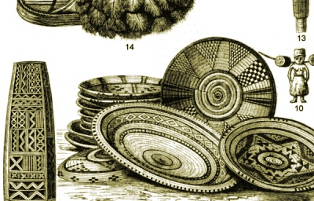

  
[Intangible Textual Heritage](../../index)  [Africa](../index) 

------------------------------------------------------------------------

[Buy this Book on
Kindle](https://www.amazon.com/exec/obidos/ASIN/B003CN6KYW/internetsacredte)

------------------------------------------------------------------------

<table width="75%">
<colgroup>
<col style="width: 50%" />
<col style="width: 50%" />
</colgroup>
<tbody>
<tr class="odd">
<td width="50%" data-valign="TOP"></td>
<td width="50%" data-valign="CENTER"><h1 id="south-african-folk-tales" data-align="CENTER">SOUTH-AFRICAN FOLK-TALES</h1>
<h4 id="by" data-align="CENTER">BY</h4>
<h4 id="james-a.-honeÿ-m.d." data-align="CENTER">JAMES A. HONEŸ, M.D.</h4>
<h4 id="section" data-align="CENTER">[1910]</h4></td>
</tr>
</tbody>
</table>

------------------------------------------------------------------------

[Contents](#contents)    [Start Reading](sft00)    [Text
\[Zipped\]](sft.txt.gz)

------------------------------------------------------------------------

This is a collection of South African folklore collected during the 19th
century. It includes many great animal tales with classic African
wisdom.

------------------------------------------------------------------------

 [Title Page](sft00)  
[Contents](sft01)  
[Introduction](sft02)  
[Origin Of The Difference In Modes Of Life between Hottentots And
Bushmen](sft03)  
[The Lost Message](sft04)  
[The Monkey's Fiddle](sft05)  
[The Tiger, The Ram, And The Jackal](sft06)  
[The Jackal And The Wolf](sft07)  
[A Jackal And A Wolf](sft08)  
[The Lion, The Jackal, And The Man](sft09)  
[The World's Reward](sft10)  
[The Lion And Jackal](sft11)  
[Tink-Tinkje](sft12)  
[The Lion And Jackal](sft13)  
[Lion And Jackal](sft14)  
[The Hunt Of Lion And Jackal](sft15)  
[Story Of Lion And Little Jackal](sft16)  
[The Lioness And The Ostrich](sft17)  
[Crocodile's Treason](sft18)  
[The Story Of A Dam](sft19)  
[The Dance For Water Or Rabbit's Triumph](sft20)  
[Jackal And Monkey](sft21)  
[Lion's Share](sft22)  
[Jackal's Bride](sft23)  
[The Story Of Hare](sft24)  
[The White Man And Snake](sft25)  
[Another Version Of The Same Fable](sft26)  
[Cloud-Eating](sft27)  
[Lion's Illness](sft28)  
[Jackal, Dove, And Heron](sft29)  
[Cock And Jackal](sft30)  
[Elephant And Tortoise](sft31)  
[Another Version Of The Same Fable](sft32)  
[Tortoises Hunting Ostriches](sft33)  
[The Judgment Of Baboon](sft34)  
[Lion And Baboon](sft35)  
[The Zebra Stallion](sft36)  
[When Lion Could Fly](sft37)  
[Lion Who Thought Him Self Wiser Than His Mother](sft38)  
[Lion Who Took A Woman's Shape](sft39)  
[Why Has Jackal A Long, Black Stripe On His Back?](sft40)  
[Horse Cursed By Sun](sft41)  
[Lion's Defeat](sft42)  
[The Origin Of Death](sft43)  
[Another Version Of The Same Fable](sft44)  
[A Third Version Of The Same Fable](sft45)  
[A Fourth Version Of The Same Fable](sft46)  
[A Zulu Version Of The Legend Of The ''Origin Of Death''](sft47)  
[Literature](sft48)  
