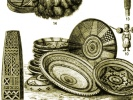

  
[Intangible Textual Heritage](../../index)  [Africa](../index.md) 
[Index](index)  [Previous](sft12)  [Next](sft14.md) 

------------------------------------------------------------------------

[Buy this Book on
Kindle](https://www.amazon.com/exec/obidos/ASIN/B003CN6KYW/internetsacredte.md)

------------------------------------------------------------------------

  
*South-African Folk-Tales*, by James A. Honeÿ, \[1910\], at Intangible
Textual Heritage

------------------------------------------------------------------------

# THE LION AND JACKAL

LION had now caught a large eland which lay dead on the top of a high
bank. Lion was thirsty and wanted to go and drink water. " Jackal, look
after my eland, I am going to get a drink. Don't you eat any."

"Very well, Uncle Lion."

Lion went to the river and Jackal quietly removed a stone on which Lion
had to step to reach the bank on his return. After that Jackal and his
wife ate heartily of the eland. Lion returned, but could not scale the
bank. " Jackal, help me," he shouted.

"Yes, Uncle Lion, I will let down a rope and then you can climb up."

Jackal whispered to his wife, "Give me one of the old, thin hide ropes."
And then aloud he added, "Wife, give me one of the strong, buffalo
ropes, so Uncle Lion won't fall."

His wife gave him an old rotten rope. Jackal and his wife first ate
ravenously of the meat, then gradually let the rope down. Lion seized it
and struggled up. When he neared the brink Jackal gave the rope a jerk.
It broke and down Lion began to roll-rolled the whole way down, and
finally lay at the foot near the river.

Jackal began to beat a dry hide that lay there as he howled, cried, and
shouted: "Wife, why did you give me such a bad rope that caused Uncle
Lion to fall? "

Lion heard the row and roared, "Jackal, stop beating your wife. I will
hurt you if you don't cease. Help me to climb up."

"Uncle Lion, I will give you a rope." Whispering again to his wife,
"Give me one of the old, thin hide ropes," and shouting aloud again,
"Give me a strong, buffalo rope, wife, that will not break again with
Lion."

Jackal gave out the rope, and when Lion had nearly reached the top, he
cut the rope through. Snap! and Lion began to roll to the bottom. Jackal
again beat on the hide and shouted, "Wife, why did you give me such a
rotten rope? Didn't I tell you to give me a strong one? " Lion roared,
"Jackal, stop beating your wife at once. Help me instantly or you will
be sorry."

"Wife," Jackal said aloud, "give me now the strongest rope you have,"
and aside to her, "Give me the worst rope of the lot."

Jackal again let down a rope, but just as Lion reached the top, Jackal
gave a strong tug and broke the rope. Poor old Lion rolled down the side
of the hill and lay there roaring from pain. He had been fatally hurt.

Jackal inquired, "Uncle Lion, have you hurt yourself? Have you much
pain? Wait a while, I am coming directly to help you." Jackal and his
wife slowly walked away.

------------------------------------------------------------------------

[Next: Lion And Jackal](sft14.md)

