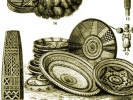

  
[Intangible Textual Heritage](../../index)  [Africa](../index.md) 
[Index](index)  [Previous](sft34)  [Next](sft36.md) 

------------------------------------------------------------------------

[Buy this Book on
Kindle](https://www.amazon.com/exec/obidos/ASIN/B003CN6KYW/internetsacredte.md)

------------------------------------------------------------------------

  
*South-African Folk-Tales*, by James A. Honeÿ, \[1910\], at Intangible
Textual Heritage

------------------------------------------------------------------------

# LION AND BABOON

BABOON, it is said, once worked bamboos, sitting on the edge of a
precipice, and Lion stole upon him. Baboon, however, had fixed some
round, glistening, eyelike plates on the back of his head. When,
therefore, Lion crept upon him, he thought, when Baboon was looking at
him, that he sat with his back towards him, and crept with all his might
upon him. When, however, Baboon turned his back towards him, Lion
thought that he was seen, and bid himself. Thus, when Baboon looked at
him, he crept upon him.\[1\] When he was near him Baboon looked up, and
Lion continued to creep upon him. Baboon said (aside), "Whilst I am
looking at him he steals upon me, whilst my hollow eyes are on him."

When at last Lion sprung at him, he lay (quickly) down upon his face,
and Lion jumped over him, falling down the precipice, and was dashed to
pieces.

\[1. Whilst Baboon did this, Lion came close upon him.\]

 

------------------------------------------------------------------------

[Next: The Zebra Stallion](sft36.md)

