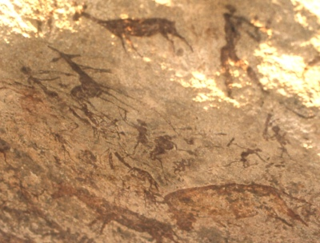

  
[Intangible Textual Heritage](../../index)  [Africa](../index.md) 

------------------------------------------------------------------------

<table width="75%">
<colgroup>
<col style="width: 50%" />
<col style="width: 50%" />
</colgroup>
<tbody>
<tr class="odd">
<td width="50%" data-valign="TOP"></td>
<td width="50%" data-valign="CENTER"><h1 id="specimens-of-bushman-folklore" data-align="CENTER">Specimens of Bushman Folklore</h1>
<h3 id="by" data-align="CENTER">by</h3>
<h2 id="w.-h.-i.-bleek-and-l.-c.-lloyd" data-align="CENTER">W. H. I. Bleek and L. C. Lloyd</h2>
<h3 id="section" data-align="CENTER">[1911]</h3></td>
</tr>
</tbody>
</table>

------------------------------------------------------------------------

[Contents](#contents)    [Start Reading](sbf00.md)    [Text
\[Zipped\]](sbf.txt.gz.md)

------------------------------------------------------------------------

------------------------------------------------------------------------

[Title Page](sbf00.md)  
[Preface](sbf01.md)  
[Introduction](sbf02.md)  
[The Mantis Assumes The Form Of A Hartebeest](sbf03.md)  
[!Gaunu-Tsaxau (The Son Of The Mantis), The Baboons, And The
Mantis](sbf04.md)  
[The Story Of The Leopard Tortoise.](sbf05.md)  
[The Children Are Sent To Throw The Sleeping Sun Into The Sky.](sbf06.md)  
[The Origin Of Death; Preceded By A Prayer Addressed To The Young
Moon.](sbf07.md)  
[The Moon Is Not To Be Looked At When Game Has Been Shot.](sbf08.md)  
[The Girl Of The Early Race, Who Made Stars.](sbf09.md)  
[The Great Star, !Gaunu, Which, Singing, Named The Stars.](sbf10.md)  
[What The Stars Say, And A Prayer To A Star.](sbf11.md)  
[!Ko-G!nuing-Tara, Wife Of The Dawn's-Heart Star, Jupiter.](sbf12.md)  
[The Son of the Wind.](sbf13.md)  
[The Wind.](sbf14.md)  
[\#Kaga'Ra And !Haunu, Who Fought Each Other With Lightning.](sbf15.md)  
[The Hyena's Revenge. First Version.](sbf16.md)  
[The Hyena's Revenge. Second Version.](sbf17.md)  
[The Lion Jealous Of The Voice Of The Ostrich.](sbf18.md)  
[The Resurrection Of The Ostrich.](sbf19.md)  
[The Vultures, Their Elder Sister, And Her Husband.](sbf20.md)  
[Ddi-Xerreten, The Lioness, And The Children.](sbf21.md)  
[The Mason Wasp And His Wife.](sbf22.md)  
[The Young Man Of The Ancient Race, Who Was Carried Off By A Lion; When
Asleep In The Field.](sbf23.md)  
[A Woman Of The Early Race And The Rain Bull.](sbf24.md)  
[The Girl's Story; The Frogs' Story.](sbf25.md)  
[The Man Who Ordered His Wife To Cut Off His Ears.](sbf26.md)  
[The \#Nerru And Her Husband.](sbf27.md)  
[The \#Nerru, As A Bird](sbf28.md)  
[The Death Of The Lizard.](sbf29.md)  
[The Cat's Song.](sbf30.md)  
[The Song of the Caama Fox.](sbf31.md)  
[The Songs of the Blue Crane.](sbf32.md)  
[The Old Woman's Song.](sbf33.md)  
[A Song Sung By The Star !Gaunu, And Especially By Bushman
Women.](sbf34.md)  
[Sirius And Canopus.](sbf35.md)  
[The Song Of The Bustard.](sbf36.md)  
[The Song Of The Springbok Mothers.](sbf37.md)  
[\|\|Kabbo's Song On The Loss Of His Tobacco Pouch.](sbf38.md)  
[The Broken String.](sbf39.md)  
[The Song Of !Nu!Numma-!Kwiten.](sbf40.md)  
[The Leopard And The Jackal.](sbf41.md)  
[Doings Of The Springbok.](sbf42.md)  
[Habits Of The Bat And The Porcupine.](sbf43.md)  
[The Saxicola Castor And The Wild Cat.](sbf44.md)  
[The Baboons And \|\|Xabbiten\|\|Xabbiten.](sbf45.md)  
[A Lion's Story.](sbf46.md)  
[The Man Who Found A Lion In A Cave.](sbf47.md)  
[Certain Hunting Observances, Called !Nanna-Sse.](sbf48.md)  
[!Nanna-Sse, Second Part.](sbf49.md)  
[Treatment of Bones by the Narrator's Grandfather, Tsatsi.](sbf50.md)  
[How The Father-In-Law Of The Narrator Treated Bones.](sbf51.md)  
[Tactics in Springbok Hunting.](sbf52.md)  
[\|\|Kabbo's Capture And Journey To Cape Town. First Account.](sbf53.md)  
[\|\|Kabbo's Capture And Journey To Cape Town. Second Account.](sbf54.md)  
[\|\|Kabbo's Journey In The Railway Train.](sbf55.md)  
[\|\|Kabbo's Intended Return Home.](sbf56.md)  
[How \|Hang\#Kass'o'S Pet Leveret Was Killed.](sbf57.md)  
[The Thunderstorm.](sbf58.md)  
[Cutting Off The Top Of The Little Finger, And Piercing Ears And
Nose.](sbf59.md)  
[Cutting Off The Top Of The Little Finger. Second Account](sbf60.md)  
[Bushman Presentiments](sbf61.md)  
[Doings And Prayers When Canopus And Sirius Come Out.](sbf62.md)  
[The Making Of Clay Pots.](sbf63.md)  
[The Bushman Soup Spoon.](sbf64.md)  
[The Shaped Rib Bone.](sbf65.md)  
[The Bushman Drum And Dancing Rattles.](sbf66.md)  
[How the Dancing Rattles are Prepared.](sbf67.md)  
[The Use of the !Going!Going, Followed by an Account of a Bushman
Dance.](sbf68.md)  
[Preparation of the Feather Brushes Used in Springbok Hunting.](sbf69.md)  
[The Marking Of Arrows.](sbf70.md)  
[The Adhesive Substance Used By The Bushmen In Marking Arrows.](sbf71.md)  
[Mode Of Getting Rid Of The Evil Influence Of Bad Dreams.](sbf72.md)  
[Concerning Two Apparitions.](sbf73.md)  
[The Jackal's Heart Not To Be Eaten.](sbf74.md)  
[\|\|Hara And Tto.](sbf75.md)  
[How Tto Is Obtained.](sbf76.md)  
[Signs Made By Bushmen In Order To Show In Which Direction They Have
Gone.](sbf77.md)  
[A Bushman, Becoming Faint From The Sun's Heat When Returning Home,
Throws Earth Into The Air, That Those At Home May See The Dust And Come
To Help Him.](sbf78.md)  
[Death.](sbf79.md)  
[The Relations Of Wind, Moon, And Cloud To Human Beings After
Death.](sbf80.md)  
[1. The Doings Of \|Xue Are Many.](sbf81.md)  
[2. Further Changes Of Form.](sbf82.md)  
[3. \|Xue As A \|\|Gui Tree And As A Fly.](sbf83.md)  
[4. \|Xue As Water and As Other Things. In His Own Form, He Rubs Fire
and Dies.](sbf84.md)  
[Prayer To The Young Moon.](sbf85.md)  
[The Treatment of Thieves.](sbf86.md)  
[The Four Pieces of Wood Called \|Xu, Used for Divining
Purposes.](sbf87.md)  
[To Beat The Ground (With A Stone).](sbf88.md)  
[Snakes, Lizards, And A Certain Small Antelope, When Seen Near Graves,
To Be Respected.](sbf89.md)  
[A Certain Snake, Which, By Lying Upon Its Back, Announces A Death In
The Family; And Which Must Not, Under These Circumstances, Be
Killed.](sbf90.md)  
