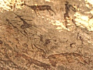

  
[Intangible Textual Heritage](../../index)  [Africa](../index.md) 
[Index](index)  [Previous](sbf76)  [Next](sbf78.md) 

------------------------------------------------------------------------

  
*Specimens of Bushman Folklore*, by W.H.I. Bleek and L.C. Lloyd,
\[1911\], at Intangible Textual Heritage

------------------------------------------------------------------------

# SIGNS MADE BY BUSHMEN IN ORDER TO SHOW IN WHICH DIRECTION THEY HAVE GONE.

They (the Bushmen) are accustomed to act thus, when another man has gone
away (and) does not return, they push their foot along the ground,\[1\] if they travel away; and they place
grass\[2\] near the marks (they have made);
and the other man does thus, when he returns, he comes (and) misses them
at the house. He looks at the house, he looks (and) looks, he perceives
the grass standing upright. And he goes to the grass, he looks at the
grass. He also perceives the grass which stands yonder.\[3\]

And he exclaims: "The people must have travelled away to the water pool
there." And he goes to the water, while he goes, looking (and) seeking
for the people, (to see) whether the people have gone to dwell at that
water.

And, he goes, ascending the water's hill;\[4\] he sits upon (it), that he may, sitting,
look, look seeking for the huts. And he perceives the huts, as the huts
stand white yonder. He sits, looking at them; the (smoke of the)
fire\[5\] rises from the huts,\[6\] as he sits looking. And he exclaims: "The

\[1. They push their foot along the ground.

2\. (They) stick grass into the bushes.

3\. There are four pieces of grass, at a distance from each other, in
the direction of the place to which the people have gone.

4\. (It) is a hill, behind which the water is.

5\. All the fires smoke.

6\. The fire is outside.\]

house must be yonder!" And he arises, he goes to the house, and,
returning, arrives ) at home.

And the other people exclaim: "Our brother must be (the one who) comes
yonder; for, he is the one who walks in this manner; for, a man of the
place (he) is, he knows the water. He would do thus, when he came past
(and) missed the house. He would come to the water which he knew. For,
ye did say that he would lose his way,\[1\]
when I said that we should travel away. Ye did say that he would lose
his way, when I wished that we should travel away, although we had not
told him about it that we should travel away; for, the water was gone.
Therefore, we travelled away on account of it."

We are used also to reverse branches.\[2\] We
thus place them, their green top is underneath, while the stump of the
branch is uppermost. And we again, we go yonder to place that branch.
And we draw our foot along the ground (making a mark), while we feel
that we shall not again go to place another branch; because we
altogether travel away.\[3\]

Therefore, the other man is wont to do thus, when he returns home (and)
misses the house.

\[1. The Bushmen are those who say, *\|\|gwi !k'u*, while the white men
are those who say, "verdwall" (i.e. verdwalen, "to lose one's way").

2\. Pierce it into the ground.

3\. I feel that I used to see nay grandfather reverse (branches).

4\. Four branches (and sometimes five) are said to be used; the first is
placed opposite to the house, the next about fifty yards distant, the
next a little further than that distance, the next rather more than
double the previous distance, and, then, no more. At the last stick, the
foot is drawn along the ground in the direction of the place to which
they go, from the last stick; which leans in the same direction.\]

He looks (about), and he espies a branch; and he exclaims: "The folk
must have travelled away to that little pool, for, this is why they have
reversed (a branch), pointing in the direction of the place where the
water is. I will go down(?) to the water, that I may go to look for the
people's footprints at the water, at the place to which they seem to
have gone to make a house,\[1\] (from which)
they go to the water." And he goes to the water, he goes down(?) to the
water. And he goes to look at the water, he espies the people's
foot-path, he takes it,\[2\] he follows it,
follows it along to the house.

\[1. Seeking for food (to dig up) is one thing; making a house is
different: "to dwell at a place."

2\. The people's footpath is that which goes along.\]

 

------------------------------------------------------------------------

[Next: A Bushman, Becoming Faint From The Sun's Heat When Returning
Home, Throws Earth Into The Air, That Those At Home May See The Dust And
Come To Help Him.](sbf78.md)

