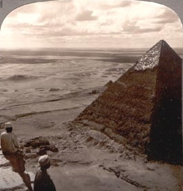

  
[Intangible Textual Heritage](../../index)  [Africa](../index) 
[Egypt](../../egy/index) 

------------------------------------------------------------------------

[Buy this Book at
Amazon.com](https://www.amazon.com/exec/obidos/ASIN/0865433623/internetsacredte)

------------------------------------------------------------------------

<table width="75%">
<colgroup>
<col style="width: 50%" />
<col style="width: 50%" />
</colgroup>
<tbody>
<tr class="odd">
<td width="50%" data-valign="TOP"></td>
<td width="50%" data-valign="CENTER"><h1 id="stolen-legacy" data-align="CENTER">Stolen Legacy</h1>
<h2 id="by-george-g.-m.-james" data-align="CENTER">by George G. M. James</h2>
<h4 id="section" data-align="CENTER">[1954]</h4></td>
</tr>
</tbody>
</table>

------------------------------------------------------------------------

[Contents](#contents)    [Start Reading](stle00)    [Page
Index](pageidx)    [Text \[Zipped\]](stle.txt.gz)

------------------------------------------------------------------------

|                                                                                                                           |
|---------------------------------------------------------------------------------------------------------------------------|
|  |

This is an afrocentric re-examination of Greek philosophy, posing the
thesis that it was, in plain, stolen from Egypt (*i.e.*, Africa). James'
theory is that classical Greek philosophy was derived from an Ancient
Egyptian mystery tradition, possibly concealing advanced scientific
knowledge that the Greeks misinterpreted. James' approach to the topic
is informed by a wide range of authorities, some
[classic](../../cla/index), others a bit more
[esoteric](../../eso/index). He makes some startling claims, *e.g.*,
that Alexander the Great and [Aristotle](../../cla/ari/index) plundered
hundreds of books from the Great Library of Alexandria, which were later
attributed to Aristotle. He is dead serious about this perceived slight
by the Greeks, and even exhorts us to boycott Greek letter fraternities.

Pioneers of the afrocentrism movement, such as James, and [Drusilla
Houston](../we/index), labored in obscurity outside the mainstream. They
were precursors of later 20th century writers such as Cheikh Anta Diop,
who advanced very similar ideas, albeit on a broader front. Today, the
substantial contribution of Africans to world civilization is better
known. These books are milestones on the path towards this
understanding.

Production notes: For once, I'd say that the
original book could have used a bit more footnotes. The blocks of
references interspersed with the text, and his tendency to use 'N.B.' as
a standalone paragraph, make it look like a set of reading notes. The
outlining is not indented in a consistent fashion, and the deeply nested
numbering of sub-sections and items is also apparently ad-hoc. However,
as is the practice, I have preserved the original text as closely as
possible. Lastly, I didn't attempt to check the spelling of the more
obscure personal names in this, and, given the number of [other
typos](errata) in the book, there may be a number of them--*J.B. Hare,
September 23rd, 2008*.

------------------------------------------------------------------------

 [Title Page](stle00)  
[Also by the Author](stle01)  
[Table of Contents](stle02)  
[Introduction](stle03)  
[The Aims of the Book](stle04)  

### Part I

[Chapter I: Greek Philosophy is Stolen Egyptian Philosophy](stle05)  
[Chapter II: So-called Greek Philosophy Was Alien To The Greeks And
Their Conditions Of Life](stle06)  
[Chapter III: Greek Philosophy Was the Offspring of The Egyptian Mystery
System](stle07)  
[Chapter IV: The Egyptians Educated the Greeks](stle08)  
[Chapter V: The Pre-Socratic Philosophers and the Teachings Ascribed to
Them](stle09)  
[Chapter VI: The Athenian Philosophers](stle10)  
[Chapter VII: The Curriculum of the Egyptian Mystery System](stle11)  
[Chapter VIII: The Memphite Theology is the Basis of all Important
Doctrines in Greek Philosophy](stle12)  

### Part II

[Social Reformation through the New Philosophy of African
Redemption](stle13)  

 

[Appendix](stle14)  
[Notes](stle15)  
[Index](stle16)  
