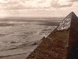

  
[Intangible Textual Heritage](../../index)  [Africa](../index) 
[Egypt](../../egy/index)  [Index](index)  [Previous](stle09) 
[Next](stle11) 

------------------------------------------------------------------------

[Buy this Book at
Amazon.com](https://www.amazon.com/exec/obidos/ASIN/0865433623/internetsacredte)

------------------------------------------------------------------------

  
*Stolen Legacy*, by George G. M. James, \[1954\], at Intangible Textual
Heritage

------------------------------------------------------------------------

p. 82 p. 83

### CHAPTER VI:

### The Athenian Philosophers.

#### 1. Socrates: (i) His Life (ii) Doctrines (iii) Summary of Conclusions.

#### (i) LIFE OF SOCRATES

\(a\) *Date and place of birth*.

Socrates was born in Athens, in the year 469 B.C. He was the son of
Sophroniscus, a sculptor, and Phaenarete, a midwife. Very little is
known about his early years; but we are told that he was brought up in
the profession of his father, and that he called himself not only a
pupil of Prodicus and Aspasia, (which statement suggests that he might
have learnt from them, music, geometry and gymnastics): but also a self
taught philosopher, according to Xenophon in the Symposium. Up to the
age of 40, his life appears to be a complete blank: the first mention
being made of him, when he served as an ordinary soldier in the sieges
of Potidaea and Delium between (432–429) B.C. (Trial and Death of
Socrates: F. J. Church: p. 15 of Introduction).

\(b\) *His economic status and personality*.

Socrates did not accept fees for what he taught, and he became so poor,
that his wife Xanthippe became very dissatisfied with domestic
conditions.

He believed that he possessed (*Daimonion Ti*) a divine something, i.e.,
a divine voice which advised and guided him in the great crises of his
life. (Turner's Hist. of Phil. p. 78–79; and Plato's Apology).

\(c\) *His Condemnation and death in 399 B.C*.

After the accustomed speeches of the accusers: (Miletus, Anytus and
Lycon); Socrates followed with his defense, at

p. 84

the conclusion of which, the judges voted 281 to 220, and Socrates was
condemned to death.

As a parting word, he addressed himself both to those who voted against
him, and those who voted in his favour. In the case of the former, he
rebuked them by predicting that evil would befall them, in consequence
of their crime in condemning him.

In the case of the latter, he not only consoled them with the assurance
that no evil could come to a good man either in life or in death; but
also expressed to them his idea about immortality. "Death is either an
eternal and dreamless sleep, wherein there is no sensation at all; or it
is a journey to another, and a better world, where are the famous men of
old". Whichever alternative be true, death is not an evil, but a good.
His death is willed by the gods, and he is content. (Plato's Apology
Chapters 25–28).

His death was delayed through a state religious ceremonial, and he
remained in prison for 30 days. We are told that during this time, he
was visited by his friends, who consisted of the inner circle, and also
his wife Xanthippe; that this was the occasion of his discourse
concerning the immortality of the soul; that he could have escaped from
death if he wished; because his friends visited him before day-break and
offered to set him free; but that he refused the offer. Accordingly
Socrates drank the hemlock and died. (Plato Phaedo;) (Xenophon
Memorabilia IV, 8, 2).

\(d\) *Crito's account:*

Crito, on the night before the death of Socrates, while he was in
prison, on behalf of the company of visitors, made a final appeal to him
to permit them to secure his escape, and spoke as follows:—

"O, my Socrates, I beseech you for the last time to listen to me and
save yourself. For to me your death will be more than a single disaster:
not only shall I lose a friend the like of whom I shall never find
again, but many persons, who do

p. 85

not know you and me well, will think that I might have saved you, if I
had been willing to spend money, but that I neglected to do so. And what
character could be more disgraceful than the character of caring more
for money than for one's friends? The world will never believe that we
were anxious to save you, but that you yourself refused to escape.

"Tell me this Socrates. Surely you are not anxious about me and your
other friends, and afraid, lest, if you escape, the informers should say
that we stole you away, and get us into trouble, and involve us in a
great deal of expense, or perhaps in the loss of all our property, and
it may be, bring some other punishment upon us besides? If you have any
fear of that kind, dismiss it.

"For of course we are bound to run those risks, and still greater risks
than those if necessary, in saving you. So do not, I beseech you, refuse
to listen to me."

Then Socrates replied: "I am anxious about that, Crito, and about much
besides," and Crito continued the appeal:—

"Then have no fear on that score. There are men who, for no very large
sum, are ready to bring you out of prison into safety, and then, you
know, these informers are cheaply bought, and there will be no need to
spend much on them.

"My fortune is at your disposal, and I think that it is sufficient, and
if you have any feeling about making use of my money, there are
strangers in Athens, whom you know, ready to use theirs, and one of
them, Simmias of Thebes, who actually brought enough for the purpose.
And Cebes and many others, are ready too.

"And therefore, I repeat, do not shrink from saving yourself, on that
ground. And do not let what. you said in court (that if you went into
exile, you would not know what to do with yourself), stand in your way:
for there are many places for you to go to, where you will be welcomed.

"If you choose to go to Thessaly, I have friends there who will make
much of you, and shelter you from any annoyance from the people of
Thessaly.

p. 86

"Consider then, Socrates; or rather the time for consideration is past;
we must resolve, and there is only one plan possible. Everything must be
done tonight. If we delay any longer, we are lost.

"O, Socrates, I implore you not to refuse to listen to me." (Plato's
Crito C. 3–5).

\(e\) *Phaedo's account of the final scene just before the death of
Socrates*.

In answer to another question from Echecrates, Phaedo replied: I will
try to tell you the whole story:—

"On the previous days, I and the others had always met in the morning at
the court, where the trial was held, which was close to the prison; and
then we would go in to Socrates.

"We used to wait each morning until the prison was opened, conversing;
for it was not opened early. When it was opened we used to go in to
Socrates, and we generally spent the whole day with him. But on that
morning we met earlier than usual, for the evening before we had learnt,
on leaving the prison, that the ship had arrived from Delos. So we
arranged to be at the usual place as early as possible. When we reached
the prison, the porter, who generally let us in came out to us and bade
us wait a little, and not to go in until he himself summoned us; for the
'Eleven' were releasing Socrates from his fetters and giving him
directions for his death.

"In no great while he returned and bade us enter. So we went in and
found Socrates just released. When Xanthippe saw us, she wailed aloud,
and cried in her woman's way: 'This is the last time: Socrates, that you
will talk with your friends, or they with you.' And Socrates glanced at
Crito and said, 'Crito, let her be taken home'. So some of Crito's
servants led her away; weeping bitterly and beating her breasts. And it
was about sunset, and the servant of the Eleven after bidding Socrates
farewell, gave him the instructions as to how to take the poison, and
then handed it to him. Socrates took the cup, and drank the poison
cheerfully, and then walked about until

p. 87

his legs felt heavy. And when he had lain down, he made his last request
to Crito in the following words: I owe a cock to Asclepius, do not
forget to pay it. By this time the poison took effect and he passed
away." (Plato Phaedo C. 3 and 65).

\(ii\) THE DOCTRINES OF SOCRATES

i\. *The doctrine of Nous*, i.e., mind or an Intelligent Cause, in order
to account for God and Creation. He is credited with the teleological
premise: whatever exists for a useful purpose is the work of an
Intelligence. (Xenophon Memorabilia I, 4, 2; Wm. Turner's Hist. of Phil.
p. 82).

ii\. *The doctrine of the Supreme Good:*—

The Supreme good i.e., the summum bonum is equated both with happiness
and with knowledge. This however is not merely *eutuchia* which depends
upon external conditions and accidents of fortune; but is (*eupraxia*),
a well-being, which is conditioned by good action. This is an attainment
in which man becomes godlike through self denial of external needs and
the cultivation of the mind: for happiness comes not through the
perishable things of the external world, but through the things that
endure, which are within us. (Xenophon Memorabilia I, 5, 4.) Wm.
Turner's Hist. of Phil. p. 83).

iii\. *The doctrines of opposites and harmony:*

\(a\) *Odd and even are the elements of numbers*. One is definite but
the other is unlimited, and the unit is the product both of odd and
even. Hence the universe consists of opposites: the finite and the
infinite, the male and the female; the odd and the even; the left and
right.

\(b\) *Harmony is the union of opposites*.

(Plato's Phaedo C. 15; Wm. Turner's Hist. of Phil. p. 41; 47).

(Zeller's Hist. of Phil. p. 61).

iv\. *The Doctrines Concerning the Soul:*

\(a\) The immortality of the Soul

\(b\) The transmigration of the Soul

p. 88

\(c\) The Salvation of the Soul:—

The purpose of philosophy is the salvation of the Soul, whereby it feeds
upon the truth congenial to its divine nature, and thus escapes from the
wheel of re-birth, and finally attains the consummation of unity with
God. (Zeller's Hist. of Phil. p. 50–56; Roger's Hist. of Phil. p. 29 and
60; Wm. Turner's Hist. of Phil. p. 41 and 48).

\(d\) The body is the tomb of the Soul

\(e\) The aspirations of the Soul:—

There is a realm of true reality, which is above the world of sense. To
this the Soul aspires.

v\. *The doctrine of Self-knowledge: Know thyself* (*seauton gnothi*).

Self-knowledge is the basis of true knowledge. The Mysteries required as
a first step, the mastery of the passions, which made room for the
occupation of unlimited powers. Hence, as a second step, the Neophyte
was required to search within himself for the new powers which had taken
possession of him. The Egyptians consequently wrote on their temples:
"Man, know thyself". (Zeller's Hist. of Phil. p. 105; S. Clymer's Fire
Philosophy p. 203).

vi\. *Astrology and Geology:*

There was a suspicion that Socrates was also engaged in the study of
Astrology and Geology, and that he taught these subjects, for in his
defense before the Athenian judges, he stated that the more formidable
of his accusers tried to persuade them with lies, that one Socrates, a
wise man, was speculating about the heavens and about things beneath the
earth, and that he was capable of making the worse appear the better
reason. (Plato's Apology C. 2).

This suspicion is further supported by the indictment brought against
Socrates, and which reads as follows:—"Miletus, the son of Miletus, of
the deme Pitthis, on his oath,

p. 89

brings the following accusation against Socrates, the son of
Sophroniscus, of the deme Alopece.

"Socrates commits a crime by not believing in the gods of the city, and
by introducing new divinities. He also commits a crime by corrupting the
youth. Penalty, death."

(Plato's Apology C. 24; C. 18 and 19).

There is still a third source from which the suspicion arose that
Socrates was engaged also in Astrology and Geology. This was the
caricature of Socrates, published by Aristophanes in his comedy: the
Clouds, as follows:—

"Socrates is a miserable recluse, who speaks a great deal of absurd and
amusing nonsense about Physics, and declares that Zeus is dethroned,
that Rotation reigns in his stead, and that the new divinities are Air,
which holds the earth suspended, Ether, the Clouds and Tongue.

"He professes to possess the power of Belial, which enables him to make
the worse appear the better reason, and his teachings cause children to
beat their parents."

(Aristophanes Clouds, 828 and 380; Life and Trial of Socrates; F. J.
Church: Introduction p. 18).

\(iii\) *Summary of Conclusions*.

1\. *Life and Personality of Socrates.*

There are two circumstances in the life of Socrates which demand our
attention: (a) he is said to have been completely unknown up to the age
of 40 and (b) to have lived a life of poverty. These circumstances point
to secrecy in training, and poverty as conditions of his life; and as
such, they coincide with the requirements of the Mystery System of
Egypt, and her secret schools, whether in the land of Egypt or abroad,
which exacted the vows of secrecy and poverty from all Neophytes and
Initiates. All aspirants of the Mysteries had to receive secret training
and preparation, and Socrates was no exception. He alone of the three
Athenian philosophers deserves the appellation of a true Master Mason.
Plato was a

p. 90

great coward and Aristotle was greater still. At the execution of
Socrates, Plato fled to Megara to the lodge of Euclid, and Aristotle
when indicted fled in exile to Calchis.

(Clement of Alexandria: Stromata Bk. 5. C. 7 and 9; Plutarch on "Isis
and Osiris" Sec. 9–11; Plato's Apology C. 8; 17; Phaedo C. 10; 13; 32;
63).

2\. *The Doctrines:*—

\(i\) *The doctrine of the Nous or an Intelligent Cause*.

With reference to this doctrine, we find that it is also credited to
Anaxagoras, who is said to have lived between 500 and 430 B.C. and who
therefore antedated Socrates (469–399 B.C.) in expounding it (Wm.
Turner's Hist. of Phil. p. 63; p. 82).

Secondly, further examination shows that the doctrine of the Nous is
also a direct inference from the doctrine of Cognition, as credited to
Democritus (460–360 B.C.), who is credited with stating that fire atoms
are distributed through the universe, and that mind is composed of fire
atoms.

Therefore it can be inferred (a) that mind fills or is distributed
through the universe and (b) since only like can produce like, then the
mind of the Universe must have been produced by a mind which is its
source.

(Wm. Turner's Hist. of Phil. p. 68; Zeller's Hist. of Phil. p. 80).

Thirdly, this doctrine of the Nous, is a doctrine that originated from
the Ancient Mysteries of Egypt, where the God Osiris was represented in
all Egyptian temples by the symbol of an Open Eye. This symbol indicated
not only sight that transcends time and space, but also the omniscience
of God, as the Great Mind which created and which directs the Universe.
This symbol is carried as a decoration in all modern Masonic lodges and
has the same meaning. (Ancient Mysteries: C. H. Vail p. 189).

p. 91

\(ii\) *The doctrine of the Supreme Good:*—

This doctrine of the Supreme Good or Summum Bonum is likewise a very
ancient doctrine which takes us back to the Egyptian Mysteries.

As stated in the books on Greek philosophy and by Socrates, it is only
in part, and consequently a mistaken notion of the original doctrine has
resulted. To say that the supreme good is happiness, that happiness is
well-being, that well-being is knowledge, and that knowledge is virtue,
is the same thing as saying that the Supreme Good is virtue.

(Xenophon Memorabilia I 4, 5; Wm. Turner's Hist. of Phil. p. 81–83).

In the Egyptian Mysteries, however, the concept of the Supreme Good is
expressed as the purpose of virtue, and that is the salvation of the
Soul, by liberating it from the ten bodily fetters. This process of
liberation is a process of purification both of mind and of body: the
former by the study of philosophy and science, and the latter by bodily
ascetic disciplines. This training was continued from the baptism of
water, and was subsequently followed by the baptism of fire, when the
candidate had made the necessary progress. This process transformed man
and made him godlike, and fitted him for union with God.

The concept of the Supreme Good, which originally came from the Egyptian
Mysteries is the earliest theory of salvation: and Socrates must have
derived this doctrine from that source, or indirectly from the
Pythagoreans.

(Plato's Phaedo C. 31; 33–34; Ancient Mysteries, C. H. Vail p. 24–25;
Fire Philosophy, R. S. Clymer p. 19; 74; 80).

\(iii\) *The following doctrines are generally admitted as having been
derived from the Pythagoreans:*

\(a\) Transmigration of the Soul

\(b\) The immortality of the Soul

\(c\) The tomb of the Soul is the body.

p. 92

\(d\) The doctrines of opposites and harmony.

Since doctrines (a), (b), (c) and (d) originated from the Pythagoreans,
and since the Pythagoreans derived them from the Egyptians, then their
Egyptian origin, [directly](errata.htm#4) or indirectly becomes evident.

(Roger's Hist. of Phil. p. 29 and 60; Turner's Hist. of Phil. p. 41 and
48; Plato's Phaedo).

\(iv\) *Astrology and Geology:*

From (a) the indictment (b) his defense before the Athenian Judges and
(c) the caricature by Aristophanes in the Clouds, we discover that
Socrates was suspected of being a student of Nature, and of introducing
new divinities into Athens.

Again it must be stated, that under the Mystery System of Egypt, the
study of Nature was a requirement, and since the Athenians prosecuted
and condemned Socrates to death, for engaging in this study and
spreading the knowledge, they must have regarded the new ideas as
foreign or of Egyptian origin.

(Plato's Apology C. 24–28; Ancient Mysteries, C. H. Vail p. 24–25).

\(v\) *The Doctrine of Self-knowledge:*

The doctrine of self-knowledge, for centuries attributed to Socrates is
now definitely known to have originated from the Egyptian Temples, on
the outside of which the words "Man, know thyself" were written.

It is evident that Socrates taught nothing new, because his doctrines
are eclectic containing elements from Anaxagoras, Democritus,
Heraclitus, Parmenides and Pythagoras, and finally have been traced to
the teachings of the Egyptian Mystery System.

(Fire Philosophy, S. R. Clymer p. 203).

vi\) *The importance of the farewell conversations of Socrates with his
pupils and friends at the prison:*

p. 93

In examining what took place during the farewell conversations of
Socrates with his pupils and friends, at least five points should be
noted:—

\(a\) The subject of the Conversations

\(b\) The determination of his friends to smuggle him away

\(c\) His refusal to accept liberation

\(d\) His dying request, which was addressed to Crito, whom he asked to
pay an important debt for him

\(e\) The value of those conversations, in their present form in
literature.

Now the question arises, what is the meaning and significance of these
five points? The answers and conclusions are as follows:—

\(a\) As the subject of the conversations dealt with the immortality and
salvation of the Soul, we at once recognize the fact that this was the
central theme of the Ancient Mysteries, and consequently that Socrates
was acquainted with the doctrines.

Moreover, when we read the Phaedo and the doctrines, both of Opposites
and Recollection which he had advanced in proof of immortality, we are
convinced that he must have received his training from the Mystery
System of Egypt, in connection with which there were Hierophants and
qualified teachers.

\(b\) Secondly, in dealing with the behavior of his friends, in their
determination to smuggle him away, we are dealing with their attempt to
render help to a brother in distress.

This was the life that Initiates were expected to live, for brotherhood
was another great principle upon which, the Egyptian Mysteries laid
emphasis. Evidently, Socrates was a "Brother Initiate" of the Egyptian
Mysteries, since it comprised one universal brotherhood.

\(c\) Thirdly, in dealing with the refusal of Socrates to accept
liberation, again we are dealing with a type of behaviour, which singles
him out as an advanced Initiate of the Ancient Mysteries of Egypt. In
the paths to mastery and victory, the

p. 94

\[paragraph continues\] Mystery System
regarded unselfishness or sacrifice as an advanced stage of attainment,
which must be accomplished before unlimited power could be bestowed upon
the candidate. It is true that Anaxagoras escaped for his life and in
like manner Plato and Aristotle; but this only serves to show that
Socrates had reached a higher degree in the Mysteries than all of them.
This necessitated training and the training centre was Egypt.

\(d\) Fourthly, with reference to the dying request of Socrates,
addressed to Crito, in which he asked him to pay a certain debt, we
again encounter another of the great ideals essential to the life of an
Initiate. This in the teaching of the Mysteries embraces the exercise of
a cardinal virtue i.e., justice; a practice which the Candidate must
adopt, in order that his sense of value might also develop.

Here again the action of Socrates reveals that he was a Brother
Initiate, with a high sense of justice and honesty, since he did not
wish to die without discharging all his obligations. Certainly, the
dying request of Socrates reveals him as a loyal member of the Mystery
System of Egypt.

\(e\) Fifthly and finally, what value may we attach to the literature
which deals with the farewell conversations of Socrates with his friends
and pupils? Since this literature embraces a man whose beliefs and
practices coincide with those of the Initiates of the Ancient Mysteries
of Egypt, then we may regard the study of Xenophon's Memorabilia,
Plato's Apology, the Phaedo, Euthyphro, Crito and Timaeus as valuable
specimens of literature of the Mysteries, or Masonic World.

(Ancient Mysteries; C. H. Vail C. 24–25; also C. 32).

(The Phaedo of Plato; The Timaeus of Plato).

(R. S. Clymer; Fire Philosophy C. 44; 49; 67; 75).

#### 2. Plato: (i) Early Life (ii) Travels (iii) Disputed Writings (iv) His Doctrines (v) Summary of Conclusions.

\(i\) *His Early Life:*

Plato is said to have been born at Athens in 427 B.C., and

p. 95

that his father's name was Aristo, and his mother's name was Perictione,
who was a relative of Solon.

Little information is known about his early life and training: but there
is a supposition that because his parents were wealthy, he must have had
such educational opportunities as were available to a wealthy youth. He
is said to have studied the doctrines of Heraclitus under Cratylus, and
to have been a pupil of Socrates for eight years. It is also said that
he was a soldier. (Roger's Student Hist. of Philosophy p. 76) (Wm.
Turner's Hist. of Philosophy p. 93) (Will. Durant's Story of Phil.)

\(ii\) (a) *His Travels:*

He was 28 years old, when Socrates died (i.e., 399 B.C.), and together
with the other pupils of Socrates, he fled from Athens to Euclid at
Megara for Safety. He kept away from Athens for 12 years, during which
time, it is also said that apart from visiting Euclid, he travelled (a)
to Southern Italy where he met the remnant of Pythagoreans, (b) to
Syracuse in Sicily, where, through Dion, he met Dionysius to whom he
became a Tutor: who subsequently caused him to be sold as a slave, and
(c) to Egypt.

(Fuller's Hist. of Philosophy) (Roger's Student's Hist. of Philosophy)
(Wm. Turner's Hist. of Phil. p. 94) (Diogenes Laertius Bk. III, p. 277).

\(ii\) (b) *His Academy*

Plato is said to have returned to Athens in 387 B.C. when a middle aged
man of 40 years and to have opened an Academy in a gymnasium on the
western suburbs of Athens over which he presided for 20 years. He is
said to have taught the following subjects (a) Political Science (b)
Statesmanship (c) Mathematics (d) Dialectics, and it is said that the
curriculum was based upon the educational principles advocated in the
Republic.

(Fuller's Hist. of Philosophy: Plato's Life) (B. D. Alexander's Hist. of
Philosophy p. 68) (Roger's Students Hist. of

p. 96

\[paragraph continues\] Philosophy p. 72)
(Wm. Turner's Hist. of Philosophy p. 122123).

\(iii\) *His Writings are disputed and doubted by modern scholarship*.

*There are 36 dialogues and a number of letters, which Plato is supposed
to have written: but which are disputed and doubted by modern
scholarship*.

\(a\) Grote states that Plato has written only those dialogues that bear
his name.

\(b\) Schaarsmidt states that only nine of the 36 dialogues are genuine
while

\(c\) Aristotle considered the Platonic dialogues as nine in number,
namely The Laws, Timaeus, Phaedo, Symposium, Phaedrus, Georgias,
Theaetus, Philebus and the Republic, which he thought are genuine.

\(d\) Of the remaining 27 dialogues some scholars contend that the
youthful dialogues should be included with the genuine ones, and these
are the Apology, Crito, Enthydemus, Laches, Lysis and Protagoras, and

\(e\) Of the remaining 21 dialogues scholars suggest that those which
were not written by Plato must have been written by his pupils (B. D.
Alexander's Hist. of Phil. p. 68).

\(iv\) THE DOCTRINES OF PLATO:

The doctrines attributed to Plato are scattered over a wide area of
literature: being found in piecemeal throughout what are called
dialogues; but particularly in connection with

\(I\) the theory of ideas and its application to natural phenomena which
includes the doctrines of (a) the real and unreal (b) the Nous (mind)
and (c) Creation.

\(II\) the ethical doctrines concerning (A) the highest good (B)
definition of virtue and (C) the cardinal virtues.

p. 97

\(III\) the doctrine of the Ideal State whose attributes are compared
with the attributes of the soul and justice. Following this order, they
are as follows:

\(I\) *The Theory of Ideas*

A. *Definition of Ideas*. This may be expressed in the following
syllogism:

The idea (retaining its unity, unchangeableness and perfection) is the
element of reality in a thing.

The idea is the concept by which a thing is known. Therefore the concept
by which a thing is known is the element of reality in a thing (*To
on*).

It follows also, that since the concept or idea of a thing is real, then
the concrete thing itself is unreal.

(Timaeus 51) (Phaedrus 247).

B. *The application of the theory of Ideas to natural Phenomena*.

In view of the definition of the Idea, three doctrines have resulted:—

\(a\) *The doctrine of the real and unreal*.

The things which we see around us are the phenomena of nature, they
belong to the earthly realm, they are only copies (*Eidola*) of their
prototypes (*paradeigmata*), the Ideas and noumena, which dwell in the
heavenly realm. The Ideas are real and perfect, but the phenomena are
unreal and imperfect; and it is the function of philosophy to enable the
mind to rise above the contemplation of the visible copies of Ideas, and
advance to a knowledge of the Ideas themselves. (The Phaedrus 250).

There is however, something common between them, because the phenomena
partake of the Idea (*metechei*). This participation is an imitation
(*mimesis*), but it is so imperfect that natural phenomena fall far
short of Ideas.

(Parmenides 132 D) (Aristotle's Metaphysics I, 6; 987b, 9).

p. 98

\(b\) *The doctrine of the Nous or World Soul*.

This teaches that the universe are living animals and that they are
endowed with the most perfect and intelligent souls; that if God had
made the world as perfect as the nature of matter allowed, that He must
have endowed it with a perfect soul. This soul acts as mediator between
the Ideas and natural phenomena, and is the cause of life, motion,
order, and knowledge in the universe. (Timaeus, 30, 35).

\(c\) *The doctrine of a Demiurgos in Creation* (*Cosmology*)

In the myth of creation found in the Timaeus, we find the doctrine on
Creation, as it is ascribed to Plato's authorship, as follows:—

Out of chaos, which was ruled by necessity, God the Demiurgos or
Creator, made order, by fashioning the phenomena of matter according to
the eternal prototypes (i.e., the Ideas) in as perfect a manner, as the
imperfection of matter would allow. He next created the Gods, and
ordered them to fashion the body of man, while He himself, made the soul
of man, from the same material as that of the world soul.

The soul of man is a self-moving principle and is responsible for life,
motion and consciousness in the body.

(Myth of creation in Timaeus; Wm. Turner's Hist. of Philosophy, p.
109–110).

\(II\) *The Ethical Doctrines*

The ethical doctrines that have been attributed to Plato are (A) that of
the highest good, i.e., the Summum Bonum (B) the connotation of virtue
and (C) the reduction of the virtues to four and the place of wisdom
among them (A) as something subjective, and as an earthly experience,
the highest good is happiness: but as an objective attainment, it is the
Idea of good, and consequently identified with God.

Therefore the purpose of man's life is freedom from the fetters of the
body, in which the soul is confined, and the practice of virtue and
wisdom, makes him like a God, even while on earth.

p. 99

\(B\) and (C)

Virtue is the order, the health and the harmony of the soul.

There are many virtues, but the greatest is wisdom. All virtues may be
reduced to the four cardinal virtues: wisdom, fortitude, temperance and
justice.

(Symposium 204E); (Theaetetus 176A); (Phaedo 64 sqq.) (The Republic IV,
441, 443).

\(III\) *The Ideal State* (*The Republic*)

The doctrine attributed to Plato in the field of civics is the doctrine
of the Ideal state whose attributes are compared with the attributes of
the soul and justice.

In a state, virtue should be the chief aim, and unless philosophers
become rulers, or rulers become thorough students of philosophy, there
will be unceasing troubles for states and humanity at large. The Ideal
state is modelled upon the individual soul, and just as the soul has
three parts, so also should the state have three parts: the rulers, the
warriors, and the workers.

(Republic VI, 490 sqq.; V, 478; III, 415).

Similarly, just as the harmony of the soul depends upon the proper
subordination of its parts, so also does the state depend upon the
proper subordination of its parts, in order to enjoy peace.

Here Plato introduces the allegory of the charioteer and the winged
steeds, in order to show that virtue is to the soul as justice is to the
state:—One horse is of noble origin: while the other is ignoble; and
consequently they cannot agree. As the noble horse strives to mount up
to the heavenly regions which are suitable to its nature: so the other
tries to drag him down. Likewise in dealing with the soul, it is the
proper subordination of its parts, that enables the noble in man to
attain its excellence; so also in dealing with the state, it is justice,
or the proper subordination of the different classes, that makes it an
Ideal State.

(Roger's Students Hist. of. Phil. p. 83); (Plato's Republic).

p. 100

\(v\) SUMMARY OF CONCLUSIONS.

The doctrines of Plato are eclectic and point to Egyptian origin.

1\. The doctrine of the real and unreal to represent doctrine found in
the comparison between natural phenomena and the Ideas, is only an
instance of the application of the doctrine of opposites. Here the
things of this world have their corresponding types in the heavenly
realm; here the Ideas correspond to Being, while the natural phenomena
correspond to not-Being. But the doctrine of opposites may be traced
back not only to Socrates, Democritus, Parmenides and the Pythagoreans,
but further back to its original source, i.e., the Egyptian Mystery
System, where the principle of opposites was represented not only by
pairs of male and female Gods, such as Osiris and Isis, but also by
pairs of pillars in the front of all the Egyptian temples.

(Memphite Theology in Kingship and the Gods, by Frankfort, C. 3, p.
25–26 and 35).

(Herodotus I, 6–26) (Ancient Egypt by John Kendrick, Bk. I, p. 339).

(Egyptian Religion by Frankfort, p. 64, 73, 88). (Zeller's Hist. of
Phil. p. 61).

(The Phaedo C. 15, 16, 49).

II\. *The doctrine of the Nous or World Soul is a principle of Egyptian
magic:*

Plato is credited with expressing this doctrine in the form of a simile,
in which he compares the world to a living animal, which is composed of
Souls. One being made perfect and responsible for the life, motion and
knowledge of the animal or universe.

This doctrine may be traced not only to (a) Democritus who based his
teaching about the fire atoms of the soul, and cognition upon the
magical principle of the Egyptians: "that the qualities of an animal are
distributed throughout its parts."

p. 101

(Golden Bough by Frazer) (Hist. of Phil., B. D. Alexander, p. 40).

(Wm. Turner, Hist. of Phil., p. 68), but also to (b) Anaxagoras, who is
said to have advanced the Nous (mind) as responsible for creating order
out of chaos, and which is omnipotent and omniscient.

(History of Philosophy, Wm. Turner, p. 63).

The doctrine of the *Nous* as a matter of fact, originated from (c) the
Mystery System of Egypt, in connection with which, the God Osiris was
represented in all Egyptian temples, by the symbol of an Open Eye,
referred to elsewhere.

This symbol indicated not only sight that transcended space and time:
but also omniscience, as the Great Mind which created and which still
directs the universe. This symbol also forms a part of the decoration of
all Masonic lodges of the modern world and dates back to the Osirian or
Sun worship of the Egyptians more than 5000 B.C. This same notion was
also represented by the Egyptians by a God with eyes all over Him and
was known as the "All seeing Eye."

(Zeller's Hist. of Phil., p. 809).

(The Ancient Mysteries, C. H. Vail, p. 189)

(Max Muller: Egyptian Mythology).

III\. *The doctrine of the Demiurge in Creation*.

This doctrine which is ascribed to the authorship of Plato, did not by
any means originate from Plato. It was not only a current doctrine at
the time of Plato, but was well known among the Eastern Ancient nations
and taught by them many centuries before his time (427–347 B.C.).

History tells us that the Persians taught this doctrine more than six
centuries B.C. through their leader Zoroaster. History also tells us
that Pythagoras (500 B.C.), taught the same doctrine expressed in terms
of Monads. The universe consisted of two unities, i.e., (a) the Unity
from which the series of numbers or beings is derived, being absolute
Unity, which

p. 102

is the source of all, i.e., the Monad of Monads or the God of Gods and
(b) the One, i.e., the first in the series of derived numbers or beings.
It is opposed to and limited by plurality, and therefore it is relative
unity, i.e., a created Monad or God (a *Demiurge*), consequently the
opposition between the One and the many is the source of all the rest.
Furthermore, history likewise tells us that the original source of the
doctrine of a Demiurge in creation was Egypt, and it dates back to the
creation story of Egypt 4000 B.C. which is to be found in the account
given by the Memphite Theology: an inscription on a stone, now kept in
the British Museum. It contains the theological and cosmological views
of the Egyptians which date back to the very beginning of Egyptian
history, when the first dynasties had made their new capital at Memphis,
the city of the God Ptah, i.e., about 4000 B.C., or even earlier.

The Egyptian cosmology must be presented in three parts; each part being
supplementary to the other, and presenting a complete philosophy by
their combination. Part (I) deals with the Gods of chaos, part (II)
deals with the Gods of order and arrangement in creation, and part (III)
deals with the Primate of the Gods, through whose *Logos* creation was
accomplished. In part (I) pre-creation or chaos is represented by (i)
Ptah, the Primate of the Gods, emerging from the primeval waters Nun in
the form of a Hill, Ta-tjenen, i.e., The Risen Land (ii) Atum, i.e.,
Atom, the sun God, immediately joining Ptah, by emerging also from the
chaotic waters Nun, and sitting upon him (the Hill).

\(iii\) A description of the other qualities within the chaos
follows:—There are four pairs of male and female Gods in the form of
frogs and serpents. Their names are (a) Nun and Naunet, the primeval
ocean and primeval matter; (b) Huh and Hauhet, the Illimitable and the
Boundless, (c) Kuk and Kauket, Darkness and Obscurity; and (d) Amon and
Amaunet, the Hidden and concealed ones. (Memphite Theology in Ancient
Egyptian Religion by Frankfort, p. 10, p. 21; Frankfort's Intellectual
Adventure of Man, p. 10, 21, 52).

p. 103

In part (II) the Gods of order and arrangement are represented as
follows:—

The same first pair of pre-creation Gods are together present, i.e.,
Ptah, the primeval Hill, who is the thought and word of all the Gods,
together with Atum, who rests upon Ptah.

Atum, i.e., Atom, having absorbed the thought and creative power of
Ptah, then proceeds with the work of Creation. He names four pairs of
parts of his own body, which become Gods, and in this way, eight Gods
are created, who together with himself become nine Gods in one family or
Godhead, called the Ennead.

N.B.

*Magic is the key to the [interpretation](errata.htm#5) of ancient
religions and philosophy*.

\(a\) Part (III) tells of the specific powers of Ptah, which Atum
absorbs, but does not tell us how He absorbs them.

\(b\) Part (I) tells us how, for it describes the movement of Atum, as
emerging from the primeval waters, and sitting upon Ptah (the risen land
or hill). It however does not give us the reason for Atum's movement: a
behavior which can be understood, only when we apply to its
interpretation, the key of magical principles.

\(c\) *The Magical Principle*

Now, what is the magical principle involved in Atum's behavior? It is
this:—

"*The qualities or attributes of entities, human or divine, are
distributed throughout their various parts, and contact with such
entities, releases those qualities*."

\(d\) It is now clear that by making contact with Ptah, Atum immediately
received the attributes of Ptah's creative thought and speech and
omnipotence and became the instrument and the Logos and the Demiurge,
through whom the task of creation was undertaken and completed.

(Dr. Frazer's Golden Bough).

p. 104

\(e\) It is also clear that according to the Memphite Theology, the
doctrines of a Demiurge and created Gods originated from the Egyptian
religion and Mystery System, and not from Plato who lived from 427 to
347 B.C.

(Ancient Egyptian Religion: Memphite Theology by Frankfort, p. 20 and
23).

(Intellectual Adventure of Ancient Man, by Frankfort, p. 21, and 51–60).

(The Egyptian Book of the Dead, c. 17).

(The Golden Bough, by Dr. Frazer—on Magic).

(The Mediterranean World, by Sandford, p. 182).

(History of Philosophy, by Weber, p. 21–22).

(The Cure of the woman who touched the hem of Christ's garment: Mark,
chapter 5, verses 25–34).

(The cure of several people who held the kerchiefs of St. Paul: Acts,
chapter 19, verse 12).

N.B.

The Memphite Theology will be dealt with in a separate chapter to show
the origin of Greek Philosophy.

IV\. *The doctrines of* (A) *the highest good* (B) *virtue and* (C) *the
cardinal virtues*.

N.B.

This is really the earliest theory of salvation and it originated from
the Egyptian Mysteries but not from Plato.

\(A\) The main purpose of the Egyptian Mysteries was the salvation of
the human soul. The Egyptians believed the human body to be a prison
house, where the soul is chained by ten fetters. This condition not only
kept man separated from God, but made him subject to the wheel of
re-birth or re-incarnation.

In order to escape from the effects of his condition, two requirements
had to be fulfilled by the Neophyte:—

\(i\) He must keep the Ten Commandments taught by the Mysteries, for by
such a discipline, he would gain conquest

p. 105

over the fetters of the soul, and liberate it, so as to make its
development possible, and

\(ii\) he now being well qualified and duly prepared, must undergo a
series of initiations, in order to develop his soul from the human stage
to that of a God. Such a transformation was known as salvation. It
placed the Neophyte in harmony with nature, man and God. It deified him,
i.e., made him become godlike; and this attainment was known as the
highest good.

According to this theory of salvation, man is expected to work out his
own salvation, without a mediator between himself and his God.

\(B\) Plato defines virtue as the order or discipline of the soul. This
meaning we accept, since it agrees with the purpose of the ten
commandments of the Mysteries.

The doctrines of the ten virtues and the ten fetters are as old as the
Egyptian history itself. Each commandment or discipline represented a
principle of virtue, and the function of each virtue was to remove a
fetter. Hence a life of virtue was antecedent and preparatory to those
further experiences, i.e., the initiations which led to gradual
perfection and the divinity of the Neophyte.

\(C\) Plato is also credited with having reduced all virtues to four
cardinal virtues, and with assigning the highest place among them to
wisdom, as follows:—wisdom, fortitude, temperance and justice.

We are also informed through the history of philosophy, that Socrates,
the alleged teacher of Plato, taught that wisdom was the equivalent of
all virtue. This divergence of opinion between pupil and teacher is
significant, since it points to the fact that both of them simply
speculated about a system of Ethics which was current in the ancient
world, and which neither of them had produced.

This system of Ethics as has already been mentioned belonged to the
Mystery System of Egypt, which required Neophytes in preparation for
initiation, to keep the following ten

p. 106

commandments, underlying which were ten principles of virtue:—

The Neophyte must (I) control his thoughts (II) control his actions
(III) have devotion of purpose (IV) have faith in the ability of his
master to teach him the truth (V) have faith in himself to assimilate
the truth (VI) have faith in himself to wield the truth (VII) be free
from resentment under the experience of persecution (VIII) be free from
resentment under experience of wrong, (IX) cultivate the ability to
distinguish between right and wrong and (X) cultivate the ability to
distinguish between the real and the unreal (he must have a sense of
values).

If we now compare the order in the above outline with the order in which
the cardinal virtues are said to be arranged, we shall immediately see
that the first place which wisdom occupies among the virtues was given
to it by the Egyptian Mysteries, and not by Plato. Consequently in (I)
and (II) from the control of thoughts and actions, we derive the virtue
of wisdom; in (VI) from freedom of resentment under persecution, we
derive the virtue of fortitude; in (IX) and (X) from an ability to
distinguish between right and wrong, and between the real and unreal, we
derive the virtues of justice and temperance.

(Plato's Republic, c. IV, 44, and 443).

(Ancient Mysteries by C. H. Vail, p. 25 also 109–112).

(Wm. Turner's History of Philosophy, p. 115).

(Zeller's History of Philosophy, p. 155–157).

V. (A) *The doctrine of the Ideal State*.

Concerning the authorship and source of this doctrine, there are two
conclusions: First, Plato was not the author of the Republic and second,
the allegory of the charioteer and winged steeds, is not a product of
Plato, but is derived from the Egyptian Book of the Dead, in the
Judgment Drama.

Concerning the first conclusion it is only necessary to reaffirm what
has already been stated in connection with the

p. 107

writings of Plato, and that is that they are disputed not only by such
modern scholars as Grote and Schaarsmidt, but also by ancient
historians: Diogenes Laertius, Aristoxenus and Favorinus (80–150 A.D.),
who declare that the subject matter of the Republic was found in the
controversies written by Protagoras (481–411 B.C.) at the time of whose
death Plato was but a boy.

Furthermore, the authorship of Plato rests only upon the opinions of
Aristotle and Theophrastus, both of whose aims were the compilation of a
Greek philosophy with Egyptian material.

(Diogenes Laertius, p. 311 and 327; Aristotle Metaphysics Bk. I).

(Zeller's History of Philosophy; Introduction, p. 8 and 13; Wm. Turner's
History of Philosophy, p. 95).

Concerning the second conclusion, it must be pointed out that the
allegory of the "Charioteer and the winged steeds" is a description of
the quality and destiny of the soul as it appears at the bar of justice,
in the Judgment Drama of the Egyptian Book of the Dead. In this Drama,
the Great Chief Justice and President of the Unseen World,
Pethempamenthes, i.e., Osiris is seated on a throne, and is attended by
the Goddesses Isis and Nephthys, while 42 assistant judges are seated
around.

Near Osiris there are four genii of Amenthe, the Unseen World,
represented as short vases, called canopi, in which the different
viscera, symbolizing the moral qualities of the individual, are kept
embalmed. The intestines hive a very important connection with the moral
qualities of the individual since they are blamed for any sin which the
individual commits. At the opposite end the deceased is introduced by
Horus, while in the centre stands the Scale of Justice which has been
erected by Anubis. On one side of it, there appears a heart-shaped vase
containing the moral qualities of the deceased, while on the other side,
there is a figure of the Goddess of Truth. Toth,

p. 108

the scribe, holding a roll of papyrus, stands by and makes a record of
the weighing. After this is completed, Horus receives the record from
Toth and advances to Osiris to make known the results. Osiris listens
and at the end of the report, pronountes sentence of reward or
punishment. In the meantime, fearful monsters lurk around the scene to
destroy the soul, if the verdict is against it.

Let us observe that

\(1\) the motion of the scale in the Judgment Drama corresponds with the
up and down motion of the winged steeds of the allegory

\(2\) the opposite qualities weighed on the scale correspond with the
opposite qualities possessed by the noble and ignoble steeds of the
allegory

\(3\) the idea of justice symbolized by the scale of Judgment Drama,
corresponds with the idea of justice expressed in the allegory.

\(4\) The winged steeds corresponds with the monsters of the judgment
drama.

\(B\) *The Authorship of the Republic*.

According to Diogenes Laertius book III and pages 311 and 327, it is
stated both by Aristoxenus and Favorinus, that nearly the whole of the
subject matter of Plato's Republic was found in the Controversies,
written by Protagoras. Furthermore, according to Roger's Students
History of Philosophy p. 78, it is stated that although Plato might have
drawn heavily upon the reminiscences of Socrates, whose lectures he
attended: yet the subject matter of the Republic is a more carefully
reasoned system of philosophy, than can be easily attributed to
Socrates. 'That the whole volume is a cumulative argument into which
there are subtly interwoven opinions on almost every subject of
philosophical importance.

It is obvious that modern scholarship doubts that Plato drew the subject
matter of the Republic from

p. 109

\[paragraph continues\] Socrates, and is
inclined to attribute authorship to Plato himself. If however, we take
into consideration the fact that the subject matter of the Republic was
in circulation long before the time of Plato: for Protagoras is supposed
to have lived from 481–411 B.C. and Plato, from 427–347 B.C., reason
forbids the assignment of the authorship to Plato.

But the important question remains: From what source did Protagoras draw
the ideas of the Republic which were circulated in the Controversies?

Text books on Greek philosophy tell us that Protagoras was a pupil of
Democritus; but when we turn to the writings of Democritus we are unable
to discover any connection between them and the (a) educational system
and the (b) paternal government which are advocated in the Republic.

This fact forces us to the conclusion that the subject matter of Plato's
Republic was neither produced by Plato, nor any Greek philosopher.

\(C\) *The Authorship of Timaeus*.

According also to Diogenes Laertius Book VIII p. 399–401, when Plato
visited Dionysius at Sicily, he paid Philolaus, a Pythagorean, 40
Alexandrian Minae of silver, for a book, from which he copied the whole
contents of the Timaeus.

Under these circumstances it is clear that Plato wrote neither the
Republic nor the Timaeus, whose subject matter identifies them with the
purpose of the Mysteries of Egypt.

(Roger's Students Hist. of Philosophy p. 76; 78; and 104).

(Zeller's Hist. of Philosophy: Introduction p. 13 and 103).

(Wm. Turner's Hist. of Philosophy p. 79 and 95).

(Plato; Apology, Crito, and Phaedo).

(Xenophon: Memorabilia; Strabo; Ancient Mysteries by C. H. Vail).

(Clement: Stromata Bk. V. C. 7 and 9).

p. 110

VI\. *The Chariot was not a culture pattern of the Greeks, at the time
of Plato, nor was it used by them in warfare:*—

Greek culture and traditions did not furnish Plato with the idea of the
chariot and winged steeds, for nowhere in their brief military history,
(i.e., up to the time of Plato) do we find the use of such a war machine
by the Greeks.

The only nearby nation who specialized in the manufacture of chariots
and the breeding of horses was the Egyptians. When Joseph was Governor
in Egypt, the horse and war chariot were in use; and when the Israelites
fled from the country, Pharaoh pursued them to the Red Sea in chariots.
Even Homer and Diodorus who visited Egypt, testify that they saw a great
multitude of war chariots and numerous stables along the banks of the
Nile, from Memphis to Thebes.

And since the Judgment Drama in the Egyptian Book of the Dead reveals
the entire philosophy contained in the allegory, Plato cannot be
credited as its author.

The following sketch of the military history of the Greeks shows that
the chariot was not used by them, nor was it their culture pattern:—

A. *[External](errata.htm#6) wars or wars with the Persians*.

\(a\) *The Ionian revolt against Persian rule*, 499–494 B.C. This
climaxed in a naval engagement at Lade, where the Ionian fleet was
defeated.

\(b\) *The [battle](errata.htm#7) of Marathon,* 490 *B.C.*

During the summer of 490 B.C., the Greeks met the Persians at the bay of
Marathon, and after a brief fight with bows and arrows, both
belligerents withdrew to prepare for more decisive engagements.

\(c\) *The battle of Thermopylae,* 480 *B.C.*

Ten years after Marathon, the Persians and Greeks met again to settle
their grievances. The Persians anchored in the Gulf of Pagasae, while
the Greeks anchored off Cape Artimesium. A battle followed and
Thermopylae was captured by the Persians.

p. 111

\(d\) *The battle of Salamis,* 479 *B.C.*

Both Persians and Greeks met again at Salamis in 479 B.C., and a naval
engagement followed, with considerable loss of ships on both sides. Both
belligerents withdrew without any decision.

\(e\) *The confederacy of Delos and their wars with the Persians,*
478–448 *B.C.*

The purpose of the confederacy was defense against Persian aggression,
and two naval battles were fought: one at the river Eurymedon in 467
B.C., when the Greeks gained a minor victory, and the other at Cyprus in
449 B.C., when the island was captured by the Persians.

N.B.

Chariots were not used in any of these engagements.

B. *Internal wars, i.e., the Peloponnesian wars,* 460–445 *B.C., and*
431–421 *B.C. respectively*.

These wars were fought between the different Greek states, and their
major engagements were maritime.

In 432 B.C. Athens blockaded Potidaea and Megara was excluded from Greek
markets. In 431 B.C. Thebes attacked Plataea, and while a Peloponnesian
army occupied Attica, an Athenian fleet raided Peloponnesus.

Pericles conducted the evacuation of Attica, the oligarchs at Corcyra
were massacred, and after the seizure of Amphipolis; Nicias sued for
peace 422 B.C.

N.B.

It is evident that Greek culture and tradition did not furnish Plato
with the idea of the charioteer and winged steeds, for nowhere in their
brief military history, (i.e., up to the time of Plato) do we find the
use of such a war machine by the Greeks as a chariot. The only nearby
nation who specialized in the manufacture of chariots and horse breeding
was the Egyptians, as already mentioned.

And since the Judgment Drama in the Egyptian Book of

p. 112

the Dead depicts the allegory of the charioteer and winged steeds,
credit for its authorship cannot be given to Plato, but to the
Egyptians.

(Sandford: Mediterranean World, c. 12, p. 197; 202; 203; 205; c. 13, p.
220–221).

(Genesis, c. 45, 27; c. 47, 17; Deut. c. 17, 16).

(I Kings, c. 10, 28).

(Homer II. i, 381; Diodorus; Roger's Hist. of Phil., p. 8384).

(John Kendrick: Ancient Egypt, Vol. I, p. 166).

(The Egyptian Book of the Dead).

#### 3. Aristotle: (i) (a) Early Life and Training and (b) His Own List of Books (c) Other Lists of Books (ii) Doctrines (iii) Summary of Conclusions: A. His Doctrines B. (i) The Library of Alexandria B. (ii) True Source of his Unusual Number of Books C. The Discrepancies and Doubts in His Life.

\(i\) (a) *Birth and early life and training*.

According to the textbooks on the history of Greek philosophy, Aristotle
was born in 384 B.C. at Stagira, a town in Thrace. His father, Neomachus
is said to have been a physician to Amyntas, King of Macedonia. Nothing
is mentioned in books about his early education, only that he became an
orphan and at the age of 19 he went to Athens, where he spent twenty
years as a pupil of Plato.

We are also informed that after the death of Plato, his nephew, became
the master of his school, and that Aristotle left immediately for Mysia,
where he met and married the niece of Hermeias.

Likewise, that after the death of Amyntas of Macedon, his son Phillip
having become king, appointed Aristotle as Tutor of his son Alexander a
boy of 13 years (later to be called the Great in consequence of his
conquest of Egypt).

After Phillip's assassination in 336 B.C. Alexander became

p. 113

king, and we are informed that he immediately planned an Asiatic
campaign and included Egypt, during which time Aristotle is said to have
returned to Athens and founded a school in a gymnasium called the
Lyceum. We are further informed that Aristotle conducted this school for
only twelve years, that Alexander the Great advanced him the funds to
purchase a large number of books, that his pupils were called
Peripatetics, and that owing to an indictment for impiety, brought
against him by a priest named Eurymedon, he fled from Athens to Chalcis
in Euboea, where he remained in exile until his death in 322 B.C.

(Roger's Student's History of Phil. p. 104).

(Zeller's History of Philosophy, p. 171–172).

(Fuller's History of Philosophy, Aristotle's Life).

(B. D. Alexander's Hist. of Phil. p. 91–92).

(Diogenes Laertius Bk. V. p. 449).

\(b\) *His own list of books*.

Aristotle is credited with classifying his own writings as follows:—

\(i\) The Theoretic, whose object is truth, and which included (a)
Mathematics (b) Physics and (c) Theology.

\(ii\) The Practical, whose object is the useful, and which included (a)
Ethics (b) Economics and (c) Politics.

\(iii\) The Productive or Poetic whose object is the beautiful, and
which included (a) Poetry (b) Art and (c) Rhetoric.

N.B.

Neither Logic nor Metaphysics was in this list. (History of Philosophy,
B. D. Alexander, p. 92).

\(c\) *Other lists of books*.

There are two lists of books which have come down to modern times from
Alexandrine and Arabian sources.

\(i\) The older list, derived from the Alexandrine Hermippus (200 B.C.),
who estimated the books of Aristotle at 400, which, according to
Zeller's suggestion, must have been in

p. 114

the Alexandrine Library, at the time of the compilation of the list,
since works which are now considered to be Aristotle's are not found in
the list.

\(ii\) The later, derived from Arabian sources, was compiled by
Ptolemus, of the First or Second Century A.D. This list mentions most of
the works in the modern collection, and has a total of one thousand
books.

(Zeller's History of Philosophy, p. 172–173; B. D. Alexander's History
of Philosophy, p. 92–93).

\(ii\) DOCTRINES OF ARISTOTLE

I. *Metaphysics: or The Principles of Being, in the Metaphysical realm*.

1\. Aristotle defines Metaphysics as the science of Being as Being.

2\. He names the Attributes of Being as

\(a\) actuality (*entelecheia*) i.e., perfection and

\(b\) potentiality i.e., the capacity for perfection. (*dynamis*).

3\. He states that all created beings are composed of actuality and
potentiality.

These two principles are present and are mixed in all created beings
except one, whose being is actuality, and includes the composition of
(a) matter and form (b) substance and accident (c) soul and its
faculties (d) active and passive intellect.

II\. *Principles of being in the physical realm*.

There are four principles of being in the physical realm which are
called Causes:—

\(1\) Matter (*hyle*) the material cause, is the potentiality or
capacity of existence (*hyle prole*). It is that out of which being is
made.

\(2\) Form or Essence (*morphe*) i.e., the formal cause is that which
gives actuality to existence. It is that into which a thing is made.
When matter is united with form the result is organized or realized
being that has come to existence in the processes of nature (*synolon,
ousia prote*).

p. 115

\(3\) Final Cause, is that for which everything exists. Everything has a
purpose and that purpose is the final cause. A final cause always
implies intelligence: but this is not always true in the case of the
efficient Cause.

Consequently in the realm of nature, every being or living organism is
the complex effect of four causes:—

\(1\) The substance out of which it is made (i.e., material cause).

\(2\) The type or idea, according to which the embryo tends to develop
(i.e., formal cause).

\(3\) The act of creation or generation (i.e., efficient cause).

\(4\) The purpose or end for which the organism is created (i.e., final
cause). In other words, matter, type, creation and purpose are the four
principles which underlie all existing things.

(B. D. Alexander's History of Philosophy, p. 97–100; Aristotle, Meta. I,
3; Wm. Turner's History of Philosophy, p. 136140. Alfred Weber's Hist.
of Phil., p. 80–84).

III\. *Doctrines concerning the existence of God*.

\(1\) Although motion is eternal, there cannot be an indefinite series
of movers and the moved, therefore there must be One, the first in the
series which is unmoved (*proton kinoun akineton*) i.e., The Unmoved
Mover.

\(2\) The actual is antecedent to the potential for although last in
appearance, is really first in nature. Therefore before all matter and
the composition of actual and potential, pure actuality must have
existed. Therefore actuality is the cause of all things that exist and
since it is pure actuality, its life is essentially free from all
material conditions. It is the thought of thought, the absolute spirit,
who dwells in eternal peace and self enjoyment, who knows himself and
the absolute truth, and is in need of neither action nor virtue.

\(3\) God is one, for matter is the principle of plurality, and the
First Intelligence is free from material conditions. His life is
contemplative thought: neither providence nor will is

p. 116

comparable with the eternal repose in which He dwells. God is not
concerned with the world.

IV\. *The doctrine of the origin of the world*.

The world is eternal, because matter, motion and time are eternal.

V. *The doctrine concerning Nature*.

Nature is everything which has the principle of motion and rest. It is
spontaneous and self determining from within. Nature does nothing in
vain, but according to definite law. It is always striving for the best
according to a plan of development, which is obstructed only by matter.
The striving of nature is through the less perfect to the more perfect.

VI\. *The doctrine concerning the Universe*.

The world is globe shaped, circular and most perfect in form. The
heaven, which is composed of ether, stands in immediate contact with the
First Cause. The stars, which are eternal come next in order, the
earth-ball is in the middle, and is the furthest from the prime mover,
and least participant of divinity.

(Eth. Wic 10, 8; 1178b, 20) (Op. cit. 10: 8, 9; 1179).

(Wm. Turner's History of Philosophy, p. 141–143; B D. Alexander, History
of Phil. p. 102–103; Zeller's History of Philosophy, p. 221; Roger's
History of Philosophy, p. 109).

(Aristotle's Physics II, I, 192b 14) (De Caelo, I, 4, 271a, 33).

(De Part. An. IV, 2, 677a 15)

(Aristotle's Physics II, 8, 199).

(B. D. Alexander's Hist. of Phil. p. 104).

(De Generatione Animalium, IV, 4, 7706, 9).

VII\. *The doctrine of the soul*.

The soul is not merely a harmony of the body or the blending of
opposites. It is neither the four elements nor their compound, for it
transcends all material conditions.

p. 117

The soul and body are not two distinct things: but one in two different
aspects, i.e., just as form is related to matter.

The soul is the power which a living body possesses, and it is the end
for which the body exists, i.e., the final cause of its existence.

While the soul which is the radical principle of life, is one, yet it
has several faculties. Those faculties are:—(1) Sensitive (2) Rational
(3) Nutritive (4) Appetitive (5) Locomotive.

Of these, the sensitive and the rational are the most important:
sensation being the faculty by means of which the forms of sen'sible
things are received, just as impression is made as by a seal; and
intelligent knowledge being the faculty by means of which intellectual
knowledge is acquired.

It is the seat of ideas only, it does not create them, since knowledge
comes through the senses.

(B. D. Alexander's History of Philosophy, p. 105–106).

(Wm. Turner's History of Philosophy, p. 147–153).

(Zeller's History of Philosophy, p 201–204).

\(iii\) SUMMARY OF CONCLUSIONS.

A. *His Doctrines*.

1\. *The doctrine of Being* (*To on*).

By declaring the attributes of Being as (a) actuality or the determining
principle, and (b) potentiality or the indeterminate principle:
Aristotle attempted to explain Reality in terms of the principle of
opposites.

But this principle was used not only by the Pythagoreans, Parmenides,
and Democritus in a similar manner but also by Socrates in his attempt
to prove the immortality of the soul, and by Plato who saw reality as
the concept of things as distinguished from the things themselves: as
the noumena as distinct from phenomena, and as the real, distinct from
the unreal.

But the principle of opposites originated from the Egyptian Mystery
System, whose Gods were male and female, and whose

p. 118

temples carried in front of them two pillars as symbols of the principle
of opposites. It is obvious that Aristotle was not the author of this
doctrine, but the Egyptians.

(Aristotle's Metaphysics I, 5, 985b, 24; Aristotle's Metaphysics I, 5,
98b, 31).

(Aristotle's Metaphysics I, 6, 987b, 9; Wm. Turner's Hist. of Phil., p.
41; 47; 48).

(Plato's Phaedo, c. 15; c. 16 and c. 49; Parmenides 132D). (Memphite
Theology, King-ship and the Gods, by Frankfort, c. 3, p. 25, 26, 35).

(Egyptian Religion by Frankfort, p. 64, 73, 88).

2\. *The existence of God*.

\(a\) The teleological concept has not only been embraced by Socrates,
Plato and Aristotle, but also by the peoples of the remotest antiquity.
In the accounts found in the first chapter of Genesis and in the
Memphite Theology, found in chapters 20 and 23 of Frankfort's Ancient
Egyptian Religion, creation proceeds from chaos to order, by definite
and gradual steps, showing design and purpose in nature, and suggesting
that it must be the work of a divine Intelligence. The dates of these
sources carry us far back into antiquity, many centuries before the time
of Aristotle, between 2000 and 5000 B.C.

We are also told that in addition to the teleological concept, Aristotle
introduced the concept of the "Unmoved Mover" in order to prove the
existence of God. But the "Unmoved Mover" is none other than the Atum of
the Memphite Theology of the Egyptians, the Demiurge, through whose
command (*logos*) four pairs of Gods were created out of different parts
of his body and who accordingly moved out of him. This act of creation
took place while Atum remained unmoved; as he embraced Ptah. Thus the
family of Nine Gods was created, and has been named the Ennead. It is
quite clear that the concept of the "Unmoved Mover" is derived from the
Egyptian theological or mystery system, and not from Aristotle, as the
modern world has been made to believe.

p. 119

N.B.

Incidentally, but no less important, it might be mentioned here that in
this story of the created Gods by Atum the Sun God into a family of
nine, i.e., the Ennead, we have the original source of two important
scientific hypotheses of modern times:—

\(1\) There are nine major planets and (2) The Sun is the parent of the
other planets (This latter being supported by the Nebular Hypothesis).
Let us remember also that

\(a\) the worship of the planets began in Egypt and

\(b\) the Egyptian temples were the first observatories of history.

\(c\) In attempting to prove the existence of God or a First Cause by
reference to actuality and potentiality, Aristotle simply followed the
traditional custom of the Ancients, who used the principle of Opposites
in order to explain the functions of nature.

\(d\) Plato used it, through the theory of Ideas, to explain the real
and unreal in the phenomena of nature.

\(e\) Socrates used it in order to establish the fact of immortality by
showing that the death of one form of life of existing things, is but
the beginning of another form of life of these things. In other words
life is perpetual, it only changes its form in its course of progress.

Democritus applied the principle of opposites in their interpretation of
a particular phase of reality. We cannot therefore consider Aristotle's
use of the terms, actuality and potentiality in the problem of the
existence of God as a new method of interpretation.

Furthermore, Aristotle's review of the doctrines of all previous
philosophers including Plato, together with his exposure of their
errors, and inconsistencies, shows that he had become confident not only
of the fact that he was in possession of a new and correct knowledge one
that had not before been made available to the Greeks, but also that he
could then speak with

p. 120

great authority. Right here I must say that I am convinced that
Aristotle represents a culture gap of 5000 years or more between his
innovation and the Greek level of civilization; because it is impossible
to escape the conviction that he obtained his education and books from a
nation outside of Greece, the Egyptians who were far in advance of the
culture of Greeks of his day.

(Memphite Theology in Kingship & The Gods by Frankfort c. 3. p. 25, 26,
35).

(Herodotus I, 6–26) (Egyptian Religion by Frankfort p. 64, 73, 88).

(Plato's Phaedo c. 15, 16, 49) (Zeller's History of Philosophy p. 61).

(Aristotle's Eth., Nic. 10, 8; 1178b, 20) (Op. cit. 10: 8, 9; 1179).

(Zeller's History of Philosophy p. 221) (Roger's History of Philosophy
p. 109).

(William Turner's History of Philosophy p. 141–143).

(B. D. Alexander's History of Philosophy, p. 102, 103).

(B D. Alexander's History of Philosophy p. 92, 93; Roger's Student
History of Philosophy p. 104).

(William Turner's History of Philosophy p. 126–127, 135).

(Zeller's History of Philosophy p. 171–173) (Plutarch's Alexander)
(Aristotle's Metaphysics) (William Turner's History of Philosophy, p.
128 footnote also Noct. Mt. 20: 5).

(Strabo).

3\. *The doctrine of the origin of the world*.

According to the doctrine that has been ascribed to Aristotle: "because
matter, motion and time are eternal, therefore the world is also
eternal", he plainly accepts and repeats a doctrine which has also been
ascribed to Democritus (400 B.C.), whose dictum we are all quite
familiar with: *ex nihillo nihil fit* (nothing comes out of nothing),
and consequently matter or the world must always have existed.

But the antiquity of the doctrine of the eternal nature of

p. 121

matter, takes us back to the creation story of the Memphite Theology of
the Egyptians, in which Chaos is represented by the Primeval Ocean Nun,
out of which there arose the Primeval Hill Ta-tjenen. Under these
circumstances we cannot give Aristotle credit for the authorship of this
doctrine.

In addition to the false authorship that has been attributed to
Aristotle, he contradicts himself in his physics VIII 1. 25; when he
also speaks of the world as caused. A thing cannot be eternal and
infinite, and at the same time finite.

(Memphite Theology in Egyptian Religion by Frankfort p. 20).

(Intellectual Adventure of Man by Frankfort p. 10, 21, 52).

4\. *The doctrine of the attributes of nature*.

Aristotle defines nature as that which possesses the principle of motion
and rest and also adds that the motion is an effort to move from the
less perfect to the more perfect by a definite law: supposedly what we
would today call evolution.

As we examine this definition, we find that Aristotle has only applied
the principle of opposites to explain one of the modes by which nature
has revealed herself just as he has done in his attempt to explain Being
in the dual terms of actuality and potentiality.

But change and motion, permanence and rest, were by no means new
problems at the time of Aristotle; since they appear to have been
investigated not only by Parmenides, Zeno and Melissus, but also by
Democritus, who stressed the notion of permanence in his famous dictum:
ex nihillo nihil fit (out of nothing, nothing comes) implying thereby
that nature is permanent and eternal.

Similarly, his reference to nature's movement from the less perfect to
the more perfect, was by no means a new discovery of a principle of
nature.

The creation account found in the first chapter of Genesis speaks of the
gradual development of life, in which the Demiurge or Logos was engaged
at work during six stages and

p. 122

rested on the seventh. Similarly, the creation account of the Egyptians
pound in the Memphite Theology, also speaks of nature's movement from
Chaos to order.

These accounts by many thousand years antedate Aristotle's time for the
former is about 2000 B.C. while the latter 4000 B.C., and since the
principle of opposites has already been shown to originate from the
Egyptians, as well as that of the gradual development of life, it is
clear that this doctrine on the attributes of nature did not originate
from Aristotle.

(Zeller's History of Philosophy, p. 60–65;) (William Turner's History of
Philosophy p. 44–52).

(Genesis c. 1).

(Roger's History of Philosophy p. 28–32).

(Intellectual Adventure of Man by Frankfort, p. 21, 51–60).

(Ancient Egyptian Religion by Frankfort, p. 20, 23).

5\. *The Soul*.

According to Aristotle the soul possesses the following attributes (1)
Identity with body, as form with matter (2) The power which a living
body possesses, i.e., the radical principle of life, manifesting itself
in the following attributes:—

\(a\) sensitive

\(b\) rational

\(c\) nutritive

\(d\) appetitive

\(e\) locomotive.

This description of the soul by Aristotle, seems to vary somewhat from
the more familiar and current ideas held by the Atomists, on the one
hand and Socrates, Plato and the Pythagoreans on the other; for while
the former believed that the soul is material and is composed of fire
atoms; the latter regarded it as a harmony of the body and a blending of
opposites.

(William Turner's History of Philosophy, p. 42, 67–68).

p. 123

(Plato Phaedo, c. 15) (Zeller's History of Philosophy, p. 61).

(De Respiratione, 4, 30, 47a).

Naturally we are now forced to ask the question: Did this doctrine of
the soul originate from Aristotle? It is clear that he did not get it
from his teacher Plato, nor from the Pythagoreans and Atomists; but from
some other source outside of Greece.

As we turn our attention to ancient history, we happily discover that
there are two such sources outside of Greece (1) The Creation story in
Genesis first chapter and (2) The Egyptian Book of the Dead, which does
not only contain attributes of the soul, identical with those mentioned
by Aristotle, but far more in an elaborate system of philosophy in which
human nature is explained as a unity of nine inseparable parts
consisting of different bodies and souls interdependent one upon
another, the physical body being one of them. (The Egyptian Book of the
Dead by Sir E. A. Budge. Introduction, p. 29–64).

In the Genesis story, it is asserted that God made man out of matter
(i.e., the dust of the earth), and breathed into his nostrils, the
breath of life, and "man became a living soul". Here we have a clear
statement of the identity of "body and soul", taken from a document
(Genesis) which antedates Aristotle by many centuries.

In the Egyptian Book of the Dead, we also find that the human soul is
composed of the following nine inseparable parts:—

\(1\) The Ka, which is an abstract personality of the man to whom it
belongs possessing the form and attributes of a man with power of
locomotion, omnipresence and ability to receive nourishment like a man.
It is equivalent to (*Eidolon*), i.e., image.

\(2\) The Khat, i.e., the concrete personality, the physical body, which
is mortal.

\(3\) The Ba, i.e., the heart-soul, which dwells in the Ka and

p. 124

sometimes alongside it, in order to supply it with air and food. It has
the power of metamorphosis and changes its form at will.

\(4\) The Ab, i.e., the Heart, the animal life in man, and is rational,
spiritual and ethical. It is associated with the Ba (heart-soul) and in
the Egyptian Judgment Drama it undergoes examination in the presence of
Osiris, the great Judge of the Unseen World.

\(5\) The Kaibit, i.e., shadow. It is associated with Ba (heart-soul)
from whom like the Ka, it receives its nourishment. It has the power of
locomotion and omnipresence.

\(6\) The Khu, i.e., spiritual soul, which is immortal. It is also
closely associated with the Ba (heart-soul), and is an Ethereal Being.

\(7\) The Sahu, i.e., spiritual body, in which the Khu or spiritual soul
dwells. In it all the mental and spiritual attributes of the natural
body are united to the new powers of its own nature.

\(8\) The Sekhem, i.e., power or the spiritual personification of the
vital force in a man. Its dwelling place is in the heavens with spirits
or Khus.

\(9\) The Ren, i.e., the name, or the essential attribute for the
preservation of a Being. The Egyptians believed that in the. absence of
a name, an individual ceased to exist.

N.B.

It must be noted that according to the Egyptian concept

\(1\) The soul has nine parts, whose unity is so complete, that even the
Ren, i.e., the name, is an essential attribute, since without it, it
cannot exist.

\(2\) The Ba (or heart-soul), is connected with the Ka, Kaibit and Ab
(Abstract personality or Shadow and Animal life) on the one hand, and
also with Khu and Sekhem (spiritual Soul and spiritual personification
of vital force) on the other hand, as the power of Nourishment.

p. 125

\(3\) The Sahu is a spiritual body which is used both by Khu and Sekhem.

\(4\) The Khat, i.e., the physical body, is essential to the soul while
manifesting itself upon the physical plane.

\(5\) The soul has the additional following attributes:—

\(a\) omnipresence

\(b\) metamorphosis

\(c\) locomotion

\(d\) nutritive

\(e\) mortality (in case of one khat)

\(f\) immortality

\(g\) rationality

\(h\) spirituality

\(i\) morality

\(j\) ethereal

\(k\) shadowy

\(6\) It is clear therefore from such a comparison as this, that the
Aristotelian doctrine of the soul is identical and coincides with only a
very small portion of the Egyptian philosophy of the soul, which
therefore stands in relation to it as a whole to its part. Consequently
we must conclude that Aristotle obtained his doctrine of the soul from
the Egyptian Book of the Dead, directly or indirectly.

B (i) *The Library of Alexandria was the true source of Aristotle's
large numbers of books:*

It is to be expected that the library of Alexandria was immediately
ransacked and looted by Alexander and his party, no doubt made up of
Aristotle and others, who did not only carry off large quantities of
scientific books: but also frequently returned to Alexandria for the
purpose of research. Just as these books were captured in Egypt by the
army of Alexander and fell into the hands of Aristotle, so after
Aristotle's death, these very books were destined to be captured by a
Roman army and conveyed to Rome according to the following story taken
from the histories of Strabo and Plutarch:—

p. 126

The books of Aristotle fell into the hands of Theophrastus who succeeded
him as Head of his School. At the death of Theophrastus, they were
bequeathed to Neleus of Scepsis. After the death of Neleus, the books
were hidden in a cellar, where they remained for almost two centuries.

When Athens was captured by the Romans in 84 B.C., the books were
captured by Sulla and carried to Rome, where Tyrannio a grammarian
secured copies and enabled Andronicus of Rhodes to publish them.

(Strabo; Plutarch; Wm. Turner's Hist. of Phil., p. 128 footnote).

(Noct., Mt, 20; 5)

The fragmentary character of Aristotle's writings and their lack of
unity, reveal the fact that he himself made notes hurriedly from books
while doing his research at the great Egyptian Library. The ancient
teaching method was oral; not by lecture and note taking.

Right here I must repeat that I am convinced that Aristotle represents a
culture gap of 5000 years between his innovation and the Greek level of
civilization; because it is impossible to escape the conviction that he
obtained his education and books from a nation outside of Greece, who
was far ahead of the culture of the Greeks of his day, and that was the
Egyptians.

(B. D. Alexander's History of Philosophy, p. 92 and 93).

(Roger's Student History of Philosophy, p. 104).

(Alfred Weber's History of Philosophy, p. 77 and 78).

(Wm. Turner's History of Philosophy, p. 126, 127, 135).

(Zeller's History of Philosophy, p. 171–173).

(Plutarch's Alexander, c. 8).

(Aristotle's Metaphysics) (Wm. Turner's History of Phil., p. 128
footnote also Noct., Mt., 20; 5).

(Strabo).

The so-called books of Aristotle deal with scientific knowledge which
was not in circulation among the Greeks, and

p. 127

consequently, it was impossible, as has already been stated, for him to
have purchased them from other so-called Greek philosophers.

It is for the purpose of concealing the true source of his books and of
his education, that history tells the very strange stories about
Aristotle (a) that he spent 20 years, as a pupil under Plato, whom we
know was incompetent to teach him; and (b) that Alexander the Great also
gave him money to buy the large number of books to which his name has
been attached; but at the same time, fails to tell us when, where and
from whom Aristotle bought the books.

Furthermore, as already pointed out, Aristotle's review of the doctrines
of all previous philosophers including Plato, together with his exposure
of their errors and inconsistencies, shows that he had become confident
not only of the fact that he was in possession of correct knowledge, one
that had not before been made available to the Greeks; but also that he
could then speak with great authority.

B (ii) *The lack of uniformity between the lists of books points to
doubtful authorship*.

1\. There are at least three lists of books. One list is said co be
Aristotle's own classification of his writings, and naturally it must be
dated within the period of his own life time 384–322 B.C. In this list
Aristotle has told the world that he wrote texts on (a) Mathematics,
Physics and Theology, (b) Ethics, Economics and Politics and (c) Poetry,
Art and Rhetoric.

Now, in order to write these texts one must have received his education
and training in the subjects on which they are written. We are told in
the history of Greek philosophy, that Socrates taught Plato and that
Plato taught Aristotle. But there is no evidence that Socrates ever
taught mathematics or economics or politics.

Consequently, it was impossible for him to teach Plato these subjects,
and also impossible for Plato to teach Aristotle

p. 128

these subjects, under the Egyptian Mystery System which was graded, and
which required proof of efficiency before promotion.

We are therefore unable to accept the claim of Aristotle to have been
the author of those books.

2\. Two lists are derived from different sources and the two together
differ widely in (a) number (b) subject matter and (c) date.

The list of Hermippus the Alexandrine (200 B.C.) contains 400 books. The
list compiled by Ptolemus, between First and Second Centuries A.D.
contains 1000 books. The very fact that there is no uniformity in the
lists points to a doubtful authorship. Also, if Aristotle in 200 B.C.
had only 400 books, by what miracle did they increase to 1000 in the
Second Century A.D.? Or was it forgery?

C. *The discrepancies and doubts in his life*.

\(i\) *He wastes 20 years as a pupil under Plato:*—

It is said that he went to Plato at the age of 19 and spent 20 years
with him as a pupil. But this is doubtful and unreasonable. Doubtful
because Plato is regarded as a Philosopher, while Aristotle as a
Scientist, who has been credited with all the scientific knowledge of
the Ancient World, and it is impossible for a master to teach a pupil
what he himself does not know.

It is also unreasonable to expect a man who has been credited with
Aristotle's knowledge, to waste 20 of the best years of his life, under
a master who was incompetent to teach him.

(B. D. Alexander, Hist. of Phil., p. 92; Roger's Student History of
Philosophy, p. 104).

\(ii\) *The truth of how he got such a large number of books is
misrepresented:*—

He is said to have received financial aid from Alexander the Great, and
was able to purchase a large number of books in order to advance his
studies.

p. 129

(Zeller's Hist. of Phil., p. 171; Wm. Turner's History of Phil. p. 127).

But this sounds more like a fable than the truth, for up to the time of
Aristotle, Greek education was represented by the Sophists who taught
Rhetoric and dialectics; while the study of elementary science was
confined to a few unknown philosophers. This was the standard of Greek
education, for the Sophists were the only authorized teachers.

Yet Aristotle is credited with producing a thousand different books
dealing with all branches of the scientific knowledge of antiquity.
Certainly he could not have obtained them from the Greeks, for that vast
body of knowledge, which bears his name and which was presented as new,
would really have been the traditional common possession of all who were
members of the Greek schools of philosophy for they would have been the
only persons inside Greece permitted to own such books; for knowledge
was protected as secret.

Under these circumstances it is evident that the vast body of scientific
knowledge ascribed to Aristotle, was neither in the possession of the
Greeks of his time, nor was there any one in Greece competent to teach
him Science and, least of all, on so vast a scale.

\(iii\) *He got the books by looting the Library of Alexandria:*—

The question must now be asked: How did Aristotle, a single individual,
come to possess such a vast number of scientific works, a body of
knowledge which took the Ancient World five thousand years or more to
accumulate? It is evident that Aristotle's fame as a scholar has been
grossly exaggerated: for such an accomplishment would have been both a
physical and mental impossibility. Throughout the intellectual
advancement of man, the world has witnessed many a genius; but those
have always been specialists in particular fields, not specialists in
every branch of science.

And the modern world is no exception, for our great men

p. 130

of science are not specialists in every branch of science, but only in a
particular one. That appears to be nature's way.

As a matter of fact, the many discrepancies and doubts in the life and
activities of Aristotle lead us to the only reasonable solution of the
problem that instead of the tales (a) that Alexander the Great gave him
money to buy books (b) that he spent 20 years of his life as a pupil
with Plato and (c) that he left the Palace of Alexander for Athens, when
Alexander started on his Egyptian invasion, he, on the contrary, must
have spent a large part of those 20 years under the tutorship of the
Egyptian Priests, and also must have accompanied Alexander on the
Egyptian invasion, which gave him the opportunity, not only to carry
away from the Alexandrian Library, the vast number of books which are
now said to be his, but also to copy notes from a large number of
volumes. Indeed modern scholarship has shown that the writings of
Aristotle bear all the marks of hurriedly copied notes which of course
suggests that Aristotle himself copied these notes from the books of the
Alexandrian Library. The historical account of Aristotle's life is
incredible.

\(iv\) *It was the custom of ancient armies to capture books as valuable
war booty:*—

When a victorious army takes possession of a country, it is customary
for special companies to search for and [seize](errata.htm#8) war booty,
i.e., to help themselves to everything that is considered valuable. The
Greeks, among all the surrounding nations, were the most anxious to
obtain the valuable secrets of the Egyptians, in the Ancient Sciences,
and it would appear that the greatest opportunity came to them to
accomplish the desire when Alexander the Great invaded Egypt. As stated
elsewhere, ancient invading armies looted libraries, because of the
great value attached to books; and temples were also looted, not only
for books, but also for the gold and silver, out of which the gods and
ceremonial vessels were made.

------------------------------------------------------------------------

[Next: Chapter VII: The Curriculum of the Egyptian Mystery
System](stle11)
