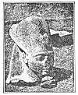

  
[Intangible Textual Heritage](../../index)  [Africa](../index.md) 
[Index](index)  [Previous](we05)  [Next](we07.md) 

------------------------------------------------------------------------

p. 40

# CHAPTER III.

### ANCIENT ETHIOPIA, THE LAND.

The Nubo-Egyptian desert was once abundantly watered and a well timbered
region. With the exclusion of the narrow Nile valley, all of this is
generally a barren waste today. Geology reveals that in the primitive
ages, this country had a moist climate like the Congo basin; but these
conditions prevailed in remote [geological](errata.htm#9.md) times,
probably before the creation of the delta. The changes that turned the
Sahara into a burning waste in time made Upper Egypt dry and torrid.
Keane describes its climate as often fatal to all but full blooded
natives. Under those brazen skies the children of even Euro-African half
castes seldom survive after the tenth or twelfth year. Passing
southward, we find that ancient edifices occur throughout the whole
extent of Ethiopia. In the olden days, the climate there was favorable
to the nurturing and development of a high type of civilization and
produced an Ethiopian so superior to the later types, that they were
called by the ancients, "the handsomest men of the primeval world."

The whole of the space between the Nile and Abyssinia, and northward to
Lower Egypt once constituted Ethiopia. It was called Beled-es-Soudan
(land of the blacks). Once Egypt extended

p. 41

to Lower Nubia. The ancient kingdom of Meroe was Upper Nubia and was
divided into agricultural and grazing lands. Crowfoot tells us in his
*Ancient Meroe*, p. 29, that Meroe at the height of its prosperity was
established upon as broad an economic basis as Egypt or Mesopotamia.
Ancient authorities tell us that they grew grains upon lands richer and
wider than the whole of Egypt, with pastures of limitless plains. Theirs
were lands of heavy rains. Precious stones were there in abundance. They
produced beautiful painted pottery and their princes were robed in
magnificence. The yearning of the Ethiopian for all things beautiful,
his love for ceremony and costly attire may not be mere imitation but
springs from inheritance, from the possession of these things by his
ancestors thousands of years ago.

Herodotus II, 29, says, "Meroe was a great city and metropolis." Here
Zeus Ammon was worshipped in temples of the utmost splendor. The
*Cyclopedia of Biblical Literature* explains, "The early prosperity and
grandeur of Ethiopia sprang from the carrying trade of which it was the
center, between India and Arabia on the one hand and the interior of
Africa and especially Egypt on the other. There was intimate connection
between Egypt and Ethiopia commercially. Thebes and Meroe founded a
common colony in Libya." This would prove the close relationship of
Thebes, which was Nubian and Meroe. Meroe was the seat of a great
caravan route from the north of Africa. Another route went westward
across the

p. 42

\[paragraph continues\] Soudan. Strabo spoke of this open way in the day
of Tartesus, long before the ancient Gades was built. From Meroe
eastward extended the great caravan route by which the wares of southern
Arabia and Africa were interchanged. The great wealth of the Cushites
arose from this net work of commerce which covered the prehistoric
world.

*Biblical Literature* asks these pertinent questions, "Whence did Egypt
obtain spices and drugs with which she embalmed her dead? Whence the
incense that burned on her altars? Whence came into the empire the
immense amount of cotton in which her inhabitants were clad, and which
her own soil so sparingly produced? And whence came into Egypt the
rumors of the Ethiopian gold countries which Cambyses set out to seek?
Whence that profusion of ivory and ebony that Greek and Phoenician
artists embellished? Whence the early spread of the name of Ethiopia
celebrated by Jewish poets as well as by the earliest Grecian bards?
Whence but from the international commerce of which Ethiopia was the
center and seat?" These principal trade routes may still be pointed out
by a chain of ruins, extending from the shores of the Indian Ocean to
the Mediterranean. The cities Adule, Axum, Meroe, Thebes and Carthage
were the links in the chain. The "merchandise of Ethiopia" of which the
Bible so often speaks passed along this line of cities to less civilized
portions of the earth.

Heeren in his *Ancient Nations of Africa*, tells us that commercial
intercourse existed between

p. 43

the countries of southern Asia, between India and Arabia, Ethiopia,
Libya and Egypt, which was founded upon their mutual necessities; and
became the parent of the [civilizations](errata.htm#10.md) of these
peoples. The fame of the Ethiopians, as a civilized people had forced
its way into Greece in the time of Homer. Meroe, the hundred gated
Thebes, Jupiter-Ammon, and the oracles in Lybia and Greece were woven
with the most ancient Greek myths. The Argonautic Expedition, the Triton
Sea, and the Garden of the Hesperides, were flashes from this ancient
Ethiopian commerce. Its introduction into Hellas must have been made at
a very early period as shown by the oracle and sanctuary of Dodona.
Ethiopian commerce was carried on under the protection of sanctuaries.
The priests of Ammon said, that the oracles were founded in Greece from
Thebes and Meroe. The Pelasgians adopted the Egyptian names of these
deities and passed them on to the later Greeks.

Heeren continues, "Meroe from time immemorial had been an oracle of
Jupiter. Its soil was extremely fertile. As late as 1000 B. C. it was
one of the most powerful states of the ancient world. Accounts left us
by the ancients have been considered fabulous but not so to those who
have viewed the ruins now covering the site of this once powerful and
highly civilized state. Remnants of mighty buildings covered with
sculptures, representations of priestly ceremonies and battles, rows of
sphinxes and colossi, give rise to the question, as to which nation
Ethiopia or Egypt imparted its knowledge to the other."

p. 44

\[paragraph continues\] Until historical times Ethiopia furnished Egypt
with gold. Her ravines were worked until the middle of the 12th century.
Gold was extracted by crushing, a very costly method, proving that these
mines had been very rich and must have been a source of the great
profusion of golden articles found in many African ruins and graves.

Keane describes the Fayum district, which grew in great profusion,
roses, vine olives, sugar cane and cotton. Here the orange and lemon
trees attained the size of our apple trees. The district was in more
primeval times an and depression. An early pharaoh cut a deep channel
through the rocky barrier toward the Nile and let in the western river.
Since the Twelfth Dynasty this lake had been one of blessing and
abundance. This tract thus reclaimed from the desert was justly a wonder
of Egypt. Here the marvelous Lake Moeris received the discharge of the
Bahr Yusef, which was one half the volume of the Nile. It was one of the
astounding engineering feats of the old world and still ranks as one of
the most marvelous achievements of mankind. Notwithstanding the drying
up of Lake Moeris the Fayum is still an important and fertile province.

Gold appears in the Elba Hills. Topaz mines are worked, while perhaps
its emerald mines were then the oldest and most extensive in the world,
and the only ones known until the conquest of Peru. Ethiopia seems to
have had an inexhaustible supply of building material of the first
quality, sandstone, limestone and granite were worked there for ages. In
ancient days the buildings

p. 45

seem to have been of red brick, now the people live in mud huts. Barth
speaks of the numerous ruins of Upper Nubia, which attest the splendor
of the ancient cities. The average student does not know that in Nubia
are infinitely more monuments and temples than in Egypt; besides this
Arabs say that Europeans are acquainted with few of the monuments
concealed by the encroaching sands in the desert. Twelve miles north of
Naga is a labyrinth of ruined buildings. The Arabs call it Massaurrat.
The central building is one of the largest known edifices, being 2700
feet in circumference. Its columns are fluted but without hieroglyphics.
(*The Earth and Its Inhabitants*--Reclus. Vol. I, p. 246.)

The two temples of Jebel Arden are covered with sculpture, representing
the victories of a king who bears the titles of one of the Egyptian
pharaohs. One of the buildings is approached by an avenue of sphinxs.
The pyramids, temples, colonades, avenues of animals and statutes are
still standing at Meroe. Their sandstone was not so durable as that of
Egypt. Eighty pyramids have been damaged by sightseers. Lepius with
difficulty prevented the systematic destruction of the monuments of
Meroe. Cairo was built by removing the marble facing of the Great
Pyramid. Thus have many ancient ruins disappeared. The pyramids of Meroe
do not compare with those of Egypt in magnitude, though they are more
artistic. Reclus describes the two temples at Abu Simbel, that take
their place as marvels of ancient art. They are the monuments of
Ibsambul.

p. 46

\[paragraph continues\] The southern temple is hewn out of the living
rock. Before the gate sit four colossi over sixty feet high, of noble
and placid countenance. All these colossi. are covered with
inscriptions. In the interior of the rock, follow three large halls in
succession and twelve smaller ones whose walls contain brilliant
paintings. If you will examine the faces of these colossi in any book of
authentic cuts you will find that they are the faces of full featured
Ethiopians.

"Many temples succeed these as far as the first cataract, containing
burial grottoes, gateways and towers. Almost buried in the sand,
travelers find the ancient town of Mabendi, whose tunnel shaped
[galleries](errata.htm#11.md) like those of Crete are still to be seen
passing under the houses. We see Dakka with its gigantic gateways only
possible of erection by the hand of the ancient Cushite. In the
sepulchral cave Beit-el-Walli are sculptures representing triumphal
processions, assaults, court and battle scenes. These have been rendered
more [popular](errata.htm#12.md) by engravings than any other. The colors
of these paintings are still remarkably brilliant." (*The Earth and Its
Inhabitants*, Vol. 1, p. 306.) The temples of Dabod and Dakka were built
by the Ethiopian king Ergamenes. Many of these ruins and this art appear
to us as Egyptian but as Sayce points out the little temple of Amada in
Nubia built by Thotmes III in honor of his young wife, in delicately
finished and brilliantly painted sculpture on stone, is worth far more
than the colossal monuments of Ramses II. Ramses cared more for size and

p. 47

 

[  
Click to enlarge](img/04700.jpg.md)

"An Ancient Cushite.  
RAMESES II, SURNAMED ''THE GREAT.''  
From a group in red granite. Tanis. Photographed by Mr. W. M. F.
Petrie."}

 

p. 48

number of buildings than for their careful construction and artistic
finish. Sayce describes the building of his era as mostly scamped, the
walls ill built and the sculpture coarse and tasteless. Even here in
Nubia the monument of Abu Simbel forms a striking contrast. Wrought by
the hands of Nubians it forms one of the world's wonders carved in rock.
It is as Sayce says the noblest monument left us by the barren wars and
vain glorious monuments of Ramses-Sesostris. (*Ancient Empires of the
East*--A. H. Sayce.)

Meroe had an army of 250,000 trained men and 400,000 artisans when her
rule reached Syria. One note-worthy feature was the enormous size of the
city of Meroe. It covered an almost unbelievable area. The ruins that
Pliny described had disappeared in Roman times, so ancient was their
origin. That is why so little can be learned about Ethiopia by the study
of the country today. The period of her ancient glory was too far beyond
the ages of our times. Hoskins thought the pyramids of Gizeh magnificent
and wonderful in effect and artistic design. There were pyramids used
for burial places at the site of Meroe. On the reliefs on the walls of
the burial chambers the rulers appear purely Cushite. Calliund thought
Massaurrat, a unique place having no parallel in Egypt, to have been a
great college. Heeren thought it the site of the oracle of Jupiter, at
whose command colonies issued forth which carried civilization, arts and
religion from Ethiopia into the Delta, to Greece and to far Nordic
lands.

p. 49

The *Encyclopedia Britannica* says, "The Nubians are supposed by some
authorities to agree with the ancient Egyptians more closely than the
Copts, usually deemed their representatives." According to Dr.
Pritchard, it is probable that the Barabra may be an offshoot from the
original stock that first peopled Egypt and Nubia. It was the Old Race
of the higher civilization that ruled Egypt in the pre-dynastic ages. It
was from this nation went forth the colonies that spread civilization.
This old race of the Upper Nile, the Agu or Anu of the ancient
traditions, spread their arts from Egypt to the Ægean, from Sicily to
Italy and Spain. Mosso Angelo says that the characteristic decorations
on the pottery of the Mediterranean race of prehistoric times is
identical with that of pre-dynastic Egypt. Reisner in 1899 examined 1200
tombs in the Nile valley. He found the remains of a distinct race who
buried their dead with legs doubled up against abdomen and thorax. This
was an old Ethiopian form of burial, which preceeded embalming and may
be traced through ancient Cushite lands.

Earnest and consciencious students, seeking the facts about ancient
Ethiopia, find but scanty and unsatisfactory references in modern books.
Going back to ancient records we find voluminous testimony. Out of this
material the modern author selects what he sees fit and rejects much
authentic history about Ethiopia. One book will tell us that the
Ethiopians belonged to the Japhetic stock, in fact this is the favored
theory; yet the encyclopedia says that Nubians are a Negroid

p. 50

stock. Others say that they are Semitic. There is a world of
contradiction in modern books from an ethnological standpoint. Without
the untangling of these threads one must have a narrow and twisted
conception of true history., In ancient days the African nations were
proud and mighty. Cambyses marched against the Egyptians because their
king had refused him a daughter in marriage. A stele in the British
museum shows how the fleet of Cambyses was destroyed by Ethiopians on
the Nile and the land forces succumbed to famine. At this time the
temples of Napata were already in ruins.

Pyramids were erected for a long line of queens called Candace. The high
treasurer of one of these queens was converted to Christianity under the
preaching of Philip. To prove how lasting is the religious impression
upon the heart of the Ethiopian, Abyssinia is the only great Christian
nation of any importance in the east today. The Candace queens ruled
over an Ethiopia that included Abyssinia, but their center was near
Meroe, where they were buried. The Scriptures spoke of the treasure of
queen Candace, accumulated from the merchandise and wealth of Ethiopia.
Strabo spoke of a queen warrior of Ethiopia. This line of queens was of
a race type never seen among Egyptians. They had the pronounced Bushman
figure. The renowned queen of Sheba, queen of the south, who visited
Solomon belonged to this line of queens.

Ethiopia furnished the perfumes of the ancient world. "From Meroe to
Memphis the most common

p. 51

object carved or painted in the interior of the temples was the censor
in the bands of the priest. They worshipped the presiding deity with
gold and silver vessels, rich vestments, gems and many other offerings.
Various substances were used for incense but the most esteemed came from
Ethiopia. It was from these costly products that this nation derived
much of its wealth that has seemed fabulous to the thoughtless. For the
embalming of the dead, spicery in vast quantities was used. The Hindu
and Egyptians use incense to this day. The Hebrews burned incense.
Nineveh, Persepolis, the earthenware of China, all show innumerable
forms of censors; Greece, Rome and on down to our day in Catholic
ceremonies we find that the incense, first necessary to allay the odors
of animal sacrifice, and finally taking its place, still persists. In
ancient days when the dead were buried in churches, the burning of
incense was thought necessary to preserve men's health. For these
reasons; we must recognize how enormous must have been the traffic to
supply such demands. Early writers said that Ethiopians had fountains
with the odor of violets, and that her prisoners were fettered with gold
chains.

Considering the natural products of Ethiopia, her commerce, the strength
of her armies, spoken of by the Scriptures as a thousand thousand, we
find them a substantial foundation for ancient traditions about that
nation. Another remarkable people of these regions were the Microbians,
Herodotus describes the visit of the ambassadors

p. 52

of Cambyses to them. He directed his expedition against them because of
their reputed wealth. His spies brought presents to this king of the
Ethiopians. They were a very tall race and the king was chosen for his
great stature, They were a civilized people with their own laws and
institutions. The spies brought a purple robe, gold and perfumes, and a
cask of palm wine. This king looked at their presents and despised them,
he inquired how long they lived and what they ate. When told that they
lived eighty years, he said, "I do not wonder that you who feed upon
such rubbish should live no longer. The Microbians," he said, "lived one
hundred and twenty years and sometimes longer," their chief food being
flesh and milk. This diet was evidence of civilization. He sent a
message to the Persian king that filled him with rage, "When you can
bend the bow which I send you then you may undertake an expedition to
the Microbians."

The ambassadors were shown the "Table of the Sun," a meadow at the
outskirts of the city in which much boiled flesh was laid, placed there
every night by the magistrates. This seems a strange custom to the
unthinking, but was a part of the commercial policy of the Ethiopians, a
way by which the vast trains of caravans, that swept through the country
were fed. At the table of the Sun, all who wished might eat. The
ambassadors were next led to the prisons, where the captives, were bound
with gold fetters. This was before the iron age. Ethiopia had a skill in
embalming superior to Egypt. The Ethiopian

p. 53

mummy could be seen all around and they were preserved in columns of
transparent glass. The Egyptian mummy could only be seen from the front.
In the sepulchers the corpses were covered with plaster on which were
painted lifelike portraits of the deceased. They were then placed in the
cases of crystal which was dug up in abundance. his report of Herodotus
proves the Ethiopians in possession of laws, prisons, commerce,
knowledge of working metals and the fine arts.

------------------------------------------------------------------------

[Next: Chapter IV. The Amazing Civilization of Ethiopia](we07.md)
