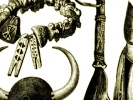

  
[Intangible Textual Heritage](../../index)  [Africa](../index) 
[Index](index)  [Previous](wmp01)  [Next](wmp03) 

------------------------------------------------------------------------

[Buy this Book on
Kindle](https://www.amazon.com/exec/obidos/ASIN/B003C1QZ5I/internetsacredte)

------------------------------------------------------------------------

  
*Woman's Mysteries of a Primitive People*, by D. Amaury Talbot,
\[1915\], at Intangible Textual Heritage

------------------------------------------------------------------------

# LIST OF PLATES

|                                                                                               |              |
|-----------------------------------------------------------------------------------------------|--------------|
| "FATTING-HOUSE" WOMEN                                                                         | Frontispiece |
|                                                                                               | FACING PAGE  |
| TYPES OF IBO WOMEN                                                                            | 4            |
| CHIEF DANIEL HENSHAW, WITH HIS FAMILY                                                         | 8            |
| A HUNTING SCENE                                                                               | 12           |
| IBIBIO CHIEFS, WITH ATTENDANTS                                                                | 12           |
| A JUJU SHRINE, WITH JUJU LEAVES IN THE FOREGROUND                                             | 16           |
| A BEACH ON WHICH TWINS WERE FORMERLY OFFERED UP                                               | 24           |
| THE PATH OVER THE MAGIC WATER WHICH SHRANK UNDERGROUND TO AVOID THE POLLUTION OF A TWIN WOMAN | 28           |
| ORON MAN WITH TWINS WHOSE LIVES HE SAVED                                                      | 30           |
| NDIYA BEACH                                                                                   | 32           |
| VIEW ON THE CROSS RIVER, IN THE EKET DISTRICT                                                 | 38           |
| AN IBOIBO MARKET                                                                              | 48           |
| A HIGH IDIONG PRIEST                                                                          | 52           |
| CLIMBING PALMS, "IN WHICH DWELLS THE SOUL OF A WOMAN"                                         | 56           |
| AN IBIBIO GIRL, WITH WAIST BEADS                                                              | 64           |
| JUJU "IMAGE" WITH MASK AND DRESS OF WOVEN FIBRE                                               | 66           |
| A TYPICAL SACRED POOL IN IBIBIO LAND                                                          | 76           |
| JUJU TREE OF THE COMPOUND SHOWN IN THE BACKGROUND                                             | 80           |
| FATTING-HOUSE GIRLS AFTER THE FIRST TIME OF SECLUSION (*Mbobi*)                               | 84           |
| "FATTING-HOUSE" WOMEN                                                                         | 88           |
| IKOTOBO MARKET-PLACE                                                                          | 96           |
| A TOWN PLAYGROUND                                                                             | 104          |
| POOL OF ISEMIN, TO WHICH THE WOMEN GO IN PROCESSION NAKED AT DAWN                             | 108          |

 

p. viii

|                                                                              |             |
|------------------------------------------------------------------------------|-------------|
|                                                                              | FACING PAGE |
| SHRINE OF ISEMIN                                                             | 110         |
| TYPE OF ROAD IN THE EKET DISTRICT                                            | 114         |
| EKOI WOMAN AND GIRLS FROM NCHOPAN                                            | 116         |
| A TYPICAL EGBO HOUSE                                                         | 118         |
| AN IBO WOMAN                                                                 | 118         |
| JUJU TO WHICH HUMAN VICTIMS ARE OFFERED UP                                   | 120         |
| CHIEF OKONNOR OF IKOTOBO                                                     | 128         |
| A NIGERIAN LANDSCAPE: MUD FLATS LEFT DRY BY THE TIDE                         | 130         |
| AN IBIBIO CHIEF                                                              | 130         |
| A BREWER OF LOVE PHILTRES                                                    | 142         |
| JUJU ITA BRINYAN                                                             | 146         |
| A JUJU WHICH PROTECTS A FAMILY FROM WITCHCRAFT                               | 162         |
| GULLY DOWN WHICH THE SUSPECTED WITCH WAS THROWN                              | 170         |
| LEAF "IMAGE," IN A JUJU "PLAY"                                               | 176         |
| A RIVER DISCOVERED BY p. A. TALBOT                                           | 184         |
| EGBO "IMAGES"                                                                | 192         |
| THE "MOTHER OF GHOSTS AND DEVILS"                                            | 200         |
| TYPE OF EKOI WOMAN                                                           | 208         |
| A WOMAN'S MEMORIAL                                                           | 216         |
| PATH NEAR AKAIYA, PASSING THROUGH "THE FOREST OF THOSE WHO MAY NOT BE BURIED | 220         |
| WATER LILIES ON A CREEK DISCOVERED BY p. A. TALBOT                           | 232         |

 

------------------------------------------------------------------------

[Next: Chapter 1: Introductory](wmp03)

