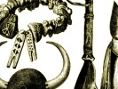

  
[Intangible Textual Heritage](../../index)  [Africa](../index.md) 
[Index](index)  [Previous](wmp11)  [Next](wmp13.md) 

------------------------------------------------------------------------

[Buy this Book on
Kindle](https://www.amazon.com/exec/obidos/ASIN/B003C1QZ5I/internetsacredte.md)

------------------------------------------------------------------------

  
*Woman's Mysteries of a Primitive People*, by D. Amaury Talbot,
\[1915\], at Intangible Textual Heritage

------------------------------------------------------------------------

p. 138

# CHAPTER X

### LOVE PHILTRES AND MAGIC

ONE morning, just as we were leaving Okon Ekkpo (Jamestown), a
deputation of chiefs came to lay a case of some interest before my
husband. The head wife of one of them had accused a fellow wife of
attempting to administer a "love potion" to their common lord, the
effect of which would be to draw his affection from all others to the
giver alone. The potion had been bought from a noted witch-doctor of the
neighbourhood. In this case the magician in question was a woman, young
and singularly attractive in appearance.

At first sight the crime did not seem very heinous, but it transpired
that love potions are by no means harmless, since they contain small
portions of a powerful poison, repeated doses of which are said not only
to affect the brain and render the recipient incapable of normal
judgment, but even to bring death in the end. The principal ingredients
in these philtres are the hearts of chickens pounded up to a smooth
paste, together with leaves thought to contain magical qualities. It is
not without significance that among the Ibibios, save when administered
in "medicine" intended to weaken the will or destroy the courage of the
recipient, the hearts and livers of chickens are

p. 139

carefully avoided as food, since it is thought that those who partake
will become "chicken-hearted" in consequence.

In order to render the charm efficacious it is necessary to draw forth
the soul of some person and imprison it amid fresh-plucked herbs in an
earthen pot never before used. The vessel is then hung above a slow
fire, and, as the leaves dry up, the body of the man or woman chosen for
the purpose is said to wither away.

In the present case, a fellow wife, Antikka by name, was the victim
chosen, and when my husband asked whether any evil consequences had been
thought to result, the complainant drew forth the woman, remarking:

"Our District Commissioner can see for himself. Formerly Antikka was a
very fresh woman, plump and beautiful. Now that her soul has been drawn
into the pot and withered by slow fire it is plain to see that she has
become dry and sapless."

The woman was very pale, of mixed blood, and it was easy to see from her
drawn face and terror-stricken air that, however foolish such a story
sounds to twentieth-century ears, it was no idle tale to her.

In view of the importance attached to such cases by no less an authority
than Dr. Wallis Budge, of the British Museum, it may be well to give the
proceedings in full.

During the course of the trial a fellow wife named Ikwaw Eyo stated on
oath:

"I was in my house when Ikwaw came and said,

We are all three the wives of one husband. Let us

p. 140

make medicine that our husband may not love his other wife, Antikka.'
Afterwards I went to him and reported: 'Ikwaw has asked me to join her
in preparing a love philtre so that you will not be able to care for any
other wives.'

"Another time the same woman came to me and said, 'Aret knows all about
magic leaves.' After this she asked me to come into the house where the
magician was, but when the latter saw me she said, 'It is not a good
thing to have called Ikwaw Eyo into the presence of the medicine. She
may tell her husband about it.'

"All this also I reported, and told, too, that Aret had bidden Ikwaw buy
a little clay bowl in the marketplace of the value of four wires. This
she did, and later, when all was prepared, they asked me, 'Whose soul do
you think we should call into the pot?' I answered, 'I do not know.' On
this Aret said, 'Let her alone. To-day we will grind the medicine and
afterwards we can settle whose soul it will be best to call.'

"Next Ikwaw was sent out to get an egg. She begged me to bring one also,
and I went to Antikka and asked her for one, which she gave, and I in
turn handed it to Ikwaw. Then Aret and she made the medicine, and called
Antikka's soul. Long they called, very softly, and in words which I
could not understand. After a while they sent me out, bidding me fetch
some yellow *ogokk* powder, and on my return Aret said, 'We have already
called Antikka's soul into the pot.' Ikwaw then begged Aret to call our
husband's soul also before the juju, but the medicine

p. 141

woman said, 'If I should do this the soul of your husband would go
wandering, and he himself would fall sick of his body.'

"Ikwaw told me that Aret had also stated, 'We may not beat this medicine
in one of the fu-fu mortars. Should we do this the vessel could not be
used again.' Ikwaw then sent me to bring one of the old mats from before
Antikka's house. I refused, but afterwards fetched one in secret from
her own house instead of that of Antikka. Aret gave me a piece of root
to hang up over my hearth, but Ikwaw advised her not to let me have it,
as should our husband come to my house and see it hanging in the
fireplace, he would be sure to ask about it, and I should then very
likely tell him of the secret thing they had done. In my presence Aret
also said to Ikwaw:

"'When you bring your husband water in which to wash in the morning take
a little of the liquid from out the pot of medicine, and mix with the
fresh water. Also spread some upon the side of the bowl, and at night
before you go to lie in his bed, rub some of this juju over your own
arms, feet and neck.'

"Later Ikwaw bore the pot of medicine into her bedroom and I went away,
but that same day our husband went to visit her. He saw the medicine and
carried it off to his house. Next day he called a meeting of the chiefs,
then summoned Aret and Ikwaw before them and asked, 'What sort of
medicine is this which you have been making?' They answered, 'It is a
love philtre.' So the chiefs said that the case must be brought to
Court."

Ikwaw stated on oath:

p. 142

"One day I asked Aret to come and give medicine to my little daughter
who was sick. About this time Eyo said to me, 'Akon Abassi, our fellow
wife, is making love philtres for our husband. That is why he loves her
more than us. Let us therefore find someone who can make such medicine
for us also.'

"I answered, 'I have no money'; but she said, 'I will bring some.' Later
she brought five shillings, which she asked me to give to Aret. I showed
the money to the latter, who said, 'I cannot accept it, as I do not know
why it is given.' Afterwards Eyo, came secretly to the back of my house
and said, 'Arrange with Aret about the love philtre.' Later I asked Aret
to come and see me again. We met Eyo outside the door of my house. She
asked Aret, 'Have you brought the medicine?' Aret answered 'Yes.' Eyo
questioned further, 'What must one do with it?' Aret replied, 'Bring a
fu-fu mortar.' This Eyo did. The magic bark was laid in it, and at her
request I beat this to powder. When all was prepared I asked Eyo to take
the medicine to her house. She said, 'I cannot, because no one is sick
there, and should our husband see it and ask the reason for my having it
I should have nothing to say in excuse.'"

Only a short time ago an epidemic of such "love poisoning" was said to
have broken out in Calabar, and to have caused the death of many chiefs.

The following case in which a love philtre also figures came before the
Native Court at Awa on April 25th, 1913. In this the prosecutor, Ayana
Etuk Udaw, sworn, stated:

"About a year ago I went to Ikot Etobo where one

p. 143

Udofia Nwa by name told me that Akpan Nka had asked him to make a
medicine to give to my wife Owo, so that she might leave me and go to
him. Udofia also said that he had given the medicine to Akpan Nka."

Udofia Nwa stated on oath:

"About a year ago the accused asked me to make medicine for him. I
inquired to whom he was going to give it, and he said it was for the
prosecutor's wife Owo, to cause her to leave her present husband and
come to him. I made the medicine. Afterwards prosecutor came to my
country and I asked him if his wife was still with him. He said, 'No,
she has gone away.' On hearing this I reported that the accused had
bought medicine from me with the intention of taking the woman from him
by this means. First the accused had said that he wanted it for his
sister, and afterwards that it was for prosecutor's wife."

The accused stated

"About a year ago I asked the witness Udofia Nwa to make a medicine for
me. He asked to whom I was going to give it, and I mentioned my sister,
who is living at Afia Nsitt. I wanted her to take the medicine so that
she should return to me and I should then be able to give her in
marriage to anyone whom I chose. I did not mention the name of
prosecutor's wife, nor have I given medicine to the woman."

A third case in which a love philtre played a part, came before the
Court at Idua Oron. This time it was a jealous mistress who sought to
administer the potion. The account is given by a woman well known to all
those concerned.

p. 144

George Offong, a former Native Court clerk, had married two wives at his
own town, Okatt. When he was transferred to Idua as clerk of court, he
met an Oron woman named Emiene whom he induced to come to his house.
After a short time he sent to fetch his two wives, and one came while
the other remained behind. Now the one who answered his call was his
best-loved wife, Etuk Udaw by name, and before long it was clear to the
Oron woman that Offong cared far more for the new-comer than for
herself. This angered her, and she determined to steal away his
affection so that he might be led to divorce his wife.

With this end in view she got together her most valued possessions, and
went to a famous witch-doctor to purchase a love philtre. The necessary
potion was given, and she was instructed as to the rites to be carried
out in order to ensure its efficacy. For this she had to go alone to a
waste place, and there, hidden from all eyes, carry out the prescribed
ritual. While thus engaged a friend of her lover chanced to pass through
the bush, near the spot which she had chosen. Attracted by light and
sound in so lonely a place the man crept near and hid behind some trees,
where unseen and unsuspected, he could witness everything. Only when the
last rite was finished and the woman, exhausted by the frenzy of her
petition, lay prone upon the ground did he steal away to tell Offong
what he had seen. In consequence both men made investigations and
succeeded in learning all that was to be known.

Not till long after dark had fallen did Emiene creep

p. 145

back to her lover's house. When she appeared before him he charged her
with the carrying out of evil rites in order to turn his love away from
Etuk Udaw and transfer it to herself. She denied all knowledge of this,
saying, "I never did any such thing." To this Offong replied, "There is
a man who witnessed all that you have done. Also we know from whom you
bought the medicine, and the price which you paid."

On hearing this Emiene said, "Send for this man that I may know who
accuses me."

When the witness came forward and told of the very place where she had
practised the charm, and of all she had said and done there, as also the
name of the witch-doctor from whom the love philtre had been bought, she
realised that further denial was useless; so hung her head and said
never a word. After the accuser had gone the poor woman held out her
arms toward Offong and pleaded that what she had done was but because it
was hard to live in his house day by day and see another woman preferred
before herself. She entreated, therefore, that he would forgive her and
let her stay on as before, but he answered, "That cannot be. I must
bring the matter before court."

So this was done, with the result that the members pronounced her guilty
and sentenced her to three months' imprisonment.

Afterwards Offong would never see her again.

Other magic rites in frequent use are practised by jealous men or women
to wither up the vital powers of those who have fallen under their
displeasure and prevent such from the procreation of offspring. Such

p. 146

a case happened not long ago and is thus related by Udaw of Ikot Atako.

"A woman of Ikot Akpan Udaw, by name Adiaha Ntokk, was given by her
parents in marriage to a fellow townsman named Udaw Nka Nta. For some
years she lived quietly in her husband's house and bore him two babes.
Afterwards she grew weary of him, and seeing another man who pleased her
better, said to Nka Nta:

"'I am tired of you, and have seen a man whom I like better. He is
willing to repay the dowry which you gave to my parents, so I shall
leave you and go to him.'

"Now Nka Nta loved this woman with so strong a passion that, because of
it, he cared for no other wife; so he begged her not to leave him. She,
however, only laughed at his entreaties, gathered together her
possessions, and prepared to go to the house of her new lover.

"When Udaw Nka Nta saw that she had determined to leave him he went
before the juju and made sacrifice, calling upon the spirit to hear his
prayer. Then he came back and stood before the woman and said:

"'Since you will no longer be my wife you shall henceforth be barren.
Never shall you bear a babe to another man.'

"For the moment Adiaha Ntokk was startled, but she soon rallied and
answered with a laugh and a toss of the head, 'You are not Abassi to
give or withhold children.'

"To this the man replied, 'I know very well that of myself I have no
power, but the spell I have wrought

p. 147

is a very strong one, and in time you will see whether or no my words
are vain. Once again I tell you, if you leave my house for that of
another you will never bear piccan more.'

"In spite of this Adiaha persisted, and went to her new lover. Yet the
curse held, and though she lived with him for several years, Eka Abassi
sent no babe to their hearth.

"After a time the faithless wife again grew weary and thought: 'I will
seek out a new husband by whom I may bear a child, since this one is of
no use to me.' So she married a third man, named Anam Okut, and still
lives at Afa Eket; but the juju which her first husband put upon her yet
holds. Never a babe has been born to her, and no new husband will take
to his house a wife so accursed."

Another method of bringing barrenness upon those against whom a grudge
is harboured came out in a case heard at Idua Oron on July 14th, 1913.
In this a man, Ekpenyon by name, accused his wife Isong Edigi Owo of
invoking the great Mbiam juju, Ita Brinyan, or as it is sometimes called
Atabli Inyan, against him.

The plaintiff stated on oath:

"Three weeks ago I gave my wife thirty wires and asked her to go and buy
fish and palm oil for me. She took the wires, but when later I sent to
ask for what she had bought she answered that she had nothing. I
therefore went to her house and inquired why she had not purchased the
fish. First she would not speak, then answered that she had only bought
oil. I caught hold of her and drew her out of the house, telling her

p. 148

to go and buy the fish. She refused, whereupon I pushed her and she
prepared to fight me. I struck her and she caught hold of me . . . so I
threw her down, and my other wife ran out to part us. Afterwards Isong
Edigi went out and cut leaves, praying that no other child might be born
from me, and that Ita Brinyan might kill me. To make the curse more sure
she washed a certain part of her body, then threw the water before my
door, crying out that I must never more become the father of a babe. She
asserted that while we were fighting I had wounded that part of her, and
that this was why she called upon the juju against me."

Thereupon the Court asked accused: "Did you hold the leaves in your two
hands?"

Answer: "Yes."

Question: "When a person holds leaves in both hands and calls upon the
name of Atabli Inyan, what is meant?"

To this the accused refused to reply, whereon one of the Court Members,
deputed to speak for the others, rose and said:

"Atabli Inyan is the strongest of all Mbiams. He dwells by the waterside
and beneath the water. Had the woman not meant to invoke this juju
against her husband she would not thus have held the leaves in her two
hands while calling upon his name."

Another case in which a magic potion figures came up before the same
Native Court on July 15th, 1913. In this the plaintiff, Anwa Ese,
stated:

"Defendant went to a medicine man named Umo Ekkpe, and asked for a juju
which would kill me or

p. 149

destroy my reason, so that he might be able to marry my wife. The chiefs
of our town questioned him about the matter in the presence of several
people and he never denied it."

Abassi Anse, brother of plaintiff, sworn, stated

"The accused went to Umo Ekkpe, to get a medicine with which to kill my
brother or make him mad, so that the latter's wife should become his
own."

Ekpenyong Ata stated on oath:

"I heard that accused went to buy a love medicine to give to
complainant's wife in order that the woman might love him."

Okon Udaw stated:

"I admit that I went to buy a medicine from Umo Ekkpe, but it is only a
love potion. It cannot kill anyone. I wished to give the medicine to
complainant's wife, because I love her and do not know whether she loves
me or not."

Some Ibibio women know the secret of a "magic" which will attract a
husband's love to them alone, and guard the thoughts of their lords from
straying to rivals. The following information was gleaned from women
informants, one of whom stated:

"A very famous medicine is one that is only known to witches, and must
be purchased at a great price from a witch-doctor. This is never used
save when a woman has grown tired of her husband and wishes to rid
herself of him in order to marry another man. It is a terrible potion
which, once administered, goes straight to the head and destroys all
will-power, placing the victim under the control of her who has
administered it. So soon as a man has eaten or drunk of the fatal

p. 150

mixture the faithless wife has but to say 'Now go,' and, no matter how
strong, young or wealthy he may be the husband must rise at once, and,
abandoning all his possessions and everything that life holds dear, go
straight down to the river, there to drown himself--leaving his cruel
witch-wife free to marry another man.

"Some men know how to make a medicine which will turn to them the heart
of any woman whom they may desire, and also kill her former husband,
should she be married. Some possess the juju Ibokk Ima, which they place
in a little niche in the mud wall above the lintel. To this object,
which is usually in the form of a ball made of twisted tie-tie, a cord
is fastened, and at night-time the man goes and pulls it gently seven
times, calling upon the name of the woman and crying, 'Come! I want you!
Come! I want you!' until she rises in sleep, even from her husband's
side, and is forced to go to the house of the one who thus summons her.
Arrived at the door, still in her sleep, she knocks softly, and her
lover opens and leads her within. . . . When she goes back to her
husband next morning perhaps he will ask her, 'Where have you been?' She
is quite dazed and knows not what to say, so to avert suspicion, usually
answers, 'I come from my mother's place.'"

A very old woman, strongly suspected of possessing uncanny powers, said
one day:

"The juju Ikoruben can make doors fly open before a man at night-time so
that such a one can enter unseen and unheard, and bear off any sleeping
woman in his arms. Afterwards he can carry her back in the same way, and
the woman never know

p. 151

what has been done to her. Should she chance to wake and find herself in
a strange room she will cry, 'Where am I; afar from my house, in that of
a stranger?' Usually, however, she falls asleep once more and does not
wake up again until she finds herself back in her own home. Then, if she
tells anyone of the strange dream which she had in the night, the friend
in whom she confides raises a warning finger and says, 'Hush! Tell no
one! It is the juju Ikoruben or Ibokk Ima that has taken you, and it is
not good for your husband to know of the matter.'

The juju Etuk Nwan is also said to confer the power of passing invisibly
through locked doors and thus entering houses at midnight. By its help
men are said to obtain the favours of women who had scorned them by
daylight, and also to steal whatever goods they may happen to covet.
Such a case was brought before my husband in the Native Court at Oron,
where an Akaiya man was accused of having practised the juju to the
great loss of all his townsfolk.

In order to ensure efficacy for this particular "magic" the presence of
a confederate is needed. The latter must stand outside the house which
is about to be burgled, holding in his hands the skull of a sheep or of
an "Ebett," sometimes called the "sleeping antelope." Should the
attention of the watcher be distracted, or should he lay down the skull
even for a moment, the spell would be broken, and the thief, no longer
invisible, is liable to be seized. Strange as such a belief may seem, it
is no more remarkable than that which survived until lately in our own
land, namely, that a candle fastened into a hand cut from the body

p. 152

of a murderer as it swung from the gallows-tree would confer the same
immunity upon burglars. It is somewhat singular that a belief similar to
that of the Ibibios obtains among Zulus, only with these latter the
skull of another species of antelope is used.

The secrets of all "invisible jujus" were thought to have been confided
to mortals by evil spirits, whose underground dwellings, according to
local belief, are entered through the curiously shaped ant-hills which
abound in this part of the world, and before which small sacrificial
bowls and other offerings may usually be seen.

The origin of the "invisible juju" is given in the following legend
which, in a slightly different form. was also found among the Ekoi.

"Once, long ago, a hunter went out into the bush to snare animals. He
set his traps, and then climbed up into a tree to watch for prey. Near
the place was an ant-hill, which in this part of the country is supposed
to be the home of evil spirits.

"While the hunter sat watching, safely screened from view amid the
branches, he saw seven such spirits come out. They all wore human form,
and one of them bore a vessel full of juju. This he sprinkled over
himself and his six companions, rubbing it well over all their bodies,
until one by one they became invisible; but before quite fading away,
the last of them hid the bowl of medicine in a secret place.

"After a while the hunter climbed down, took out the basin, rubbed its
contents over himself, and then, assured of invisibility, followed the
spirits.

The way led to the market-place, and arrived

p. 153

there he saw the seven genii and they saw him. They wondered greatly how
this 'earth child' had become possessed of the invisible juju, so they
said to one another, 'Let us go back and see whether our medicine is
safe.'

"When these evil beings reached their home once more they searched for
the bowl of juju, but could not find it. On this they grew very angry
and threatened to kill the hunter, who by now had hastened back to his
hiding-place in the tree. After searching a long time the spirits looked
up and saw him there. Then they called out:

'Is it you who have stolen our medicine?'

The hunter owned to having found the bowl, whereon the evil beings said:

"'If you will come down and give it back to us we swear to give you a
portion for yourself.'

"On this the man climbed down, took the vessel from the place where he
had hidden it, and gave it back to its owners. The latter put a part
aside for him saying:

"'This will confer great power upon you, for by its use you may become
rich. Only take care not to use it too often, lest you should get into
trouble.'

"Before re-entering the ant-hill one of the genii turned toward the
hunter and added:

"'Should you tell anyone the secret of the medicine or of its use we
shall come for you and kill you.'

"The man promised to keep the secret, and went home well pleased. After
awhile he began to grow rich, for by means of the invisible juju he
could enter into any house and steal whatsoever he chose.

p. 154

"At last the townsfolk rose up, called a meeting of chiefs, and asked:

"'Whence does this man get all his cows, goats and sheep, with money and
many rich things, while we grow poor through continual thefts?'

"The chiefs called the hunter before them and asked him to give the
reason for his changed circumstances. At first he refused to reply, but
they said:

"'If you do not answer we will put you to death.'

On this the man feared greatly, and at length confessed how he had
become possessed of the power. Hardly had he finished than he fell down
dead."

There is a very efficacious way by which a woman may enlist the help of
the evil spirits who dwell within ant-hills. This also is one of the
woman's mysteries, which must be carefully guarded from the knowledge of
man. In order to carry out the rites a woman should go herself, or send
a magician of her own sex, hired for the purpose, at about the time of
the full moon. Then, standing so that her shadow falls upon the mound,
she must recite certain incantations proper to the occasion. After
awhile some small creature will be seen to creep out near the base of
the hill. This must be caught and enclosed in a little receptacle
prepared in readiness. After binding it round with strips of cloth,
preferably white, it should be worn beneath the garments, and will
confer magical powers upon its owner, both for good and ill.

Though far less elaborate, this rite is in some ways like that by which
Kedah ladies seek to obtain possession of that strange little familiar
the "pelsit," so

p. 155

inimitably described in the fascinating pages of "In Court and
Kampong." [1](#fn_26.md)

"Polong and pelsit are but other names for bajang, the latter is chiefly
used in the State of Kedah, where it is considered rather chic to have a
pelsit. A Kedah lady on one occasion, eulogising the advantage of
possessing a familiar spirit (she said that amongst other things it gave
her absolute control over her husband and the power of annoying people
who offended her), thus described the method of securing this useful
ally:

"'You go out,' she said, 'on the night before the full moon and stand
with your back to the moon and your face to an ant-hill, so that your
shadow falls on the ant-hill. Then you recite certain jampi
(incantations), and bending forward try to embrace your shadow. If you
fail try again seven times, repeating more incantations. If not
successful go the next night and make a further effort, and the night
after if necessary--three nights in all. If you cannot then catch your
shadow wait till the same day on the following month and renew the
attempt. Sooner or later you will succeed, and as you stand there in the
brilliance of the moonlight, you will see that you have drawn your
shadow into yourself, and your body will never again cast a shade. Go
home, and in the night, whether sleeping or waking, the form of a child
will appear before you and put out its tongue; that seize, and it will
remain while the rest of the child disappears. In a little while the
tongue will turn into something that breathes, a small animal, reptile
or insect, and

p. 156

when you see the creature has life put it in a bottle and the pelsit is
yours."'

A still more gruesome recipe for securing this familiar is to "go to the
graveyard at night and dig up the body of a first-born child whose
mother was also first-born . . . carry it to an ant-hill in the open
ground and there dandle it (*di-timang*). After a little while, when the
child shrieks and lolls its tongue out (*terjerlir lidah-nya*) bite off
its tongue and carry it home. Then obtain a coco-nut shell . . . carry
it to a place where three roads meet, light a fire and heat the shell
till oil exudes, dip the child's tongue in the oil and bury it in the
heart of the three cross roads (*hati sempang tiga*). Leave it untouched
for three nights, then dig it up and you will find that it has turned
into a pelsit." [1](#fn_27.md)

It is to propitiate the evil spirits which dwell beneath ant-hills that
little huts are so often built above them, usually hung round with
pieces of white cloth or other votive offerings.

As in so many stories of white magic among the ancients whether carried
out with the object of acquiring wealth, regaining health, or inducing
victory to crown a warrior's arms, the aid of a faithful wife is
necessary for the success of most charms.

One of the most fantastic of jujus is called "Kukubarakpa." There are
many magic rites for the obtaining of riches, but that of the python
(*asaba*) is more powerful than all.

These magic creatures live in creeks or rivers, and are credited,
according to popular belief, with bearing

p. 157

a great shining stone in the head, much as was "the toad ugly and
venomous" among ourselves not very long ago. Many legends exist as to
the power of this gem, by virtue of which riches beyond the dreams of
avarice may be conferred upon those who enter the "python affinity," or
purchase a share in its magic. People who long for wealth go to a juju
man known to possess familiars such as these, and bargain with him for
the sale of one.

The first step is to swallow a thread seven fathoms long "as a sign of
the animal." Later, a tiny pad, in all save size like those which
carriers wear upon the head beneath their loads, must also be gulped
down. It is upon this little cushion that, when the rites are over and
the thread has become metamorphosed into a snake, the reptile rests, "so
as not to injure the body of its owner by pressing directly upon it."

One rule must be strictly observed. The first money gained "by the power
of the snake" may not be used directly for the enjoyment of its
possessors, but must be brought before the priest. Should this rule be
forgotten, the man who thus made too great haste to be rich would die at
once. Nothing could save him.

It was confided to us that the full law of the juju is as follows: The
man who bears the snake within him goes home and tells the matter to
that one of his wives whom he can trust above all others. Then together
they build a small "secret court" within their compound entered by two
doors, one of which opens into the room set aside for the private use of
the husband. and the other into that of the trusted wife.

p. 158

In the midst of the hidden court a great earthen pot or bowl must be set
filled with fresh spring water. Into this the couple throw leaves,
together with roots and bark of magic potency, provided by the juju man
for the purpose. Afterwards, with the point of a spear, a hole is driven
through the bottom of the pot by which the water that is within might
sink into the breast of Isong, our mother. Down and down it sinks,
making by magic a channel right through to the riverside.

It is fatal to attempt to carry out this juju during the time of storms;
for thunder and lightning would render it of no avail. December, January
and February are the best months for carrying out the rites, since that
is the season of Isu Akariku, i.e. the Face of the Fog. Beware of
lightning, for Obumo is much to be feared in matters of magic; since he
is a god very jealous of all powers which seem as if seeking to rival
him in might.

When the pot has been placed in position during calm weather in the
midst of the hidden court, after a hole has been driven through the
bottom, the husband must wait patiently until the hour of low tide. So
soon as this is reached he goes to his room, locks the door by which it
communicates with the secret place, and sends all his "boys" away,
saying, "Should anyone ask for me tell them I am away from home." Then
he lays himself down upon his bed and falls into a deep sleep, while his
trusted wife stays on guard by the magic pot, a fresh egg poised in her
hand.

The woman may not lift her eyes from the bowl even for a second. So soon
as the tide turns water

p. 159

begins to flow up and swirl round at the bottom. This is, however, not
yet the time for the magic to work. At the exact moment of high tide, as
the water rushes through, for one instant the head of a python is seen
within the pot. At once she must fling the egg so that it strikes the
reptile. Then the water rises and rises till it pours over the earthen
rim and overflows the whole yard. When the woman sees this, she knows
that her part is done for the time; so slips softly away into her room,
where she locks the door and lies down to sleep.

This juju can only be carried out by a loving and faithful wife, for
should the watcher at any time have had another lover her thoughts would
certainly turn to him and she would miss the moment for throwing in the
egg; in which case the husband would never more wake from his sleep. Not
till next morning may the door of the secret court be opened. When this
is done it will be found full of thousands of wires or brass rods,
whichever may have been asked from the juju, piled so high as to reach
far up the walls, and glinting in the early morning sunlight.

Before the treasure may be touched, magic leaves must be pounded into a
fine paste and mixed with water. This medicine is called *usuk*, i.e.
disinfectant, and should be sprinkled over the gift, to destroy all evil
influences which might otherwise attach to wealth gained in so strange a
way. [1](#fn_28.md) Even so, after the "first
fruits" have been borne as an offering to the

p. 160

priest, the actual wires or rods should not be used in direct purchase
of anything for the personal use of those who have wrought the spell. As
soon as possible the new treasure should be exchanged for coins or
produce, which can then safely be bartered for whatever is desired.

Some time ago a well-known chief of Calabar was said to have obtained
considerable wealth in this fashion. He was careful to warn his wives
not to enter his room, or, at any rate, to take nothing thence. One of
them, however, chanced to peep within and saw a heap of money lying in
one of the corners, new and shining. The temptation was too strong, so
she concealed a certain sum at the bottom of her market-basket and set
out.

It happened that a great catch of crayfish had been brought in by the
fisher-folk that day. The sight tempted the woman, and she bought a
plentiful supply, which she took home, cooked, and set before her
husband. All unknowing he ate of the dish, but no sooner had the first
mouthful passed his lips than he felt the juju seize him, and at once
knew what had happened. He cried aloud to the woman who had served him
so ill: "What have you done? You have disobeyed the word which I spoke,
and now I must die for your fault." Hardly had he finished speaking when
he fell down dead.

My informant is a man for whom we have the highest esteem. Strange as it
may appear he believed absolutely in the truth of every word which he
related. The man whose death has just been described was a great friend
of his, and one of his own "age class"--

p. 161

an association of those born within a few years of one another, the
members of which hold together "closer than a brother." He finished his
story very sadly:

"There is a man in the Kamerun to whom all such magic is known. He
offered to teach my favourite brother the rites necessary in order to
make him very rich. The latter came to me and said, 'If you will join
with me in this business I will gladly enter upon it, but I fear to do
such a thing alone.'"

To this our informant answered, "If it were now as in the old days, how
gladly I would do so! As it is, I fear too much to enter upon any such
thing, for to-day our wives are light of mind and unstable of heart,
looking always here and there, from one man to another. Of all my wives
there is none upon whom I can lean in full trust. The old order has
passed away, giving place to new, and should I lay me down depending
upon a wife's faithfulness, there would be but little chance of ever
again awakening."

It is hard to forget the sadness of the patient voice as it uttered
these words-not complainingly, but. merely as stating a fact beyond
human power to remedy.

------------------------------------------------------------------------

### Footnotes

[155:1](wmp12.htm#fr_26.md) Sir Hugh Clifford.

[156:1](wmp12.htm#fr_27.md) Sir Hugh Clifford, "In
Court and Kampong," pp. 230 and 244.

[159:1](wmp12.htm#fr_28.md) Cf. the Malay custom of
sprinkling "tepong tawar," which properly means "the neutralising
rice-flour water," neutralising being used almost in a chemical sense,
i.e. in the sense of "sterilising" the active element of poisons. A. E.
Crawley, "Mystic Rose," p. 326.

------------------------------------------------------------------------

[Next: Chapter 11: Witchcraft](wmp13.md)

