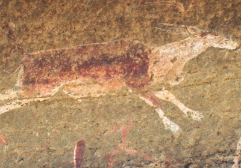

  
[Intangible Textual Heritage](../../index)  [Africa](../index) 

------------------------------------------------------------------------

<table width="75%">
<colgroup>
<col style="width: 50%" />
<col style="width: 50%" />
</colgroup>
<tbody>
<tr class="odd">
<td width="50%" data-valign="TOP"></td>
<td width="50%" data-valign="CENTER"><h1 id="kaffir-xhosa-folk-lore" data-align="CENTER">Kaffir (Xhosa) Folk-Lore:</h1>
<h2 id="by-george-mccall-theal" data-align="CENTER">by George McCall Theal</h2>
<h3 id="section" data-align="CENTER">[1886]</h3></td>
</tr>
</tbody>
</table>

------------------------------------------------------------------------

[Contents](#contents)    [Start Reading](xft00)    [Text
\[Zipped\]](xft.txt.gz)

------------------------------------------------------------------------

This is a collection of folk tales from the South African Xhosa people,
the tribe to which Nelson Mandela belongs. Please note that the original
title of the book uses an appellation for the Xhosa, Kaffir, which today
is considered disrespectful. That said, this is a scholarly collection
of Xhosa tales; it is a primary source on the subject. As such, this
book is part of the cultural heritage of South Africa and is both
entertaining and informative.

------------------------------------------------------------------------

 [Title Page](xft00)  
[Preface](xft01)  
[Contents](xft02)  
[Introductory Chapter Regarding The Kaffirs](xft03)  
[Story Of The Bird That Made Milk. I](xft04)  
[The Story Of The Bird That Made Milk. II](xft05)  
[The Story Of Five Heads](xft06)  
[The Story Of Tangalimlibo](xft07)  
[Story Of The Girl Who Disregarded The Custom Of Ntonjane](xft08)  
[The Story Of Simbukumbukwana](xft09)  
[The Story Of Sikulume](xft10)  
[The Story Of Hlakanyana](xft11)  
[The Story Of Demane And Demazana](xft12)  
[The Runaway Children; Or, The Wonderful Feather](xft13)  
[Story Of Ironside And His Sister](xft14)  
[Story Of The Cannibal's Wonderful Bird](xft15)  
[The Story Of The Cannibal Mother And Her Children](xft16)  
[Story Of The Girl And The Mbulu](xft17)  
[The Story Of Mbulukazi](xft18)  
[The Story Of Long Snake](xft19)  
[The Story Of Kenkebe](xft20)  
[Another Story Of Kenkebe](xft21)  
[Story Of The Wonderful Horns](xft22)  
[The Story Of The Glutton](xft23)  
[Story Of The Great Chief Of The Animals](xft24)  
[Story Of The Hare](xft25)  
[Story Of Lion And Little Jackal](xft26)  
[Proverbs And Figurative Expressions](xft27)  
[Notes: The Story Of The Bird That Made Milk](xft28)  
[Notes: The Story Of Five Heads](xft29)  
[Notes: The Story Of Tangalimlibo](xft30)  
[Notes: Story Of The Girl Who Disregarded The Custom Of
Ntonjane](xft31)  
[Notes: The Story Of Simdukumbukwana](xft32)  
[Notes: The Story Of Sikulume](xft33)  
[Notes: The Story Of Demane And Demazana](xft34)  
[Notes: The Runaway Children](xft35)  
[Notes: The Girl And The Mbulu](xft36)  
[Notes: The Story Of Long Snake](xft37)  
[Notes: The Story Of Kenkebe](xft38)  
[Notes: Story Of Lion And Little Jackal](xft39)  
