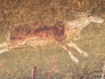

  
[Intangible Textual Heritage](../../index)  [Africa](../index) 
[Index](index)  [Previous](xft09)  [Next](xft11) 

------------------------------------------------------------------------

  
*Kaffir (Xhosa) Folk-Lore*, by George McCall Theal, \[1886\], at
Intangible Textual Heritage

------------------------------------------------------------------------

# THE STORY OF SIKULUME.

There was once in a certain village an old man who was very poor. He had
no children, and only a few cattle. One day, when the sky was clear and
the sun was bright, he sat down by the cattle-fold. While he was sitting
there, he noticed some birds close by which were singing very joyfully.
He listened for a while, and then he stood up to observe them better,
They were very beautiful to look upon, and they sang differently from
other birds. They had all long tails and topknots on their heads. Then
the old man went to the chief and told him what he had seen.

The chief said: "How many were they?

The old man replied: "There were seven."

The chief said: "You have acted wisely in coming to tell me; you shall
have seven of the fattest of my cows. I have lost seven sons in battle,
and these beautiful birds shall be in the place of my seven sons. You
must not sleep to-night, you must watch them, and to-morrow I will
choose seven boys to catch them. Do not let them out of your sight by
any means."

In the morning the chief ordered all the boys of the village to be
assembled at the cattle-fold, when he spoke to them of the birds. He
said "I will choose six of you, and set my son who is dumb, over you,
that will make seven in all. You must catch those birds. Wherever they
go, you must follow, and you must not see my face again without them."
He gave them weapons, and instructed them that if any one opposed them
they were to fight till the last of them died.

The boys set off to follow those beautiful birds. They chased them for
several days, till at last the birds were exhausted, when each of the
boys caught one. At the place where they caught the birds they remained
that night.

On the morning of the next day they set out on their return home. That
evening, they came to a hut in which they saw a fire burning, but no one
was there. They went in, and lay down to sleep. In the middle of the
night one of those boys was awake. He heard some one saying: "There is
nice meat here. I will begin with this one, and take this one next, and
that one after, and the one with small feet the last." The one with the
small feet was the son of the chief. His name was Sikulume, for he had
never been able to speak till he caught the bird. Then he began to talk
at once.

After saying those words the voice was still. Then the boy awakened his
companions, and told them what he had heard.

They said: "You have been dreaming; there is no one here how can such a
thing be?"

He replied: "I did not dream; I spoke the truth."

Then they made a plan that one should remain awake, and if anything
happened, he should pinch the one next him, and that one should pinch
the next, till all were awake.

After a while the boy who was listening heard some one come in quietly.
That was a cannibal. He said the same words again, and then went out for
the purpose of calling his friends to come to the feast. The boy
awakened his companions according to the plan agreed upon, so that they
all heard what was said. Therefore, as soon as the cannibal went out,
they arose and fled from that place. The cannibal came back with his
friends, and when the others saw there was no one in the hut, they
killed and ate him.

As they were going on, Sikulume saw that he had left his bird belaind.
He stood, and said: "I must return for my bird, my beautiful bird with
the long tail and topknot on its head. My father commanded that I must
not see his face, again unless I bring the bird."

The boys said: "Take one of ours. Why should you go where cannibals
are?"

He replied: "I must have the one that is my own."

He stuck his assagai in the ground, and told them to look at it. He
said: "If it stands still, you will know I am safe; if it shakes, you
will know I am running; if it falls down, you will know I am dead." Then
he left them to return to the hut of the cannibals.

On the way he saw an old woman sitting by a big stone. She said: "Where
are you going to?" He told her he was going for his bird. The old woman
gave him some fat, and said: "If the cannibals pursue you, put some of
this on a stone."

He came to the hut and got his bird. The cannibals were sitting outside,
a little way back. They had just finished eating the owner of the hut.
When Sikulume came out with his bird they saw him and ran after him.
They were close to him, when he took some of the fat and threw it on a
stone. The cannibals came to the stone, and began to fight with each
other.

One said: "The stone is mine."

Another said: "It is mine."

One of them swallowed the stone. When the others saw that, they killed
him and ate him. Then they pursued again after Sikulume. They came close
to him again, when he threw the remainder of the fat on another stone.
The cannibals fought for this also. One swallowed it, and was killed by
the others.

They followed still, and Sikulume was almost in their hands, when he
threw off his mantle. The mantle commenced to run another way, and the
cannibals ran after it. It was so long before they caught it that the
young chief had time to reach his companions.

They all went on their way, but very soon they saw the cannibals coming
after them. Then they observed a little man sitting by a big stone.

He said to them: "I can turn this stone into a hut."

They replied: "Do so."

He turned the stone into a hut, and they all went inside, the little man
with them. They played the "*iceya*" there. The cannibals came to the
place and smelt. They thought the hut was still a stone, for it looked
like a stone to them. They began to bite it, and bit till all their
teeth were broken, when they returned to their own village.

After this, the boys and the little man came out.

The boys went on. When they reached their own home they saw no people,
till at length an old woman crept out of a heap of ashes. She was very
much frightened, and said to them: "I thought there were no people
left."

Sikulume said: "Where is my father?"

She replied: "All the people have been swallowcd by the inabulele" (a
fabulous monster).

He said: "Where did it go to?

The old woman replied: "It went to the river."

So those boys went to the river, and Sikulume said to them: "I will go
into the water, and take an assagai with me. If the water moves much,
you will know I am in the stomach of the inabulele; if the water is red,
you will know I have killed it." Then he threw himself into the water
and went down.

The inabulele swallowed him without tearing him or hurting him. He saw
his father and his mother and many people and cattle. Then he took his
assagai and pierced the inabulele from inside. The water moved till the
inabulele was dead, then it became red. When the young men saw that,
they cut a big hole in the side of the inabulele, and all the people and
the cattle were delivered.

One day Sikulume said to another boy I am going, to the doctor's; tell
my sister to cook food for me, nice food that I may eat." This was done.

He said to his sister: "Bring me of the skin of the inabulele which I
killed, to make a mantle." She called her companions, and they went to
the side of the river. She sang this song:-

"Inabulele,  
Inabulele,  
I am sent for you  
By Sikulume,  
Inabulele."

The body of the inabulele then came out. She cut two little pieces of
the skin for sandals, and a large piece to make a mantle for her
brother.

When he was a young man, Sikulume said to his friends: "I am going to
marry the daughter of Mangangezulu."

They replied: "You must not go there, for at Mangangezulu's you will be
killed."

He said: "I will go."

Then he called those young men who were his chosen friends to accompany
him. On the way they came to a place where the grass was long. A mouse
came out of the grass, and asked Sikulume where he was going to.

He replied: "I am going to the place of Mangangezulu."

The mouse sang this song

"Turn back, turn back, Sikulume.  
No one ever leaves the place of Mangangezulu.  
Turn back, turn back, O chief."

Sikulume replied: "I shall not turn back."

The mouse then said: "As it is so, you must kill me and throw my skin up
in the air."

He did so.

The skin said: "You must not enter by the front of the village; you must
not eat off a new mat; you must not sleep in a hut which has nothing in
it."

They arrived at the village of Manggangezulu. They entered it from the
wrong side, so that all the people said: "Why is this?"

They replied: "It is our custom."

Food was brought to them on a new mat, but they said It is our custom to
eat off old mats only."

An empty hut was given to them to sleep in, but they said: "It is our
custom only to sleep in a hut that has things in it."

The next day the chief said to Sikulume and his companions: "You must go
and tend the cattle."

They went. A storm of rain fell, when Sikulume spread out his mantle and
it becarne a hut as hard as stone, into which they all went. In the
evening they returned with the cattle. The daughter of Mangangezulu came
to them. Her mother pressed her foot in the footprint of Sikulume, and
he became an eland.

The girl loved the young chief very much. When she saw he was turned
into an eland, she made a great fire and drove him into it. Then he was
burned, and became a little coal. She took the coal out and put it in a
pot of water, when it became a young man again.

Afterwards they left that place. The girl took with her an egg, a
milksack, a pot, and a smooth stone. The father of the girl pursued
them.

The girl threw down the egg, and it became mist. Her father wandered
about in the mist a long time, till at length it cleared away. Then he
pursued again.

She threw down the milksack, and it became a sheet of water. Her father
tried to get rid of the water by dipping it up with a calabash, but he
could not succeed, so he was compelled to wait till it dried up. He
followed still.

The girl threw down the pot, and it became thick darkness. He waited a
long time till light came again, when he followed them. He could travel
very quickly.

He came close to them, and then the girl threw down the smooth stone. It
became a rock, a big rock with one side steep like a wall. He could not
climb up that rock, and so he returned to his own village.

Then Sikulume went home with his wife. He said to the people: "This is
the daughter of Mangangezulu. You advised me not to go there, lest I
should be killed. Here is my wife."

After that he became a great chief. All the people said: "There is no
chief that can do such things as Sikulume."

------------------------------------------------------------------------

[Next: The Story Of Hlakanyana](xft11)

