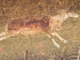

  
[Intangible Textual Heritage](../../index)  [Africa](../index.md) 
[Index](index)  [Previous](xft34)  [Next](xft36.md) 

------------------------------------------------------------------------

  
*Kaffir (Xhosa) Folk-Lore*, by George McCall Theal, \[1886\], at
Intangible Textual Heritage

------------------------------------------------------------------------

# THE RUNAWAY CHILDREN.

There are three or four versions of this story, but all agree in the
main points. In one, it is the grandmother of the children who is the
cannibal, in another, it is their mother, and in a third it is the
husband of their aunt. One version makes Magoda escape with the
children, and introduces a great deal of obscenity. The parts referring
to the bird and the manner of the children's delivery are the same in
all. So also is the episode of the broken pot, but the conversation
between the two girls differs in some respects.

When a Kaffir woman is married, her husband's parents give her a new
name, by which she is known to his family ever after. Upon the birth of
her first child, whether son or daughter, she is frequently called by
every one else after the name given to the child, "the mother of
so-and-so."

The ntengu is rather larger than a swallow, and is of a bright
bluish-black colour. It may often be seen on the backs of cattle,
seeking for insects on which it feeds.

------------------------------------------------------------------------

[Next: Notes: The Girl And The Mbulu](xft36.md)

