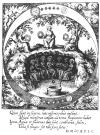

  
[Intangible Textual Heritage](../../index)  [Alchemy](../index.md) 
[Index](index)  [Previous](hm102)  [Next](hm104.md) 

------------------------------------------------------------------------

[Buy this Book at
Amazon.com](https://www.amazon.com/exec/obidos/ASIN/B001VKXXVQ/internetsacredte.md)

------------------------------------------------------------------------

*The Hermetic Museum, Vol. I*, by Arthur Edward Waite, \[1893\], at
Intangible Textual Heritage

------------------------------------------------------------------------

p. 1

# THE HERMETIC MUSEUM

###### RESTORED AND ENLARGED.

## VOLUME I

p. 2

  [  
Click to enlarge](img/00200.jpg.md)

p. 3

### TABLE OF CONTENTS.

### VOLUME I.

<table data-border="0">
<colgroup>
<col style="width: 50%" />
<col style="width: 50%" />
</colgroup>
<tbody>
<tr class="odd">
<td data-valign="top">
 
</td>
<td data-valign="top">
PAGE.
</td>
</tr>
<tr class="even">
<td data-valign="top">
 
I.—THE GOLDEN TRACT concerning the Stone of the Philosophers, by an Anonymous German Adept
</td>
<td data-valign="bottom">
<a href="hm104.htm#page_5">5</a>
</td>
</tr>
<tr class="odd">
<td data-valign="top">
 
II.—THE GOLDEN AGE RESTORED: Having now appeared a second time, flourished beautifully, and brought forth fragrant and Golden Seed. This rare and precious Seed is shewn and imparted to all the Sons of True Wisdom and the Doctrine, by Henry Madathanas
</td>
<td data-valign="bottom">
<a href="hm105.htm#page_51">51</a>
</td>
</tr>
<tr class="even">
<td data-valign="top">
 
III.—THE SOPHIC HYDROLITH; or, Water Stone of the Wise, that is, a Chemical Work, in which the Way is shewn, the Matter named, and the Process described; namely, the Method of obtaining the Universal Tincture
</td>
<td data-valign="bottom">
<a href="hm106.htm#page_69">69</a>
</td>
</tr>
<tr class="odd">
<td data-valign="top">
 
IV.—A DEMONSTRATION OF NATURE, made to the erring Alchemists, and complaining of the Sophists and other False Teachers. Set forth by John A. Mehung
</td>
<td data-valign="bottom">
<a href="hm107.htm#page_121">121</a>
</td>
</tr>
<tr class="even">
<td data-valign="top">
 
V.—A SHORT TRACT, or PHILOSOPHICAL SUMMARY, by Nicholas Flamell
</td>
<td data-valign="bottom">
<a href="hm107.htm#page_141">141</a>
</td>
</tr>
<tr class="odd">
<td data-valign="top">
p. 4
</td>
<td data-valign="bottom">
 
</td>
</tr>
<tr class="even">
<td data-valign="top">
 
VI.—THE ONLY TRUE WAY; or, an useful, good, and helpful Tract, pointing out the Path of Truth
</td>
<td data-valign="bottom">
<a href="hm109.htm#page_149">149</a>
</td>
</tr>
<tr class="odd">
<td data-valign="top">
 
VII.—THE GLORY OF THE WORLD; or, Table of Paradise; that is to say, a True Account of the Ancient Science which Adam learned from God Himself; which Noah, Abraham, and Solomon held as one of the Greatest Gifts of God; which also all Sages, at all times, preferred to the wealth of the whole world, regarded as the Chief Treasure of the whole world, and bequeathed only to Good Men; namely, the Science of the Philosopher's Stone
</td>
<td data-valign="bottom">
<a href="hm110.htm#page_165">165</a>
</td>
</tr>
<tr class="even">
<td data-valign="top">
 
VIII.—A TRACT OF GREAT PRICE, published by a German Sage in the year 1423, under the following title: The True Teaching of Philosophy concerning the Generation of Metals and their True Origin
</td>
<td data-valign="bottom">
<a href="hm111.htm#page_245">245</a>
</td>
</tr>
<tr class="odd">
<td data-valign="top">
 
IX.—A VERY BRIEF TRACT CONCERNING THE PHILOSOPHICAL STONE. Written by an unknown German Sage, about 200 years ago, and called The Book of Alze
</td>
<td data-valign="bottom">
<a href="hm112.htm#page_259">259</a>
</td>
</tr>
<tr class="even">
<td data-valign="top">
 
X.—THE BOOK OF LAMBSPRING, a noble ancient Philosopher, concerning the Philosophical Stone, by Nicholas Barnaud Delphinas
</td>
<td data-valign="bottom">
<a href="hm113.htm#page_271">271</a>
</td>
</tr>
<tr class="odd">
<td data-valign="top">
 
XI.—THE GOLDEN TRIPOD; or, Three Choice Chemical Tracts, namely: That of Basilius Valentinus, a Monk of the Benedictine Order, called Practica, with Twelve Keys and an Appendix
</td>
<td data-valign="bottom">
<a href="hm114.htm#page_307">307</a>
</td>
</tr>
</tbody>
</table>

------------------------------------------------------------------------

[Next: The Golden Tract Concerning the Stone of the Philosophers](hm104.md)
