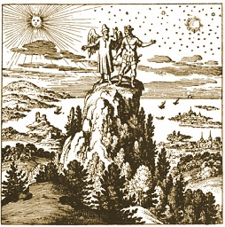

  
[Intangible Textual Heritage](../../index)  [Alchemy](../index) 

------------------------------------------------------------------------

[Buy this Book at
Amazon.com](https://www.amazon.com/exec/obidos/ASIN/B001VKXXVQ/internetsacredte)

------------------------------------------------------------------------

[Hermetic Museum Index](../hermmuse/index)  
**VOL. I** \| [VOL. II](../hm2/index)

------------------------------------------------------------------------

<table width="75%">
<colgroup>
<col style="width: 50%" />
<col style="width: 50%" />
</colgroup>
<tbody>
<tr class="odd">
<td width="50%" data-valign="TOP"> 
Book of Lambspring, figure 12 (Public Domain Image)</td>
<td width="50%" data-valign="CENTER"><h1 id="the-hermetic-museum-volume-i" data-align="CENTER">The Hermetic Museum, 
Volume I</h1>
<h2 id="translated-by-arthur-edward-waite" data-align="CENTER">translated by Arthur Edward Waite</h2>
<h4 id="section" data-align="CENTER">[1893]</h4></td>
</tr>
</tbody>
</table>

------------------------------------------------------------------------

[Contents](#contents)    [Start Reading](hm100)    [Page
Index](pageidx)    [Text \[Zipped\]](hm1.txt.gz)

------------------------------------------------------------------------

|                                                                                                                           |
|---------------------------------------------------------------------------------------------------------------------------|
|  |

------------------------------------------------------------------------

 [Title Page](hm100)  
[Preface to the English Edition](hm101)  
[Preface to Latin Original](hm102)  
[Contents of Volume I](hm103)  
[The Golden Tract Concerning the Stone of the Philosophers](hm104)  
[The Golden Age Restored](hm105)  
[The Sophic Hydrolith](hm106)  
[A Demonstration of Nature](hm107)  
[A Short Tract or Philosophical Summary](hm108)  
[The Only True Way](hm109)  
[The Glory of the World; or, Table of Paradise](hm110)  
[A Tract of Great Price](hm111)  
[The Book of Alze](hm112)  
[The Book of Lambspring](hm113)  
[The Golden Tripod](hm114)  
