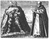

  
[Intangible Textual Heritage](../../index)  [Alchemy](../index) 
[Index](index)  [Previous](hm202)  [Next](hm204) 

------------------------------------------------------------------------

[Buy this Book at
Amazon.com](https://www.amazon.com/exec/obidos/ASIN/B001VKXXWK/internetsacredte)

------------------------------------------------------------------------

*The Hermetic Museum, Vol. II*, by Arthur Edward Waite, \[1893\], at
Intangible Textual Heritage

------------------------------------------------------------------------

p. 68 p. 69

# THE TESTAMENT

###### OF

## CREMER,

###### ABBOT OF WESTMINSTER. AND BROTHER OF THE BENEDICTINE ORDER.

  [  
Click to enlarge](img/06900.jpg)

p. 70

A TETRASTICH ON THIS WORK.

By M. M.

<table data-border="0" width="75%">
<colgroup>
<col style="width: 100%" />
</colgroup>
<tbody>
<tr class="odd">
<td data-valign="top" width="655">
"Either the meaning of the Author or the letter of his writings is deceitful. Be on your guard, therefore. Everywhere a serpent lurks among the flowers. Yet scorn not a friend who spoke as plainly as he might. Beneath the shadowy foliage of words is concealed the golden fruit"

"OF"

"TRUTH."
</td>
</tr>
</tbody>
</table>

p. 71

#### THE TESTAMENT

###### OF

## CREMER, THE ENGLISHMAN,

###### ABBOT OF WESTMINSTER, AND FRIAR OF THE BENEDICTINE ORDER.

I HAVE attempted to give a full and accurate account of Alchemy without
using any of those obscure technical terms, which have proved so serious
a stumbling-block in the way of many students of this Art. I am here
describing my own experience during the thirty years which I spent and
wasted in perusing the writings of authors whose whole ingenuity seemed
to have been concentrated upon the Art of expressing thought in
unintelligible language. The more I read the more hopelessly I went
astray, until Divine Providence at length prompted me to undertake a
journey to Italy, and caused me to be accepted as a disciple by that
noble and marvellously learned Master Raymond, with whom I remained for
a long time. In his eyes I found such favour that he not only unfolded
to me a partial knowledge of this Great Mystery, but at my most earnest
entreaty, accompanied me to this island of England, and lived with me
here two years. During his stay he thoroughly instructed me in the whole
secret of the work. Subsequently, I introduced my noble master to his
most gracious Majesty King Edward, who received him kindly and
honourably, and obtained from him a promise of inexhaustible wealth, on
condition that he (the King) should in person conduct a Crusade against
the Turks, the enemies of God, and that he should thenceforward refrain
from making war on other Christian nations. But, alas, this promise was
never fulfilled, because the King grossly violated his part of the
contract, and compelled my dear master to fly

p. 72

beyond the seas, with sorrow and grief in his soul. My heart still burns
within me when I think of the unjust treatment which he received, and I
have no more earnest longing than once more to behold his bodily
presence. For the model of his daily life, and the purity and integrity
of his mind, would move the most inveterate sinner to repentance.

In the meantime, rest assured, most blessed Raymond, that I and my
brethren day by day pour out our prayers before God on your behalf. All
wisdom is derived from God, and ever ends in Him. Any one who desires
knowledge should ask it of Him, for he gives liberally, and without
upbraiding. The height and the depth of all knowledge, and the whole
treasure of wisdom are given unto men of God, because in Him, and to
Him, and through Him are all things, and nothing can happen without His
will. In beginning my discourse I invoke the help of Him Who is the
source and origin of all good things. May the bright light of His Spirit
shine in my heart, and guide me into all truth; also enabling me to
point out to others the true path of Knowledge! May this prayer be
granted by Him who is enthroned on High, and rules and governs all
things, world without end! Amen.

"In the Beginning was the Word. . . . . . . . . . . .full of grace and
truth."

\_\_\_\_\_

*Prayer*.

Holy Lord, Almighty Father, Eternal God, deign to bless and sanctify the
fire which we unworthy men, by invocation of Thy only-begotten Son our
Lord Jesus Christ, presume to bless. Hallow it, most gracious God, with
Thy benediction, and let it tend to the good of the human race, through
our Lord Jesus Christ.

Good Lord, Creator of the Red Light,  
Who dividest the times by certain seasons,  
When the Sun vanishes, fearful Chaos comes again:  
Oh Christ, restore the light to Thy faithful people! p. 73

Though Thou hast studded heaven's floor with stars,  
And inlaid it with the bright lamp of the Moon,  
Yet Thou dost teach us also to strike light out of flints,  
And to fan it into life out of the stone-born spark.

Thou art the true light of the eyes, and the light of the senses;  
A mirror Thou art of things without and of things within.  
Accept this light which I bear, ministering,  
Tinged with the unction issued from the peace-bearing virgin.

To Thee we come, great Father, thro’ Thine only Son,  
In whom Thy glory visibly shines forth,  
And through Him, the Blessed Comforter,  
Whom Thou didst send forth from Thy great heart.

In whom Thy Brightness, Honour, Light, and Wisdom,  
Majesty, Goodness, and Mercy  
Dwell with us throughout the Ages,  
And draw us up to the Fountain of Light. Amen.

\_\_\_\_\_\_\_\_

#### CHAPTER I.

*How to prepare the living water which constitutes the life of our Art*.

Take three oz. of tartar of good claret, strong and pure. Add to it five
oz. of Petroleum, two oz. of living sulphur, two oz. of orange-coloured
Arsenic, three oz. of Rabusenum, two oz. of willow charcoal. Mix and
distil all these ingredients in the "Bath of Neptune," in a
well-stoppered glass jar. Let this jar be about one cubit high, and
carefully closed to prevent any of the spirits or smoke from
evaporating. When you see it turn of a pale colour, take it out of the
furnace, and let it cool. You ought to be able to prepare it in about
four days. Be careful not to inhale its smell, for it is deadly poison.
This water should be kept in a stout well-stoppered glass jar, and used
according to the directions given in the following chapters.

The *other water* should be twice distilled out of the urine of an
unpolluted youth of eighteen; if he be polluted, the water will have no
vitality.

p. 74

#### CHAPTER II.

Take the water of an unpolluted youth after his first sleep for three or
four nights, until you have three pints. Put it each night into a
well-stoppered stone jar; remove the sediment. Strain out one pint of
the thinnest and purest part of the liquid. Add two glasses of very
strong vinegar, two oz. of quicklime, half-an-ounce of the "living
water," of which the preparation has been described above. Put the
mixture into an earthen pot, and place over it an alembic or distilling
vessel, rendered airtight with clay. Let it stand one day and one night
before you put it on the fire. Then expose it to gentle heat, and let it
distil continually for five or six days and nights. Thus let it flow by
drops; carefully lute your glass receptacle so that neither spirit nor
smoke may escape, and when the liquor distilling assumes a blue or
pallid colour, then abstract nothing further.

#### CHAPTER III.

Smelt eight oz. of clear, hard iron ore, having no blemishes, in three
or four parts, over a fierce charcoal fire; extinguish it with so much
of the Virgin water described in the second chapter as may be necessary
for the purpose. Then take three oz. of tin, heat it for a short time in
the fire, and steep it in the Virgin water. Pound the iron ore and the
tin very small on a marble tablet, and when it begins to cool feed it
with some of the water aforesaid. Pour the whole into a narrow-necked
glass bottle, and seal it up with lead. Put it in a safe place, and in
October you should fill a water-tight box (about one yard in height)
with fresh horse dung, and thrust your glass vessel into it. Next to the
bottle let there be a layer of unslaked quick-lime. Shut the lid of the
box closely, and never look at the mixture but at the time of the full
moon. Its colours will continue to change until it becomes fixed and
hardened. Then it is precipitated towards the bottom of the vessel. When
it has been in the box twelve weeks, it should be quite black. You may
then take it out, and keep it till the twentieth day of March, when it
should be once more pounded small, according to the directions given
below.

p. 75

#### CHAPTER IV.

About the fifteenth day of March take three oz. of quicksilver, and add
to it half-an-oz. of "living water." Pass the quicksilver five times
through a strainer purged with lye and well dried. Melt two pounds of
lead, and pour it into a pot. When it becomes liquid, thrust into it a
thin round skewer, and when the lead is still warm, but already fixed,
remove the skewer, and pour in the quicksilver instead. When the whole
mass has cooled turn it out on a slab of marble, pour some oil over it,
pound it small, divide it into three parts, mix each with small pilules
of soot. Leave them in a closely sealed vessel for eight days, stamp
them to powder, and nourish this powder with a liquid compounded in
equal proportions of vinegar and "Virgin water." Put the soft paste
which must thus be formed into a high glass distilling vessel. Close up
the upper part of the vessel with clay, and tie it up with a piece of
leather or parchment. Then plunge it into a wooden box, containing
glowing coals of juniper wood and oak, and a twentieth part of iron
filings. To test the degree of the fire before inserting the vessel put
in it a piece of dry paper. If it catches alight the fire is not too
hot, but if the thin shreds which remain of the paper after burning are
also consumed, then the heat is excessive, and the door must be opened
till the temperature lowers; when it has become properly warm, carefully
add to it a spoonful of "living water" (described in the first chapter).
But take care that the still is only three-quarters covered with the
coals, in order that you may, whenever the moon is full, be able quickly
to remove the cover, and see how the work is progressing. Whenever you
perform this, add a spoonful of "living water." At first the colour of
the mixture should be black; afterwards it will become white, and will
pass through various changes of colour. When the mixture turns solid or
fixed, its colour should be red of a somewhat dark tinge, and it should
also be saline and heavy, no longer flowing or bubbling up towards the
top of the vessel. It ought to be treated in the manner suggested for
forty weeks, beginning on the twenty-fifth of March. By the end of this
period the mixture will have become so hard as to burst the vessel. When
this happy event takes place, the whole house will be filled with a

p. 76

most wonderfully sweet fragrance; then will be the day of the Nativity
of this most blessed Preparation. Remember, that the iron box with the
coals ought to be enclosed in another wooden box, of which the object is
to preserve the compound from the noxious influences of the air.

#### CHAPTER V.

Take two pounds of pure and soft lead, two pounds of pure tin, and melt
them in the above-mentioned well-covered clay jar. Place the whole on a
wood fire, and keep it in a moderate blaze for three hours. Remove the
"foam" of the metallic ore, till the whole mixture is pure and
transparent, then add to it a fourth part of an ounce of the Red Stone
powdered. Stir it gently with an iron spoon until the whole mass turns
red. Leave the jar for seventy-two hours, and during the last three
hours expose it once more to the gentle heat of a blazing wood fire.
While it is still liquid you can mould it into any shape you please;
when it hardens you have before your eyes the Consummation of the whole
work. Mind you lift up your hands in grateful prayer to the Giver of all
good gifts. So be it.

#### CHAPTER VI.

*How to prepare a fire proof clay jar in which  
to melt the metal*.

Take well-tempered potter's clay, or the white earth which is called
Taxonium; mix it with a tenth part of horse dung. When the jar has been
formed, and is half dried, cover it with thin filings of red or
caldarium copper and fine powder of red arsenic. When it is quite dry,
smear all its lower part with saltpetre dissolved for twelve hours in
the "living water" of our first chapter.

*How to prepare the Clay*.

Make the "clay" which you are to use for stopping up your vessel and
keeping it air-tight, of bitumen, or quicklime mastic, and the white of
eggs, well mixed with a little white Armenian bolus. Let your petroleum
be clear, pure, and yellow. Your Rabusenum should be clear, and of a
bright vermilion.

p. 77

It is my wish that Brother Alexander, and Richard, of this our
Monastery, should copy this Testament in the name of the Most Blessed
Trinity, and preserve it carefully.

In the first place, let them diligently keep the secret from all greedy
and nefarious persons, and reveal it to none but the Abbot and Prior,
for the time being, of our Monastery. Nor should it be made known to
them until they have sworn on the four Gospels that they will not reveal
it to any men in power, or to any of the inferior brethren of our
Monastery.

Moreover, it is my wish that the Art be not actually exercised in this
our Monastery, except to save it from penury and ruin—a contingency
which is not likely to happen, seeing that I leave to it so great a
treasure of precious metals. I also enjoin upon you who are in authority
in this house, to wit, the Abbot and Prior, to have this my last will
and testament copied once in every sixty years, in order that it may not
become illegible, either through the ravages of time, or through a
change in the form of those written characters which render man's
thought permanent.

Furthermore, I command you not to betray the secret of the preparation
of the Red Dragon's Blood, or the quantities of substances required, or
the manner of their treatment, or the time when the work should be taken
in hand, to any human soul, except to the persons named above; and I
adjure you to keep and preserve intact, inviolate, and unbroken the
trust committed to you, in the Name of the Father, the Son, and the Holy
Spirit, as you will one day have to answer me before the judgment seat
of Christ. Whoever does not observe this my mandate, let his name be
blotted out from the Book of Life.

Magnesia is the smelted ore of iron. When the mixture is still black it
is called the Black Raven. As it turns white, it is named the Virgin's
Milk, or the Bone of the Whale. In its red stage, it is the Red Lion.
When it is blue, it is called the Blue Lion. When it is all colours, the
Sages name it Rainbow. But the number of such names is legion: and I can
only mention these few. Moreover, they were only invented for the
purpose of confounding the vulgar, and hiding this mystery from the
simple. Whenever you meet with a book full of these strange and
outlandish terms and names, throw it aside at once: it will not teach
you anything.

p. 78

*Rabusenum* is a certain red substance and earth coming forth with
water, which flows out of minerals, and is brought to perfection in the
month of July in a glass jar exposed to the heat of the sun for 26 days.

------------------------------------------------------------------------

[Next: The New Chemical Light](hm204)
