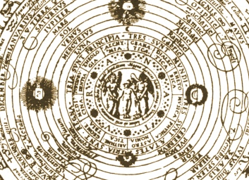

  
[Intangible Textual Heritage](../../index)  [Alchemy](../index.md) 

------------------------------------------------------------------------

[Buy this Book at
Amazon.com](https://www.amazon.com/exec/obidos/ASIN/B001VKXXWK/internetsacredte.md)

------------------------------------------------------------------------

[Hermetic Museum Index](../hermmuse/index.md)  
[VOL. I](../hm1/index.md) \| **VOL. II**

------------------------------------------------------------------------

<table width="75%">
<colgroup>
<col style="width: 50%" />
<col style="width: 50%" />
</colgroup>
<tbody>
<tr class="odd">
<td width="50%" data-valign="TOP"> 
The All-Wise Doorkeeper, Fig. II, detail (p. 305)</td>
<td width="50%" data-valign="CENTER"><h1 id="the-hermetic-museum-volume-ii" data-align="CENTER">The Hermetic Museum, 
Volume II</h1>
<h2 id="translated-by-arthur-edward-waite" data-align="CENTER">translated by Arthur Edward Waite</h2>
<h4 id="section" data-align="CENTER">[1893]</h4></td>
</tr>
</tbody>
</table>

------------------------------------------------------------------------

[Contents](#contents)    [Start Reading](hm200.md)    [Page
Index](pageidx)    [Text \[Zipped\]](hm2.txt.gz.md)

------------------------------------------------------------------------

|                                                                                                                           |
|---------------------------------------------------------------------------------------------------------------------------|
|  |

------------------------------------------------------------------------

 [Title Page](hm200.md)  
[Table of Contents](hm201.md)  
[Believe-Me, or The Ordinal of Alchemy](hm202.md)  
[The Testament of Cremer](hm203.md)  
[The New Chemical Light](hm204.md)  
[New Chemical Light](hm205.md)  
[An Open Entrance to the Closed Palace of the King](hm206.md)  
[A Subtle Allegory Concerning the Secrets of Alchemy](hm207.md)  

### The Three Treatises of Philalethes

[Title and Contents](hm208.md)  
[I. The Metamorphosis of Metals](hm209.md)  
[II. A Brief Guide to the Celestial Ruby](hm210.md)  
[III. The Fount of Chemical Truth](hm211.md)  

 

[Helvetius’ Golden Calf](hm212.md)  
[The All-Wise Doorkeeper or A Fourfold Figure](hm213.md)  
[Addendum](hm214.md)  
