  
[Intangible Textual Heritage](../../index)  [Americana](../index.md) 
[Index](index)  [Previous](am14)  [Next](am16.md) 

------------------------------------------------------------------------

[Buy this Book on
Kindle](https://www.amazon.com/exec/obidos/ASIN/B002HRE4BU/internetsacredte.md)

------------------------------------------------------------------------

  
*The Amish*, by A.M. Aurand, \[1938\], at Intangible Textual Heritage

------------------------------------------------------------------------

p. 15

### ILLUSTRATIONS

  [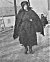  
Click to enlarge](img/01500.jpg.md)

**In Haste**.—Amish woman on a cold day going to a public "vendue," one
of their delights and a way to save money.

  [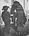  
Click to enlarge](img/01501.jpg.md)

**Willing Little Helpers**.—Twins help mother carry a purchase of plates
and some odds houle from a public sale.

  [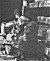  
Click to enlarge](img/01502.jpg.md)

**Nonchalance**.—Three trusting youngsters waiting—until the canera
snaps—and they are off in a great big flash.

  [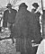  
Click to enlarge](img/01503.jpg.md)

**Contemplation**.—An Amish woman has purchased an ironing-board at a
sale, and now says to herself: "Is it o. k?"

p. 16

**THE CANDID CAMERA GOES INTO ACTION IN LANCASTER COUNTY**

(All photos by Chas. S. Rice, except one [above](#img_01600), by Kepler.md)

  [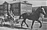  
Click to enlarge](img/01600.jpg.md)

**Contrast**.—An Amishman and helpmate on a wagon with modern springs,
passing a school building in Belleville. Education in the higher grades
is op-posed by them as unnecessary and tending toward worldliness. ()

  [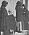  
Click to enlarge](img/01601.jpg.md)

**Bonnets and Shawls**.—The Amish, too, have time for conversation. Note
the bonnets, and initials low on shawl, left. ([Upper row,
center](#img_01601).md)

  [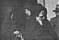  
Click to enlarge](img/01700.jpg.md)

**Satisfaction**.—Here we see the contented expression of a successful
bidder at a public sale. Possibly the woman in the foreground did the
bidding for the one to the left, while the one in the center says: "Oh!"
([Upper right](#img_01700).md)

  [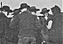  
Click to enlarge](img/01602.jpg.md)

**All Together** . . . Broad-brimmed hats, full-grown whiskers, heavy
sweaters, a great-coat or two, and a bonnet. We don't know what she
might be saying, but her audience is giving her all possible attention.
([Lower left](#img_01602).md)

  [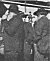  
Click to enlarge](img/01603.jpg.md)

"Rule of Thumb."—Patriarchal Amishman in animated conversation indicates
his "point" by an old standard. ([Lower row, center](#img_01603).md)

  [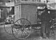  
Click to enlarge](img/01701.jpg.md)

**Transportation**—Nearly every "Old Order" Amishman has a buggy as the
highest type of transportation with which to get to town. Patterned so
alike, it remains for the Amish to say: "We know ’em!" ([Lower
right](#img_01701).md)

p. 18

  [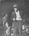  
Click to enlarge](img/01800.jpg.md)

**Father and Son**.—Amishman with store suspenders and "broadfall" pants
(no fly) . . . and a bewildered-looking boy.

  [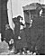  
Click to enlarge](img/01801.jpg.md)

**Curiosity**.—The child on the left just "wants to see" . . . while the
one in the center "listens in" on the conversation.

  [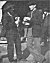  
Click to enlarge](img/01802.jpg.md)

**Religion** . . . is the topic of this pair, as when most Amish gather.
Child, in center, and man at right, eat ice cream.

  [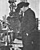  
Click to enlarge](img/01803.jpg.md)

**Planning**.—"I got the stuff at my own price, now I wonder how I'll
ever get it 'to home' without a neighbor's help."

------------------------------------------------------------------------

[Next: Books About the Amish and the Mennonites](am16.md)
