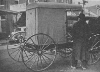

  
[Intangible Textual Heritage](../../index)  [Americana](../index.md) 

------------------------------------------------------------------------

[Buy this Book on
Kindle](https://www.amazon.com/exec/obidos/ASIN/B002HRE4BU/internetsacredte.md)

------------------------------------------------------------------------

<table width="75%">
<colgroup>
<col style="width: 50%" />
<col style="width: 50%" />
</colgroup>
<tbody>
<tr class="odd">
<td width="50%" data-valign="TOP"> 
Amish Buggy</td>
<td width="50%" data-valign="CENTER"><h1 id="the-amish" data-align="CENTER">The Amish</h1>
<h2 id="by-ammon-monroe-aurand-jr." data-align="CENTER">by Ammon Monroe Aurand, Jr.</h2>
<h4 id="section" data-align="CENTER">[1938]</h4></td>
</tr>
</tbody>
</table>

------------------------------------------------------------------------

[Contents](#contents)    [Start Reading](am00.md)    [Page
Index](pageidx)    [Text \[Zipped\]](am.txt.gz.md)

------------------------------------------------------------------------

|                                                                                                                           |
|---------------------------------------------------------------------------------------------------------------------------|
|  |

This is a short pamphlet about the Amish written in the 1930s by A.M.
Aurand, Jr., a local Pennsylvania writer who self-published a number of
similar booklets. Written in a conversational style, this outsider
account is sympathetic and provides a surprising amount of detail about
Amish and Mennonite religious beliefs and practices. Because Amish life
is deeply conservative, this treatment remains useful for understanding
their culture, even though it was written decades ago.

------------------------------------------------------------------------

 [Title Page](am00.md)  
[An Amishman Writes](am01.md)  
[These Odd Folk Called ''Amish''](am02.md)  
[Quaintness of Hair Styles and Dress Attract Attention](am03.md)  
[Amish In Mifflin County Accounted Leading Conservatives](am04.md)  
[Amish and Mennonites Are World-Famed Agriculturalists](am05.md)  
[Religious Services Are Held In Their Houses and Barns](am06.md)  
[Bundling and Marriage Customs Are Interesting and Unique](am07.md)  
[Funerals and Superstitions Attract Outside Interest](am08.md)  
[Temperance and Frugality Are Two Outstanding Attributes](am09.md)  
[Woman's Place Is In the Home and In the Harvest Fields](am10.md)  
[The German Language and ''Dutch'' Dialect Familiar To All](am11.md)  
[Historical Account of the Amish and the Mennonites](am12.md)  
[Amish-Mennonite Statistics](am13.md)  
[The True ''faith and Practice'' of the Brethren, or
''Dunkers''](am14.md)  
[Illustrations](am15.md)  
[Books About the Amish and the Mennonites](am16.md)  
