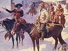

  
[Intangible Textual Heritage](../../index)  [Americana](../index) 
[Index](index)  [Previous](cig09)  [Next](cig11) 

------------------------------------------------------------------------

  
*Coffee in the Gourd*, ed. J. Frank Dobie \[1923\], at Intangible
Textual Heritage

------------------------------------------------------------------------

### MISCELLANY OF TEXAS FOLK-LORE

### BY W. P. WEBB

    The folk-lore presented here is nothing more than a miscellaneous
collection. A few of the selections bear unmistakable signs of
authorship; others are parodies on well-known religious or popular
songs. Each selection, however, has this feature in common with all
folk-lore: it lives and is handed down by word of mouth by some class or
group.

### I

### HOBO SONGS

    The first songs I shall give were collected from two hobos who were
placed in the police station at Cuero, Texas. They were picked up as
suspicious characters after a local diamond robbery and placed in
prison. Upon being liberated, they found it impossible to get out of
town, and voluntarily returned to the police station and asked to be
locked up for the night and fed. One of the school boys happened to get
in conversation with them and got one song in the hobo's own
handwriting. The hobo wrote an excellent business hand, and the
punctuation and capitalization showed him to be a man of more than
average education. On the morning--following I went down to the police
station and got some other songs. The hobos talked freely and
interestingly. They said they learned the songs when in the I. W. W.
(International Workmen of the World, or I Won't Work). They spoke of the
I. W. W.'s as "Wobblers." I asked one where they were from. He shrugged
his shoulders, sucked his cigarette, and said: "Oh, everywhere. We've
been to the Pacific and to the Atlantic, so we can't say where we're
from." After a moment he added rather whimsically, "We been everywhere
looking for work, and--never able to find it."

    The first song, an obvious parody, was sung to the good religious
tune of "Hallelujah, Thine the Glory."

HALLELUJAH, BUM AGAIN

When spring time does come,  
O won't we have fun.  
We'll throw up our jobs  
And we'll go on the bum.

Chorus:

Hallelujah, I'm a bum,  
Hallelujah, bum again,  
Hallelujah, give us a handout  
To revive us again.

I went up to a house  
And I knocked on the door,  
A lady came out  
And said, "You've been here before."

Chorus:

I went up to a house  
And I asked for a piece of bread,  
A lady came out  
And said, "The baker is dead."

Chorus:

I went up to a house  
And I asked for a pair of pants;  
A lady came out  
And said, "I don't clothe no tramps."

Chorus:

I went into a saloon,  
And I bummed him for a drink;  
He gave me a glass  
And he showed me the sink.

Chorus:

"Why don't you go to work  
Like other men do?"  
"How the hell are we going to work  
When there's no work to do."

Chorus:

YOU'LL EAT PIE BYE AND BYE

Holy Rollers and Jumpers come out,  
And they holler and jump and they shout,  
But when eating time comes around they will say,  
"You will eat on that glorious day."

Chorus:

You will eat bye and bye,  
In that glorious land way up high,  
Work and pray, live on hay,  
You'll eat pie in the sky bye and bye, that's no lie.

    Another ballad, and the best one given by the hobo, is entitled
"Tramp, Tramp, Tramp, Keep on a-Tramping." He said he learned it out in
Denver where the "wobblers" ran the Salvation Army off the street. The
tune is familiar to all.

TRAMP, TRAMP, TRAMP, KEEP ON A-TRAMPING

He walked up and down the street  
Till the shoes fell off his feet,  
Across the street he spied a lady cooking stew.  
And he said, "How do you do,  
May I chop some wood for you?"  
But what the lady told him made him feel so blue.

Chorus:  
"Tramp, tramp, tramp, keep on a-trampin',  
There is nothing here for you;  
If I catch you 'round again,  
You will wear the ball and chain,  
Keep a-trampin', that's the best thing you can do."

Across the street a sign he read,  
"Work for Jesus," so it said.  
And he said, "Here is my chance, I'll surely try."  
And he kneeled upon the floor  
Until his knees got rather sore,  
But at eating time he heard the preacher cry.

Chorus:

Down the street he met a cop,  
And the copper made him stop,  
And he said: "When did you blow into town?"  
And he took him to the judge,  
But the judge he said, "Ah fudge!  
Bums that have no money need not come around."

Chorus:

   The last song is but a parody of "A Soldier of the Legion."

THE DYING HOBO AT THE WESTERN WATER TANK

Out in Denver on a cold November day,  
Inside an empty box-car, a dying hobo lay.  
His partner stood beside him, with low and drooping head,  
Listening to the last words the dying hobo said.

"Tell my sweetheart back in Denver not to weep for me,  
Not a tear in her eye must lurk,  
For I'm going to a land where I don't have to work;  
You can sleep out nights, and don't have to wear no socks,  
And little streams of whiskey come trickling out of the rocks.

"Hark! I hear a whistling, I must catch her on the fly;  
Farewell, partner, I must leave you, I'm not afraid to die."  
The hobo stopped, his head fell back, as he sang his last refrain.  
His partner swiped his hat and socks, and caught the east bound train.

### II

### RAILROAD SONGS

Ole J. Gould owns the Katy line, the C. B. & the Q.,  
Owns the C. & A, Cannon Ball, gettin' richer every day,  
And if you niggers doan look out, he'll own the Santa Fe.

A few more words I'll write to you,  
Before I bid you all adieu,  
And if I live two months or three,  
I vow I'll leave old Santa Fe.

GOING TO LEAVE THE I. & G.

I went down to my mother's house,  
I overstayed my time,  
    Early Monday morning.  
The boss struck me thirty-nine,

Called me in to breakfast,  
And scarcely gave me time,  
To eat a piece of buttered bread  
And an old bacon rind.

Chorus:  
Going to leave the I. & G.  
    Tra-la-la-la-la,  
Going upon the T. & P.  
    Tra-la-la-la-la.

Ole Mistress, will you be so kind  
And give me a bite to eat,  
A little, piece of buttered bread,  
And a little piece of meat,  
A little piece of custard pie,  
To soothe my appetite.

Chorus:

All along the I. & G.,  
Waiting for a freight,  
Roving the old Island down,  
With not a bite to eat.  
If the brakeman catches me,  
My waiting's all in vain,  
It's skip out, you jolly bum,  
And catch the next freight train.

Chorus:

### III

### SLUM SONGS

THE PEANUT GIRL AND THE POLICEMAN

Listen to me, all you fair maids,  
While a story I will tell;  
It's all about a peanut girl,  
Who cut a mighty swell.

She lived with her mother up seven pair of stairs,  
On' the Bowery near Grand;  
But her place of business was on Broadway,  
Where she kept a peanut stand.

A rowdy or a spree one day,  
As down the street was bent,  
He ran against the peanut stand,  
And away the peanuts went.

A young policeman standing by  
With a big club in his hand,  
He marched the rowdy off to jail  
For upsetting the peanut stand.

She loved the young policeman then,  
And he bought her peanuts too,  
She loved his German silver star,  
And his coat all trimmed in blue.

They loved each other like Shanghai fowls,  
Roving round in spring;  
They went to the lager beer saloon  
To hear the Dutchmen sing.

    Some part of the song seems to have been left out here, as the
narrative is broken.

The Atlantic Cable brought no news,  
And peanuts took a rise;  
And the peanut girl is a bankrupt now,  
And the young policeman lied.

    The next song belongs in the same class as "Albert," the famous
negro song. It makes use of a refrain at the end of each stanza that
seems absolutely meaningless.

DEPEND ON ME, CHOLLIE, GOD KNOWS

Twinkle, twinkle, said a little star,  
Here comes Brady on a cable car,  
Knockin' out windows, breakin' down doors,  
Tryin' to keep even with the Sandy slows (St. Louis--)

    'Pend on me, Chollie, God knows.

Brady walked down the street,  
Stepped into Duncan's saloon,  
Told old man Duncan to consider himself under arrest.  
Old man Duncan placed a 44 right in Brady's chest.

    'Pend on me, Chollie, God knows.

News came around that Old Brady was dead,  
Came to his wife. "It can't be so,  
For my husband left here 'bout an hour ago."

    'Pend on me, Chollie, God knows.

"Mama, mama, give me my hat,"  
"No, my chile, I can't do that,  
Wrap this shawl around your head,  
Go and see if yo' daddy is dead."

    'Pend on me, Chollie, God knows.

Next morning at nine o'clock,  
Buggies and hearses had formed a line,  
To carry old Brady to the burying ground.

    'Pend on me, Chollie, God knows.

Friends and relations were knocking about,  
When they heard that Brady was dead.  
They all went home and dressed in red,  
Came down the street singin'  "Brady went to hell with a Stetson on."

    'Pend on me, Chollie, God knows.

(Given by Walter Roher, Cuero, Texas.)

### IV

### COWBOY SONGS

    More of the cowboy songs than songs of any other class have been
collected in Texas. These given here have been obtained at first hand
from the cowmen. They are interesting as variants to the songs collected
by Mr. Lomax and others.

    The following songs were obtained from a man who lives at Uvalde. He
had been a cowboy, but as ranching has about passed out, he has turned
his attention to the moving picture business instead. He had in his
possession a home talent production of wild west life produced by
himself in the rough mountainous country of Uvalde, which he carried
from town to town in automobile and showed for one or two nights at
local theaters. From him I obtained "Pap Runnels" and "Boggus Creek."

PAP RUNNELS

Well, mates, I don't like stories,  
Nor I'm not going to act,  
But as for around this campfire,  
That is no truthful fact.

You all have heard of Boggus,  
I used to run with Jim.  
And many a hard day scoutin'  
I've had long-side o' him.

We camped at old Fort Reno,  
A trapper there used to dwell,  
They called him old Pap Runnels,  
You scouts all know him well.

We camped at Powder River,  
And killed a buffalo calf,  
We cooked a piece of liver  
And baked a piece of ham.

While resting quite contented,  
We heard three shots or four;  
Putting out the fire and listening,  
We heard a dozen more.

So hastening to our rifles,  
And fixing on our gear,  
For we knew that old Pap Runnels  
Had fixed his traps up there.

So mounting quick as lightning,  
To go was our desire,  
Too late, the painted Hasques  
Had set the house on fire.

We tied our horses quickly  
And waded up the stream;  
Among the vines and rushes  
We heard a muffled scream.

Among the vines and bushes  
A little girl did lie;  
Saying, "My father is murdered  
And here I must die."

BOGGUS CREEK

As I rode in the town of Fort Griffin in the spring of '83  
An old Texas cowman came riding up to me,  
Saying, "How do you do, young fellow, and how would you like to go  
And spend one summer season in the hills of Mexico?"

"It's being out of employment," to the drover I did say,  
"For me to go to New Mexico depends upon the pay,  
But if you pay good wages and transportation too,  
I wouldn't mind to go along and spend a month or two."

"Oh, yes, we pay good wages, free transportation too,  
But if you grow homesick, Fort Griffin bound to go,  
I'll never loan you a horse to ride from the hills of Mexico."

"O listen to that old driver's talk, O listen what a gag."  
It's ten or twenty cowboys, all stout able-bodied men,  
Our trip it was a pleasant one--  
Until we reached old Boggus Creek out in old Mexico.

Now our pleasures have all ended and our troubles have begun  
The first hail storm we had on us, Gosh, how those cattle run.  
They run through thorns and thickets, our lives we had no show,  
For there's no worse hell on earth than the hills of Mexico.

Go home to wives and sweethearts, tell others not to go  
To the God-forsaken country of old New Mexico.

### V

### NEGRO SONGS AND STORIES

    The following two stories were contributed to me by Cuero school
girls.

THE BLACK CAT STORY

    One night it wuz late befo' my ole man, Alex, come hum, an it wuz
late befo' I could wash de dishes. As I went to pouhr out de dish watah,
I saw a big post standin' in the yahd. I nevah see dat post dar befo',
so I watched it, and sho nuff dat post 'gin to grow biggah and biggah.
Den ater a spell it 'gin to grow littler and littler entil it tu'ned
into a trunk. Dis trunk was all solid gold, wid knobs of black cat
heads, and deys eyes wuz shinin' lak fire. Den I wuz skeered an called
Alex, but Alex say he couldn't see nothin'. But I looked and see dat
trunk jus' a-rollin' around de connah by itself. I run to my room an got
into my baid and undah de covah, and evah time I look up I see de black
cat standin' dar.

THE HAUNTED HOUSE OF CUERO

    Ma and me had been washin' fo' ole Misses Stell all day, an' she
jus' would hab it no yuther way that we must stay and make her some o'
them flapjacks what you eat wid sorgum lasses which we uster make. An',
sir, just about when we done got through and cleaned up de keechen, I
looked out de window, an' I sees a great big black cloud a-risin' from
de north. I jus' gits up an' declares to ole Misses Stell dat we mus' be
a-gwine, for I believe it gwine to start a-rainin' an we wanter be home
'fore it started, 'cause de younguns was all at home an' a-waitin' for
dar supper. So ma and me, we jus' gets our bundles, an' away we starts.
We jus' walks so fas' until I declare one of dese hear things dat dey
ride in dese hear years couldn't have gone as far, for we shore did
flew.

    It was a long way from Misses Stell's an' when ma and me was about
half way it starts onto rainin' and ma and me justs starts to walk
faster, an' jus' starts to prayin' fo' de Lord to let us git home to our
chillern an' out o' dis rain, When we gits down in de lane, I says to
ma, "Let's go in this hear house, fo dar ain't no one a-libin' here fo
de las' six years."

    Well we goes in an' we sees a light a-shinin' in from up stairs, an'
we jus' goes up dem stairs like de little mice, an' when we wuz in de
second story, we seed dat de light came from the third story. We jus'
starts up dem der steps, and when we got to de top de light goes out,
an' someone says, "Who's dar?" I jus' gits up de nerve to say, "Two of
dese hear black niggers dat libs across de field." An' jus' then de door
opens and all I seed was a whole lot o ghosts all a-sittin' around a
coffin.

    Ma an' me we jus' flew down dem steps, an' we gits outside and
starts across de field, I look back and sees dem all a-comin' ater us.
We jus' flew in de house an' fell on our knees an started a-prayin' to
de Lord for mercy, and de little chillern dey jus' axed us what we was
a-prayin' for. We jus' can't answer dem chilluns' questions. You jus'
kaint git one of us niggers to go in dat house dat's three stories high
dat's on de outskirts of dis hear town.

    These songs were obtained from a Gatesville negro named "Rags."

IF YOU GO FISHIN'

If you go fishin', I'm a-goin' a-fishin' too,  
You bet yo life yo sweet little wife can catch as many fish as you.  
When you go fishin,' you tryin' to flirt,  
The fish you is fishin' for is got on a skirt.

GEORGE WASHINGTON

Geo'ge Washin'ton, I hate to say you nevah tole a lie,  
I wish there wuz no Washin'ton, I do, I hope I die.  
When I wuz a little boy some white man felt o' my haid,  
Said, "Some day you may be president,"--some day I nevah see.  
Somebody lie, dat's sho as you born, somebody lie on me.

COME OUT DAT KITCHEN, LIZA

Last night I went out callin' in de white folks' yard,  
Liza says, "Come right in, set right down, but please doan make no
noise."  
She sliced the ham, put it in the pan,  
Must a let it cook too hard;  
The scent went up stairs, and the white folks knows,  
And then they yelled out loud.

Says, "Come out o' that kitchen, Liza,  
Great God, quit scorchin' dat ham."  
The onliest thing I see just right,  
Get yo clothes, you bettah exit tonight.  
Says, "Come out o' that kitchen, Liza,  
You'd better quit scorchin' dat ham."

I'M GOIN' BACK TO ARKANSAS TOMORROW

'm goin' back to Arkansas tomorrow,  
I'm goin' back to Arkansas today.  
I'm goin' to roll the cotton bales over,  
Oh, niggah, niggah, won't you roll dat cotton,  
Oh, Lordy Massa, Oh, Lordy Massa.

Oh, Massa, Massa, don't you hear dat baby cry,  
Some folks say dat baby goin' to die,  
Goin' back to Arkansas tomorrow.

EVERY DARKY WORKIN' ON THE LEVEE

Every darky workin' on the levee,  
Waitin' fo' de steamboat to come down,  
Must be good ole Sandy Lee comin';  
Everybody workin' on the levee,  
Waitin' fo' de steamboat to come down.

DE DEVIL AND HIS WIFE

De Devil an his wife playin' seven up,  
Playin' fo'a silvah half dollah,  
De Devil turned a jack from de bottom of de pack,  
You hear de people ovah de river holler.

    The next song was obtained for me by one of the school girls from a
negro cook in Cuero, Texas. It makes use of the refrain, and gives
advice to the wicked. The first stanza is one line repeated four times,
no doubt for the purpose of getting the emotion of the singer aroused by
the idea that the first line conveys, the idea of the everlasting life.

Eye that believeth on de Lord, gonna hab evahlastin' life,  
Eye that believeth on de Lord, gonna hab evahlastin' life,  
Eye that believeth on de Lord, gonna hab evahlastin' life,  
Eye that believeth on de Lord, gonna hab evahiastin' life.

God tole Satan in de days of old, gonna hab evahlastin' life;  
You may hab Job's body, but I want his soul, gonna hab evahlastin' life.

Run along, Job, and git yo crown, gonna hab evahlastin' life,  
Eye that believeth on de Lord, gonna hab evahlastin' life.

I saw an angel standin' in de moon,  
Gonna hab evahlastin' life,  
He's talkin' 'bout the things gonna happen soon,  
Gonna hab évahlastin' life.

I saw another one a-standin' in de sun,  
Gonna hab evahlastin' life,  
He's talkin' about de things dat's jus' been done,  
Gonna hab evahlastin' life.

I saw another one a-standin' in the east,  
Gonna hab evahlastin' life,  
He's tellin' God's chillern to live in peace,  
Gonna hab evahlastin' life.

I saw another one a-standin' in the south,  
Gonna hab evahlastin' life,  
With a silver trumpet in his mouth,  
Gonna hab evahlastin' life.

I saw another one a-standin' in the west,  
Gonna hab evahlastin' life,  
He's tellin' God's chillern to take their rest,  
Gonna hab evahlastin' life.

I saw another one a-standin' in the north,  
Gonna hab evahlastin' life,  
He's tellin' God's people to bear their cross,  
Gonna hab evahlastin' life.

    Imagine a dice game going on in a corner between a horse, a flea,
and a mouse. The mouse is not necessary to the dice game, but is
indispensable for the rhyme scheme. In this game if one darky is a point
ahead he says: "I'm a hoss on you"; if behind, "That's a hoss on me."

A boss and a flea an' a little mice,  
Settin' in the conner shootin' dice;  
Hoss' foot slipped, an' he fell on de flea.  
Flea cried out: "That's a hoss on me."

------------------------------------------------------------------------

[Next: Brazos Bottom Philosophy, by A. W. Eddins](cig11)

