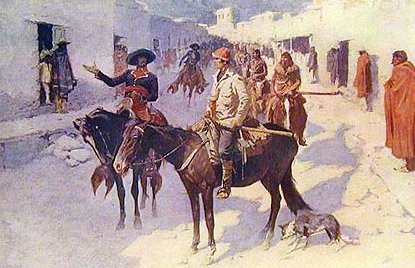

  
[Intangible Textual Heritage](../../index)  [Americana](../index) 

------------------------------------------------------------------------

<table width="75%">
<colgroup>
<col style="width: 50%" />
<col style="width: 50%" />
</colgroup>
<tbody>
<tr class="odd">
<td width="50%" data-valign="TOP"> 
The Spanish Escort, by Frederick Remington [1908] (Public Domain Image)</td>
<td width="50%" data-valign="CENTER"><h1 id="coffee-in-the-gourd" data-align="CENTER">Coffee in the Gourd</h1>
<h2 id="edited-by-j.-frank-dobie" data-align="CENTER">edited by J. Frank Dobie</h2>
<h4 id="section" data-align="CENTER">[1923]</h4></td>
</tr>
</tbody>
</table>

------------------------------------------------------------------------

[Contents](#contents)    [Start Reading](cig00)    [Text
\[Zipped\]](cig.txt.gz)

------------------------------------------------------------------------

This is a folklore miscellany originally published by the Texas
Folk-lore society in 1923, and reprinted in 1935. The articles reflect
the cultural diversity of Texas, including articles on African-American,
Tejano, German and Native American folklore. One of the highlights is
[an interview](cig12) with W.C. Handy, 'the father of the blues;' the
lyrics in this piece foreshadow some of the great rock compositions of
the sixties. The articles vary widely from academic to amateur in tone.
As usual, the original text has been transcribed verbatim. It reflects
the time and place in which it was written, and includes ethnic terms
and characterizations which today would be considered wildly offensive,
even in an ethnographic context. *Caveat lector*.

Thanks to Eliza Yetter for transcribing this collection.

------------------------------------------------------------------------

 [Title Page](cig00)  
[Contents](cig01)  
[Rebaptized in Ink](cig02)  
[The Texas Folk-Lore Society Since 1916](cig03)  
[Texas Legends Number For 1924](cig04)  
[One Evening As I Sat Courting, by L.W. Payne. Jr.](cig05)  
[Human Foundation Sacrifices In Balkan Ballads, by Max Sylvius
Handman](cig06)  
[The Decline and Decadence of Folk Metaphor, by W. H. Thomas](cig07)  
[Indian Pictographs of the Big Bend in Texas, by Victor J.
Smith](cig08)  
[The Cowboy Dance By J. R. Craddock](cig09)  
[Miscellany of Texas Folk-Lore, by W. P. Webb](cig10)  
[Brazos Bottom Philosophy, by A. W. Eddins](cig11)  
[The ''Blues'' As Folk-Songs, by Dorothy Scarborough](cig12)  
[Customs Among the German Descendants of Gillespie County, by Julia
Estill](cig13)  
[Customs And Superstitions Among Texas Mexicans on the Rio Grande
Border, by Florence Johnson Scott](cig14)  
[Pedro and Pancho, by Mrs. Mary A. Sutherland](cig15)  
[Weather Wisdom of the Texas-Mexican Border, by J. Frank Dobie](cig16)  
