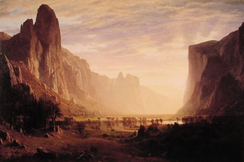

  
[Intangible Textual Heritage](../../index)  [Americana](../index) 

------------------------------------------------------------------------

[Buy this Book at
Amazon.com](https://www.amazon.com/exec/obidos/ASIN/B002ACPKVU/internetsacredte)

------------------------------------------------------------------------

<table width="75%">
<colgroup>
<col style="width: 50%" />
<col style="width: 50%" />
</colgroup>
<tbody>
<tr class="odd">
<td width="50%" data-valign="TOP"> 
Albert Bierstadt; Looking Down Yosemite [1895] (Public Domain Image)</td>
<td width="50%" data-valign="CENTER"><h1 id="myths-and-legends-of-our-own-land" data-align="CENTER">Myths and Legends of Our Own Land</h1>
<h2 id="by-charles-m.-skinner" data-align="CENTER">by Charles M. Skinner</h2>
<h4 id="section" data-align="CENTER">[1896]</h4></td>
</tr>
</tbody>
</table>

------------------------------------------------------------------------

[Contents](#contents)    [Start Reading](lol000)    [Text
\[Zipped\]](lol.txt.gz)

------------------------------------------------------------------------

|                                                                                                                           |
|---------------------------------------------------------------------------------------------------------------------------|
|  |

Charles M. Skinner wrote at approximately the time that the frontier
closed. It was a time when the US was starting to enter the world stage,
and was in the process of building a national, as well as a number of
regional mythologies. In the process, many stories which were apocryphal
or pure inventions were elevated to the status of folklore. Mixed into
this collection are many stories which are from [Native
American](../../nam/index) sources.

------------------------------------------------------------------------

 [Title Page](lol000)  
[Contents](lol001)  
[Preface](lol002)  

### The Hudson And Its Hills

[Rip Van Winkle](lol003)  
[Catskill Gnomes](lol004)  
[The Catskill Witch](lol005)  
[The Revenge Of Shandaken](lol006)  
[Condemned To The Noose](lol007)  
[Big Indian](lol008)  
[The Baker's Dozen](lol009)  
[The Devil's Dance-chamber.](lol010)  
[The Culprit Fay](lol011)  
[Pokepsie](lol012)  
[Dunderberg](lol013)  
[Anthony's Nose](lol014)  
[Moodua Creek](lol015)  
[A Trapper's Ghastly Vengeance](lol016)  
[The Vanderdecken Of Tappan Zee](lol017)  
[The Galloping Hessian](lol018)  
[Storm Ship Of The Hudson](lol019)  
[Why Spuyten Duyvil Is So Named](lol020)  
[The Ramapo Salamander](lol021)  
[Chief Croton](lol022)  
[The Retreat From Mahopac](lol023)  
[Niagara](lol024)  
[The Deformed Of Zoar](lol025)  
[Horseheads](lol026)  
[Kayuta And Waneta](lol027)  
[The Drop Star](lol028)  
[The Prophet Of Palmyra](lol029)  
[A Villain's Cremation](lol030)  
[The Monster Mosquitoe](lol031)  
[The Green Picture](lol032)  
[The Nuns Of Carthage](lol033)  
[The Skull In The Wall](lol034)  
[The Haunted Mill](lol035)  
[Old Indian Face](lol036)  
[The Division Of The Saranacs](lol037)  
[An Event In Indian Park](lol038)  
[The Indian Plume](lol039)  
[Birth Of The Water-lily](lol040)  
[Rogers's Slide](lol041)  
[The Falls At Cohoes](lol042)  
[Francis Woolcott's Night-riders](lol043)  
[Polly's Lover](lol044)  
[Crosby, The Patriot Spy](lol045)  
[The Lost Grave Of Paine](lol046)  
[The Rising Of Gouverneur Morris](lol047)  

### The Isle Of Manhattoes And Nearby

[Dolph Heyliger](lol048)  
[The Knell At The Wedding](lol049)  
[Roistering Dirck Van Dara](lol050)  
[The Party From Gibbet Island](lol051)  
[Miss Britton's Poker](lol052)  
[The Devil's Stepping-stones](lol053)  
[The Springs Of Blood And Water](lol054)  
[The Crumbling Silver](lol055)  
[The Cortelyou Elopement](lol056)  
[Van Wempel's Goose](lol057)  
[The Weary Watcher](lol058)  
[The Rival Fiddlers](lol059)  
[Wyandank](lol060)  
[Mark Of The Spirit Hand](lol061)  
[The First Liberal Church](lol062)  
[On And Near The Delaware](lol063)  
[The Phantom Dragoon](lol064)  
[Delaware Water Gap](lol065)  
[The Phantom Drummer](lol066)  
[The Missing Soldier Of Valley Forge](lol067)  
[The Last Shot At Germantown](lol068)  
[A Blow In The Dark](lol069)  
[The Tory's Conversion](lol070)  
[Lord Percy's Dream](lol071)  
[Saved By The Bible](lol072)  
[Parricide Of The Wissahickon](lol073)  
[The Blacksmith At Brandywine](lol074)  
[Father And Son](lol075)  
[The Envy Of Manitou](lol076)  
[The Last Revel In Printz Hall](lol077)  
[The Two Rings](lol078)  
[Flame Scalps Of The Chartiers](lol079)  
[The Consecration Of Washington](lol080)  
[Evangaline](lol081)  

### Tales Of Puritan Land

[The Snoring Of Swunksus](lol082)  
[The Lewiston Hermit](lol083)  
[The Dead Ship Of Harpswell](lol084)  
[The Schoolmaster Had Not Reached Orrington.](lol085)  
[Jack Welch's Death Light](lol086)  
[The Lady Ursula](lol087)  
[Father Moody's Black Veil](lol088)  
[The Home Of Thunder](lol089)  
[The Partridge Witch](lol090)  
[The Marriage Of Mount Katahdin](lol091)  
[The Moose Of Mount Kineo](lol092)  
[The Owl Tree](lol093)  
[A Chestnut Log](lol094)  
[The Watcher On White Island](lol095)  
[Chocorua](lol096)  
[Passaconaway's Ride To Heaven](lol097)  
[The Ball Game By The Saco](lol098)  

### The White Mountains

[The White Mountains](lol099)  
[The Vision On Mount Adams](lol100)  
[The Great Carbuncle](lol101)  
[Skinner's Cave](lol102)  
[Yet They Call It Lover's Leap](lol103)  
[Salem And Other Witchcraft](lol104)  
[The Gloucester Leaguers](lol105)  
[Satan And His Burial-place](lol106)  
[Peter Rugg, The Missing Man](lol107)  
[The Loss Of Weetamoo](lol108)  
[The Fatal Forget-me-not](lol109)  
[The Old Mill At Somerville](lol110)  
[Edward Randolph's Portrait](lol111)  
[Lady Eleanore's Mantle](lol112)  
[Howe's Masquerade](lol113)  
[Old Esther Dudley](lol114)  
[The Loss Of Jacob Hurd](lol115)  
[The Hobomak](lol116)  
[Berkshire Tories](lol117)  
[The Revenge Of Josiah Breeze](lol118)  
[The May-pole Of Merrymount](lol119)  
[The Devil And Tom Walker](lol120)  
[The Gray Champion](lol121)  
[The Forest Smithy](lol122)  
[Wahconah Falls](lol123)  
[Knocking At The Tomb](lol124)  
[The White Deer Of Onota](lol125)  
[Wizard's Glen](lol126)  
[Balanced Rock](lol127)  
[Shonkeek-moonkeek](lol128)  
[The Salem Alchemist](lol129)  
[Eliza Wharton](lol130)  
[Sale Of The Southwicks](lol131)  
[The Courtship Of Myles Standish](lol132)  
[Mother Crewe](lol133)  
[Aunt Rachel's Curse](lol134)  
[Nix's Mate](lol135)  
[The Wild Man Of Cape Cod](lol136)  
[Newbury's Old Elm](lol137)  
[Samuel Sewall's Prophecy](lol138)  
[The Shrieking Woman](lol139)  
[Agnes Surriage](lol140)  
[Skipper Ireson's Ride](lol141)  
[Heartbreak Hill](lol142)  
[Harry Main: The Treasure And The Cats](lol143)  
[The Wessaguscus Hanging](lol144)  
[The Unknown Champion](lol145)  
[Goody Cole](lol146)  
[General Moulton And The Devil](lol147)  
[The Skeleton In Armor](lol148)  

### Martha's Vineyard And Nantucket

[Martha's Vineyard And Nantucket](lol149)  
[Love And Treason](lol150)  
[The Headless Skeleton Of Swamptown](lol151)  
[The Crow And Cat Of Hopkinshill](lol152)  
[The Old Stone Mill](lol153)  
[Origin Of A Name](lol154)  
[Micah Rood Apples](lol155)  
[A Dinner And Its Consequences](lol156)  
[The New Haven Storm Ship](lol157)  
[The Windam Frogs](lol158)  
[The Lamb Of Sacrifice](lol159)  
[Moodus Noises](lol160)  
[Haddam Enchantments](lol161)  

### Block Island And The Palatine

[Block Island And The Palatine](lol162)  
[The Buccaneer](lol163)  
[Robert Lockwood's Fate](lol164)  
[Love And Rum](lol165)  

### Lights And Shadows Of The South

[The Swim At Indian Head](lol166)  
[The Moaning Sisters](lol167)  
[A Ride For A Bride](lol168)  
[Spooks Of The Hiawassee](lol169)  
[Lake Of The Dismal Swamp](lol170)  
[The Barge Of Defeat](lol171)  
[Natural Bridge](lol172)  
[The Silence Broken](lol173)  
[Siren Of The French Broad](lol174)  
[The Hunter Of Calawassee](lol175)  
[Revenge Of The Accabee](lol176)  
[Toccoa Falls](lol177)  
[Two Lives For One](lol178)  
[A Ghostly Avenger](lol179)  
[The Wraith Ringer Of Atlanta](lol180)  
[The Swallowing Earthquake](lol181)  
[Last Stand Of The Biloxi](lol182)  
[The Sacred Fire Of Nachez](lol183)  
[Pass Christian](lol184)  
[The Under Land](lol185)  

### The Central States And The Great Lakes

[An Averted Peril](lol186)  
[The Obstinacy Of Saint Clair](lol187)  
[The Hundredth Skull](lol188)  
[The Crime Of Black Swamp](lol189)  
[The House Accursed](lol190)  
[Michel De Coucy's Troubles](lol191)  
[Wallen's Ridge](lol192)  
[The Sky Walker Of Huron](lol193)  
[The Coffin Of Snakes](lol194)  
[Mackinack](lol195)  
[Lake Superior Water Gods](lol196)  
[The Witch Of Pictured Rocks](lol197)  
[The Origin Of White-fish](lol198)  
[The Spirit Of Cloudy](lol199)  
[The Sun Fire At Sault Sainte Marie](lol200)  
[The Snake God Of Belle Isle](lol201)  
[Were-wolves Of Detroit](lol202)  
[The Escape Of Francois Navarre](lol203)  
[The Old Lodger](lol204)  
[The Nain Rouge](lol205)  
[Two Revenges](lol206)  
[Hiawatha](lol207)  
[The Indian Messiah](lol208)  
[The Vision Of Rescue](lol209)  
[Devil's Lake](lol210)  
[The Keusca Elopement](lol211)  
[Pipestone](lol212)  
[The Virgins' Feast](lol213)  
[Falls Of St. Anthony](lol214)  
[Flying Shadow And Track Maker](lol215)  
[Saved By A Lightning-stroke](lol216)  
[The Killing Of Cloudy Sky](lol217)  
[Providence Hole](lol218)  
[The Scare Cure](lol219)  
[Twelfth Night At Cahokia](lol220)  
[The Spell Of Creve Ciur Lake](lol221)  
[How The Crime Was Revealed](lol222)  
[Banshee Of The Bad Lands](lol223)  
[Standing Rock](lol224)  
[The Salt Witch](lol225)  

### Along The Rocky Range

[Over The Divide](lol226)  
[The Phantom Train Of Marshall Pass](lol227)  
[The River Of Lost Souls](lol228)  
[Riders Of The Desert](lol229)  
[The Division Of Two Tribes](lol230)  
[Besieged By Starvation](lol231)  
[A Yellowstone Tragedy](lol232)  
[The Broad House](lol233)  
[The Death Waltz](lol234)  
[The Flood At Santa Fe](lol235)  
[Goddess Of Salt](lol236)  
[The Coming Of The Navajos](lol237)  
[The Ark On Superstition Mountains](lol238)  
[The Pale Faced Lightning](lol239)  
[The Weird Sentinel At Squaw Peak](lol240)  
[Sacrifice Of The Toltecs](lol241)  
[Ta-vwots Conquers The Sun](lol242)  
[The Comanche Rider](lol243)  
[Horned Toad And Giants](lol244)  
[The Spider Tower](lol245)  
[The Lost Trail](lol246)  
[A Battle In The Air](lol247)  

### On The Pacific Coast

[The Voyager Of Whulge](lol248)  
[Tamanous Of Tacoma](lol249)  
[The Devil And The Dalles](lol250)  
[Cascades Of The Columbia](lol251)  
[The Death Of Umatilla](lol252)  
[Hunger Valley](lol253)  
[The Wrath Of Manitou](lol254)  
[The Spook Of Misery Hill](lol255)  
[The Queen Of Death Valley](lol256)  
[Bridal Veil Fall](lol257)  
[The Governor's Right Eye](lol258)  
[The Prisoner In American Shaft](lol259)  

### As To Buried Riches

[Kidd's Treasure](lol260)  
[Other Buried Wealth](lol261)  

### Storied Waters, Cliffs And Mountains

[Monsters And Sea-serpents](lol262)  
[Stone-throwing Devils](lol263)  
[Storied Springs](lol264)  
[Lovers' Leaps](lol265)  
[God On The Mountains](lol266)  
