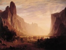

  
[Intangible Textual Heritage](../../index)  [Americana](../index) 
[Index](index)  [Previous](lol217)  [Next](lol219) 

------------------------------------------------------------------------

[Buy this Book at
Amazon.com](https://www.amazon.com/exec/obidos/ASIN/B002ACPKVU/internetsacredte)

------------------------------------------------------------------------

  
*Myths and Legends of our Own Land*, by Charles M. Skinner, \[1896\], at
Intangible Textual Heritage

------------------------------------------------------------------------

### PROVIDENCE HOLE

The going of white men into the prairies aroused the same sort of
animosity among the Indians that they have shown in other parts of the
country when retiring before the advance of civilization, and many who
tried to plant corn on the rolling lands of Iowa, though they did no
harm to the red men, paid for the attempt with their lives. Such was the
fate of a settler who had built his cabin on the Wyoming hills, near
Davenport. While working in his fields an arrow, shot from a covert,
laid him low, and his scalp was cut away to adorn the belt of a savage.
His little daughter, left alone, began to suffer from fears and
loneliness as the sun went lower and lower, and when it had come to its
time of setting she put on her little bonnet and went in search of him.
As she gained the slope where he had last been seen, an Indian lifted
his head from the grass and looked at her.

Starting back to run, she saw another behind her. Escape seemed
hopeless, and killing or captivity would have been her lot had not a
crevice opened in the earth close to where she stood. Dropping on hands
and knees she hastily crawled in, and found herself in what seemed to be
an extensive cavern. Hardly had she time to note the character of the
place when the gap closed as strangely as it had opened and she was left
in darkness. Not daring to cry aloud, lest Indians should hear her, she
sat upright until her young eyes could keep open no longer; then, lying
on a mossy rock, she fell asleep. In the morning the sun was shining in
upon her and the way to escape was open. She ran home, hungry, but
thankful, and was found and cared for by neighbors. "Providence Hole"
then passed into the legends of the country. It has closed anew,
however.

 

 

------------------------------------------------------------------------

[Next: The Scare Cure](lol219)
