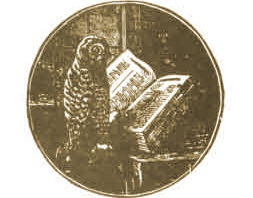

  
[Intangible Textual Heritage](../../index)  [Americana](../index) 

------------------------------------------------------------------------

<table width="75%">
<colgroup>
<col style="width: 50%" />
<col style="width: 50%" />
</colgroup>
<tbody>
<tr class="odd">
<td width="50%" data-valign="TOP"></td>
<td width="50%" data-valign="CENTER"><h1 id="pow-wows" data-align="CENTER">Pow-Wows</h1>
<h5 id="or-long-lost-friend" data-align="CENTER">or Long Lost Friend</h5>
<h2 id="by-john-george-hoffman" data-align="CENTER">By John George Hoffman</h2>
<h4 id="section" data-align="CENTER">[1820]</h4></td>
</tr>
</tbody>
</table>

------------------------------------------------------------------------

[Contents](#contents)    [Start Reading](pow000)    [Page
Index](pageidx)    [Text \[Zipped\]](pow.txt.gz)

------------------------------------------------------------------------

Written by a Pennsylvania Dutch healer in the 1820s, this book is a
rambling collection of rural home remedies and folk invocations. Pow-wow
is a unique creole of Christian theology and a shamanistic belief
system. It is still practiced in some rural areas of Pennsylvania. In
spite of the name, it is not of Native American derivation. It is
believed to have been brought over to America by German immigrants who
practiced folk-magic.

This little book includes healing spells, binding spells, protective
spells, talismans, wards and benedictions. As for the home remedies, we
don't recommend you try any of them (e.g., if you have scurvy we suggest
that you get some limes. And if your livestock are sick, *please* have a
veterinarian look at them.) The text is also of historical interest, as
it paints a vivid picture of the miseries of rural American life in the
early nineteenth century. The original is very rare.

------------------------------------------------------------------------

 [Title Page](pow000)  
[Preface](pow001)  
[Testimonials](pow002)  

### Arts and Remedies

[Hysterics](pow003)  
[Hysterics and Colds](pow004)  
[Bleeding](pow005)  
[Falling Away](pow006)  
[When Anyone Is Sick](pow007)  
[Worms In Men And Cattle](pow008)  
[Slander](pow009)  
[Colic](pow010)  
[Fever](pow011)  
[To Attach A Dog To A Person](pow012)  
[Palpitation Of The Heart, And Hide-Bound Persons](pow013)  
[Injuries](pow014)  
[A Wand For Searching For Iron, Ore Or Water](pow015)  
[How To Obtain Things Which Are Desired](pow016)  
[Catching Fish](pow017)  
[Various Ulcers and Boils](pow018)  
[Mortification And Inflammation](pow019)  
[To Prevent Wicked Or Malicious Persons From Doing You An
Injury](pow020)  
[Bots Or Worms In Horses](pow021)  
[The Poll-Evil In Horses](pow022)  
[Bad Wounds And Burns](pow023)  
[Wild-Fire](pow024)  
[Pains](pow025)  
[Warts](pow026)  
[Whooping Cough](pow027)  
[Bleeding](pow028)  
[Toothache](pow029)  
[Walk Securely](pow030)  
[Colic](pow031)  
[Convulsive Fevers](pow032)  
[The Fever](pow033)  
[Plaster](pow034)  
[Eye-Water](pow035)  
[The White Swelling](pow036)  
[Epilepsy](pow037)  
[Burns](pow038)  
[Bleeding](pow039)  
[Pain](pow040)  
[Toothache](pow041)  
[Bruises And Pains](pow042)  
[From Albertus Magnus](pow043)  
[Fits Or Convulsions](pow044)  
[Headache](pow045)  
[Broken Glass](pow046)  
[Make Cattle Return Home](pow047)  
[To Prevent The Hessian Fly From Injuring The Wheat](pow048)  
[To Prevent Cherries From Ripening Before Martinmas](pow049)  
[Stinging Nettles](pow050)  
[Sun-Flower](pow051)  
[Sore Mouth](pow052)  
[Consumption](pow053)  
[Swallow-Wort](pow054)  
[Hollow Horn In Cows](pow055)  
[Wheal In The Eye](pow056)  
[To Make Chickens Lay](pow057)  
[Divinatory Wands](pow058)  
[Tape-Worm](pow059)  
[Bots In Horses](pow060)  
[Burn](pow061)  
[Snake-bite](pow062)  
[Mad Dogs](pow063)  
[Remove Pain and Heal Wounds](pow064)  
[Fever, Worms, And Colic](pow065)  
[Weakness Of Limbs](pow066)  
[To Make Horses Eat](pow067)  
[Rats and Mice](pow068)  
[Wen on Horse](pow069)  
[Eye-water](pow070)  
[Immobilizing Thieves](pow071)  
[Sweeney In Horses](pow072)  
[Molasses](pow073)  
[Beer](pow074)  
[Epilepsy](pow075)  
[Make Cattle Return Home](pow076)  
[Sores](pow077)  
[Wounds](pow078)  
[Sore Eyes](pow079)  
[Lice](pow080)  
[Paper Blotting](pow081)  
[The Gravel](pow082)  
[Incontinence](pow083)  
[Remove Wen](pow084)  
[Field-Mice And Moles](pow085)  
[Eye Scum](pow086)  
[Deafness and Toothache](pow087)  
[Painful Teething](pow088)  
[Vomiting And Diarrhœa](pow089)  
[Burns](pow090)  
[Oil of Cloves a Panacea](pow091)  
[Dysentery And Diarrhœa](pow092)  
[Toothache](pow093)  
[Advice To Pregnant Women](pow094)  
[Mad Dog Bite](pow095)  
[To Increase The Growth Of Wool](pow096)  
[Mortification](pow097)  
[The Poll-Evil In Horses](pow098)  
[Scurvy And Sore Throat](pow099)  
[Plaster](pow100)  
[Bleeding](pow101)  
[Bleeding](pow102)  
[Lawsuits](pow103)  
[Swelling of Cattle](pow104)  
[Fishing](pow105)  
[Rheumatism](pow106)  
[Worms In Bee-Hives](pow107)  
[To Prevent Gun-Barrels From Rusting](pow108)  
[A Wick Which Is Never Consumed](pow109)  
[Prayer before Journey](pow110)  
[Fire and Pestilence](pow111)  
[Conflagration](pow112)  
[Against Malign Witchcraft](pow113)  
[Extinguish Fire](pow114)  
[To Prevent Bad People From Getting About The Cattle](pow115)  
[Stopping Fire](pow116)  
[To Fasten Or Spell-Bind](pow117)  
[Prevent Fire](pow118)  
[After Being Bewitched](pow119)  
[Against Sickness And Theft](pow120)  
[Against Mishaps And Dangers](pow121)  
[Gypsy Protection Sentence](pow122)  
[Against Evil Spirits and Witchcraft](pow123)  
[Swellings](pow124)  
[To Treat A Cow After Milk Is Taken](pow125)  
[Against Adversaries](pow126)  
[Against Danger and Death](pow127)  
[A Sick Cow](pow128)  
[Fever](pow129)  
[Immobilizing a Thief](pow130)  
[Immobilizing a Thief (3)](pow131)  
[Releasing Spell-Bound Persons](pow132)  
[To Compel A Thief To Return Stolen Goods](pow133)  
[A Benediction For All Purposes](pow134)  
[To Win Every Game](pow135)  
[Burns](pow136)  
[Warding Cattle from Witchcraft](pow137)  
[Binding Wounds](pow138)  
[Relieving Painful Wounds](pow139)  
[Worms](pow140)  
[Against Every Evil Influence](pow141)  
[Legal Success](pow142)  
[To Stop Bleeding](pow143)  
[Preventing Attack by Man or Animal](pow144)  
[House Protection](pow145)  
[Charms](pow146)  
[To Be At All Times Blessed](pow147)  
[More Charms](pow148)  
[To Recover Stolen Goods](pow149)  
[A Well-Tried Charm](pow150)  
[Spring-tails or Ground-Fleas](pow151)  
[Benedictions against Enemies](pow152)  
[Hunting Talismans](pow153)  
[Stolen Goods](pow154)  
[Charm Against Gunshot](pow155)  
[Unlucky Days](pow156)  
[Prayer before Journey](pow157)  

### Appendix

[Epilepsy](pow158)  
[Salve to Heal Wounds](pow159)  
[Peaches](pow160)  
[Sweet Oil](pow161)  
[Dropsy](pow162)  
[Lock Jaw](pow163)  
[Wasp or Bee Sting](pow164)  
[Diarrhœa](pow165)  
[Soap](pow166)  
[Dyes](pow167)  
[Veterinary Remedies](pow168)  
[Index](pow169)  
[So Help Me](pow170)  
