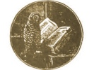

  
[Intangible Textual Heritage](../../index)  [Americana](../index.md) 
[Index](index)  [Previous](pow015)  [Next](pow017.md) 

------------------------------------------------------------------------

  
*Pow-Wows, or Long Lost Friend*, by John George Hoffman, \[1820\], at
Intangible Textual Heritage

------------------------------------------------------------------------

HOW TO OBTAIN THINGS WHICH ARE DESIRED.

If you call upon another to ask for a favor, take care to carry a little
of the five-finger grass with you, and you shall certainly obtain that
you desired.

------------------------------------------------------------------------

[Next: Catching Fish](pow017.md)

