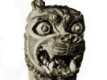
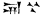

  
[Intangible Textual Heritage](../../index.md)  [Ancient Near
East](../index)  [Index](index)  [Previous](blc04)  [Next](blc06.md) 

------------------------------------------------------------------------

  
*The Babylonian Legends of Creation*, by E. A. Wallis Budge, \[1921\],
at Intangible Textual Heritage

------------------------------------------------------------------------

## The "Bilingual" Version of the Creation Legend.

1\. "The holy house, the house of the gods in the holy place had not yet
been made.

2\. "No reed had sprung up, no tree had been made.

3\. "No brick had been laid, no structure of brick had been erected.

4\. "No house had been made, no city had been built.

  [![The Bilingual
Version of the Creation Legend. \[No. 93,014.\]](tn/003.png)  
Click to enlarge](img/003.png.md)  
The Bilingual Version of the Creation Legend. \[No. 93,014.\]  

5\. "No city had been made, no creature had been constituted.

6\. "Enlil's city,   (i.e.,
Nippur) had not been made, E-kur 
 had not been built,

7\. "Erech   had not been
made, E-Aena   had not been
built,

8\. The Deep [4](blc17.htm#fn_3) (or Abyss.md) had
not been made, Eridu   had
not been built.

9\. "Of the holy house, the house of the gods, the dwelling-place had
not been made.

10\. "All the lands were sea

11\. "At the time that the mid-most sea was \[shaped like\] a trough,

12\. "At that time Eridu was made, and E-sagil was built,

13\. "The E-sagil where in the midst of the Deep the god
Lugal-dul-azaga [5](blc17.htm#fn_4.md) dwelleth,

14\. "Babylon was made, E-sagil was completed.

15\. "The gods the Anunnaki he created at one time.

16\. "They proclaimed supreme the holy city, the dwelling of their
heart's happiness.

17\. "Marduk laid a rush mat upon the face of the waters,

18\. "He mixed up earth and moulded it upon the rush mat,

19\. "To enable the gods to dwell in the place where they fain would be.

20\. "He fashioned man.

21\. "The goddess Aruru  
with him created the seed of mankind.

22\. "He created the beasts of the field and \[all\] the living things
in the field.

23\. "He created the river Idiglat (Tigris) and the river Purattu
(Euphrates), and he set them in their places,

24\. "He proclaimed their names rightly.

  [![Terra-cotta figure
of a god. From a foundation deposit at Babylon. \[No.
90,9961\]](tn/004.png)  
Click to enlarge](img/004.png.md)  
Terra-cotta figure of a god. From a foundation deposit at Babylon. \[No.
90,9961\]  

25\. "He created grass, the vegetation of the marsh, seed and shrub;

26\. "He created the green plants of the plain,

27\. "Lands, marshes, swamps,

28\. "The wild cow and the calf she carried, the wild calf, the sheep
and the young she carried, the lamb of the fold,

29\. "Plantations and shrub land,

30\. "The he-goat and the mountain goat ...

31\. "The lord Marduk piled up a dam in the region of the sea (*i.e.*,
he reclaimed land)

32\. "He ... a swamp, he founded a marsh.

33\. "... he made to be

34\. "Reeds he created, trees he created,

35\. "... in place he created

36\. "He laid bricks, he built a brick-work,

37\. "He constructed houses, he formed cities.

38\. "He constructed cities, creatures he set \[therein\].

39\. "Nippur he made, E-Kur he built.

40\. "\[Erech he made, E-Anna\] he built.

\[The remainder of the text is fragmentary, and shows that the text
formed part of an incantation which was recited in the Temple of E-Zida,
possibly the great temple of Nabu at Borsippa.\]

  [![Bronze figure of a
Babylonian god. \[No. 91,147\]](tn/005.png)  
Click to enlarge](img/005.png.md)  
Bronze figure of a Babylonian god. \[No. 91,147\]  

------------------------------------------------------------------------

[Next: The Legend of the Creation According to Berosus and
Damascius](blc06.md)
