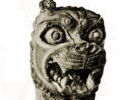

  
[Intangible Textual Heritage](../../index.md)  [Ancient Near
East](../index)  [Index](index)  [Previous](blc15)  [Next](blc17.md) 

------------------------------------------------------------------------

  
*The Babylonian Legends of Creation*, by E. A. Wallis Budge, \[1921\],
at Intangible Textual Heritage

------------------------------------------------------------------------

## Notes.

1\. There are in the British Museum several fragments of Neo-Babylonian
copies of the Seven Tablets of Creation, the exact position of which is
at present uncertain. One of these (S. 2013) is of some importance
because it speaks of one object which was in the "upper Tiâmat"  , and of another which was in the
"lower Tiâmat"  . This shows
that the Babylonians thought that one half of the body of Tiâmat, which
was split up by Marduk, was made into the celestial ocean, and the other
half into the terrestrial ocean, in other words, into "the waters that
were above" and "the waters that were beneath" the firmament
respectively.

2\. When George Smith published his *Chaldean Account of Genesis* in
1876, he was of opinion that the Creation Tablets in the British Museum
contained descriptions of the Temptation of Eve by the serpent and of
the building and overthrow of the Tower of Babel. The description of
Paradise in Genesis ii seems to show traces of Babylonian influence, and
the cylinder seal, Brit. Mus. No. 89,326, was thought to be proof that a
Babylonian legend of the Temptation existed. In fact, George Smith
printed a copy of the seal in his book (p. 91). But it is now known that
the tablet which was believed to refer to man's eating of the fruit of
the Tree of Knowledge (K. 3, 473 + 79-7-8, 296 + R. 615) describes the
banquet of the gods to which they invited Marduk. In like manner the
text on K. 3657, which Smith thought referred to the Tower of Babel, is
now known to contain no mention of a tower or building of any sort. It
was also thought by him that K. 3364 contained a set of instructions
which God gave to Adam and Eve after their creation, but it is now known
and admitted by all Assyriologists that the text on this tablet contains
moral precepts and has nothing to do with the Creation Series. Enquiries
are from time to time made at the Museum for tablets which deal with the
Temptation of Eve, and the destruction of the Tower of Babel, and the
Divine commands to Adam and Eve; it is perhaps not superfluous to say
that nothing of the kind exists.

List of the name of the Stars or Signs of the Zodiac, with a List
Showing the Month that was Associated with Each Star in the Persian
Period.

BY SIDNEY SMITH, M.A., and C.J. GADD, M.A., Assistants in the
Department.

   
No. 77,821 (85-4-30, 15).

|     |             |                                                                     |                                                      |
|-----|-------------|---------------------------------------------------------------------|------------------------------------------------------|
|     |             | TRANSLITERATION.                                                    | TRANSLATION.                                         |
| 1   | Nisannu     | (kakkab) (amel) Agru....                                            | The Labourer.                                        |
| 2   | Airu        | " Kakkab u (kakkab) Alap shame                                      | The Star and the Bull of heaven.                     |
| 3   | Simanu      | " Re'u kinu shame u (kakkab) tu'ame rabuti                          | The faithful shepherd of heaven and the Great Twins. |
| 4   | Duuzu       | " AL.LUL. (shittu) [54](blc17.htm#fn_53.md)... | The Tortoise.                                        |
| 5   | Abu         | " Kalbu rabu ....                                                   | Great Dog (Lion).                                    |
| 6   | Ululu       | " Shiru ....                                                        | Virgin with ear of corn.                             |
| 7   | Tashritum   | " Zibanitum ....                                                    | ....                                                 |
| 8   | Araḫ shamna | " Akrabu ....                                                       | The Scorpion.                                        |
| 9   | Kislimu     | " PA.BIL.SAG ....                                                   | Enurta (the god).                                    |
| 10  | Ṭebetum     | " SUḪUR.MASH ....                                                   | The Goat-fish.                                       |
| 11  | Shabaṭu     | " Gula ....                                                         | The Great Star                                       |
| 12  | Addaru      | " DIL.GAN.u rikis nuni                                              | The star ... and the Band of Fishes.                 |

I have been assisted in the preparation of this monograph by Mr. Sidney
Smith, M.A., Assistant in the Department.

E.A. WALLIS BUDGE.

DEPARTMENT OF EGYPTIAN AND ASSYRIAN ANTIQUITIES, BRITISH MUSEUM. *June*
1, 1921.

------------------------------------------------------------------------

[Next: Footnotes](blc17.md)
