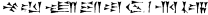

  
[Intangible Textual Heritage](../../index)  [Ancient Near
East](../index)  [Index](index)  [Previous](blc16) 

------------------------------------------------------------------------

  
*The Babylonian Legends of Creation*, by E. A. Wallis Budge, \[1921\],
at Intangible Textual Heritage

------------------------------------------------------------------------

## Footnotes.

------------------------------------------------------------------------

### Footnotes

[1](blc01.htm#fr_0) See the *Transactions*, Vol.
IV, Plates I-VI, London, 1876.

[2](blc03.htm#fr_1) See the duplicate fragments
described in the Index to Ebeling, *Keilschrifttexte aus Assur*,
Leipzig, 1919 fol.

[3](blc04.htm#fr_2) The text is found on a tablet
from Abû Habbah, Brit. Mus., No. 93,014 (82-5-22, 1048).

[4](blc05.htm#fr_3) APSÛ. It is doubtful if APSÛ
here really means the great abyss of waters from out of which the world
was called. It was, more probably, a ceremonial object used in the cult
of the god, something like the great basin, or "sea," in the court of
the temple of King Solomon, mentioned in I Kings, vii, 23; 2 Kings, xxv,
13, etc.

[5](blc05.htm#fr_4) This is a name under which
Marduk was worshipped at Eridu.

[6](blc06.htm#fr_5) The god whose head was taken
off was not Belus, as is commonly thought, but the god who the cuneiform
texts tell us was called "Kingu."

[7](blc06.htm#fr_6) The god whose head was taken
off was not Belus, as is commonly thought, but the god who the cuneiform
texts tell us was called "Kingu."

[8](blc07.htm#fr_7) *Muallidat gimrishun*  .

[9](blc07.htm#fr_8) It is probable that the idea
of this Tablet is perpetuated in the "Preserved Tablet" of the Ḳur'ân
(Surah x, 62), on which the destiny of every man was written at or
before the creation of the world. Nothing that is written (*maktûb*)
there can be erased, or altered, or fail to take effect.

[10](blc07.htm#fr_9) 
 (*Cun. Texts*, Part XXIV, Plate 44, l. 142).

[11](blc07.htm#fr_10)

|                   |
|-------------------|
|  |

|                   |
|-------------------|
|  |

Or perhaps the "belly of Tiâmat." The Egyptians distinguished a portion
of the heavens by the name of "Khat Nut," "the belly of Nut,"   and two drawings of it are
extant. The first shows an oval object rimmed with stars and the other a
pear-shaped object, with a god inside it. (See Brugsch, *Inschriften
(Astronomische)* Leipzig, 1883, p, 146.)

[12](blc07.htm#fr_11) This is the original of
the Syriac word for the Signs of the Zodiac *malwâshê* (plural of
*malwâshâ)*. The Syrians added to it an *m*, thus giving it a
participial form.

[13](blc07.htm#fr_12) Δεκανοί also called
πρόσωπα, ὡροσκόποι, φύλακες and ἐπίσκοποι. They were well known to the
Egyptians, who, as early as the fourteenth century B.C., possessed a
full list of them. See Lepsius, *Chronologie*, Berlin, 1848, and
Brugsch, *Thesaurus (Astronomische und Astrologische Inschriften)*,
Leipzig, 1883.

[14](blc07.htm#fr_13) Formerly known as Ninip.

[15](blc07.htm#fr_14) See Naville, *La Litanie
du Soleil*, Paris, 1875, Plate ii ff.

[16](blc07.htm#fr_15) See *Kur'ân*, Surah vii,
v. 179. That there were ninety-nine Beautiful Names of God rests on the
authority of Abû Hurairah, who repeats the statement as made by Muhammad
the Prophet.

[17](blc07.htm#fr_16) Published by King,
*Cuneiform Texts*, Part XXV, Plate 50.

[18](blc07.htm#fr_17) Thus he is equated with
En-Urta, Nergal, En-lil, Nabû, Sin, Shamash, Adad, etc.

[19](blc07.htm#fr_18) See Poebel, *Historical
Texts*, No. 1.

[20](blc07.htm#fr_19) See King, *Cuneiform
Texts*, Part XIII, Plate 33; and Ebellog, *Assurtexte*, I, No. 6.

[21](blc07.htm#fr_20) The *biru* was the
distance which a man would travel in two hours.

[22](blc08.htm#fr_21) This translation is made
from transcripts of the British Museum fragments (*Cuneiform Texts*,
Part XIII), and transcripts of the Berlin fragments (Ebeling,
*Keilschrifttexte aus Assur*, Nos. 117, 118).

[23](blc08.htm#fr_22) The name of an object was
the object itself, and it was believed that nothing could exist apart
from its name.

[24](blc08.htm#fr_23) Tiâmat's wrath was roused
by Apsu, who had proposed to slay the gods, her children. She took no
part in the first struggle of Apsu and Mummu against the gods, and only
engaged in active hostilities to avenge Apsu.

[25](blc08.htm#fr_24) Literally, "they excited
themselves to hostility."

[26](blc08.htm#fr_25) A title of Tiâmat.

[27](blc08.htm#fr_26) These nine monsters with
the Weapon (Thunderbolt?) and Kingu form the Eleven Allies of Tiâmat,
and it is clear that she and her Allies represent the Twelve Signs of
the Zodiac. When Marduk destroyed Tiâmat and her associates, he found it
necessary to fix the stars, the images of the great gods, in their
places, as the Twelve Signs of the Zodiac. (See the Fifth Tablet of
Creation, p. 55.)

[28](blc08.htm#fr_27) The god here alluded to is
Mardak, who, in one aspect, is a fire-god; see Tablet IV, II. 39, 40.

[29](blc09.htm#fr_28) See above.

[30](blc09.htm#fr_29) Lines 83, 84, 88-101 are
translated from the British Museum fragments and the Berlin fragments;
lines 88-101 contain the equivalent to the whole gap in the British
Museum tablet.

[31](blc09.htm#fr_30) *i.e.*, "let what thou
sayest prevail."

[32](blc11.htm#fr_31) *I.e.*, the destruction of
Tiâmat.

[33](blc11.htm#fr_32) *I.e.*, the establishing
of a new creation to take the place of the old.

[34](blc11.htm#fr_33) The meaning of   *pal-a* is unknown.

[35](blc11.htm#fr_34) This equipment of the
charioteer is shown on the bas-reliefs.

[36](blc11.htm#fr_35) Compare Psalms xviii,
7-15; civ, i ff.

[37](blc11.htm#fr_36) *I.e.*, the gods were
impatient to begin the fight.

[38](blc11.htm#fr_37) By impressing his seal on
the Tablet Marduk proved his ownership of the Tablet, and made his claim
to it legal.

[39](blc11.htm#fr_38) This is an oblique way of
saying that Marduk succeeded where Ea failed.

[40](blc11.htm#fr_39) The word is *kupu*,
*i.e.*, "reed" or "sedge." It is possible that Marduk skinned Tiâmat.

[41](blc13.htm#fr_40) Reading, *ishtenish lu
kuppudu-ma ana shina lu uzizu*.

[42](blc13.htm#fr_41) *I.e.*, "to cause the gods
to be content,"

[43](blc13.htm#fr_42) Literally "they
(indefinite) opposed me."

[44](blc13.htm#fr_43) See *Cuneiform Texts*,
Part XXIV, Plate 50, where it is said that the god Sin is "Marduk, who
maketh bright the night."

[45](blc13.htm#fr_44) Lines 44 and 45 announce
Marduk's determination to build Babylon.

[46](blc13.htm#fr_45) This is the word commonly
used for "temple-tower." The famous ziggurat of E-Sagila here mentioned
was built in Seven Stages or Steps, each probably having its own
distinctive colour. It was destroyed probably soon after the capture of
Babylon by Cyrus (539 B.C.) and when Alexander the Great reached Babylon
he found it ruins.

[47](blc13.htm#fr_46) This is the first known
mention of the "horns" of a ziggurat, and the exact meaning of the word
is doubtful.

[48](blc13.htm#fr_47) From this text it seems
clear that Up-shukkinaku was the name of a chamber in the temple of
E-Sagila. This name probably means the "chamber of the shakkanaku,"
*i.e.*, the chamber in which the governor of the city (*shakkanaku*)
went annually to embrace the hands of the god Bel-Marduk, from whom he
thereby received the right of sovereignty over the country.

[49](blc14.htm#fr_48) This line seems to imply
that Marduk was regarded as the instructor of the "old" gods; the
allusion is, probably, to the "ways" of Anu, Bel and Ea, which are
treated as technical terms in astrology.

[50](blc14.htm#fr_49) Here the title
"Black-headed" refers to all mankind, but it is sometimes used by the
scribes to distinguish the population of the Euphrates Valley from
foreign peoples of light complexions.

[51](blc14.htm#fr_50) Compare the language of
the Kur'ân (Surah II, v. 256), "He (Allah) knoweth what is before them
and what is behind them."

[52](blc14.htm#fr_51) These lines suggest that
the fight between Marduk and Tiâmat was recurrent; it is incorrect to
translate the verbal forms as preterites.

[53](blc15.htm#fr_52) "To open the ears" -- to
give understanding.

[54](blc16.htm#fr_53) The Egyptian Sheta  
