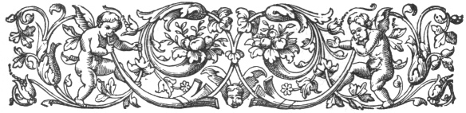
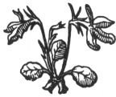

  
[Intangible Textual Heritage](../../index)  [Ancient Near
East](../index)  [Index](index)  [Previous](caog00)  [Next](caog02) 

------------------------------------------------------------------------

  
*The Chaldean Account of Genesis*, by George Smith, \[1876\], at
Intangible Textual Heritage

------------------------------------------------------------------------

p. vii

 

### INTRODUCTION.

|                     |
|---------------------|
|  |

SOME explanation is necessary in introducing my present work. Little
time has elapsed since I discovered the most important of these
inscriptions, and in the intervening period I have had, amidst other
work, to collect the various fragments of the legends, copy, compare,
and translate, altering my matter from time to time, as new fragments
turned up. Even now I have gone to press with one of the fragments of
the last tablet of the Izdubar series omitted.

The present condition of the legends and their recent discovery alike
forbid me to call this anything more than a provisional work; but there
was so general a desire to see the translations that I have published
them, hoping my readers will take them with the same reserve with which
I have given them.

I have avoided some of the most important comparisons and conclusions
with respect to Genesis, as my desire was first to obtain the
recognition of the evidence without prejudice.

p. viii

The chronological notes in the book are one of its weak points, but I
may safely say that I have placed the various dates as low as I fairly
could, considering the evidence, and I have aimed to do this rather than
to establish any system of chronology.

I believe that time will show the Babylonian traditions of Genesis to be
invaluable for the light they will throw on the Pentateuch, but at
present there are so many blanks in the evidence that positive
conclusions on several points are impossible. I may add in conclusion
that my present work is intended as a popular account, and I have
introduced only so much explanation as seems necessary for the proper
understanding of the subject. I have added translations of some parts of
the legends which I avoided in my last work, desiring here to satisfy
the wish to see them as perfect as possible; there still remain however
some passages which I have omitted, but these are of small extent and
obscure.

*October* 26, 1875.

 

------------------------------------------------------------------------

[Next: Contents](caog02)

