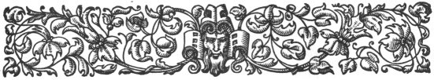
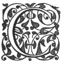
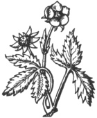

  
[Intangible Textual Heritage](../../index.md)  [Ancient Near
East](../index)  [Index](index)  [Previous](caog01)  [Next](caog03.md) 

------------------------------------------------------------------------

  
*The Chaldean Account of Genesis*, by George Smith, \[1876\], at
Intangible Textual Heritage

------------------------------------------------------------------------

p. ix

 

### CONTENTS.

|                                                                                                                                                                                                                                                                                                                                                                                                                                                                                                                                                                                                                                                          |                             |
|----------------------------------------------------------------------------------------------------------------------------------------------------------------------------------------------------------------------------------------------------------------------------------------------------------------------------------------------------------------------------------------------------------------------------------------------------------------------------------------------------------------------------------------------------------------------------------------------------------------------------------------------------------|-----------------------------|
| Chapter I.—The Discovery of the Genesis Legends.                                                                                                                                                                                                                                                                                                                                                                                                                                                                                                                                           |                             |
|  Cosmogony of Berosus.—Discovery of Cuneiform Inscriptions.—Historical Texts.—Babylonian origin of Assyrian literature.—Mythological tablets.—Discovery of Deluge texts.—Izdubar, his exploits.—Mutilated condition of tablets.—Lecture on Deluge tablets.—"Daily Telegraph" offer.—Expedition to Assyria.—Fragments of Creation tablets.—Solar Myth.—Second journey to Assyria.—Tower of Babel.—Clay records.—Account of creation in "Telegraph."—"Daily Telegraph" collection.—Interest of Creation legends.—The Fall.—New fragments.—List of texts                                                    | page [1](caog04.htm#page_1.md) |
|                                                                                                                                                                                                                                                                                                                                                                                                                                                                                                                                                                                                                                                          |                             |
| Chapter II.—Babylonian and Assyrian Literature.                                                                                                                                                                                                                                                                                                                                                                                                                                                                                                                                            |                             |
| Babylonian literature.—Kouyunjik library.—Fragmentary condition.—Arrangement of tablets.—Subjects.—Dates.—Babylonian source of literature.—Literary period.—Babylonian Chronology.—Akkad.—Sumir.—Urukh, king of Ur.—Hammurabi.—Babylonian astrology.—War of Gods.—Izdubar legends.—Creation and fall.—Syllabaries and bilingual tablets.—Assyrian copies.—Difficulties as to date.—Mutilated condition.—Babylonian library.—Assyrian empire.—City of Assur.—Library at Calah.—Sargon of Assyria.—Sennacherib.—Removal of Library to Nineveh.—Assurbanipal or Sardanapalus.—His additions to library.—Description of contents.—Later Babylonian libraries | [19](caog05.htm#page_19.md)    |
| p. x                                                                                                                                                                                                                                                                                                                                                                                                                                                                                                                                                                                                                            |                             |
| Chapter III.—Chaldean Legends Transmitted Through Berosus and Other Ancient Authors.                                                                                                                                                                                                                                                                                                                                                                                                                                                                                                       |                             |
| Berosus and his copyists.—Cory's translation.—Alexander Polyhistor.—Babylonia.—Oannes, his teaching.—Creation.—Belus.—Chaldean kings.—Xisuthrus.—Deluge.—The Ark.—Return to Babylon.—Apollodorus.—Pantibiblon.—Larancha.—Abydenus.—Alorus, first king.—Ten kings.—Sisithrus.—Deluge.—Armenia.—Tower of Babel.—Cronos and Titan.—Nicolaus Damascenus.—Dispersion from Hestiæus.—Babylonian colonies.—Tower of Babel.—The Sibyl.—Titan and Prometheus.—Damascius.—Tauthe.—Moymis.—Kissare and Assorus.—Triad.—Bel                                                                                                                                          | [37](caog06.htm#page_37.md)    |
|                                                                                                                                                                                                                                                                                                                                                                                                                                                                                                                                                                                                                                                          |                             |
| Chapter IV.—Babylonian Mythology.                                                                                                                                                                                                                                                                                                                                                                                                                                                                                                                                                          |                             |
| Greek accounts.—Mythology local in origin.—Antiquity.—Conquests.—Colonies.—Three great gods.—Twelve great gods.—Angels.—Spirits.—Anu.—Anatu.—Vul.—Ishtar.—Equivalent to Venus.—Hea.—Oannes.—Merodach.—Bel or Jupiter.—Ziratbanit, Succoth Benoth.—Elu.—Sin the moon god.—Ninip.—Shamas.—Nergal.—Anunit.—Table of gods                                                                                                                                                                                                                                                                                                                                    | [51](caog07.htm#page_51.md)    |
|                                                                                                                                                                                                                                                                                                                                                                                                                                                                                                                                                                                                                                                          |                             |
| Chapter V.—Babylonian Legend of the Creation.                                                                                                                                                                                                                                                                                                                                                                                                                                                                                                                                              |                             |
| Mutilated condition of tablets.—List of subjects.—Description of chaos.—Tiamat.—Generation of gods.—Damascius.—Comparison with Genesis.—Three great gods.—Doubtful fragments.—Fifth tablet.—Stars.—Planets.—Moon.—Sun.—Abyss or chaos.—Creation of moon.—Creation of animals.—Man.—His duties.—Dragon of sea.—Fall.—Curse for disobedience.—Discussion.—Sacred tree.—Dragon or serpent.—War with Tiamat.—Weapons.—Merodach.—Destruction of Tiamat.—Mutilation of documents.—Parallel Biblical account.—Age of story                                                                                                                                      | [61](caog08.htm#page_61.md)    |
|                                                                                                                                                                                                                                                                                                                                                                                                                                                                                                                                                                                                                                                          |                             |
| Chapter VI.—Other Babylonian Accounts of the Creation.                                                                                                                                                                                                                                                                                                                                                                                                                                                                                                                                     |                             |
| Cuneiform accounts originally traditions.—Variations.—Account of Berosus.—Tablet from Cutha.—Translation.—Composite animals.—Eagle-headed men.—Seven brothers.—Destruction of men.—Seven wicked spirits.—War in heaven.—Variations of story.—Poetical account of Creation                                                                                                                                                                                                                                                                                                                                                                                | [101](caog09.htm#page_101.md)  |
|                                                                                                                                                                                                                                                                                                                                                                                                                                                                                                                                                                                                                                                          |                             |
| Chapter VII.—The Sin of the God Zu.                                                                                                                                                                                                                                                                                                                                                                                                                                                                                                                                                        |                             |
| God Zu.—Obscurity of legend.—Translation.—Sin of Zu.—                                                                                                                                                                                                                                                                                                                                                                                                                                                                                                                                                                                                    |                             |
| p. xi                                                                                                                                                                                                                                                                                                                                                                                                                                                                                                                                                                                                                          |                             |
| Anger of the gods.—Speeches of Anu to Vul.—Vul's answer.—Speech of Anu to Nebo.—Answer of Nebo.—Sarturda.—Changes to a bird.—The Zu bird.—Bird of prey.—Sarturda lord of Amarda                                                                                                                                                                                                                                                                                                                                                                                                                                                                          | [113](caog10.htm#page_113.md)  |
|                                                                                                                                                                                                                                                                                                                                                                                                                                                                                                                                                                                                                                                          |                             |
| Chapter VIII.—The Exploits of Lubara.                                                                                                                                                                                                                                                                                                                                                                                                                                                                                                                                                      |                             |
| Lubara.—God of Pestilence.—Itak.—The Plague.—Seven warrior gods.—Destruction of people.—Anu.—Goddess of Karrak.—Speech of Elu.—Sin and destruction of Babylonians.—Shamas.—Sin and destruction of Erech.—Ishtar.—The great god and Duran.—Cutha.—Internal wars.—Itak goes to Syria.—Power and glory of Lubara.—Song of Lubara.—Blessings on his worship.—God Ner.—Prayer to arrest the Plague                                                                                                                                                                                                                                                            | [123](caog11.htm#page_123.md)  |
|                                                                                                                                                                                                                                                                                                                                                                                                                                                                                                                                                                                                                                                          |                             |
| Chapter IX.—Babylonian Fables.                                                                                                                                                                                                                                                                                                                                                                                                                                                                                                                                                             |                             |
| Fables.—Common in the East.—Description.—Power of speech in animals.—Story of the eagle.—Serpent.—Shamas.—The eagle caught.—Eats the serpent.—Anger of birds.—Etana.—Seven gods.—Third tablet.—Speech of eagle.—Story of the fox.—His cunning.—Judgment of Shamas.—His show of sorrow.—His punishment.—Speech of fox.—Fable of the horse and ox.—They consort together.—Speech of the ox.—His good fortune.—Contrast with the horse.—Hunting the ox.—Speech of the horse.—Offers to recount story.—Story of Ishtar.—Further tablets                                                                                                                      | [137](caog12.htm#page_137.md)  |
|                                                                                                                                                                                                                                                                                                                                                                                                                                                                                                                                                                                                                                                          |                             |
| Chapter X.—Fragments of Miscellaneous Texts.                                                                                                                                                                                                                                                                                                                                                                                                                                                                                                                                               |                             |
| Atarpi.—Sin of the world.—Mother and daughter quarrel.—Zamu.—Punishment of world.—Hea.—Calls his sons.—Orders drought.—Famine.—Building.—Nusku.—Riddle of wise man.—Nature and universal presence of air.—Gods.—Sinuri.—Divining by fracture of reed.—Incantation.—Dream.—Tower of Babel.—Obscurity of legend.—Not noticed by Berosus.—Fragmentary tablet.—Destruction of Tower.—Dispersion.—Locality of Babylon.—Birs Nimrud.—Babil.—Assyrian representations                                                                                                                                                                                           | [153](caog13.htm#page_153.md)  |
|                                                                                                                                                                                                                                                                                                                                                                                                                                                                                                                                                                                                                                                          |                             |
| Chapter XI.—The Izdubar Legends.                                                                                                                                                                                                                                                                                                                                                                                                                                                                                                                                                           |                             |
| Account of Deluge.—Nimrod.—Izdubar.—Age of Legends.—Babylonian cylinders.—Notices of Izdubar.—Surippak.—Ark City.                                                                                                                                                                                                                                                                                                                                                                                                                                                                                                                                        |                             |
| p. xii                                                                                                                                                                                                                                                                                                                                                                                                                                                                                                                                                                                                                        |                             |
| —Twelve tablets.—Extent of Legends.—Description.—Introduction.—Meeting of Heabani and Izdubar.—Destruction of tyrant Humbaba.—Adventures of Ishtar.—Illness and wanderings of Izdubar.—Description of Deluge and conclusion.—First Tablet.—Kingdom of Nimrod.—Traditions.—Identifications.—Translation.—Elamite Conquest.—Dates                                                                                                                                                                                                                                                                                                                          | [167](caog14.htm#page_167.md)  |
|                                                                                                                                                                                                                                                                                                                                                                                                                                                                                                                                                                                                                                                          |                             |
| Chapter XII.—Meeting of Heabani and Izdubar.                                                                                                                                                                                                                                                                                                                                                                                                                                                                                                                                               |                             |
| Dream of Izdubar.—Heabani.—His wisdom.—His solitary life.—Izdubar's petition.—Zaidu.—Harimtu and Samhat.—Tempt Heabani.—Might and fame of Izdubar.—Speech of Heabani.—His journey to Erech.—The midannu or tiger.—Festival at Erech.—Dream of Izdubar.—Friendship with Heabani . 193                                                                                                                                                                                                                                                                                                                                                                     |                             |
|                                                                                                                                                                                                                                                                                                                                                                                                                                                                                                                                                                                                                                                          |                             |
| Chapter XIII.—Destruction of the Tyrant Humbaba.                                                                                                                                                                                                                                                                                                                                                                                                                                                                                                                                           |                             |
| Elamite dominion.—Forest region.—Humbaba.—Conversation.—Petition to Shamas.—Journey to forest.—Dwelling of Humbaba.—Entrance to forest.—Meeting with Humbaba.—Death of Humbaba.—Izdubar king                                                                                                                                                                                                                                                                                                                                                                                                                                                             | [207](caog16.htm#page_207.md)  |
|                                                                                                                                                                                                                                                                                                                                                                                                                                                                                                                                                                                                                                                          |                             |
| Chapter XIV.—The Adventures of Ishtar.                                                                                                                                                                                                                                                                                                                                                                                                                                                                                                                                                     |                             |
| Triumph of Izdubar.—Ishtar's love.—Her offer of marriage.—Her promises.—Izdubar's answer.—Tammuz.—Amours of Ishtar.—His refusal.—Ishtar's anger.—Ascends to Heaven.—The bull.—Slain by Izdubar.—Ishtar's curse.—Izdubar's triumph.—The feast.—Ishtar's despair.—Her descent to Hades.—Description.—The seven gates.—The curses.—Uddusunamir.—Sphinx.—Release of Ishtar.—Lament for Tammuz                                                                                                                                                                                                                                                                | [217](caog17.htm#page_217.md)  |
|                                                                                                                                                                                                                                                                                                                                                                                                                                                                                                                                                                                                                                                          |                             |
| Chapter XV.—Illness and Wanderings of Izdubar.                                                                                                                                                                                                                                                                                                                                                                                                                                                                                                                                             |                             |
| Heabani and the trees.—Illness of Izdubar,—Death of Heabani.—Journey of Izdubar.—His dream.—Scorpion men.—The Desert of Mas.—The paradise.—Siduri and Sabitu.—Urhamsi.—Water of death.—Ragmu.—The conversation.—Hasisadra                                                                                                                                                                                                                                                                                                                                                                                                                                | [241](caog18.htm#page_241.md)  |
|                                                                                                                                                                                                                                                                                                                                                                                                                                                                                                                                                                                                                                                          |                             |
| Chapter XVI.—The Story of the Flood and Conclusion.                                                                                                                                                                                                                                                                                                                                                                                                                                                                                                                                        |                             |
| Eleventh tablet—The gods.—Sin of the world.—Command to build the ark.—Its contents.—The building.—The Flood.—Destruction of people.—Fear of the gods.—End of Deluge.—Nizir.—                                                                                                                                                                                                                                                                                                                                                                                                                                                                             |                             |
| p. xiii                                                                                                                                                                                                                                                                                                                                                                                                                                                                                                                                                                                                                      |                             |
| Resting of Ark.—The birds.—The descent from the ark.—The sacrifice.—Speeches of gods.—Translation of Hasisadra.—Cure of Izdubar.—His return.—Lament over Heabani.—Resurrection of Heabani.—Burial of warrior.—Comparison with Genesis,—Syrian nation.—Connection of legends.—Points of contact.—Duration of deluge.—Mount of descent.—Ten generations.—Early cities.—Age of Izdubar                                                                                                                                                                                                                                                                      | [263](caog19.htm#page_263.md)  |
|                                                                                                                                                                                                                                                                                                                                                                                                                                                                                                                                                                                                                                                          |                             |
| Chapter XVII.—Conclusion.                                                                                                                                                                                                                                                                                                                                                                                                                                                                                                                                                                  |                             |
| Notices of Genesis.—Correspondence of names.—Abram.—Ur of Chaldees.—Ishmael.—Sargon.—His birth.—Concealed in ark.—Age of Nimrod.—Doubtful theories.—Creation.—Garden of Eden.—Oannes.—Berosus.—Izdubar legends.—Urukh of Ur.—Babylonian seals.—Egyptian names.—Assyrian sculptures                                                                                                                                                                                                                                                                                                                                                                       | [295](caog20.htm#page_295.md)  |

 

------------------------------------------------------------------------

[Next: List of Illustrations](caog03.md)

