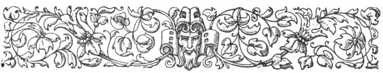
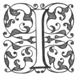
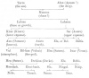

  
[Intangible Textual Heritage](../../index.md)  [Ancient Near
East](../index)  [Index](index)  [Previous](caog06)  [Next](caog08.md) 

------------------------------------------------------------------------

  
*The Chaldean Account of Genesis*, by George Smith, \[1876\], at
Intangible Textual Heritage

------------------------------------------------------------------------

p. 51

 

### CHAPTER IV.

### BABYLONIAN MYTHOLOGY.

Greek accounts.—Mythology local in
origin.—Antiquity.—Conquests.—Colonies.—Three great gods.—Twelve great
gods.—Angels.—Spirits.—Anu.—Anatu.—Vul.—Ishtar.—Equivalent to
Venus.—Hea.—Oannes.—Merodach.—Bel or Jupiter.—Zirat-banit, Succoth
Benoth.—Elu.—Sin the moon god.—Ninip.—Shamas.—Nergal.—Anunit.—Table of
gods.

|                    |
|--------------------|
|  |

IN their accounts of the Creation and of the early history of the human
race the Babylonian divinities figure very prominently, but it is
difficult in many cases to identify the deities mentioned by the Greek
authors, because the phonetic reading of the names of the Babylonian
gods is very obscure, and the classical writers often mention these
divinities by the terms in their own mythology, which appeared to them
to correspond with the Babylonian names.

In this chapter it is only proposed to give a general account of some
parts of the Babylonian mythology, to show the relationship between the
deities and their titles and work.

p. 52

Babylonian mythology was local in origin; each of the gods had a
particular city which was the seat of his worship, and it is probable
that the idea of weaving the gods into a system, in which each should
have his part to play, only had its origin at a later time. The
antiquity of this mythology may be seen by the fact, that two thousand
years before the Christian era it was already completed, and its deities
definitely connected into a system which remained with little change
down to the close of the kingdom.

It is probable that the gods were in early times only worshipped at
their original cities or seats, the various cities or settlements being
independent of each other; but it was natural as wars arose, and some
cities gained conquests over others, and kings gradually united the
country into monarchies, that the people of conquering cities should
claim that their gods were superior to those of the cities they
conquered, and thus carne the system of different ranks or grades among
the gods. Again, colonies were sent out of some cities, and the
colonies, as they considered themselves sons of the cities they started
from, also considered their gods to be sons of the gods of the mother
cities. Political changes in early times led to the rise and fall of
various cities and consequently of their deities, and gave rise to
numerous myths relating to the different personages in the mythology. In
some remote age there appear to have been three great cities in the
country, Erech, Eridu, and Nipur, and their divinities Anu, Hea, and Bel
were considered

p. 53

the "great gods" of the country. Subsequent changes led to the decline
of these cities, but their deities still retained their position at the
head of the Babylonian system.

These three leading deities formed members of a circle of twelve gods,
also called great. These gods and their titles are given as:

1\. Anu, king of angels and spirits, lord of the city of Erech.

2\. Bel, lord of the world, father of the gods, creator, lord of the
city of Nipur.

3\. Hea, maker of fate, lord of the deep, god of wisdom and knowledge,
lord of the city of Eridu.

4\. Sin, lord of crowns, maker of brightness, lord of the city of Ur.

5\. Merodach, just prince of the gods, lord of birth, lord of the city
of Babylon.

6\. Vul, the strong god, lord of canals and atmosphere, lord of the city
of Muru.

7\. Shamas, judge of heaven and earth, director of all, lord of the
cities of Larsa and Sippara.

8\. Ninip, warrior of the warriors of the gods, destroyer of wicked,
lord of the city of Nipur.

9\. Nergal, giant king of war, lord of the city of Cutha.

10\. Nusku, holder of the golden sceptre, the lofty god.

11\. Belat, wife of Bel, mother of the great gods, lady of the city of
Nipur.

p. 54

12\. Ishtar, eldest of heaven and earth, raising the face of warriors.

Below these deities there was a large body of gods forming the bulk of
the pantheon, and below these were arranged the Igege, or angels of
heaven, and the Anunnaki, or angels of earth. Below these again came
various classes of spirits or genii called Sedu, Vadukku, Ekimu, Gallu,
and others; some of these were evil, some good.

The relationship of the various principal gods and their names, titles,
and offices will be seen by the following remarks.

At the head of the Babylonian mythology stands a deity who was sometimes
identified with the heavens, sometimes considered as the ruler and god
of heaven. This deity is named Anu, his sign is the simple star, the
symbol of divinity, and at other times the Maltese cross. Anu represents
abstract divinity, and he appears as an original principle, perhaps as
the original principle of nature. He represents the universe as the
upper and lower regions, and when these were divided the upper region or
heaven was called Anu, while the lower region or earth was called Anatu;
Anatu being the female principle or wife of Anu. Anu is termed the old
god, and the god of the whole of heaven and earth; one of the
manifestations of Arm was as the two forms Lahma and Lahama, which
probably correspond to the Greek forms Dache and Dachus, see [p.
50](caog06.htm#page_50.md). These forms are said to have sprung out of the
original chaos, and they are

p. 55

followed by the two forms sar and kisar (the Kissare and Assorus of the
Greeks), sar means the upper hosts or expanse, kisar the lower hosts or
expanse; these are also forms of manifestations of Anu and his wife. Aim
is also lord of the old city, and he bears the names Alalu and Papsukul.
His titles generally indicate height, antiquity, purity, divinity, and
he may be taken as the general type of divinity. Anu was originally
worshipped at the city of Erech, which was called the city of Anu and
Anatu, and the great temple there was called the "house of Anu," or the
"house of heaven."

Anatu, the wife or consort of Anu, is generally only a female form of
Anu, but is sometimes contrasted with him; thus, when Anu represents
height and heaven, Anatu represents depth and earth; she is also lady of
darkness, the mother of the god Hea, the mother producing heaven and
earth, the female fish-god, and she is one of the many goddesses called
Istar or Venus.

Anu and Anatu have a numerous family; among their sons are numbered
Sar-ziri, the king of the desert, Latarak, Abgula, Kusu, and the
air-god, whose name is uncertain. The air-god is usually called Vul, he
has also the name Pur, and the epithets Ramman or Rimmon, the
self-existent, and Uban or Ben. Vul is god of the region of the
atmosphere, or space between the heaven and earth, he is the god of
rain, of storms and whirlwind, of thunder and lightning, of floods and
watercourses. Vul was

p. 56

in high esteem in Syria and Arabia, where he bore the name of Daddi; in
Armenia he was called Teiseba. Vul is always considered an active deity,
and was extensively worshipped.

Another important god, a son of Anu, was the god of fire; his name may
be read Bil-kan, with the possibility of some connection with the
Biblical Tubal Cain and the classical Vulcan. The fire-god takes an
active part in the numerous mythological tablets and legends, and he is
considered to be the most potent deity in relation to witchcraft and
spells generally.

The most important of the daughters of Anu was named Istar; she was in
some respects the equivalent of the classical Venus. Her worship was at
first subordinate to that of Anu, and as she was goddess of love, while
Anu was god of heaven, it is probable that the first intention in the
mythology was only to represent love as heaven-born; but in time a more
sensual view prevailed, and the worship of Istar became one of the
darkest features in Babylonian mythology. As the worship of this goddess
increased in favour, it gradually superseded that of Anu, until in time
his temple, the house of heaven, came to be regarded as the temple of
Venus.

The planet Venus, as the evening star, was identified with the Ishtar of
Erech, while the morning star was Anunit, goddess of Akkad.

There were various other goddesses called Istar, among which may be
noticed Istar, daughter of Sin

p. 57

the moon-god, who is sometimes confounded with the daughter of Anu.

A companion deity with Anu is Hea, who is god of the sea and of Hades,
in fact of all the lower regions. He has two features, and corresponds
in some respects to the Saturn or Cronos of the ancients, in others to
their Poseidon or Neptune. Hea is called god of the lower region, he is
lord of the sea or abyss; he is lord of generation and of all human
beings, he bears the titles lord of wisdom, of mines and treasures; he
is lord of gifts, of music, of fishermen and sailors, and of Hades or
hell. It has been supposed that the serpent was one of his emblems, and
that he was the Oannes of Berosus; these things do not, however, appear
in the inscriptions. The wife of Hea was Dav-kina, the Davke of
Damascius, who is the goddess of the lower regions, the consort of the
deep; and their principal son was Maruduk or Merodach, the Bel of later
times.

Merodach, god of Babylon, appears in all the earlier inscriptions as the
agent of his father Hea; he goes about in the world collecting
information, and receives commissions from his father to set right all
that appears wrong. Merodach is an active agent in creation, but is
always subordinate to his father Hea. In later times, after Babylon had
been made the capital, Merodach, who was god of that city, was raised to
the head of the Pantheon. Merodach or Bel was identified with the
classical Jupiter, but the name Bel, "the lord," was only given to him
in times subsequent

p. 58

to the rise of Babylon. The wife of Merodach was Zirat-banit, the
Succoth Benoth of the Bible.

Nebo, the god of knowledge and literature, who was worshipped at the
neighbouring city of Borsippa, was a favourite deity in later times, as
was also his consort Tasmit. Beside Merodach Hea had a numerous progeny,
his sons being principally river gods.

A third great god was united with Anu and Hea, his names were Enu, Elu,
Kaptu, and Bel; he was the original Bel of the Babylonian mythology, and
was lord of the surface of the earth and the affairs of men. Elu was
lord of the city of Nipur, and had a consort named Belat or Beltis. Elu,
or Bel, is the most active of the gods in the general affairs of
mankind, and was so generally worshipped in early times that he came to
be regarded as the national divinity, and his temple at the city of
Nipur was regarded as the type of all temples. The extensive worship of
Bel, and the high honour in which he was held, seem to point to a time
when his city, Nipur, was the metropolis of the country.

Belat, or Beltis, the wife of Bel, is a famous deity celebrated in all
ages, but as the title Belat was only "lady," or "goddess," it was a
common one for many goddesses, and the notices of Beltis probably refer
to several different personages. The same remark may be applied to the
name Istar, or Ishtar, meaning "goddess," which is applied to any female
divinity.

p. 59

Elu had, like the other gods, a numerous family; his eldest son was the
moon-god called Ur, Agu or Aku, Sin and Itu, in later times generally
termed Sin. Sin was presiding deity of the city of Ur, and early assumed
an important place in the mythology. The moon-god figures prominently in
some early legends, and during the time the city of Ur was capital of
the country his worship became very extensive and popular in the whole
of the country.

Ninip, god of hunting and war, was another celebrated son of Elu; he was
worshipped with his father at Nipur. Ninip was also much worshipped in
Assyria as well as Babylonia, his character as presiding genius of war
and the chase making him a favourite deity with the warlike kings of
Assur.

Sin the moon-god had a son Shamas, or Samas, the sun-god, and a
daughter, Istar or Venus. Shamas is an active deity in some of the
Izdubar legends and fables, but he is generally subordinate to Sin. In
the Babylonian system the moon takes precedence of the sun, and the
Shamas of Larsa was probably considered a different deity to Shamas of
Sippara.

Among the other deities of the Babylonians may be counted Nergal, god of
Cutha, who, like Ninip, presided over hunting and war, and Anunit, the
deity of one city of Sippara, and of the city of Akkad.

The following table will exhibit the relationship of the principal
deities; but it must be noted that the

p. 60

\[paragraph continues\] Assyrian
inscriptions are not always consistent, either as to the sex or
paternity of the gods:—

  [  
Click to enlarge](img/06000.jpg.md)

 

------------------------------------------------------------------------

[Next: Chapter V. Babylonian Legend of the Creation](caog08.md)

