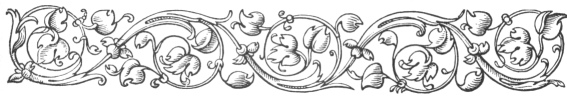
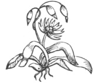

  
[Intangible Textual Heritage](../../index.md)  [Ancient Near
East](../index)  [Index](index)  [Previous](caog08)  [Next](caog10.md) 

------------------------------------------------------------------------

  
*The Chaldean Account of Genesis*, by George Smith, \[1876\], at
Intangible Textual Heritage

------------------------------------------------------------------------

p. 101

 

### CHAPTER VI.

### OTHER BABYLONIAN ACCOUNTS OF THE CREATION.

Cuneiform accounts originally
traditions.—Variations.—Account of Berosus.—Tablet from
Cutha.—Translation.—Composite animals.—Eagle-headed men.—Seven
brothers.—Destruction of men.—Seven wicked spirits.—War in
heaven.—Variations of story.—Poetical account of Creation.

|                    |
|--------------------|
|  |

IN the last chapter I have given the fragments of the principal story of
the Creation and Fall from the cuneiform inscriptions, but it appears
from the tablets that all these legends were "traditions" or "stories"
repeated by word of mouth, and afterwards committed to writing. When
such traditions are not reduced to writing, and depend on being handed
down from generation to generation by word of mouth, they are liable to
vary, sometimes very widely, according to the period and condition of
the country. Thus many different versions of a story arise, and there
can be no doubt that this was actually the case with the Creation
legends. There must

p. 102

have been a belief in the Creation and some of the leading features of
this story long before these Creation legends were committed to writing,
and there is evidence of other stories, related to those already given,
which were at about the same time committed to writing. The story of the
Creation transmitted through Berosus (see chapter iii. pp. 37–50)
supplies us with a totally different story, differing entirely from the
cuneiform account in the last chapter and from the Genesis account, and
some fragments of tablets from Kouyunjik belonging to the library of
Assurbanipal give a copy, mutilated as usual, of another version having
many points of agreement with the account of Berosus. This legend, of
which the following is a translation, is stated to be copied from a
tablet at Cutha.

*Legend of Creation from Cutha tablet*.

(Many lines lost at commencement.)

1\. lord of . . . .

2\. . . . . his lord the strength of the gods . . . .

3\. . . . . his host . . . . host . . . .

4\. lord of the upper region and the lower region lord of angels . . . .

5\. who drank turbid waters and pure water did not drink,

6\. with his flame, his weapon, that man he enclosed,

7\. . . . . he took, he destroyed,

8\. on a tablet nothing was then written, and there were not left the
carcasses and waste?

p. 103

9\. from the earth nothing arose and I had not come to it.

10\. Men with the bodies of birds of the desert, human beings

11\. with the faces of ravens,

12\. these the great gods created,

13\. and in the earth the gods created for them a dwelling.

14\. Tamat gave unto them strength,

15\. their life the mistress of the gods raised,

16\. in the midst of the earth they grew up and became great,

17\. and increased in number,

18\. Seven kings brothers of the same family,

19\. six thousand in number were their people,

20\. Banini their father was king, their mother

21\. the queen was Milili,

22\. their eldest brother who went before them, Mimangab was his name,

23\. their second brother Midudu was his name,

24\. their third brother . . . . tur was his name,

25\. their fourth brother . . . . dada was his name,

26\. their fifth brother . . . . tah was his name,

27\. their sixth brother . . . . ru was his name,

28\. their seventh brother . . . . was his name.

Column II.

(Many lines lost.)

1\. . . . . evil . . . .

2\. man his will turned

p. 104

3\. in . . . . I purified?

4\. On a tablet the evil curse of man he carved?

5\. I called the worshippers and sent,

6\. seven in width and seven in depth I arranged them.

7\. I gave them noble reeds? (pipes?)

8\. I worshipped also the great gods

9\. Ishtar, . . . ., Zamama, Anunitu

10\. Nebo . . . . Shamas the warrior,

11\. the gods listened to my doings

12\. . . . . he did not give and

13\. thus I said in my heart:

14\. Now here am I and

15\. let there not . . . . ground

16\. let . there not . . . .

17\. may I go as I trust in Bel . . . . my heart,

18\. and . . . . my iron may I take.

19\. In the first year in the course of it

20\. one hundred and twenty thousand men I sent out and among them,

21\. one of them did not return.

22\. In the second year in the course of it, ninety thousand the same.

23\. In the third year in the course of it, sixty thousand seven hundred
the same.

24\. They were rooted out they were punished, I eat,

25\. I rejoiced, I made a rest.

26\. Thus I said in my heart now here am I and

27\. at this time what is left?

p. 105

28\. I the king, am not the preserver of his country,

29\. and the ruler is not the preserver of his people.

30\. When I have done may corpses and waste be left,

31\. the saving of the people from night, death, spirits, curses,

(Many more broken lines, meaning quite uncertain.)

Fragment of Column III.

1\. . . . I caused to pursue . . . .

2\. . . . . blood . . . . . . . . .

3\. in the midst of them twelve men fled from me.

4\. After them I pursued, swiftly I went,

5\. those men, I captured them

6\. those men I turned . . . . .

7\. Thus I said in my heart . . . . .

Column IV.

(Several lines lost at commencement.)

1\. to . . . . .

2\. the powerful king . . . .

3\. the gods . . . .

4\. hand . . . . take them

5\. thou king, viceroy, prince, or any one else,

6\. whom God shall call, and who shall rule the kingdom,

7\. who shall rebuild this house, this tablet I write to thee,

8\. in the city of Cutha, in the temple of Sitlam,

9\. in the sanctuary of Nergal, I leave for thee;

p. 106

10\. this tablet see, and,

11\. to the words of this tablet listen, and

12\. do not rebel, do not fail,

13\. do not fear, and do not turn away,

14\. then may thy support be established,

15\. thou in thy works shall be glorious,

16\. thy forts shall be strong,

17\. thy canals shall be full of water,

18\. thy treasures, thy corn, thy silver,

19\. thy furniture, thy goods,

20\. and thy instruments, shall be multiplied.

(A few more mutilated lines.)

  [  
Click to enlarge](img/10600.jpg.md)  
SACRED TREE, ATTENDANT FIGURES AND EAGLE-HEADED MEN, FROM THE SEAL OF A
SYRIAN CHIEF, NINTH CENTURY B.C.  

This is a very obscure inscription, the first column, however, forms
part of a relation similar to that of Berosus in his history of the
Creation; the beings who were killed by the light, and those with men's
heads and bird's bodies, and bird's heads and men's bodies,

p. 107

agree with the composite monsters of Berosus, while the goddess of
chaos, Tiamat, who is over them, is the same again as the Tiamat of the
Creation legends and the Thalatth of Berosus.

The relation in the second and third columns of the inscription is
difficult, and does not correspond with any known incident. The fourth
column contains an address to any future king who should read the
inscription which was deposited in the temple of Nergal at Cutha.

It is probable that this legend was supposed to be the work of one of
the mythical kings of Chaldea, who describes the condition and history
of the world before his time.

There is another legend which appears to be connected with these, the
legend of the seven evil spirits, which I have given in my former work,
"Assyrian Discoveries," p. 398.

*Tablet with the story of the Seven Wicked Gods or Spirits*.

Column I.

1\. In the first days the evil gods

2\. the angels who were in rebellion, who in the lower part of heaven

3\. had been created,

4\. they caused their evil work

5\. devising with wicked heads . . .

p. 108

6\. ruling to the river . . . .

7\. There were seven of them. The first was . . .

8\. the second was a great animal . . . .

9\. . . . . which any one . . . .

10\. the third was a leopard . . . .

11\. the fourth was a serpent . . . .

12\. the fifth was a terrible . . . . which to . . . .

13\. the sixth was a striker which to god and king did not submit,

14\. the seventh was the messenger of the evil wind which . . . . made.

15\. The seven of them messengers of the god Anu their king

16\. from city to city went round

17\. the tempest of heaven was strongly bound to them,

18\. the flying clouds of heaven surrounded them,

19\. the downpour of the skies which in the bright day

20\. makes darkness, was attached to them

21\. with a violent wind, an evil wind, they began,

22\. the tempest of Vul was their might,

23\. at the right hand of Vul they came,

24\. from the surface of heaven like lightning they darted,

25\. descending to the abyss of waters, at first they came.

26\. In the wide heavens of the god Anu the king

27\. evil they set up, and an opponent they had not.

p. 109

28\. At this time Bel of this matter heard and

29\. the account sank into his heart.

30\. With Hea the noble sage of the gods he took counsel, and

31\. Sin (the moon), Shamas (the sun), and Ishtar (Venus) in the lower
part of heaven to control it he appointed.

32\. With Anu to the government of the whole of heaven he set them up.

33\. To the three of them the gods his children,

34\. day and night to be united and not to break apart,

35\. he urged them.

36\. In those days those seven evil spirits

37\. in the lower part of heaven commencing,

38\. before the light of Sin fiercely they came,

39\. the noble Shamas and Vul (the god of the atmosphere) the warrior to
their side they turned and

40\. Ishtar with Anu the king into a noble seat

41\. they raised and in the government of heaven they fixed.

Column II.

1\. The god . . . . .

2\. . . . . .

3\. The god . . . . .

4\. which . . . . .

5\. In those days the seven of them . . . .

p. 110

6\. at the head in the control to . . . . .

7\. evil . . . . .

8\. for the drinking of his noble mouth . . . .

9\. The god Sin the ruler . . . . mankind

10\. . . . . . of the earth

11\. . . . . . troubled and on high he sat,

12\. night and day fearing, in the seat of his dominion he did not sit.

13\. Those evil gods the messengers of Anu their king

14\. devised with wicked heads to assist one another, and

15\. evil they spake together, and

16\. from the midst of heaven like a wind to the earth they carne down.

17\. The god Bel of the noble Sin, his trouble

18\. in heaven, he saw and

19\. Bel to his attendant the god Nusku said:

20\. "Attendant Nusku this account to the ocean carry, and

21\. the news of my child Sin who in heaven is greatly troubled;

22\. to the god Hea in the ocean repeat."

23\. Nusku the will of his lord obeyed, and

24\. to Hea in the ocean descended and went.

25\. To the prince, the noble sage, the lord, the god unfailing,

26\. Nusku the message of his lord at once repeated.

27\. Hea in the ocean that message heard, and

p. 111

28\. his lips spake, and with wisdom his mouth was filled.

29\. Hea his son the god Merodach called, and this word he spake

30\. "Go my son Merodach

31\. enter into the shining Sin who in heaven is greatly troubled;

32\. his trouble from heaven expel.

33\. Seven of them the evil gods, spirits of death, having no fear,

34\. seven of them the evil gods, who like a flood

35\. descend and sweep over the earth.

36\. To the earth like a storm they come down.

37\. Before the light of Sin fiercely they came

38\. the noble Shamas and Vul the warrior, to their side they turned and
. . . .

The end of this legend is lost; it probably recorded the interference of
Merodach in favour of Sin, the moon god.

In this story, which differs again from all the others, Bel is supposed
to place in the heaven the Moon, Sun, and Venus, the representative of
the stars. The details have no analogy with the other stories, and this
can only be considered a poetical myth of the Creation.

This legend is part of the sixteenth tablet of the series on evil
spirits; but the tablet contains other matters as well, the legend
apparently being only quoted in it. There is another remarkable legend
of the same sort on another tablet of this series

p. 112

published in "Cuneiform Inscriptions," vol. iv. p. 15. The whole of this
series concerns the wanderings of the god Merodach, who goes about the
world seeking to remove curses and spells, and in every difficulty
applying to his father Hea to learn how to combat the influence of the
evil spirits, to whom all misfortunes were attributed.

 

------------------------------------------------------------------------

[Next: Chapter VII. The Sin of the God Zu](caog10.md)

