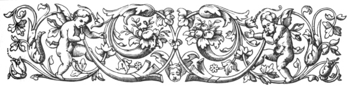
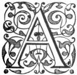
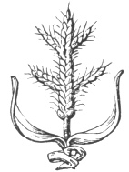

  
[Intangible Textual Heritage](../../index)  [Ancient Near
East](../index)  [Index](index)  [Previous](caog09)  [Next](caog11) 

------------------------------------------------------------------------

  
*The Chaldean Account of Genesis*, by George Smith, \[1876\], at
Intangible Textual Heritage

------------------------------------------------------------------------

p. 113

 

### CHAPTER VII.

### THE SIN OF THE GOD ZU.

God Zu.—Obscurity of legend.—Translation.—Sin of
Zu.—Anger of the gods.—Speeches of Anu to Vul.—Vul's answer.—Speech of
Anu to Nebo.—Answer of Nebo.—Sarturda.—Changes to a bird.—The Zu
bird.—Bird of prey.—Sarturda lord of Amarda.

|                    |
|--------------------|
|  |

AMONG the legends of the gods, companion stories to the accounts of the
Creation and Deluge, one of the most curious is the legend of the sin
committed by the god Zu.

This legend stands alone among the stories, its incidents and its
principal actor being otherwise almost unknown from cuneiform sources. I
have at present only detected one copy of the story, and this is in so
mutilated a condition that it cannot be connected with any other of the
legends. From some similarity in style, I conjecture that it may form
the first tablet of the series which I have termed the "Wars of the
Gods." I have, however, no sufficient evidence to connect the two, and
for this reason

p. 114

give it here a separate place, preceding the tablets of the "Wars of the
Gods."

The principal actor in the legend is a being named Zu, the name being
found in all three cases of an Assyrian noun Zu, Za and Zi. Preceding
the name is the determinative of divinity, from which I judge Zu to have
been ranked among the gods.

The story of the sin of Zu has sometimes reminded me of the outrage of
Ham on his father Noah, and the mutilation of Ouranus by his son Saturn,
but there is not sufficient evidence to connect the stories, and there
are in the Assyrian account several very difficult words. One of these
is particularly obscure, and I only transcribe it here by the ordinary
phonetic values of the characters *um-sim-i*, it may possibly mean some
talisman or oracle in the possession of Bel, which was robbed from him
by Zu. There are besides the two difficult words *parzi* and *tereti*,
which I have preferred merely transcribing in my translation. It must be
added that the inscription is seriously mutilated in some parts, giving
additional difficulty in the translation.

The tablet containing the account of the sin of Zu, K 3454, in the
Museum collection, originally contained four columns of text, each
column having about sixty lines of writing. The first and fourth column
are almost entirely lost, there not being enough anywhere to translate
from.

The single fragment preserved, belonging to the

p. 115

first column, mentions some being who was the seed or firstborn of Elu
or Bel, with a number of titles, such as "warrior, soldier of the temple
of Hamsi," and the name of the god Zu occurs, but not so as to prove
these titles to be his.

The following is a partial translation of the remains of this tablet:—

K. 3454.

Column I. lost.

Column II.

1\. the fate? going . . . . of the gods all of them he sent.

2\. . . . . . . . . Zu grew old and

3\. Zu? like . . . . Bel . . . . him

4\. three? streams? of water in front and

5\. the work Bel finished? he slept in it.

6\. The crown of his majesty, the clothing of his divinity,

7\. his *umsimi*, his crown? Zu stripped, and

8\. he stripped also the father of the gods, the venerable of heaven and
earth.

9\. The desire? of majesty he conceived in his heart,

10\. Zu stripped also the father of the gods, the venerable of heaven
and earth.

11\. The desire? of majesty he conceived in his heart:

12\. Let me carry away the *umsimi* of the gods,

13\. and the *tereti* of all the gods may it burn,

p. 116

14\. may my throne be established, may I possess the *parzi*,

15\. may I govern the whole of the seed of the angels.

16\. And he hardened his heart to make war,

17\. in the vicinity of the house where he slept, he waited until the
head of the day.

18\. When Bel poured out the beautiful waters

19\. spread out on the seat his crown? was placed,

20\. the *umsimi* he took in his hand,

21\. the majesty he carried off; he cast away the *parzi*,

22\. Zu fled away and in his country concealed himself.

23\. Then spread darkness, and made a commotion,

24\. the father, their king, the ruler Bel.

25\. . . . . he sent the glory of the gods

26\. divinity was destroyed in . . . .

27\. Anu his mouth opened, and spake

28\. and said to the gods his sons:

29\. Whoever will, let him slay Zu,

30\. in all the countries may his name be renowned.

------------------------------------------------------------------------

31\. To Vul the powerful light the son of Anu

32\. a speech he made to him, also and spake to him.

33\. To Vul the powerful light the son of Anti

34\. a speech he made to him, also and spake to him:

35\. Hero Vul let there not be opposition in thee

p. 117

36\. slay Zu with thy weapon.

37\. May thy name be renowned in the assembly of the gods,

38\. in the midst of thy brothers, first set up,

39\. . . . . made also fragrant with spices,

40\. in the four regions they shall fix thy city.

41\. May thy city be exalted like the temple,

42\. they shall cry in the presence of the gods and praise thy name.

43\. Vul answered the speech,

44\. to his father Anu word he spake;

45\. Father to a desert country do thou consign him.

46\. Let Zu not come among the gods thy sons,

47\. for the *umsimi* he took in his hand,

48\. the majesty he carried off, he cast away the *parzi*,

49\. and Zu fled away and in his country concealed himself.

50\. . . . . . opening his mouth like the venerable of heaven and earth

51\. . . . . . . . . like mud

52\. . . . . . was, the gods swept away

53\. . . . . . I will not go he said.

------------------------------------------------------------------------

(Sixteen lines lost here, part on this column, part on Column III.)

Column III.

1\. and Zu fled away and in his country concealed himself.

p. 118

2\. . . . . opening his mouth like the venerable of heaven and earth

3\. . . . . . . . . like mud

4\. . . . . was, the gods swept away

5\. . . . . I will not go he said.

 

------------------------------------------------------------------------

6\. To Nebo the powerful . . . . the child of Ishtar,

7\. a speech he made to him also and spake to him:

8\. Hero Nebo let there not be opposition in thee,

9\. slay Zu with thy weapon.

10\. May thy name be renowned in the assembly of the gods,

11\. . . . . made also fragrant with spices,

12\. in the four regions they shall fix thy city.

13\. May thy city be exalted like the temple,

14\. they shall cry in the presence of the gods and praise thy name.

15\. Nebo answered the speech,

16\. to his father Anu word he spake:

17\. Father to a desert country do thou consign him.

18\. Let Zu not come among the gods thy sons,

l 9. for the *umsimi* he took in his hand,

20\. the majesty he carried off he cast away the *parzi*,

21\. and Zu fled away and in his country concealed himself.

22\. . . . . . opening his mouth like the venerable of heaven and earth

p. 119

About ten lines lost here.

33\. And thus the god . . . .

34\. I also . . . .

35\. and thus . . . .

36\. He heard also . . . .

37\. he turned . . . .

38\. The god of noble face . . . .

39\. to Anu . . . .

Column IV. lost.

Such are the fragments of the story so far as they can be translated at
present. The divine Zu here mentioned whose sin is spoken of is never
counted among the gods, and there would be no clue to his nature were it
not for a curious tablet printed in "Cuneiform Inscriptions," vol. iv.
p. 14, from which it appears that he was in the likeness of a bird of
prey. This tablet gives the following curious relation:

1\. The god Sarturda (the lesser king) to a country a place remote
\[went\],

2\. in the land of Sabu . . . . . \[he dwelt\].

------------------------------------------------------------------------

3\. His mother had not placed him and had not . . . .

4\. his father had not placed him and with him did not \[go\],

5\. the strength of his knowledge . . . .

6\. From the will of his heart a resolution he did not. . . .

7\. In his own heart a resolution he made,

8\. to the likeness of a bird he changed,

p. 120

9\. to the likeness of the divine storm bird (or Zu bird) he changed,

10\. his wife forcibly he associated with,

11\. the wife of the divine Zu bird, the son of the divine Zu bird,

12\. in companionship he made sit.

13\. The goddess Enna, the lady of Tigenna,

14\. in the mountain he loved,

15\. a female fashioned? of her mother in her likeness,

16\. the goddess of perfumes a female fashioned? of her mother in her
likeness

17\. Her appearance was like bright ukni stone,

18\. her girdle was adorned with silver and gold,

19\. brightness was fixed in . . . .

20\. brightness was set in . . . .

Many lines lost here, the story recommences on reverse.

1\. . . . . the crown he placed on his head

2\. from the nest of the divine Zu bird he came.

------------------------------------------------------------------------

This Zu bird I suppose to be the same as the god Zu of the inscriptions,
his nature is shown by a passage in the annals of Assurnazirpal
("Cuneiform Inscriptions," vol. i. p. 22, col. ii. l. 107), where he
says his warriors "like the divine zu bird upon them darted." This bird
is called the cloud or storm bird, the flesh eating bird, the lion or
giant bird, the bird of prey, the bird with sharp beak, and it evidently
indicates some ravenous bird which was deified by the

p. 121

\[paragraph continues\] Babylonians. Some
excellent remarks on the nature of this bird are given by Delitzsch in
his "Assyrische studien," pp. 96, 116.

In the legend of Sarturda it is said that he changed into a Zu bird.
Sarturda which may be explained "the young king" was lord of the city of
Amarda or Marad, and he is said to have been the deity worshipped by
Izdubar.

The Zu of the legend, who offends against Bel, I suppose to be the same
as the divine bird of prey mentioned in the other inscriptions,
otherwise we have no mention in any other inscription of this personage.

In the story of the offence of Zu there is another instance of the
variations which constantly occur in the Assyrian inscriptions with
respect to the relationship of the gods. Nebo is usually called son of
Merodach, but in this inscription he is called son of Anu.

In my translation of the legend on K 3454, the sin of Zu is very
obscure, and I am quite unable to see through the allusions in the text;
but it is quite evident that his sin was considered to be great, as it
raises the anger of Bel, and causes Anu to call on his sons in
succession to slay Zu; while the sons of the god Anu request that he may
be expelled from the company of the gods.

The second legend, in which the god Sarturda changes into a Zu bird, is
as obscure as the first, there being also in this doubtful words and
mutilated passages.

p. 122

\[paragraph continues\] Sarturda, although
a celebrated god in early times, is seldom mentioned in the later
inscriptions, and there is no information anywhere as to the females or
goddesses mentioned in the legend. The idea of the gods sometimes
changing themselves into animals was not uncommon in early times.

The explanation of these legends must be left until the meanings of
several words in them are better known.

 

------------------------------------------------------------------------

[Next: Chapter VIII. The Exploits of Lubara](caog11)

